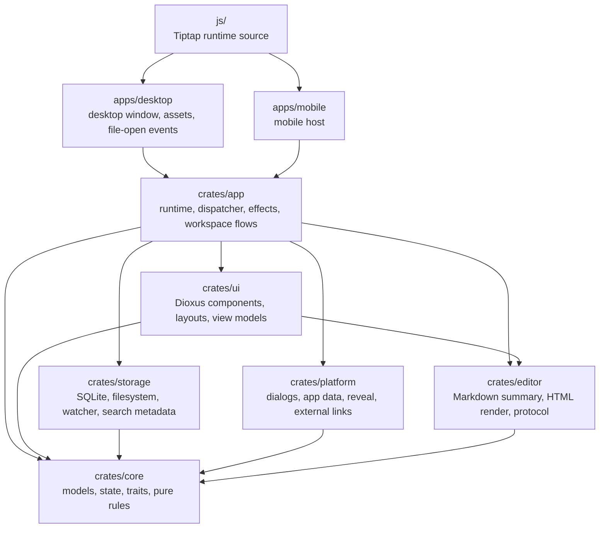

# Papyro

Local-first Markdown workspace for focused writing, source editing, and long-lived notes.

[简体中文](README.zh-CN.md) | [Documentation](docs/README.md) | [Architecture](docs/architecture.md) | [Roadmap](docs/roadmap.md) | [Development](docs/development-standards.md)

Papyro is a Rust and Dioxus 0.7 desktop-first Markdown app. It keeps your notes as real `.md` files, adds a workspace tree, tabs, search, recovery, preview, and a Typora-inspired Hybrid editor path, while keeping the application architecture small enough for long-term maintenance.

The project is still early. The current priority is not to add every note-taking feature at once. The priority is to make the editor feel stable, fast, predictable, and pleasant.

## Why Papyro?

- **Local-first notes** - your Markdown files remain normal files in your workspace.
- **Hybrid writing mode** - edit Markdown with rendered headings, lists, code blocks, tables, math, and Mermaid moving toward a WYSIWYG-style flow.
- **Workspace-aware desktop shell** - sidebar, tabs, recent files, quick open, command palette, outline, search, trash, and recovery drafts.
- **Rust application core** - storage, file operations, state transitions, recovery, and Markdown rendering stay testable.
- **Dioxus 0.7 UI** - desktop and mobile shells share the same app runtime and UI layer.
- **Offline editor bundle** - Tiptap/ProseMirror, Mermaid, KaTeX, and syntax highlighting are built into local assets.

## Current Status

Papyro is in active product and architecture development.

| Area | Status |
| --- | --- |
| Desktop shell | Usable development build |
| Mobile shell | Shared runtime entry, not production-ready |
| Markdown editing | Source, Preview, and Hybrid modes |
| Mermaid | Preview and Hybrid rendering with editable source paths |
| Search and quick open | Basic workspace search and recent files |
| Recovery | Autosave/recovery draft flow exists |
| Packaging | Not finalized |
| License | MIT |

## Quick Start

### Requirements

- Rust stable
- Cargo
- Node.js 20 or newer for the editor bundle
- PowerShell on Windows, or Bash on Unix-like systems

Optional:

- Dioxus CLI if you want to use `dx` workflows.

```bash
cargo install dioxus-cli
```

### Run the desktop app

```bash
cargo run -p papyro-desktop
```

### Run the full check suite

On Windows:

```powershell
powershell -NoProfile -ExecutionPolicy Bypass -File scripts/check.ps1
```

On Unix-like systems:

```bash
bash scripts/check.sh
```

### Rebuild the editor bundle

Edit focused source modules under `js/src/`, such as `editor-runtime.ts`,
`editor-runtime-contract.ts`, `tiptap-*` extensions/controllers,
`editor-host-runtime.js`, `editor-runtime-bootstrap.js`, and shared helpers in
`editor-core.js`. Do not edit
generated bundles by hand. Then run:

```bash
npm --prefix js install
npm --prefix js run build
npm --prefix js test
```

The build syncs generated editor assets into `assets/`, `apps/desktop/assets/`, and `apps/mobile/assets/`.

## Architecture At A Glance



The short version:

- `apps/*` are thin platform shells.
- `crates/app` owns user flows and side effects.
- `crates/core` owns pure data and rules.
- `crates/ui` renders state and sends commands.
- `crates/storage` owns disk and SQLite.
- `crates/editor` owns Markdown-derived data and render helpers.
- `js/` owns the browser editor runtime.

Read the full guide in [docs/architecture.md](docs/architecture.md).

## Documentation

| Goal | English | Chinese |
| --- | --- | --- |
| Documentation map | [docs/README.md](docs/README.md) | [docs/zh-CN/README.md](docs/zh-CN/README.md) |
| Architecture guide | [docs/architecture.md](docs/architecture.md) | [docs/zh-CN/architecture.md](docs/zh-CN/architecture.md) |
| Development rules | [docs/development-standards.md](docs/development-standards.md) | [docs/zh-CN/development-standards.md](docs/zh-CN/development-standards.md) |
| Product roadmap | [docs/roadmap.md](docs/roadmap.md) | [docs/zh-CN/roadmap.md](docs/zh-CN/roadmap.md) |
| Markdown editor | [docs/editor.md](docs/editor.md) | [docs/zh-CN/editor.md](docs/zh-CN/editor.md) |
| UI/UX redesign | [docs/ui-information-architecture.md](docs/ui-information-architecture.md) | [docs/zh-CN/ui-information-architecture.md](docs/zh-CN/ui-information-architecture.md) |
| UI surface audit | [docs/ui-surface-audit.md](docs/ui-surface-audit.md) | [docs/zh-CN/ui-surface-audit.md](docs/zh-CN/ui-surface-audit.md) |
| App icons | [docs/app-icons.md](docs/app-icons.md) | [docs/zh-CN/app-icons.md](docs/zh-CN/app-icons.md) |
| Performance budget | [docs/performance-budget.md](docs/performance-budget.md) | [docs/zh-CN/performance-budget.md](docs/zh-CN/performance-budget.md) |
| Release packaging | [docs/release-packaging.md](docs/release-packaging.md) | [docs/zh-CN/release-packaging.md](docs/zh-CN/release-packaging.md) |
| Release QA | [docs/release-qa.md](docs/release-qa.md) | [docs/zh-CN/release-qa.md](docs/zh-CN/release-qa.md) |
| Known limitations | [docs/known-limitations.md](docs/known-limitations.md) | [docs/zh-CN/known-limitations.md](docs/zh-CN/known-limitations.md) |
| AI skills | [docs/ai-skills.md](docs/ai-skills.md) | [docs/zh-CN/ai-skills.md](docs/zh-CN/ai-skills.md) |

## AI-Assisted Development

This repository includes project-local skill files under [`skills/`](skills/). They help AI coding agents load the right context without rereading the whole repository.

- [`skills/papyro-onboarding/SKILL.md`](skills/papyro-onboarding/SKILL.md) - environment setup and first-run checks.
- [`skills/papyro-architecture/SKILL.md`](skills/papyro-architecture/SKILL.md) - architecture map and dependency rules.
- [`skills/papyro-coding/SKILL.md`](skills/papyro-coding/SKILL.md) - coding workflow, validation, and commit discipline.

See [docs/ai-skills.md](docs/ai-skills.md) for when to use each skill.

## Contributing

Before changing code:

1. Read [docs/development-standards.md](docs/development-standards.md).
2. Check the current priority in [docs/roadmap.md](docs/roadmap.md).
3. Keep each commit scoped to one minimal task.
4. Run the relevant checks before pushing.

Commit titles must use English Conventional Commits, for example:

```text
fix: preserve dirty save state
feat: render hybrid headings
docs: update architecture guide
```

## Project Boundaries

Papyro is not trying to be a cloud note service, team wiki, or plugin platform yet. The product direction is a professional local Markdown workspace first. Reliability, editor feel, and maintainability beat feature count.

## License

Papyro is licensed under the [MIT License](LICENSE).
