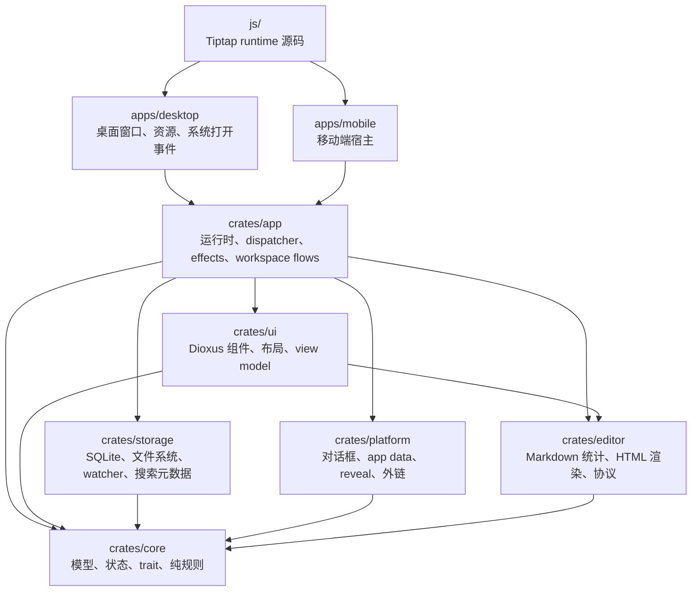

# Papyro

面向长期写作、源码编辑和本地知识库的 Markdown workspace。

[English](README.md) | [文档](docs/zh-CN/README.md) | [架构](docs/zh-CN/architecture.md) | [路线图](docs/zh-CN/roadmap.md) | [开发规范](docs/zh-CN/development-standards.md)

Papyro 是一个基于 Rust 和 Dioxus 0.7 的桌面优先 Markdown 应用。它把用户自己的 `.md` 文件当作第一等公民，同时提供工作区文件树、标签页、搜索、恢复草稿、预览和接近 Typora 体验的 Hybrid 编辑模式。

项目仍处在早期产品和架构打磨阶段。当前最重要的不是堆更多功能，而是把编辑体验、性能、数据可靠性和代码边界打磨到专业笔记软件应有的水平。

## 为什么做 Papyro？

- **本地优先** - 笔记仍是普通 Markdown 文件，用户能自由备份、同步和迁移。
- **Hybrid 写作体验** - 标题、列表、代码块、表格、数学公式和 Mermaid 朝所见即所得方向演进。
- **工作区桌面壳** - 支持侧边栏、标签页、最近文件、快速打开、命令面板、大纲、搜索、回收站和恢复草稿。
- **Rust 应用核心** - 存储、文件操作、状态迁移、恢复和 Markdown 渲染都可以测试。
- **Dioxus 0.7 UI** - desktop 和 mobile 共享应用运行时与 UI 层。
- **本地编辑器 bundle** - Tiptap/ProseMirror、Mermaid、KaTeX 和代码高亮资源都随应用构建。

## 当前状态

<table><tbody><tr><th data-cell-background="var(--tt-color-highlight-orange)" style="background-color: var(--tt-color-highlight-orange)"><span style="color: var(--tt-color-text-orange)">模块</span></th><th data-cell-background="var(--tt-color-highlight-orange)" style="background-color: var(--tt-color-highlight-orange)"><span style="color: var(--tt-color-text-orange)">状态</span></th></tr><tr><td>桌面端</td><td>可用于开发调试</td></tr><tr><td>移动端</td><td>已接入共享运行时，还不是生产级</td></tr><tr><td>Markdown 编辑</td><td>Source、Preview、Hybrid 三种模式</td></tr><tr><td>Mermaid</td><td>Preview 和 Hybrid 已有渲染与编辑路径</td></tr><tr><td>搜索和快速打开</td><td>已有基础 workspace 搜索和最近文件</td></tr><tr><td>恢复</td><td>已有自动保存与恢复草稿流程</td></tr><tr><td>打包发布</td><td>尚未完成</td></tr><tr><td>License</td><td>MIT</td></tr></tbody></table>

## 快速开始

### 环境要求

- Rust stable
- Cargo
- Node.js 20 或更高版本，用于构建编辑器 bundle
- Windows 使用 PowerShell，Unix-like 系统使用 Bash

可选：

```bash
cargo install dioxus-cli
```

### 启动桌面端

```bash
cargo run -p papyro-desktop
```

### 运行完整检查

Windows：

```powershell
powershell -NoProfile -ExecutionPolicy Bypass -File scripts/check.ps1
```

Unix-like：

```bash
bash scripts/check.sh
```

### 构建编辑器资源

手动修改 `js/src/` 下的聚焦源码模块，例如 `tiptap-runtime.js`、
`tiptap-*` 扩展/控制器、`editor-host-runtime.js`、`editor-runtime-bootstrap.js`
以及 `editor-core.js` 中的共享 helper。不要手动改生成物。改完后运行：

```bash
npm --prefix js install
npm --prefix js run build
npm --prefix js test
```

构建脚本会同步生成 `assets/`、`apps/desktop/assets/` 和 `apps/mobile/assets/` 下的编辑器资源。

## 架构速览



一句话理解：

- `apps/*` 是薄宿主壳。
- `crates/app` 管用户流程和副作用。
- `crates/core` 管纯数据和规则。
- `crates/ui` 只渲染状态并发送命令。
- `crates/storage` 管磁盘和 SQLite。
- `crates/editor` 管 Markdown 派生数据和渲染辅助。
- `js/` 管浏览器编辑器 runtime。

完整说明见 [docs/zh-CN/architecture.md](docs/zh-CN/architecture.md)。

## 文档入口


| 目标                | 中文                                                                                     | English                                                                    |
| ----------------- | -------------------------------------------------------------------------------------- | -------------------------------------------------------------------------- |
| 文档地图              | [docs/zh-CN/README.md](docs/zh-CN/README.md)                                           | [docs/README.md](docs/README.md)                                           |
| 架构导览              | [docs/zh-CN/architecture.md](docs/zh-CN/architecture.md)                               | [docs/architecture.md](docs/architecture.md)                               |
| 开发规范              | [docs/zh-CN/development-standards.md](docs/zh-CN/development-standards.md)             | [docs/development-standards.md](docs/development-standards.md)             |
| 产品路线图             | [docs/zh-CN/roadmap.md](docs/zh-CN/roadmap.md)                                         | [docs/roadmap.md](docs/roadmap.md)                                         |
| Markdown 编辑器      | [docs/zh-CN/editor.md](docs/zh-CN/editor.md)                                           | [docs/editor.md](docs/editor.md)                                           |
| UI/UX 重构          | [docs/zh-CN/ui-information-architecture.md](docs/zh-CN/ui-information-architecture.md) | [docs/ui-information-architecture.md](docs/ui-information-architecture.md) |
| UI 界面审计           | [docs/zh-CN/ui-surface-audit.md](docs/zh-CN/ui-surface-audit.md)                       | [docs/ui-surface-audit.md](docs/ui-surface-audit.md)                       |
| App icons         | [docs/zh-CN/app-icons.md](docs/zh-CN/app-icons.md)                                     | [docs/app-icons.md](docs/app-icons.md)                                     |
| 性能预算              | [docs/zh-CN/performance-budget.md](docs/zh-CN/performance-budget.md)                   | [docs/performance-budget.md](docs/performance-budget.md)                   |
| Release packaging | [docs/zh-CN/release-packaging.md](docs/zh-CN/release-packaging.md)                     | [docs/release-packaging.md](docs/release-packaging.md)                     |
| Release QA        | [docs/zh-CN/release-qa.md](docs/zh-CN/release-qa.md)                                   | [docs/release-qa.md](docs/release-qa.md)                                   |
| Known limitations | [docs/zh-CN/known-limitations.md](docs/zh-CN/known-limitations.md)                     | [docs/known-limitations.md](docs/known-limitations.md)                     |
| AI skills         | [docs/zh-CN/ai-skills.md](docs/zh-CN/ai-skills.md)                                     | [docs/ai-skills.md](docs/ai-skills.md)                                     |


## AI 协作

仓库包含项目级 skill 文件，位于 [`skills/`](skills/)：

- [`skills/papyro-onboarding/SKILL.md`](skills/papyro-onboarding/SKILL.md) - 新人环境安装和首次运行。
- [`skills/papyro-architecture/SKILL.md`](skills/papyro-architecture/SKILL.md) - 快速理解架构和依赖边界。
- [`skills/papyro-coding/SKILL.md`](skills/papyro-coding/SKILL.md) - 编码、验证和提交规范。

这些 skill 的目标是让 AI 助手快速加载正确上下文，减少每次开发前重复读全仓库的 token 消耗。

## 贡献

开始改代码前：

1. 阅读 [docs/zh-CN/development-standards.md](docs/zh-CN/development-standards.md)。
2. 查看 [docs/zh-CN/roadmap.md](docs/zh-CN/roadmap.md) 的当前优先级。
3. 每个提交只做一个最小任务。
4. 推送前运行相关检查。

提交标题使用英文 Conventional Commits，例如：

```text
fix: preserve dirty save state
feat: render hybrid headings
docs: update architecture guide
```

## 项目边界

Papyro 当前不是云笔记、团队 wiki 或插件平台。它首先要成为一个专业、本地优先、体验稳定的 Markdown workspace。可靠性、编辑手感和可维护性优先于功能数量。

## License

Papyro 采用 [MIT License](LICENSE) 开源。