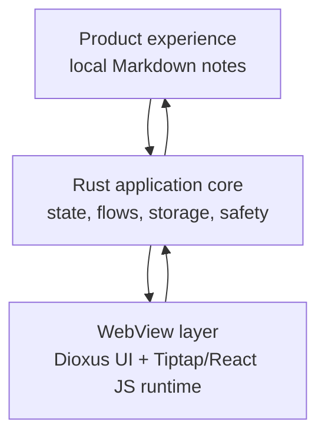
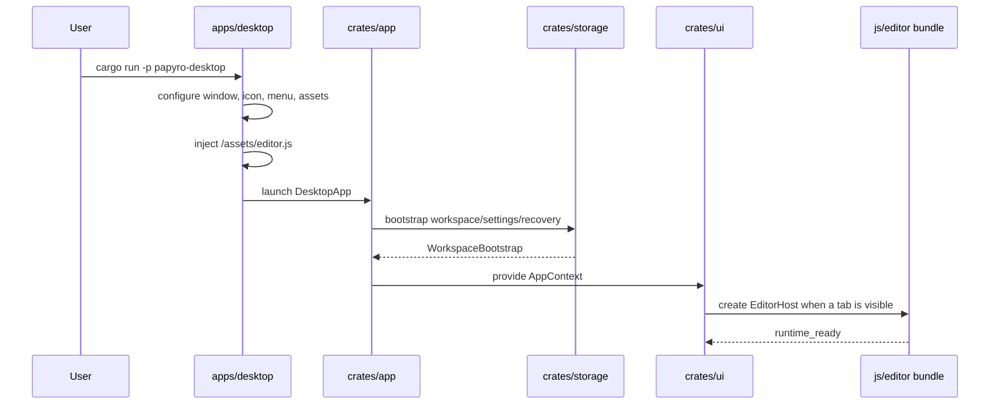
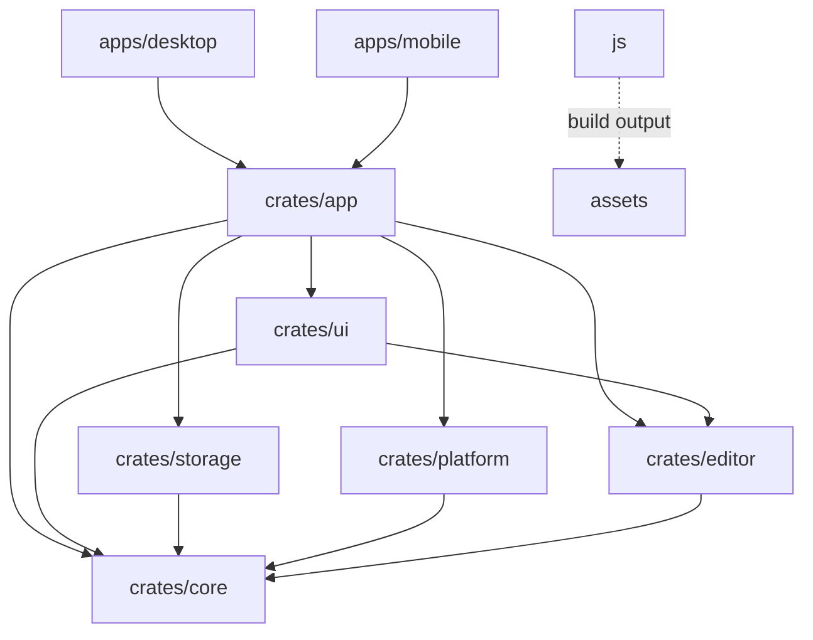
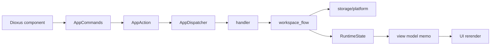
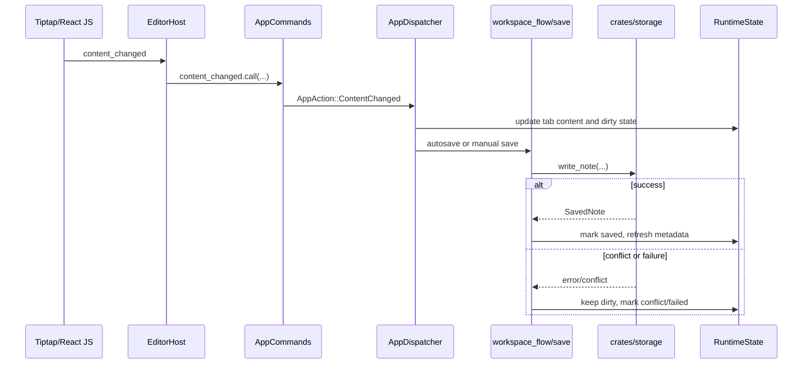
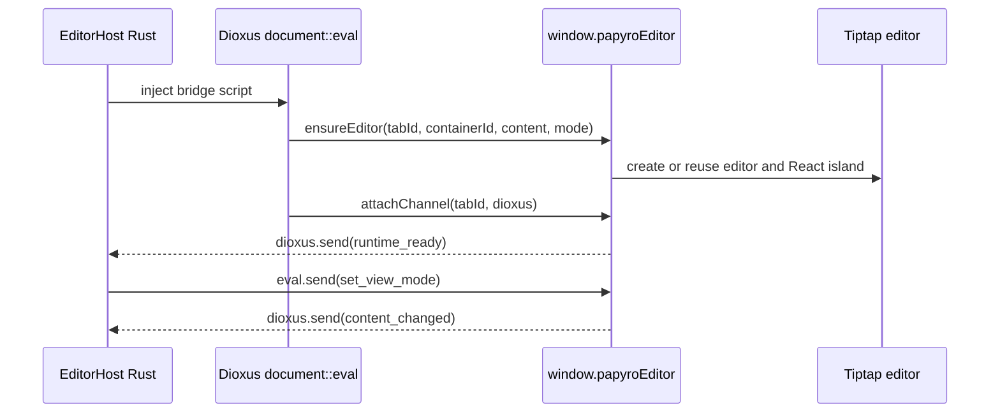
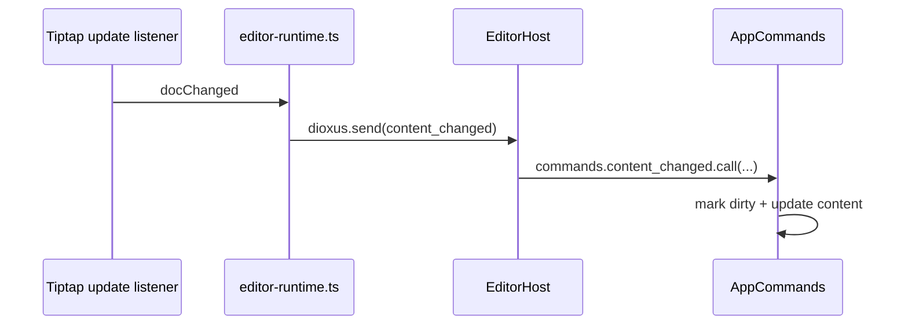
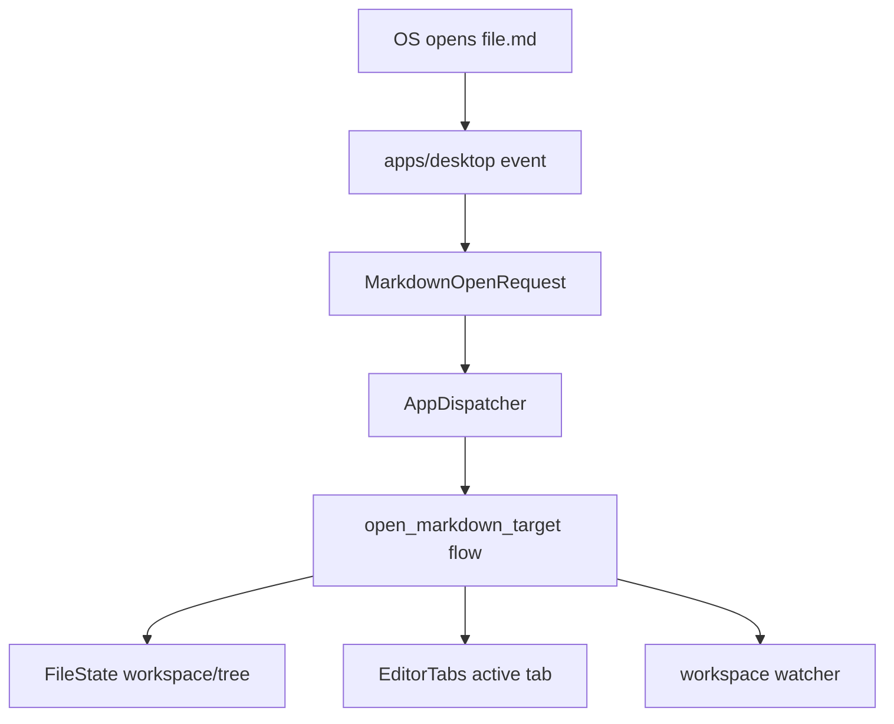

# Papyro Architecture Onboarding

[简体中文](zh-CN/architecture.md) | [Documentation](README.md)

This guide is meant to teach the project, not just list folders. After reading it, a new contributor should understand:

- what kind of app Papyro is
- why the project uses Rust, Dioxus, and JavaScript together
- how clicks, typing, saving, previewing, and editor events move through the system
- what each crate owns
- how Rust and the Tiptap/React JavaScript runtime communicate
- where future work such as file association, multi-window mode, theming, and Hybrid editing belongs

If this is your first time in the repository, read this guide in order. Then use [development standards](development-standards.md), [roadmap](roadmap.md), [tiptap refactor plan](tiptap-refactor-plan.md), and [performance budget](performance-budget.md) for task-specific work.

## 1. One Sentence

Papyro is a local-first Markdown workspace app.

More concretely:

- user notes are real `.md` files in real folders
- SQLite stores metadata such as workspaces, recent files, tags, settings, and recovery drafts
- Rust owns application state, file operations, storage, safety, and user flows
- Dioxus 0.7 lets us write UI components in Rust and render them into a desktop WebView
- Tiptap/ProseMirror owns complex browser editing behavior such as input, selection, IME, undo, schema-aware blocks, tables, and document-native commands
- React owns the editor UI island for Tiptap menus, handles, overlays, and future node views
- JavaScript owns the editor runtime because Tiptap, Mermaid, KaTeX, React, and DOM editing APIs live in the browser ecosystem



## 2. Vocabulary

| Term | Meaning |
| --- | --- |
| Workspace | A folder selected by the user. File tree, search, and watcher state center on it. |
| Note | A Markdown file, usually `.md` or `.markdown`. |
| Tab | An open document in the current window. It tracks path, dirty state, and save state. |
| Content | The current text for a tab. It may not be saved to disk yet. |
| Dirty | The tab has unsaved changes. Failed writes must keep the tab dirty. |
| Shell | A platform entry point such as `apps/desktop` or `apps/mobile`. |
| Runtime | The shared signals, commands, effects, and context created by `crates/app`. |
| View model | A UI-friendly projection of state from `crates/ui/src/view_model.rs`. |
| Editor runtime | The Tiptap/ProseMirror runtime and React island built from `js/src/editor-entry.ts`. |
| Protocol | The command/event structs passed between Rust and JavaScript. |

## 3. Startup Flow

Desktop startup:



Desktop workspace selection is explicit:

- a startup Markdown file wins, and Papyro picks the deepest known workspace that contains it
- `PAPYRO_WORKSPACE` is the only environment-provided default workspace
- without a startup file or environment default, Papyro resumes the most recent workspace
- on a true first run, Papyro starts with no workspace and shows the onboarding empty state

The desktop app intentionally does not scan the process current directory as an implicit workspace.
This keeps `cargo run` and packaged launches from accidentally indexing a large project folder.

Key files:

| Step | File |
| --- | --- |
| Desktop launch | `apps/desktop/src/main.rs` |
| Desktop app entry | `crates/app/src/desktop.rs` |
| Runtime and context | `crates/app/src/runtime.rs` |
| Initial state | `crates/app/src/state.rs` |
| Desktop layout | `crates/ui/src/layouts/desktop_layout.rs` |
| Editor pane | `crates/ui/src/components/editor/pane.rs` |
| Editor host bridge | `crates/ui/src/components/editor/host.rs` |

Mobile also uses `crates/app` and `crates/ui`, but today it is a shared-runtime development entry, not a production mobile product.

## 4. Why Rust + Dioxus + JavaScript?

This is the most important architectural choice in Papyro. It is not accidental mixing. It is a boundary decision.

### Rust owns trusted application behavior

Rust owns:

- filesystem reads and writes
- SQLite metadata
- workspace scanning
- save, rename, move, delete flows
- recovery drafts
- dirty/save/conflict state
- testable Markdown-derived logic
- safe wrappers around platform APIs

These areas need reliability, strong tests, and clear ownership.

### Dioxus owns Rust-authored UI

Dioxus lets the project write UI in Rust while rendering into a WebView.

Papyro uses Dioxus 0.7:

- components are Rust functions returning `Element`
- local state uses `Signal<T>`
- derived state uses `use_memo`
- side effects use `use_effect`
- UI talks to the app layer through `AppContext` and `AppCommands`

This keeps the UI close to Rust state without turning the whole app into a JavaScript frontend.

### JavaScript owns browser editor mechanics

Complex text editing is a browser ecosystem strength.

Tiptap sits on ProseMirror and solves hard problems that are expensive to rebuild in Rust or ad hoc DOM code:

- cursor and selection behavior
- IME composition
- undo/redo history
- schema-aware blocks and marks
- table editing and column resizing
- node views and extension composition
- Markdown import/export through tested handlers
- React-based editor chrome through official `@tiptap/react` APIs
- paste and keyboard handling

Mermaid, KaTeX, React, and many Markdown editor integrations also live naturally in JS/DOM.

Writing all of this from scratch in Rust would be expensive and unlikely to match mature editor behavior. Papyro therefore uses:

- Rust for application truth and data safety
- JavaScript for browser editor interaction and React editor chrome
- a typed JSON protocol between them

## 5. Repository Map

```text
.
├─ apps/
│  ├─ desktop/             # desktop shell: window, launch args, assets, system events
│  └─ mobile/              # mobile shell: mobile assets and shared runtime mount
├─ crates/
│  ├─ app/                 # runtime, dispatcher, handlers, effects, use cases
│  ├─ core/                # models, state structs, traits, pure rules
│  ├─ ui/                  # Dioxus components, layouts, view models, i18n
│  ├─ storage/             # SQLite, filesystem, watcher, workspace scan
│  ├─ platform/            # dialogs, app data, reveal, external links
│  └─ editor/              # Markdown summary, HTML render, protocol structs
├─ js/                     # Tiptap runtime, React editor island, tests, build script
├─ assets/                 # shared generated/static assets
├─ scripts/                # CI and local validation scripts
├─ skills/                 # project-local AI skills
└─ docs/                   # current documentation
```

## 6. Dependency Direction



Rules:

- `core` must not depend on Dioxus, storage, platform, or JS.
- `ui` must not write files directly.
- `storage` must not know UI layout.
- `platform` must not mutate app state directly.
- `js` must not save files directly.
- After dependency direction changes, run `node scripts/check-workspace-deps.js`.

## 7. Layer Responsibilities

### `apps/desktop`

The desktop shell owns:

- logging setup
- native window title, size, icon, and menu configuration
- platform window chrome policy: macOS keeps native traffic-light controls, while Windows and Linux keep the Papyro custom titlebar controls
- runtime asset sync
- `/assets/editor.js` injection
- startup Markdown path collection
- system opened-file event handling
- mounting `papyro_app::desktop::DesktopApp`

It must not own shared workspace flow, save logic, file tree state, or tab content state.

### `apps/mobile`

The mobile shell owns:

- mobile CSS and asset injection
- brand asset context
- mounting `papyro_app::mobile::MobileApp`

It should not fork desktop business logic.

### `crates/app`

The application layer is the orchestration center.

| File | Role |
| --- | --- |
| `runtime.rs` | creates runtime signals, memos, context, and effects |
| `state.rs` | defines runtime signal groups |
| `actions.rs` | defines app-level actions |
| `dispatcher.rs` | routes actions to handlers and effects |
| `handlers/*` | connects actions, state, storage, and platform |
| `workspace_flow/*` | owns file/workspace/tab use cases |
| `effects.rs` | owns autosave, watcher, flush-on-close, runtime side effects |
| `settings_persistence.rs` | batches settings writes |
| `open_requests.rs` | normalizes external Markdown open requests |

The app layer keeps UI away from storage and keeps storage away from UI.

### `crates/core`

The core layer owns stable data and pure rules:

- `Workspace`
- `NoteMeta`
- `FileNode`
- `EditorTab`
- `AppSettings`
- `FileState`
- `EditorTabs`
- `TabContentsMap`
- `UiState`
- `NoteStorage`
- `ProcessRuntimeSession`
- `WindowSession`
- `WindowSessionKind`

If logic can be tested without Dioxus, filesystem APIs, or platform APIs, it may belong in `core`.

### `crates/ui`

The UI layer owns Dioxus rendering:

- layouts
- header, sidebar, editor, settings, search, command palette, recovery, trash
- theme classes and primitives
- `AppContext`
- `AppCommands`
- view models
- i18n text

Good UI code reads view models, renders components, and sends commands.

### `crates/storage`

Storage owns persistence:

- SQLite schema and migrations
- workspace metadata
- note metadata
- recent files
- tags
- settings
- recovery drafts
- Markdown file reads and writes
- workspace scanning
- watcher event mapping
- search helpers

Data safety rule: failed writes must not clear dirty state.

### `crates/platform`

Platform owns system integration:

- app data directory
- folder and file dialogs
- reveal in explorer
- external URL opening
- desktop opened URL extraction

These APIs are wrapped so app flows can be tested.

### `crates/editor`

Editor owns Rust-side Markdown capability:

- document statistics
- outline extraction with TOC-ready anchors
- Hybrid block analysis
- Preview HTML rendering
- code highlighting theme decisions
- Rust/JS protocol structs

`crates/editor` is not the Tiptap runtime. The browser editor runtime lives in `js/`.

Outline extraction uses the same `pulldown-cmark` Markdown semantics as Preview
instead of a line-based scanner. It collects ATX and Setext headings, strips
inline Markdown formatting from titles, preserves explicit heading IDs, and
generates stable duplicate-safe anchor IDs. Rust keeps this as the
application-level TOC source; JS only consumes the rendered outline rows for
active-state sync and navigation.

### `js/`

The JS directory owns browser editor runtime code.

| File | Role |
| --- | --- |
| `js/src/editor-entry.ts` | bundle entry, registers the Tiptap adapter behind `window.papyroEditor` |
| `js/src/editor-runtime-defaults.ts` | production Tiptap runtime assembly, including React island, node view, and table adapters |
| `js/src/editor-runtime.ts` | Tiptap editor creation, Markdown sync setup, lifecycle wiring, and React tree mounting |
| `js/src/editor-runtime-protocol.ts` | Rust command bridge for view mode, content, preferences, commands, focus, and destroy messages |
| `js/src/editor-runtime-contract.ts` | stable host facade and adapter contract for `window.papyroEditor` |
| `js/src/tiptap-react/` | React island provider, slots, mount controller, and future editor UI components |
| `js/src/tiptap-*.js` | focused Tiptap controllers, commands, Markdown handlers, and UI helpers |
| `js/test/tiptap-*.test.ts` | Node test-runner coverage for runtime, commands, tables, Markdown, and UI primitives |
| `js/build.js` | builds and syncs generated editor assets |

Only edit `js/src/*` by hand. Do not edit generated `assets/editor.js` directly.

## 8. Runtime State

`crates/app/src/state.rs` defines `RuntimeState` as a group of Dioxus signals:

```text
RuntimeState
├─ file_state              # workspace, tree, selection, recent files
├─ process_runtime         # process session and open mode
├─ editor_tabs             # open tabs and active tab
├─ tab_contents            # tab content and revision
├─ ui_state                # theme, settings, view mode, chrome state
├─ workspace_search        # workspace search
├─ recovery_drafts         # recovery draft list
├─ status_message          # visible status text
├─ workspace_watch_path    # current watcher path
├─ pending_close_tab       # close confirmation
├─ pending_delete_path     # delete confirmation
├─ editor_runtime_commands # Rust-to-JS editor command queue
└─ settings_persistence    # background settings save queue
```

The state is split so unrelated UI areas do not invalidate each other:

- file tree changes should not rebuild the Tiptap editor
- typing should not rerender the whole sidebar
- theme changes should not recompute Markdown preview
- tab switching should not rescan the whole workspace

## 9. UI-To-App Data Flow



Example: create a new note.

1. UI calls `commands.create_note.call(name)`.
2. `AppCommands` reaches `AppDispatcher`.
3. Dispatcher routes `AppAction::CreateNote`.
4. Handler calls `file_ops::create_note`.
5. Workspace flow asks storage to create the file.
6. Success updates `FileState`, `EditorTabs`, and `TabContentsMap`.
7. View models recompute.
8. UI shows the new tab and file tree entry.

## 10. Save Flow



The important boundary:

- JS reports content changes.
- Rust decides when to save.
- storage writes to disk.
- failed saves keep dirty state.

## 11. Why The Editor Protocol Exists

Rust and JavaScript should not know each other's internal objects. They communicate through explicit message types in `crates/editor/src/protocol.rs`:

- `EditorCommand`: Rust sends this to JS.
- `EditorEvent`: JS sends this to Rust.

Benefits:

- JSON structure is testable.
- Fields stay stable.
- new capabilities have a clear change point.
- JS does not know Rust state internals.
- Rust does not know Tiptap, ProseMirror, React, or DOM object internals.

## 12. How Rust Starts The JS Editor

The key file is `crates/ui/src/components/editor/host.rs`.

Each editable tab gets an `EditorHost`. It:

1. creates a DOM container id such as `mn-editor-{tab_id}`
2. runs a bridge script with `document::eval`
3. waits for `window.papyroEditor`
4. calls `window.papyroEditor.ensureEditor(...)`
5. calls `window.papyroEditor.attachChannel(tabId, dioxus)`
6. receives `runtime_ready`
7. listens for JS events
8. sends commands with `eval.send(EditorCommand::...)`



The `dioxus` object is provided by Dioxus eval:

- JS calls `dioxus.send(value)`, Rust receives with `eval.recv::<EditorEvent>().await`.
- Rust calls `eval.send(command)`, JS receives with `await dioxus.recv()`.

## 13. How JS Registers The Runtime

`js/src/editor-entry.ts` registers:

```javascript
window.papyroEditor = {
  name: "papyro.editor",
  version: "1.0.0",
  protocolVersion: 1,
  runtimeKind: "tiptap",
  methods: [...],
  describe() { ... },
  ensureEditor,
  handleRustMessage(tabId, message) { ... },
  attachChannel(tabId, dioxus) { ... },
  attachPreviewScroll,
  navigateOutline,
  syncOutline,
  scrollEditorToLine,
  scrollPreviewToHeading,
  renderPreviewMermaid,
  renderPreviewMath,
};
```

The facade is frozen and installed as a non-writable `window.papyroEditor`
property. Rust validates the facade name, facade version, protocol version, and
required bridge methods before mounting an editor. This keeps the WebView bridge
auditable while still hiding Tiptap, ProseMirror, React, registry, and DOM
internals behind explicit functions.

| Function | Purpose |
| --- | --- |
| `describe` | return the frozen facade descriptor used by smoke tests and host checks |
| `ensureEditor` | create or reuse a Tiptap editor instance and its React island |
| `attachChannel` | store the Dioxus communication object |
| `handleRustMessage` | handle Rust commands |
| `syncOutline` | sync active heading state |
| `navigateOutline` | jump to an outline heading |
| `renderPreviewMermaid` | render Mermaid in Preview |
| `renderPreviewMath` | render KaTeX math in Preview |

## 14. Rust-To-JS Commands

`EditorCommand` includes:

| Command | Purpose |
| --- | --- |
| `SetContent` | replace editor content from Rust |
| `SetViewMode` | update Source / Hybrid / Preview runtime mode |
| `SetBlockHints` | send Rust-derived Markdown block hints |
| `SetPreferences` | update editor preferences |
| `InsertMarkdown` | insert Markdown at the current selection |
| `ApplyFormat` | apply bold, italic, link, heading, etc. |
| `Focus` | focus the editor |
| `Destroy` | destroy or recycle the editor host |

Commands are usually sent from:

- `crates/ui/src/components/editor/host.rs`
- `crates/ui/src/commands.rs`
- `crates/app/src/dispatcher.rs`

## 15. JS-To-Rust Events

`EditorEvent` includes:

| Event | Trigger |
| --- | --- |
| `RuntimeReady` | editor runtime is ready |
| `RuntimeError` | JS runtime failed |
| `ContentChanged` | user input changed document text |
| `SaveRequested` | JS captured a save shortcut |
| `PasteImageRequested` | user pasted or dropped an image |

Local image paste and drop follows the official Tiptap file-handling split:
the editor runtime intercepts supported image files, but it does not persist
them or enable base64 image documents. JS reads the file as base64 and sends
`PasteImageRequested { tab_id, mime_type, data }`; Rust validates the MIME and
image signature, writes a unique file under the workspace `assets/` directory,
then queues `EditorCommand::InsertMarkdown` with a relative
`` link. If no Rust channel is attached, the paste/drop is left to
Tiptap/ProseMirror instead of being consumed.

Mermaid rendering stays in JS because Mermaid requires DOM APIs and manages its
own SVG rendering queue. Papyro uses one shared renderer for Preview HTML and
the Tiptap Mermaid node view. The renderer initializes Mermaid with
`startOnLoad: false`, `securityLevel: "strict"`, `suppressErrorRendering: true`,
and `htmlLabels: false`, and marks those safety keys as secure so document-level
Mermaid directives cannot relax the local-document sandbox. Rendering is
tokenized per target element so stale async renders cannot overwrite a newer
diagram state.

KaTeX rendering also stays in JS. Rust enables `pulldown-cmark`
`ENABLE_MATH`, strips raw HTML as usual, and converts inline/display math
events into escaped `.mn-math-inline` and `.mn-math-block` placeholders.
`js/src/tiptap-math.js` owns the shared renderer for Tiptap math node views and
Preview placeholders. It renders with `trust: false`, `throwOnError: true`,
`output: "mathml"`, bounded `maxSize`, and bounded `maxExpand`, so local
documents cannot opt into trusted KaTeX HTML features.

Outline/TOC data stays on the Rust side for revision alignment. `OutlineItem`
contains the heading level, cleaned title, source line number, and stable
`anchor_id`. `OutlinePane` exposes those values through `data-line-number`,
`data-heading-index`, and `data-anchor-id`; `window.papyroEditor.syncOutline`
and `navigateOutline` continue to handle only DOM active-state and scroll
behavior. This follows Tiptap's TOC model of headless anchor data plus a
separate UI, while keeping Papyro's Rust document model as the source of truth.

Most input follows this path:



## 16. Why Hybrid Needs Rust Block Hints

Hybrid mode is not just CSS.

It needs to know the source ranges for:

- heading
- list
- task list
- blockquote
- code fence
- table
- math
- Mermaid

Rust analyzes these in `crates/editor/src/parser/blocks.rs` and produces `MarkdownBlockHintSet`.

Flow:

```text
active document snapshot
-> analyze_markdown_block_snapshot_with_options
-> MarkdownBlockHintSet
-> EditorHost
-> EditorCommand::SetBlockHints
-> Tiptap runtime compatibility handlers
```

Why not all JS?

- Rust already needs Markdown stats, Preview, Outline, and large-document policy.
- block hints can align with Rust document revisions.
- large-document fallback is easier to centralize.

Why not all Rust?

- Tiptap document state, selection, node views, DOM hit testing, and scroll live in JS.
- Browser editor behavior would be awkward to drive directly from Rust.

Hybrid is therefore Rust analysis plus Tiptap/React presentation. As more editor surfaces move to native Tiptap extensions and React node views, block hints should stay compatibility data rather than a second source of truth.

## 17. Preview Versus Hybrid

| Capability | Preview | Hybrid |
| --- | --- | --- |
| Editable | no | yes |
| Primary rendering | Rust HTML | Tiptap/ProseMirror document view with React chrome |
| Mermaid | JS-assisted render | Tiptap node/extension state |
| KaTeX math | Rust placeholder + JS KaTeX render | Tiptap math node view |
| Truth source | Rust tab content | Rust tab content plus JS input events |

Preview uses `pulldown-cmark` and `syntect` on the Rust side, then JS helps with
Mermaid, KaTeX, and scroll/outline behavior. Preview Mermaid and math blocks
render only when their source changed, show explicit states, and reuse the same
strict renderer configuration as the editable node views.

Hybrid uses Tiptap as the interactive editor and keeps Markdown synchronization explicit so files remain portable.

## 18. Why Editor Hosts Are Reused

Creating a Tiptap editor is expensive. It builds a ProseMirror view, extension state, node views, plugins, listeners, layout caches, and the React island around editor chrome.

Papyro therefore keeps a host lifecycle and spare pool:

- opening a tab tries to reuse an existing editor host
- hidden tabs keep their host
- closed tabs are destroyed or recycled after a delay
- sidebar, theme, and status changes should not rebuild the editor

Relevant files:

- `crates/ui/src/components/editor/pane.rs`
- `crates/ui/src/components/editor/host.rs`
- `js/src/editor-runtime.ts`
- `js/src/tiptap-react/`

## 19. Workspace, Tabs, And File Association

Current model:

- `FileState` stores current workspace, file tree, selected path.
- `EditorTabs` stores open tabs and active tab.
- `TabContentsMap` stores tab contents.
- `workspace_watch_path` stores the current watcher path.

OS Markdown open flow:

1. desktop receives opened-file event
2. event becomes `MarkdownOpenRequest`
3. app determines the target workspace
4. app bootstraps or reloads that workspace if needed
5. app opens or activates the tab
6. sidebar file tree follows the tab's workspace
7. switching tabs also switches visible workspace context
8. watcher subscriptions follow the active workspace path



This matters for multi-workspace tabs and future multi-window behavior.
Opening a file in another workspace must preserve existing tabs; the active
tab path is the source of truth for the sidebar tree and watcher context.

### Window Session Ownership

`crates/core/src/session.rs` keeps process/window routing pure and testable.

- `ProcessRuntimeSession` stores the configured note open mode and the effective runtime mode.
- `WindowSessionRegistry` stores known windows and the focused window.
- `WindowSessionKind::Main` owns normal tabbed editing in single-window mode.
- `WindowSessionKind::Settings` is a process-level tool window and must not receive document tabs.
- `WindowSessionKind::Document { path }` is the only window kind that owns one explicit document path.
- Workspace paths on a window are context metadata; they do not imply document ownership.
- `ProcessRuntimeSession::prepare_markdown_open` is the mutating route used by app code. In `MultiWindow` mode it registers a new document session the first time a path is opened, or focuses the existing document session for that path.
- `crates/app/src/state.rs` queues `DocumentWindowRequest` values after routing so desktop code can open or focus the native document window.
- `crates/app/src/desktop_tool_windows.rs` owns the native desktop window registry. Reopening the same path focuses the existing `WindowSessionId` instead of duplicating the document.

Document windows run their own Dioxus runtime with `multi_window_available: false`.
That keeps their `EditorTabs`, `TabContentsMap`, pending close tab, selection, command queue, and dirty state local to that window instead of projecting through the main window state.
Storage and settings are process-level dependencies:

- `crates/app/src/runtime.rs` passes the same storage `Arc<dyn NoteStorage>` into document windows.
- `crates/app/src/process_settings.rs` owns `ProcessSettingsHub`, a process-level settings snapshot and watch channel shared by every runtime.
- Runtime bootstrap goes through `ProcessSettingsHub::prepare_bootstrap`, so newly opened document windows use the latest in-memory global settings before falling back to disk state.
- Settings saves publish to the hub before writing to storage, so other windows update live.
- `crates/app/src/settings_persistence.rs` guards settings writes with revision checks and a process-level write lock, so an older window cannot overwrite a newer settings snapshot after a delayed save task.

Cross-window document save conflicts still need dedicated tests and UX before multi-window editing should be considered complete.

## 20. How The Settings Tool Window Works

Desktop settings now open in an independent Dioxus desktop window instead of
as a modal inside the main editor chrome.

The implementation path is:

- `crates/app/src/desktop_tool_windows.rs` creates the settings tool window with `dioxus::desktop::window().new_window(...)`.
- `crates/ui/src/components/settings/mod.rs` exposes `SettingsSurface`, so the modal and tool window reuse one settings form.
- `crates/ui/src/layouts/desktop_layout.rs` asks a `SettingsWindowLauncher` context to open the tool window, with the old modal kept as a fallback.
- The tool window receives the same app context as the main window, so settings changes still flow through normal commands and update the main editor live.
- The tool window is created hidden, then shown and focused after the desktop context resolves. This avoids a visible blank white window during webview startup.
- Window title text is localized through the shared app context, and the native window icon is loaded from the Papyro logo asset so secondary windows match the main app chrome.
- Desktop chrome is platform-aware. macOS settings and main windows use native traffic-light controls and hide Papyro's self-drawn minimize, maximize, and close buttons. Windows and Linux keep the custom Papyro controls and drag regions.

Document windows reuse the same process-level window pattern, but unlike settings
they create a fresh app runtime rather than sharing the main `AppContext`.
Their editor state is local, while storage and settings are supplied through shared process services.

## 21. Where To Start For Common Tasks

| Task | Start here | Also check |
| --- | --- | --- |
| UI layout/style | `crates/ui/src/components` | `assets/main.css`, `apps/*/assets/main.css` |
| Theme tokens or Markdown visual style | [theme-system.md](theme-system.md) | `assets/main.css`, `js/src/tiptap-*.js`, `js/src/tiptap-react/` |
| New UI command | `crates/ui/src/commands.rs` | `crates/app/src/actions.rs` |
| New app behavior | `crates/app/src/dispatcher.rs` | `handlers/*`, `workspace_flow/*` |
| File operation | `crates/app/src/workspace_flow` | `crates/storage/src/fs` |
| Save behavior | `workspace_flow/save.rs` | `crates/storage/src/lib.rs` |
| File tree behavior | `crates/ui/src/components/sidebar` | `crates/core/src/file_state.rs` |
| Markdown Preview | `crates/editor/src/renderer/html.rs` | `crates/ui/src/components/editor/preview.rs` |
| Hybrid editing | `js/src/editor-runtime.ts`, `js/src/tiptap-*.js` | `js/src/tiptap-react/`, `crates/editor/src/parser/blocks.rs` |
| Paste/selection/IME | `js/src/tiptap-paste-controller.js`, `js/src/tiptap-ui-primitives.js` | `js/test/tiptap-*.test.ts` |
| Settings field | `crates/core/src/models.rs` | settings UI and storage settings |
| OS file open | `apps/desktop/src/main.rs` | `crates/app/src/open_requests.rs`, `dispatcher.rs` |

## 22. Standard Feature Path

Example: adding a callout block.

1. Define the product behavior in roadmap or an issue.
2. Pick the UI entry, such as toolbar, command palette, or shortcut.
3. Extend `AppCommands` if Rust must route the action.
4. Extend `AppAction` and dispatcher if this is app behavior.
5. Use `EditorRuntimeCommandQueue` if Rust needs JS to insert Markdown.
6. Handle the command in JS.
7. Add JS core tests when behavior changes.
8. Update [tiptap-refactor-plan.md](tiptap-refactor-plan.md).
9. Run relevant validation.

Do not make UI components write files directly.

## 23. Standard Protocol Change Path

When Rust and JS need a new message:

1. update `crates/editor/src/protocol.rs`
2. add serde JSON tests
3. update Rust sender or receiver in `EditorHost`
4. handle the message in `js/src/editor-runtime.ts` or a focused `js/src/tiptap-*.js` controller
5. send JS events with `dioxus.send(...)`
6. handle events in the Rust `EditorHost` match
7. add Rust or JS tests
8. update this guide and [tiptap-refactor-plan.md](tiptap-refactor-plan.md)

Protocol messages should use stable data. Do not pass Tiptap, ProseMirror, React, or DOM internal objects.

## 24. Performance Boundaries

High-risk paths:

- typing
- paste
- tab switch
- Source/Hybrid/Preview switch
- Preview render
- outline extraction
- file tree refresh
- workspace search
- sidebar resize

Before changing these paths, read [performance budget](performance-budget.md).

Ask:

- will this rebuild the Tiptap editor or React island?
- will this clone large document text?
- will this do IO in a render path?
- will this make sidebar and editor subscribe to each other?
- will this parse the whole document on every keystroke?

## 25. Project Health

Papyro tries to keep these habits:

- docs describe current facts
- README is visitor-facing
- roadmap describes priority, not diary entries
- skills help AI load focused context
- each commit does one minimal task

Full check:

```powershell
powershell -NoProfile -ExecutionPolicy Bypass -File scripts/check.ps1
```

Docs-only minimum:

```bash
node scripts/check-perf-docs.js
node scripts/report-file-lines.js
```

## 26. Summary

Papyro's core boundary is: Rust owns application truth, Dioxus owns UI composition, JavaScript owns complex Tiptap/React editor interaction, and both sides communicate through an explicit protocol.

If you preserve that boundary, features, UI work, Hybrid improvements, file association, and future multi-window work all have clear homes.
