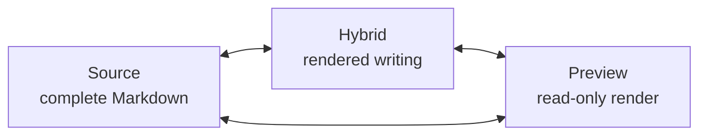
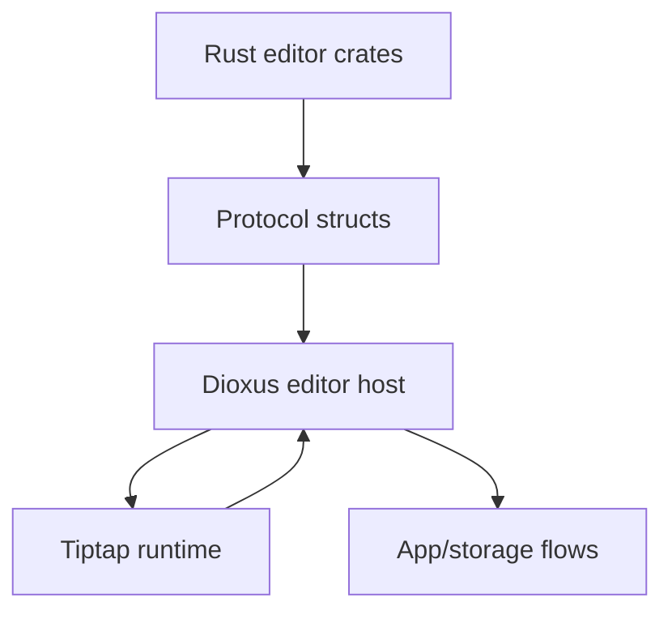

# Markdown Editor Guide

[简体中文](zh-CN/editor.md) | [Documentation](README.md)

Papyro's editor is the product center. Source mode must stay trustworthy, Preview mode must stay readable, and Hybrid mode must become comfortable enough for daily writing.

## Goals

- Keep Markdown files portable and human-readable.
- Make common writing tasks feel modern: headings, lists, links, tables, code, math, images, and Mermaid should be easy to insert and edit.
- Keep Source mode available for exact control.
- Keep Preview and Hybrid visually aligned.
- Preserve selection, cursor, undo, paste, and IME behavior before adding more decoration.

## Modes

| Mode | Purpose | Editing |
| --- | --- | --- |
| Source | Plain Markdown editing | Full source text |
| Hybrid | Rendered Markdown blocks with editable behavior | Main writing mode |
| Preview | Rendered document | Read-only |

## Runtime Contract

The `feat-tiptap` branch now runs Tiptap/ProseMirror behind the existing
`window.papyroEditor` facade. Rust and Dioxus still talk to the stable facade;
they do not depend on Tiptap internals.

Content synchronization must flow through `MarkdownSyncController`:

- Rust/Dioxus still own saved content, dirty state, tab state, and workspace state.
- JS keeps one canonical Markdown string per editor entry.
- Rust `set_content` first updates the controller, then writes into Tiptap with `contentType: "markdown"` while suppressing echo events.
- Tiptap `update` events call `editor.getMarkdown()` and emit `content_changed` with Markdown.
- Parse failures must not replace the last known good Markdown. JS emits `runtime_error` and leaves the user with editable source content.
- Source mode will use the same controller rather than keeping a separate hidden content copy.
- Preview remains Rust-rendered HTML and never becomes the source of persisted content.

## Rust And JS Responsibilities

Rust owns:

- Markdown summary and document stats
- outline extraction
- block analysis for Hybrid hints
- HTML rendering for Preview
- code highlighting through `syntect`
- protocol structs in `crates/editor/src/protocol.rs`

JS owns:

- Tiptap editor state and extensions
- input commands and paste behavior
- selection, cursor, scroll, and IME handling
- Hybrid rich-text behavior and node views
- Mermaid, KaTeX, table, task list, image, and code block extensions

The app layer owns:

- tab truth
- content truth
- dirty/save/conflict state
- storage writes
- workspace context

## Hybrid Product Bar

Hybrid is not complete when it merely hides Markdown markers. It should compare well with modern Markdown and document tools such as Typora and Feishu Docs.

For the architecture review behind the next Hybrid stabilization pass, see [Hybrid Editor Architecture Review](editor-hybrid-architecture.md).

Expected capabilities:

- headings render after confirmation and remain directly editable
- lists continue, indent, outdent, and select predictably
- checkboxes can be toggled without damaging Markdown source
- links and inline code do not unexpectedly reveal source on normal clicks
- code blocks preserve cursor hit testing and selection contrast
- Mermaid blocks can be edited while keeping rendered feedback visible
- tables can be inserted, navigated, and edited without manual pipe alignment
- inline and display math can be inserted and corrected with clear feedback
- paste replaces selected text and preserves expected Markdown behavior
- IME composition is never interrupted by Markdown shortcuts

## Block Editing Priorities

| Block | Required behavior |
| --- | --- |
| Heading | rendered style, stable cursor, marker access only when needed |
| List | continuation, indentation, checkbox toggle, selection stability |
| Table | insert table, add/remove row/column, cell navigation, alignment |
| Code block | syntax highlighting, stable hit testing, visible selection |
| Inline code | consistent selection background, no accidental source reveal |
| Link | clickable affordance plus predictable edit path |
| Math | inline/display insertion, rendered preview, error feedback |
| Mermaid | side-by-side edit/render path for complex diagrams |
| Image | paste/import local asset, render safely, preserve Markdown link |

## Insertion Entry

The command palette includes insertion commands for common writing structures: table, fenced code block, link, image, callout, inline math, display math, Mermaid diagram, and task list. These commands insert Markdown into the active tab through the editor runtime command queue, so they share the same selection replacement path as pasted snippets. Snippets can include a cursor landing offset, which keeps formula and block insertion ready for immediate typing.

Hybrid table widgets support direct cell editing, Tab/Shift+Tab cell navigation, and row/column actions relative to the focused cell. The Markdown source remains the storage format, but normal table edits should not require hand-aligning pipe syntax.

Hybrid and Preview share the same document rhythm. The editor, source pane, fallback editor, and Preview scroller keep at least 24px of padding, and Hybrid unordered/ordered lists use the same indent and list-item spacing tokens as Preview.

Clicking blank space inside a table cell should focus the editable cell through Tiptap/ProseMirror coordinates and refresh the active-cell chrome. Clicking text or inline content inside the cell stays on the native text-editing path, and dragging across cells is the explicit range-selection gesture.

Selecting a single table cell should show a visible theme border around that cell. Hovering a table cell reveals row and column axis handles outside the grid; those handles span the hovered row height or column width, select the whole axis on click, and open the scoped table menu only after the ProseMirror row or column selection succeeds.

Block handles must target semantic block owners. Tables, code blocks, images, display math, and Mermaid blocks expose one outer block-level handle; hovering inside table cells or inside complex block controls must not create child paragraph or child-control handles. Table-specific row, column, cell, and range controls belong to the table overlay, not to the generic block handle.

Hybrid selection color is driven by the shared `--mn-hybrid-selection` token. Code blocks, inline code, links, table inputs, and Mermaid source editors should therefore use the same selection tone as normal editor text instead of mixing native browser blue with custom editor selection layers.

Hybrid pointer behavior must distinguish glyphs from line-height whitespace. Hovering or clicking directly on text uses edit semantics for that line. Hovering the vertical gap below a glyph run stays in normal semantics and should target the next line when selecting. Hovering the gap above a glyph run should target the previous line. Selection backgrounds should be clipped to glyph/text rectangles and must not paint the whole line-height gap.

When there is no previous or next line, gap targeting falls back to the current line. This keeps first/last-line clicks from jumping to a synthetic line such as `0` while preserving predictable gap behavior in the middle of a document.

## Markdown Rendering

Current Rust-side stack:

- `pulldown-cmark` for Markdown parsing
- `syntect` for code highlighting
- HTML sanitization and local image URL handling in `crates/editor/src/renderer/html.rs`

Current JS-side stack:

- Tiptap/ProseMirror for editor state and rendering
- `@tiptap/markdown` for Markdown parse/serialize round-trips
- Mermaid for diagrams
- KaTeX for math

Before adopting additional Markdown styles or parser/render libraries, use [Markdown style references](markdown-style-references.md). Do not copy large third-party styles blindly. Papyro needs a coherent app design system.

## Protocol Rules

- Rust-to-JS commands must be represented in `crates/editor/src/protocol.rs`.
- JS-to-Rust events must keep payloads stable and test-covered.
- View mode, preferences, content changes, save requests, paste image requests, runtime ready, and runtime error events must remain explicit.
- JS must not write files directly.
- Rust remains the source of truth for saved content, tab state, and workspace state.

## Manual Smoke Checklist

Run this after editor changes:

- type English and Chinese text in Source and Hybrid
- use IME composition in headings and lists
- paste plain text over a selected range
- paste a URL over selected text
- insert heading, list, checkbox, code block, inline code, table, math, and Mermaid
- switch Source -> Hybrid -> Preview and back
- click outline items in each mode
- open a large document and confirm large-document policy messages are understandable
- verify selection color is visible inside inline code, code blocks, and Mermaid edit areas

## Common Mistakes

- Hiding Markdown syntax while breaking cursor hit testing.
- Making current block rendering depend on nearby unrelated lines.
- Recomputing every decoration on every keystroke for large documents.
- Styling Preview and Hybrid differently enough that mode switching feels like a different document.
- Using browser-native controls for complex app UI without styling or accessibility review.
