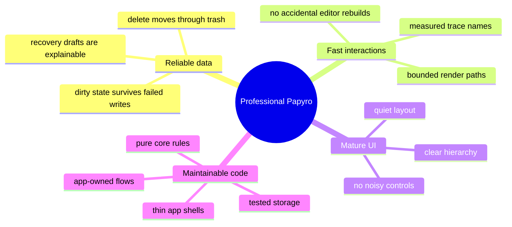
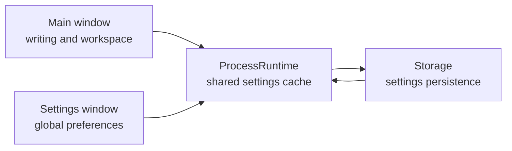
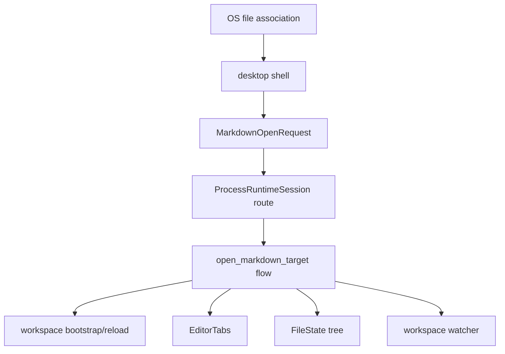

# Papyro Roadmap

[简体中文](zh-CN/roadmap.md) | [Documentation](README.md)

Papyro's roadmap is intentionally focused. The product should become a professional local-first Markdown workspace before it becomes a large feature platform.

## Product North Star

Papyro should feel like a calm desktop writing tool:

- local Markdown files stay user-owned and portable
- Hybrid mode feels close to Typora for everyday writing
- Source and Preview remain available for advanced control
- workspace, tabs, search, outline, trash, assets, and recovery feel predictable
- startup, tab switching, file operations, and editing stay responsive on real projects
- the architecture remains understandable for new contributors

## Quality Bar

## Current Architecture Facts

- `apps/desktop` and `apps/mobile` are thin shells.
- `crates/app` owns runtime, dispatcher, handlers, effects, and workspace flows.
- `crates/core` owns models, state, traits, and pure rules.
- `crates/ui` owns Dioxus components, layouts, view models, and i18n.
- `crates/storage` owns SQLite, filesystem, workspace scanning, watcher, metadata, and recovery.
- `crates/platform` owns system integration.
- `crates/editor` owns Markdown summary, rendering, block analysis, and protocol structs.
- `js/` owns the CodeMirror runtime and generated editor bundle.

See [architecture.md](architecture.md) for the current map.

## Phase 1 - Foundation And Data Safety

Goal: make workspace, tab, settings, save, and recovery flows reliable.

- [x] Move shared runtime orchestration into `crates/app`.
- [x] Keep platform shells thin.
- [x] Split workspace flows into use-case modules.
- [x] Preserve dirty state on failed saves.
- [x] Add recovery draft flows.
- [x] Add settings persistence queue.
- [x] Add workspace dependency checks.
- [x] Audit save/conflict paths for external file changes and OS-opened Markdown files.
- [x] Make file association open requests a first-class use case with tests.

## Phase 2 - Performance As A Contract

Goal: make common interactions measurable and hard to regress.

- [x] Add trace names for editor and chrome interactions.
- [x] Add performance smoke checker.
- [x] Add file line budget checks.
- [x] Add UI accessibility and contrast checks.
- [x] Keep generated editor bundles synchronized.
- [ ] Capture manual desktop traces before large editor or chrome changes.
- [x] Add automated smoke coverage for the highest-risk editor paths.

Tracked trace names:

- `perf app dispatch action`
- `perf editor pane render prep`
- `perf editor open markdown`
- `perf editor switch tab`
- `perf editor view mode change`
- `perf editor outline extract`
- `perf editor command set_view_mode`
- `perf editor command set_preferences`
- `perf editor input change`
- `perf editor preview render`
- `perf editor host lifecycle`
- `perf editor host destroy`
- `perf editor stale bridge cleanup`
- `perf chrome toggle sidebar`
- `perf chrome resize sidebar`
- `perf chrome toggle theme`
- `perf chrome open modal`
- `perf workspace search`
- `perf tab close trigger`
- `perf runtime close_tab handler`

## Phase 3 - Desktop Shell And Core UX

Goal: make the app look and behave like a professional note editor.

- [x] Redesign desktop shell layout.
- [x] Improve sidebar icons, menus, root selection, and empty-area context menu behavior.
- [x] Remove the native desktop menu bar.
- [x] Add i18n support for English and Chinese UI text.
- [x] Improve settings layout and dark-mode contrast.
- [x] Replace app shell branding assets.
- [x] Move Settings into an independent desktop window.
- [x] Keep settings window size stable across sections.
- [x] Replace native-looking `select`, modal, message, menu, and tooltip surfaces with Papyro design-system components.
- [x] Define component primitives for `Button`, `IconButton`, `Select`, `SegmentedControl`, `Modal/Dialog`, `Message/Toast`, `ContextMenu`, `Tooltip`, `Tabs`, and `FormField`.
- [x] Use proven open-source component systems as references, not direct React dependencies. [Radix Primitives](https://github.com/radix-ui/primitives) is a strong behavior/accessibility reference, and [shadcn/ui](https://github.com/shadcn-ui/ui) is a strong copy-and-own visual/component composition reference.
- [x] Finish mobile layout pass after desktop behavior stabilizes.

Settings-window direction:

The settings window should be a process-level tool window. It should update live settings without forcing the main editor window to remount.

## Phase 3.5 - UI/UX System Redesign

Goal: make Papyro look deliberately designed, not demo-like or AI-generated.

Reference direction:

- Benchmark top Markdown and knowledge products before redesigning: Feishu Docs, Yuque, Notion Docs, Obsidian, and other polished 2026-era enterprise tools.
- Study modern enterprise UI systems such as Linear and Fluent UI for density, hierarchy, keyboard-first flows, component states, and accessibility discipline.
- Keep Papyro's own identity: local-first Markdown, calm writing, fast workspace navigation, and professional desktop ergonomics.
- Use references as quality benchmarks, not direct proprietary copies. Extract principles for navigation, writing flow, component states, density, and accessibility.
- Produce a comparison matrix before implementation: workspace navigation, editor chrome, block insertion, Markdown rendering, outline, search, command palette, settings, empty/loading/error states, keyboard paths, themes, and narrow-window behavior.

Design work:

- [x] Audit every primary surface: desktop shell, sidebar, editor header, tab bar, outline, status bar, settings, search, quick open, command palette, trash, recovery, empty states, loading states, and error states. See [UI Surface Audit](ui-surface-audit.md).
- [x] Create a benchmark and gap-analysis document with source links, screenshots, interaction notes, and concrete Papyro redesign decisions before changing the main CSS. See [UI/UX Benchmark And Redesign Decisions](ui-ux-benchmark.md).
- [x] Define a new product visual brief: typography, spacing scale, color roles, surface elevation, border radius, icon style, density, motion, focus rings, and copy tone. See [Papyro UI Visual Brief](ui-visual-brief.md).
- [x] Redesign the app information architecture so workspace navigation, document editing, outline, commands, and settings feel cohesive instead of assembled screen by screen. See [UI Information Architecture](ui-information-architecture.md).
- [x] Inventory the Dioxus-first component system over CSS tokens and define the target primitives: `Button`, `IconButton`, `Input`, `Select`, `SegmentedControl`, `Switch`, `Dialog`, `Popover`, `DropdownMenu`, `ContextMenu`, `Tooltip`, `Toast/Message`, `Tabs`, `SidebarItem`, `TreeItem`, `Toolbar`, `EmptyState`, and `Skeleton`. See [UI Architecture And Component Inventory](ui-architecture.md).
- [x] Add a CSS token audit for raw colors, spacing one-offs, and duplicated component selectors before broad visual rewrites. See [UI Token Audit](ui-token-audit.md).
- [x] Replace native-looking controls and one-off product controls with reusable primitives for sidebar search, tree rows, inline rename, editor tabs, outline items, settings color inputs, and editor chrome controls.
- [x] Centralize primitive state class names through `PrimitiveState` and `ClassBuilder` for active, open, disabled, destructive, editing, drag, drop, expanded, onboarding, and resizing states.
- [x] Add first primitive interaction CSS variables for button, icon button, editor tool, and view-mode option hover, active, focus, disabled, and destructive states.
- [ ] Continue reducing one-off CSS by moving repeated hover, active, disabled, focus-visible, loading, destructive, compact, selected, and checked state rules into reusable primitive contracts.
- [x] Create layout primitives for app chrome: split panes, resizable rails, scroll containers, sticky toolbars, fixed editor action zones, and responsive overflow rules.
- [ ] Make Markdown writing surfaces visually match mature editors: quiet canvas, readable measure, balanced margins, polished code/table/callout styles, and consistent Preview/Hybrid typography.
- [x] Add design QA artifacts: component inventory, before/after screenshots, desktop narrow-width screenshots, dark-mode screenshots, contrast checks, keyboard navigation checks, and CSS line-budget checks. See [UI Design QA Checklist](ui-design-qa.md).
- [x] Document the new UI architecture so future contributors know where to add components, where tokens live, and when one-off CSS is forbidden.

Acceptance bar:

- Papyro should feel closer to a serious desktop knowledge tool than a prototype.
- Screens must not rely on generic gradients, noisy cards, random colors, or decorative filler.
- Components must be reusable, accessible, keyboard-friendly, and visually coherent in light and dark themes.
- Layout must remain stable when the window narrows, tabs overflow, long filenames appear, or dialogs switch sections.

## Phase 4 - Markdown Editing Experience

Goal: make Hybrid mode useful for real writing, not just decorated source text.

- [x] Add Rust block analysis for headings, lists, tables, code, math, and Mermaid.
- [x] Add Preview rendering with code highlighting and Mermaid support.
- [x] Add Hybrid decorations and runtime block states.
- [x] Improve paste replacement and Markdown input commands.
- [x] Add Mermaid rendered/editing behavior.
- [ ] Make Hybrid selection, cursor hit testing, and inline decorations feel consistent.
- [x] Define pointer behavior precisely: hovering text should enter edit semantics, hovering line-gap whitespace should stay in normal semantics, gap selection should target the next line's text, text-area selection should target the current line, and selection backgrounds should cover glyph runs instead of full line-gap blocks.
- [x] Make code block, inline code, links, lists, and Mermaid editing share consistent selection colors.
- [ ] Treat cursor offset, wrong-line hit testing, missing selection background, accidental source reveal, and selection leaking into whitespace as architecture-level Hybrid defects, not isolated CSS bugs.
- [x] Review mainstream editor architecture patterns before continuing Hybrid patches: CodeMirror decorations/widgets, ProseMirror/Tiptap node views, Lexical decorators, Slate void/inline nodes, and Typora-like source/render switching. See [Hybrid Editor Architecture Review](editor-hybrid-architecture.md).
- [x] Decide a stable selection and hit-testing strategy for inline elements, code blocks, tables, math, Mermaid, and links before adding more Markdown block features.
- [x] Add regression coverage or repeatable smoke scripts for cursor placement, text selection, IME composition, paste replacement, and block edit/render transitions.
- [x] Align Hybrid editing with modern Markdown writing tools such as Typora and Feishu Docs: inserting tables, math, code blocks, callouts, links, images, and Mermaid should be discoverable and fast.
- [x] Add editor insertion affordances for common blocks instead of requiring users to remember Markdown syntax for every task.
- [x] Make table creation and editing feel document-native: add rows/columns, move between cells, preserve alignment, and avoid layout jumps.
- [x] Make math insertion and editing first-class, including inline math, display math, preview feedback, and error states.
- [ ] Treat enterprise-grade editing as the bar: predictable paste, undo, selection, IME, keyboard navigation, accessibility, and stable layout are required before calling Hybrid complete.
- [x] Decide whether long-term Hybrid remains CodeMirror decoration-based or moves toward a richer document model.

See [editor.md](editor.md).

## Phase 4.1 - Tiptap Editor Runtime Migration

Goal: use the `feat-tiptap` branch to migrate the interactive editor runtime from CodeMirror to Tiptap/ProseMirror while preserving Markdown files, the Rust/Dioxus protocol, and enterprise-grade maintainability.

See [Tiptap Migration Plan](tiptap-migration-plan.md).

Engineering bar:

- New code must be reusable, iterative, resilient, and clearly modular.
- Do not replace the current large runtime with another giant `editor.js`.
- Every complex block needs a Markdown round-trip strategy and tests.
- Preserve the `window.papyroEditor` facade during migration so Rust/Dioxus stay independent from editor internals.
- Use the official Tiptap Notion-like editor template as an interaction benchmark for slash commands, floating toolbars, block insertion, and responsive editor chrome, while keeping Papyro local-first and Markdown-first.
- Generated bundles, desktop/mobile assets, CSS line budgets, a11y, contrast, primitive usage, and Rust/JS tests must keep passing.

Tasks:

- [x] Create the dedicated `feat-tiptap` migration branch.
- [x] Document the Tiptap migration architecture, risks, phases, and definition of done.
- [x] Commit and push the migration plan.
- [x] Extract the first runtime adapter facade contract and tests.
- [x] Add runtime registry and injectable CodeMirror runtime factory modules.
- [ ] Split the JS editor runtime into a stable facade, registry, and adapter contract.
- [ ] Keep the CodeMirror adapter as the default with no behavior change.
- [x] Install and wire the Tiptap foundation dependencies.
- [x] Implement a Tiptap adapter prototype behind a feature flag or runtime selector.
- [x] Support basic Markdown round-trip: paragraphs, headings, lists, blockquotes, bold, italic, inline code, code blocks, and links.
- [ ] Redefine Source/Hybrid/Preview: Hybrid uses Tiptap, Preview remains Rust-rendered, and Source remains Markdown-editable.
- [x] Add a Tiptap Source pane backed by `MarkdownSyncController`.
- [x] Add a reusable slash command controller as the headless foundation for Notion-like but Papyro-native block insertion.
- [x] Add the first Notion-like but Papyro-native slash command menu controller.
- [x] Add the first Papyro-native floating formatting toolbar controller.
- [x] Add the first Papyro-native block handle controller.
- [x] Add the first Papyro-native block action menu controller.
- [x] Add shared Tiptap UI primitives for popover placement, menu active-descendant state, toolbar roots, and visibility handling.
- [ ] Add advanced block action menus and responsive editor toolbar behavior.
- [x] Preserve Tiptap `content_changed`, `insert_markdown`, and `set_view_mode` protocol behavior with runtime tests.
- [x] Preserve Tiptap `save_requested`, `paste_image_requested`, and `runtime_error` protocol behavior; keep `runtime_ready` host-owned.
- [x] Preserve Tiptap `set_preferences` state updates through a tested controller.
- [x] Preserve Tiptap `auto_link_paste` behavior for selected-text URL paste.
- [x] Preserve `set_block_hints` as a Tiptap migration compatibility message.
- [x] Preserve Tiptap `destroy` semantics with stale instance protection.
- [x] Add Tiptap task list extensions with checked/unchecked Markdown round-trip coverage.
- [x] Add Tiptap table extensions with pipe table round-trip coverage and rich insert command support.
- [x] Add Tiptap math extensions with inline/display Markdown round-trip coverage and KaTeX preview/error states.
- [x] Add Tiptap Mermaid extensions with fenced code round-trip coverage and shared preview/error rendering.
- [x] Add Tiptap image extensions with local URL Markdown round-trip coverage and shared paste/drop protocol support.
- [x] Add Tiptap code block options with language metadata, fenced Markdown round-trip coverage, and shared code styling.
- [x] Migrate task lists, tables, math, Mermaid, images, and code blocks.
- [ ] Remove CodeMirror dependencies, `.cm-*` CSS, and obsolete tests.
- [ ] Finish full acceptance checks and push the completed migration.

## Phase 4.5 - Themes, Typography, And Markdown Styles

Goal: give users several high-quality visual choices without making the app feel like a random theme gallery.

- [x] Define a theme system with semantic tokens for app chrome, editor canvas, Markdown content, code blocks, selections, focus rings, and status colors.
- [x] Ship a small curated set of polished themes first: System, Light, Dark, GitHub-like light/dark, high-contrast, and one warm reading theme.
- [x] Research open-source Markdown style references before adopting any visual baseline. Candidate references include [`sindresorhus/github-markdown-css`](https://github.com/sindresorhus/github-markdown-css) for GitHub-flavored Markdown layout and color behavior, plus well-known code theme ecosystems such as [Shiki](https://github.com/shikijs/shiki), [highlight.js](https://github.com/highlightjs/highlight.js), and [Catppuccin](https://github.com/catppuccin/catppuccin).
- [x] Keep Markdown render styles compatible across Preview and Hybrid so headings, lists, tables, blockquotes, code, math, and Mermaid do not visually drift between modes.
- [x] Replace odd font presets with practical system-first presets: UI Sans, System Serif, Reading Serif, Mono Code, and CJK-friendly fallback stacks.
- [x] Make font settings understandable for normal users: preview text, clear labels, safe defaults, and no obscure font names as the first choices.
- [x] Add theme and Markdown-style snapshot/smoke checks so future CSS changes do not break contrast, spacing, or code readability.

## Phase 5 - File Association, Tabs, And Workspace Sessions

Goal: make external Markdown files feel native.

Required behavior:

- [x] When the OS opens a Markdown file with Papyro, the current window receives the file-open event.
- [x] Tabs update to include the opened Markdown file.
- [x] The sidebar workspace switches to the opened file's parent workspace when needed.
- [x] If several tabs belong to different workspace roots, switching tabs updates the sidebar tree to that tab's workspace.
- [x] Dirty tabs are flushed or protected before switching workspace context.
- [x] Watcher subscriptions follow the active workspace safely.
- [x] Recent workspace/file metadata records this flow.

Recommended architecture:

Professional constraints:

- Opening a file outside the current workspace must not silently discard dirty tabs.
- The active tab should be the source of truth for which workspace tree is shown.
- A future multi-window mode must route files through a real `WindowSession`, not a one-off desktop shortcut.
- Tests should cover same-workspace open, external-parent bootstrap, dirty-tab protection, watcher switching, and tab activation.

## Phase 6 - Multi-Window Mode

Goal: support advanced workflows after single-window routing is reliable.

- [x] Define production `ProcessRuntime` and `WindowSession` ownership.
- [x] Move settings to a process-level tool window first.
- [x] Remove desktop settings-window white flash, carry full i18n into newly opened windows, and use the Papyro app icon instead of the default Dioxus icon.
- [x] Add document window routing behind `NoteOpenMode::MultiWindow`.
- [x] Ensure each window owns its own tab contents, selection, and dirty state.
- [x] Share storage and settings safely across windows.
- [x] Add save-conflict tests across windows.

Multi-window should not be rushed. It is a reliability feature, not just a UI feature.

## Phase 7 - Packaging And Release Readiness

Goal: make Papyro installable and understandable for non-developers.

- [x] Define license.
- [x] Add release packaging for desktop.
- [x] Add app icons for target platforms.
- [x] Add first-run workspace onboarding.
- [x] Add manual QA checklist for release builds.
- [x] Document known limitations.
- [ ] Add About-window actions for checking updates and viewing release notes before publishing.

## Ongoing Product Principles

- Avoid adding permanent chrome unless it improves writing or navigation.
- Prefer icons for familiar actions and text for destructive or ambiguous actions.
- Keep the editor area visually calm.
- Do not hide data safety behind convenience.
- Treat performance budgets as feature requirements.
- Keep architecture docs current enough that a new contributor can make the next correct change.
