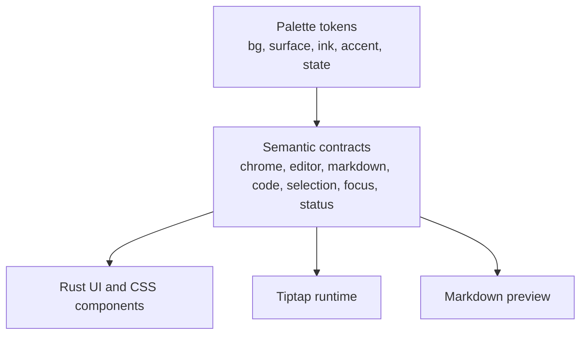

# Theme System

[简体中文](zh-CN/theme-system.md)

Papyro themes are built from semantic CSS tokens. A component should describe what it needs, not which hex value looks right today.

## Token Layers

| Layer | Examples | Who should use it |
| --- | --- | --- |
| Palette | `--mn-bg`, `--mn-surface`, `--mn-ink`, `--mn-accent` | Theme authors and low-level CSS only |
| Chrome | `--mn-chrome-bg`, `--mn-chrome-surface`, `--mn-chrome-ink-muted` | Sidebar, header, modal, command palette, status bar |
| Editor canvas | `--mn-editor-canvas-bg`, `--mn-editor-canvas-ink`, `--mn-editor-active-line-bg` | Tiptap host and source editing UI |
| Markdown | `--mn-markdown-ink`, `--mn-markdown-muted-ink`, `--mn-markdown-link` | Preview and Hybrid rendered Markdown |
| Code | `--mn-code-surface`, `--mn-code-block-surface`, `--mn-code-ink`, `--mn-code-border` | Inline code, fenced code, Mermaid source panes |
| Selection and focus | `--mn-selection-bg`, `--mn-selection-ink`, `--mn-focus-ring` | Selection backgrounds, focused controls, editor cursor states |
| Status | `--mn-status-danger`, `--mn-status-warning`, `--mn-status-success` | Save states, destructive actions, warnings, success indicators |

## Source Files

- `assets/main.css` is the shared design source used by packaged assets.
- `apps/desktop/assets/main.css` mirrors the desktop runtime copy.
- `apps/mobile/assets/main.css` owns mobile shell layout and mobile token bridges.
- `assets/styles/modal.css` and `apps/desktop/assets/styles/modal.css` hold modal-specific styles.
- `assets/styles/markdown.css`, `apps/desktop/assets/styles/markdown.css`, and `apps/mobile/assets/styles/markdown.css` hold the document surface, outline, Preview, and rendered Markdown rhythm.
- `assets/styles/tiptap-chrome.css`, `apps/desktop/assets/styles/tiptap-chrome.css`, and `apps/mobile/assets/styles/tiptap-chrome.css` are the Tiptap chrome entry stylesheets.
- Tiptap chrome implementation styles are split by responsibility into `tiptap-chrome-code.css`, `tiptap-chrome-base.css`, `tiptap-chrome-command.css`, `tiptap-chrome-table.css`, and `tiptap-chrome-block.css`. Keep the shared, desktop, and mobile copies synchronized.
- Tiptap node views consume the same tokens through CSS classes in the markdown and Tiptap chrome styles plus focused `js/src/tiptap-*.js` modules.
- Official Tiptap UI components keep their upstream `--tt-*` variables. Papyro maps those variables to the semantic `--mn-*` contract in `assets/main.css`, `apps/*/assets/main.css`, and `js/src/styles/_variables.scss`.

When changing a token that is mirrored in an app asset, update both copies in the same commit.

## Authoring Rules

- Prefer semantic tokens in component CSS. Use `--mn-chrome-surface` instead of `--mn-surface` when styling app chrome.
- Keep Preview and Hybrid Markdown on the same `--mn-markdown-*` and `--mn-code-*` tokens.
- Do not rewrite official Tiptap component styles to use `--mn-*` directly. Extend the bridge by mapping the official `--tt-*` variable to an existing semantic token first.
- Add a semantic token before adding another one-off color to a component.
- Do not encode behavior in a color name. Use `--mn-status-warning`, not `--mn-yellow`.
- Do not introduce a new theme until the token contract covers app chrome, editor canvas, Markdown, code blocks, selection, focus rings, and status colors.

## Component Primitives

Shared UI surfaces live in `crates/ui/src/components/primitives.rs`. Use these before creating one-off controls.

See [UI Architecture And Component Inventory](ui-architecture.md) for the current primitive inventory, target component set, migration order, and one-off CSS rules.

Behavior and accessibility should use mature open-source systems as references. Radix Primitives is the reference for keyboard and ARIA behavior, while shadcn/ui is the reference for copy-and-own composition and restrained visual hierarchy. Papyro does not depend on either React library directly.

## Current Themes

Papyro currently ships System, Light, Dark, GitHub Light, GitHub Dark, High Contrast, and Warm Reading. Curated themes should override palette tokens first, then only override semantic tokens when the theme needs a deliberate behavior difference.
