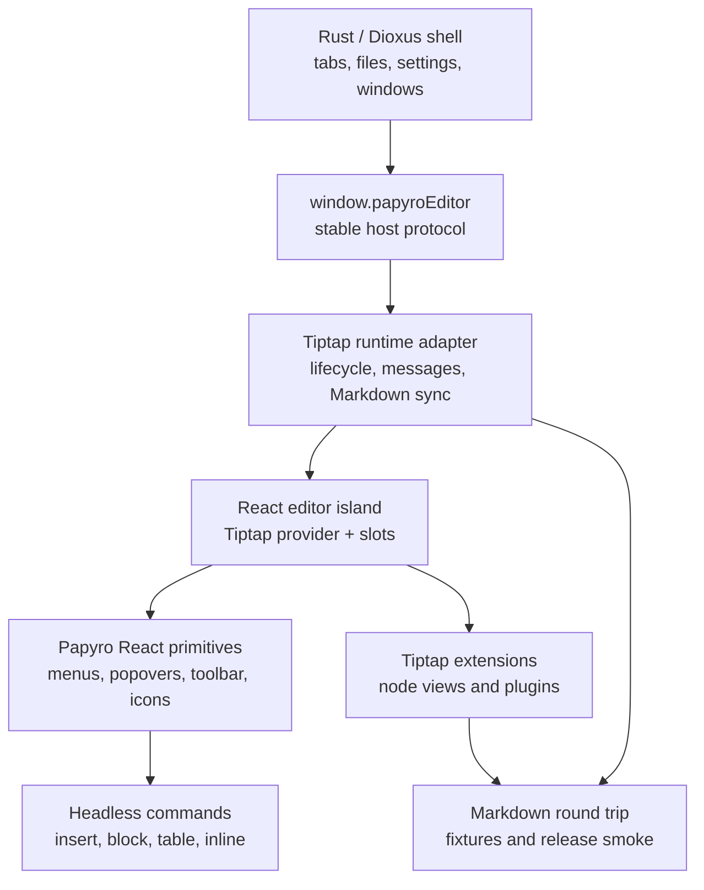

# Tiptap Enterprise Editor TODO

[简体中文](zh-CN/tiptap-enterprise-editor-todo.md) | [Official React strategy](tiptap-official-react-strategy.md) | [Runtime plan](tiptap-react-runtime-plan.md) | [Roadmap](roadmap.md)

This document is the execution checklist for turning Papyro's Tiptap editor into a release-ready, Notion-like Markdown editor. It is intentionally more concrete than the roadmap: each milestone includes scope, implementation notes, acceptance criteria, and verification.

## Current State

The `feat-tiptap` branch already changed the runtime direction, but the visible experience is not finished.

- The editor now uses Tiptap/ProseMirror for Hybrid mode and keeps the Dioxus-facing `window.papyroEditor` facade.
- A React island foundation exists under `js/src/tiptap-react/`.
- Many advanced surfaces still come from hand-written DOM controllers under `js/src/tiptap-*.js`.
- The official Tiptap Notion-like template is still a benchmark, not an integrated component set.

That means the current app can still feel like the previous custom implementation. The next work must migrate the user-facing editor chrome into official Tiptap React patterns instead of continuing small DOM patches.

## Official Baseline

Before implementing any item here, refresh and check the local official references:

```powershell
git -C E:\tiptap pull --ff-only
git -C .reference\tiptap-docs pull --ff-only
```

Primary references:

- `E:\tiptap\packages\react`
- `E:\tiptap\packages\extension-drag-handle-react`
- `E:\tiptap\packages\extension-node-range`
- `E:\tiptap\packages\extension-table`
- `.reference/tiptap-docs/src/content/guides/react-composable-api.mdx`
- `.reference/tiptap-docs/src/content/editor/getting-started/install/react.mdx`
- `.reference/tiptap-docs/src/content/ui-components/templates/notion-like-editor.mdx`
- `.reference/tiptap-docs/src/content/ui-components/node-components/table-node.mdx`
- `.reference/tiptap-docs/src/content/ui-components/components/drag-context-menu.mdx`
- `.reference/tiptap-docs/src/content/ui-components/components/slash-dropdown-menu.mdx`

Rules:

- Use latest stable Tiptap 3 packages and keep every `@tiptap/*` dependency on the same version.
- Prefer the React composable API for editor UI.
- Treat Notion-like editor, `table-node`, `drag-context-menu`, and `slash-dropdown-menu` as licensed/non-open UI unless licensed source is explicitly added.
- Use official open packages directly. Re-create product interactions locally only when no licensed source is available.

## Default Free/Open-Source Path

Unless the project explicitly adds licensed Tiptap Start/Pro output, Papyro should follow a free official-first path:

1. Use official free/open Tiptap packages as the document model and editing foundation.
2. Build Papyro-owned React wrappers for command menus, popovers, toolbars, node views, table chrome, and block handles.
3. Treat official Notion-like interactions as the UX benchmark, not copied source.
4. Confirm each major surface with the product owner before marking it complete.
5. Iterate until the manual WebView experience matches the agreed acceptance criteria, not merely until tests pass.

This path is slower than integrating paid UI output, but it keeps the codebase legally clean, local-first, and maintainable. The result should be a Papyro editor system that can keep improving without depending on private template internals.

Review checkpoints:

- After Milestone 1, confirm the React editor shell and shared primitives feel like the right foundation.
- After Milestone 2, confirm slash/`+` insertion layout, keyboard behavior, and command grouping.
- After Milestone 3, confirm block handle click, drag, menu, and highlight behavior.
- After Milestone 4, confirm table selection, resize, add-row/add-column, and cell menus against the official benchmark.
- After Milestone 5 and 6, confirm code block and floating toolbar polish.
- Before Milestone 10, run final acceptance together against the release smoke checklist.

## Architecture Target



Non-negotiables:

- Dioxus never imports Tiptap internals.
- React owns editor UI only, not workspace or file state.
- Command definitions are data-first and shared by slash menus, handles, keyboard shortcuts, tests, and future command palette flows.
- Old DOM controllers are temporary migration code. A milestone is complete only when obsolete controller code and CSS are removed.
- Markdown remains the persisted source of truth.

## Definition Of Done

The Tiptap editor is release-ready when all of these are true:

- Hybrid mode feels document-native for blocks, tables, code, math, Mermaid, images, task lists, paste, undo, and IME.
- Source, Hybrid, and Preview round-trip Markdown without silent data loss.
- Slash insert, block handle, floating toolbar, code block controls, and table controls are React components using shared primitives.
- Pointer, keyboard, focus, outside-dismiss, drag, and resize behavior are predictable in desktop WebView.
- Chinese and English labels exist for every new editor action.
- The editor passes automated JS/Rust checks plus manual WebView smoke.
- The implementation is modular enough that a new block type can be added without editing a giant runtime file.

## Milestone 0 - Product And License Decision

Goal: stop guessing whether to rebuild or integrate official UI.

Tasks:

- [ ] Decide whether Papyro will buy/use the Tiptap Start/Pro path for production.
- [ ] If licensed, generate official UI source with Tiptap CLI into a clearly isolated third-party area.
- [ ] If unlicensed, record which official interactions will be rebuilt locally and which are deferred.
- [ ] Add attribution and upgrade notes for any copied MIT source from public Tiptap UI repositories.
- [ ] Freeze the interaction benchmark: Notion-like block handle, slash insert, table node, floating toolbar, and responsive toolbar.

Acceptance criteria:

- No non-open Tiptap UI source is copied without a license.
- The chosen path is written in [Tiptap official React strategy](tiptap-official-react-strategy.md).
- Each later milestone says whether it uses licensed official source or a Papyro local equivalent.

Verification:

```powershell
git status --short
node scripts/check-workspace-deps.js
```

## Milestone 1 - React Island As The Only Editor Chrome Host

Goal: make React the durable owner of editor UI instead of a thin mount wrapper around old DOM controllers.

Tasks:

- [ ] Add `js/src/tiptap-react/components/`, `commands/`, `hooks/`, `extensions/`, and `utils/` modules.
- [ ] Move shared floating-layer lifecycle into React: outside click, Escape, focus return, scroll, resize, and WebView body focus races.
- [ ] Add shared React primitives: `EditorPopover`, `CommandMenu`, `CommandItem`, `CommandSection`, `IconButton`, `ToolbarButton`, `Kbd`, and `VisuallyHidden`.
- [ ] Add a typed command model for insert, block action, inline format, table, and code block commands.
- [ ] Expose stable runtime hooks: editor instance, language, view mode, preferences, command executor, and active selection snapshot.
- [ ] Keep the existing DOM controllers disabled behind a runtime flag while React replacements are tested.

Acceptance criteria:

- New editor UI is added through React slots, not direct `document.createElement` overlays.
- Hovering or keyboarding inside menus does not rebuild the whole overlay DOM.
- Overlay dismissal has one shared behavior across slash, block, table, and toolbar panels.
- No new monolithic `NotionEditor.jsx` or giant controller file appears.

Verification:

```powershell
npm --prefix js test
npm --prefix js run build
node scripts/report-file-lines.js
```

Manual smoke:

- Open Hybrid mode.
- Open a command panel.
- Move the pointer into the panel slowly.
- Confirm it does not disappear until outside click, Escape, command execution, or intentional scroll outside the editor.

## Milestone 2 - Slash And Insert Menu

Goal: make `/` and `+` insertion feel like a professional document command surface.

Tasks:

- [x] Replace the DOM slash menu with a React command menu.
- [x] Separate core insert commands into Text, Lists, Blocks, Data, Media, and Advanced groups.
- [ ] Add a Recent group after command usage history exists.
- [ ] Support nested detail panels for table size, callout style, code language, and future diagram/math templates.
  - Current coverage: table size and callout style panels are implemented and anchored to the active command row.
- [x] Fix keyboard navigation so ArrowDown can reach every command and never loops before the last item.
- [x] Support Home and End navigation across the full insert command list.
- [x] Position detail panels beside the selected command, not at awkward top-right coordinates.
- [x] Add localized labels, descriptions, search aliases, and empty states for current commands.
- [x] Add command filtering with stable active item and scroll-into-view only for keyboard navigation.
- [x] Keep `+` semantics distinct: insert below the current block, open the menu at the new caret, and clean temporary slash text on cancel.

Acceptance criteria:

- `/` from typing and `+` from the gutter open the same insert system with different anchors.
- The table size picker is reachable by keyboard and mouse.
- Hover detail panels do not cover lower commands in a way that blocks selection.
- Every command has a clear icon, title, description, and i18n label.

Verification:

```powershell
node scripts/check-editor-markdown-gate.js
```

Manual smoke:

- Type `/`, navigate from first item to table using ArrowDown, insert a table.
- Click `+` beside a paragraph, insert heading, table, code block, math, Mermaid, and callout.
- Switch language between English and Chinese and repeat.

## Milestone 3 - Drag Handle And Block Action Menu

Goal: make the left block handle behave like a real document editor handle.

Tasks:

- [ ] Evaluate replacing local handle code with `@tiptap/extension-drag-handle-react` and `@tiptap/extension-node-range`.
  - Decision recorded in [Tiptap official React strategy](tiptap-official-react-strategy.md): use official DragHandle for node tracking/dragging, keep Papyro React handle for action and insert controls, and keep tables under table overlay ownership.
  - Foundation added: `@tiptap/extension-node-range` is now in the editor extension chain with `Mod` pointer selection and Papyro-themed range-selection CSS.
  - Foundation added: official DragHandle adapter options and Papyro exclusion rules are now tested in `js/src/tiptap-official-drag-handle.js`; runtime behavior still needs to switch from the compatibility controller to the official plugin.
- [ ] React-render the handle with two distinct controls: drag/action handle and insert `+`.
  - Done for the visual view: desktop/mobile bundle entry now injects a React block-handle view while the existing controller still owns behavior.
  - Still required: move behavior to the official `DragHandle`/`NodeRange` integration.
- [ ] Open the block action menu on normal click beside the pointer, not after long press.
- [ ] Block native WebView context menus on right-click and show only Papyro actions.
- [ ] Highlight the whole semantic block, including inline code and mixed marks.
- [ ] Implement reliable drag reorder with a drop indicator and transaction-level tests.
- [ ] Limit handle ownership for complex nodes: tables, code blocks, images, math, and Mermaid get one block-level handle, not per-cell or per-child handles.
  - Done for the compatibility handle path: table, code block, image node view, display math, and Mermaid descendants now resolve to the outer complex block.
  - Still required: the final React handle implementation based on official drag-handle/node-range APIs.
- [ ] Add block actions: copy Markdown, duplicate, delete, reset formatting, text color, highlight, turn into, and move up/down.

Acceptance criteria:

- Clicking the handle selects and highlights the current block.
- Dragging starts only after a movement threshold.
- Moving the mouse from handle to menu does not close the menu.
- The insert `+` never opens the block action menu.
- Tables and lists do not show redundant per-cell or per-item block handles.

Verification:

```powershell
npm --prefix js test
node scripts/check-tiptap-release-smoke.js
```

Manual smoke:

- Click, right-click, and drag handles for paragraph, heading, list item, code block, table, image, math, Mermaid, and callout.
- Confirm the selected background covers the semantic block instead of only plain text.

## Milestone 4 - Table UX Rebuild

Goal: table editing should feel close to the official Notion-like table experience, not like a debug overlay.

Decision path:

- Licensed path: integrate official `table-node` output and adapt it to Papyro tokens, Markdown persistence, and i18n.
- Unlicensed path: rebuild the same interaction principles with `@tiptap/extension-table`, ProseMirror table utilities, and Papyro React overlays.

Tasks:

- [ ] Remove the top-left whole-table selector unless a clear product action requires it.
- [ ] Remove visible handles by default. Show row/column handles only on intentional hover near the first row or first column.
- [ ] Make the entire cell surface editable and focusable, not only a tiny center area.
- [ ] Ensure cells have no visual gaps, so selection and resize borders look continuous.
- [ ] On cell click, show a theme-colored active border around that cell.
- [ ] On cell selection range, show a restrained overlay and a small action trigger on the range edge.
- [ ] Add cell action menu: merge, split, alignment, text color, background color, clear formatting, copy, delete contents.
- [ ] Add row and column action menus from slim edge handles.
- [ ] Add resize affordance on column borders that still works while a cell is active.
- [ ] Add quick row and column insertion rails: slim full-width/full-height rails with centered `+`, close enough to the table to be discoverable.
- [ ] Keep table controls hidden for adjacent code blocks or other non-table content.
- [ ] Add Markdown round-trip fixtures for alignment, header rows, merged-cell fallback, and cell background metadata if supported.

Acceptance criteria:

- Idle table view is clean.
- Hovering first row/column reveals only the relevant slim handle.
- Clicking a row/column handle selects that axis and opens a scoped menu.
- Clicking a cell selects that cell and keeps text editing natural.
- Drag selecting multiple cells reveals a range action trigger with merge available.
- Column resize works from the column border and does not disappear after selection.
- Quick add row/column controls are visible in light and dark themes.

Verification:

```powershell
npm --prefix js test
npm --prefix js run build
node scripts/check-tiptap-release-smoke.js
```

Manual smoke:

- Insert 2x2, 3x3, and 6x6 tables.
- Edit every part of a cell by clicking different cell regions.
- Select one cell, a row, a column, and a cell range.
- Resize columns.
- Add rows and columns using edge rails.
- Save, close, reopen, and verify Markdown still round-trips.

## Milestone 5 - Code Block Experience

Goal: code blocks should read and edit like professional Markdown blocks.

Tasks:

- [ ] Use a React node view for code block chrome if it improves maintainability.
- [ ] Show language label with a language switcher.
- [ ] Add copy button, wrap toggle, and optional filename/title metadata if Markdown strategy is defined.
- [ ] Use a real highlighter theme for light and dark modes.
- [ ] Preserve fenced code language through Markdown round-trip.
- [ ] Add insertion affordance before and after code blocks, especially when adjacent to tables.

Acceptance criteria:

- Light mode is not a flat blue block.
- Language can be viewed and changed without editing raw fence text.
- Users can insert a paragraph between a table and a code block.
- Copy and language controls are discoverable but quiet.

Verification:

```powershell
npm --prefix js test
node scripts/check-tiptap-release-smoke.js
```

Manual smoke:

- Insert JavaScript, Rust, JSON, Markdown, and plain text code blocks.
- Change language and save/reopen.
- Test adjacent table + code block insertion.

## Milestone 6 - Floating Formatting Toolbar

Goal: selected text formatting should be compact, stable, and keyboard accessible.

Tasks:

- [ ] Move floating toolbar into React.
- [ ] Use Tiptap state selectors for active marks instead of DOM polling.
- [ ] Add bold, italic, strike, inline code, link, text color, highlight, clear formatting, and turn into.
- [ ] Keep toolbar placement stable near viewport edges.
- [ ] Add keyboard access and focus return.
- [ ] Localize labels and tooltips.

Acceptance criteria:

- Toolbar does not steal selection when clicked.
- Toolbar does not flicker on small pointer movement.
- Active states match the selected text.
- Link editing is possible without native prompts.

Verification:

```powershell
npm --prefix js test
npm --prefix js run build
```

Manual smoke:

- Select English, Chinese, inline code, link text, and mixed formatted text.
- Apply every mark and undo/redo each action.

## Milestone 7 - Markdown Node Views

Goal: complex Markdown structures should be maintainable node views with tested serialization.

Tasks:

- [ ] Review current implementations for task list, image, math, Mermaid, callout, table, and code block.
- [ ] Convert surfaces to React node views only when it reduces complexity or improves UX.
- [ ] Define Markdown parse, editor JSON, and Markdown serialize behavior for every node.
- [ ] Add fallback behavior for unsupported metadata.
- [ ] Add error states for Mermaid and math without blocking editing.
- [ ] Keep node-view UI non-serialized and content editable where appropriate.

Acceptance criteria:

- Each complex node has one owner module.
- Editor UI chrome never leaks into Markdown output.
- Parse failures fall back to editable Markdown or a recoverable error surface.

Verification:

```powershell
npm --prefix js test
node scripts/check-tiptap-release-smoke.js
```

## Milestone 8 - Mode Contract And Persistence

Goal: Source, Hybrid, and Preview must feel like three views of the same document.

Tasks:

- [ ] Audit Source/Hybrid/Preview switching for selection, scroll, undo, dirty state, and outline sync.
- [ ] Ensure Source edits do not emit duplicate dirty events for unchanged content.
- [ ] Ensure Hybrid changes produce canonical Markdown.
- [ ] Ensure Preview uses the same Markdown styling language as Hybrid.
- [ ] Add conflict behavior tests for save failures and external file changes.
- [ ] Keep `window.papyroEditor` stable during refactors.

Acceptance criteria:

- Switching modes does not lose selection, scroll, or edits.
- Save failure keeps dirty state.
- Preview and Hybrid agree on headings, tables, code, callouts, math, Mermaid, and images.

Verification:

```powershell
npm --prefix js test
cargo test
node scripts/check-tiptap-release-smoke.js
```

## Milestone 9 - i18n, Accessibility, And Keyboard

Goal: the editor should be usable in Chinese and English with real keyboard and accessibility behavior.

Tasks:

- [ ] Add every new editor string to the i18n model.
- [ ] Add accessible labels for icon-only controls.
- [ ] Use `aria-activedescendant` or roving tab index consistently in menus.
- [ ] Support Escape, Enter, Space, Arrow keys, Home, End, Tab, Shift+Tab, and Shift+F10 where relevant.
- [ ] Protect IME composition from menu keyboard handlers.
- [ ] Keep focus rings visible and theme-token based.

Acceptance criteria:

- Chinese IME never triggers a command by accident.
- Keyboard can open and operate slash, block, table, code language, and formatting menus.
- Icon-only controls have useful accessible names in both languages.

Verification:

```powershell
npm --prefix js test
node scripts/check-ui-a11y.js
node scripts/check-ui-contrast.js
```

Manual smoke:

- Enter Chinese with IME in paragraphs, table cells, code blocks, task lists, and callouts.
- Navigate every editor menu using keyboard only.

## Milestone 10 - Performance, Cleanup, And Release Gate

Goal: finish the migration by removing old code and proving the editor can ship.

Tasks:

- [ ] Delete obsolete DOM controllers after React replacements land.
- [ ] Delete unused CSS and old `.cm-*` leftovers.
- [ ] Keep JS files under line budgets or split them before they become unreviewable.
- [ ] Add performance traces for editor open, tab switch, mode switch, command menu open, table edit, and save.
- [ ] Rebuild generated bundles and desktop/mobile copies.
- [ ] Run full automated checks.
- [ ] Run the real mounted editor smoke gate before committing editor runtime changes.
- [ ] Execute manual Tiptap release smoke in the desktop WebView.

Acceptance criteria:

- No advanced editor chrome is owned by one-off DOM controller code.
- File line budget passes.
- Generated `assets/editor.js` is in sync.
- Manual smoke is documented before merging `feat-tiptap`.

Verification:

```powershell
npm --prefix js run build
npm --prefix js test
node scripts/check-workspace-deps.js
node scripts/check-tiptap-release-smoke.js
node scripts/check-tiptap-runtime-smoke.js
node scripts/check-perf-docs.js
node scripts/check-ui-a11y.js
node scripts/check-ui-contrast.js
node scripts/check-ui-primitives.js
node scripts/report-file-lines.js
cargo test
git diff --check
```

Manual smoke checklist:

- Source, Hybrid, Preview switching.
- Chinese IME.
- Paste Markdown, HTML, image, and URL.
- Undo/redo across text, table, and block operations.
- Slash and `+` insertion.
- Block action menu and drag reorder.
- Table insert, select, resize, row/column add, merge/split, alignment, colors.
- Code block language switch and highlighting.
- Math, Mermaid, image, callout, task list.
- Outline navigation.
- Save failure and recovery.
- OS-opened Markdown file flow.

## Execution Rule For Each Task

Use this loop for every checked item:

1. Read the official Tiptap docs/source for the feature.
2. Decide licensed integration or local equivalent.
3. Add or update a focused React component, hook, command, or extension module.
4. Add unit/contract tests before broad visual polish.
5. Rebuild generated bundles after JS changes.
6. Run the relevant verification commands, including `node scripts/check-editor-markdown-gate.js` for editor changes.
7. Update docs when behavior, architecture, or known limitations change.
8. Commit with an English Conventional Commit message.

Editor-change commit gate:

- Do not commit Tiptap/editor code if Markdown fixture rendering or round-trip smoke fails.
- This gate also applies to editor CSS, generated editor bundles, Markdown parsing, Markdown rendering, Preview parity, and node-view changes.
- At minimum run `node scripts/check-editor-markdown-gate.js` before committing editor runtime changes. It runs JS tests, rebuilds generated bundles, checks Markdown styling, verifies release round-trip behavior, mounts the real Tiptap runtime, and checks generated bundle sync.
- If a change touches Markdown parsing, serialization, Preview parity, or node views, add or update a fixture before committing.

Example commit scopes:

- `feat: add react slash command menu`
- `feat: rebuild tiptap table chrome`
- `fix: stabilize block handle dismissal`
- `test: cover tiptap table selection commands`
- `docs: update tiptap editor todo`
