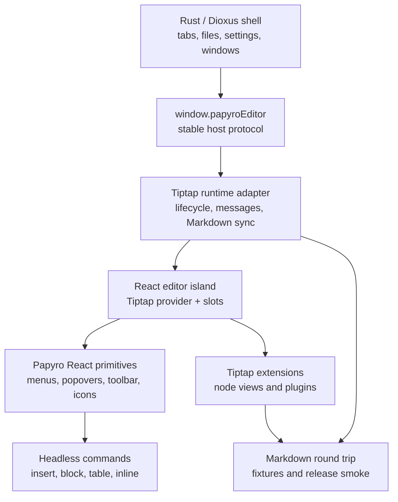

# Tiptap Enterprise Editor TODO

[简体中文](zh-CN/tiptap-enterprise-editor-todo.md) | [Official React strategy](tiptap-official-react-strategy.md) | [Runtime plan](tiptap-react-runtime-plan.md) | [Roadmap](roadmap.md)

This document is the execution checklist for turning Papyro's Tiptap editor into a release-ready, Notion-like Markdown editor. It is intentionally more concrete than the roadmap: each milestone includes scope, implementation notes, acceptance criteria, and verification.

## Current State

The `feat-tiptap` branch already changed the runtime direction, but the visible experience is not finished. The current status is:

- The editor now uses Tiptap/ProseMirror for Hybrid mode and keeps the Dioxus-facing `window.papyroEditor` facade.
- A React island foundation exists under `js/src/tiptap-react/`.
- The React island uses the installed `@tiptap/react` composable API and keeps `Tiptap.Content` as the only editor content host.
- The official licensed `table-node` UI source is mounted through `PapyroOfficialTableNodeLayer`, but Papyro still adapts it for local Markdown persistence, i18n, and desktop WebView constraints.
- Optional editor chrome is now guarded by React error boundaries so table, handle, or overlay failures do not remove the document content surface.
- Slash insert, block handle, code block chrome, format toolbar, link editor, and table menus have React paths, but some geometry and compatibility behavior still depends on migration-era controllers.

That means the current app is no longer a pure custom DOM editor, but it is also not yet a finished official Notion-like editor. The next work must keep following official Tiptap React/table-node patterns while retiring the compatibility controllers that still make the visible experience drift from the benchmark.

## Active Execution Focus

Use this short list to steer the next implementation turns before starting broad polish:

1. Stabilize the React island and bundle gate so a broken chrome component can never white-screen an opened document.
2. Finish the table-node integration against the official interaction contract: hover-owned row/column handles, visual cell selection without text selection, rectangular range selection, menus, resize, and quick add.
3. Replace remaining one-off DOM geometry ownership with React components or pure shared models consumed by React.
4. Keep Markdown as the persisted source of truth and add fixtures before changing table/code/image/math/Mermaid serialization.
5. Run the mounted bundle smoke plus `node scripts/check-editor-markdown-gate.js` before every editor-runtime commit.

## Official Baseline

Before implementing any item here, refresh and check the local official references:

```powershell
git -C E:\tiptap pull --ff-only
git -C .reference\tiptap-docs pull --ff-only
```

Primary references:

- `E:\tiptap\packages\react`
- `E:\tiptap\packages\extension-drag-handle-react`
- `E:\tiptap\packages\extension-node-range`
- `E:\tiptap\packages\extension-table`
- `.reference/tiptap-docs/src/content/guides/react-composable-api.mdx`
- `.reference/tiptap-docs/src/content/editor/getting-started/install/react.mdx`
- `.reference/tiptap-docs/src/content/ui-components/templates/notion-like-editor.mdx`
- `.reference/tiptap-docs/src/content/ui-components/node-components/table-node.mdx`
- `.reference/tiptap-docs/src/content/ui-components/components/drag-context-menu.mdx`
- `.reference/tiptap-docs/src/content/ui-components/components/slash-dropdown-menu.mdx`

Rules:

- Use latest stable Tiptap 3 packages and keep every `@tiptap/*` dependency on the same version.
- Prefer the React composable API for editor UI.
- Match the installed `@tiptap/react` source before changing integration details. In the current installed package, `<Tiptap editor={editor}>` is the primary API and `instance` is the deprecated compatibility prop.
- Treat Notion-like editor, `table-node`, `drag-context-menu`, and `slash-dropdown-menu` as licensed/non-open UI unless licensed source is explicitly added.
- Use official open packages directly. Re-create product interactions locally only when no licensed source is available.

## Default Free/Open-Source Path

Unless the project explicitly adds licensed Tiptap Start/Pro output, Papyro should follow a free official-first path:

1. Use official free/open Tiptap packages as the document model and editing foundation.
2. Build Papyro-owned React wrappers for command menus, popovers, toolbars, node views, table chrome, and block handles.
3. Treat official Notion-like interactions as the UX benchmark, not copied source.
4. Confirm each major surface with the product owner before marking it complete.
5. Iterate until the manual WebView experience matches the agreed acceptance criteria, not merely until tests pass.

This path is slower than integrating paid UI output, but it keeps the codebase legally clean, local-first, and maintainable. The result should be a Papyro editor system that can keep improving without depending on private template internals.

Reusable component licensing note:

- If these editor components stay under the repository MIT license, they are open source in the strict sense and commercial use is allowed.
- If the goal is non-commercial-only reuse, the component package must be isolated and published under an explicit source-available non-commercial license. Do not describe that package as OSI open source.
- In either model, the implementation remains clean-room Papyro code built on public Tiptap APIs. Do not copy Tiptap Start/Pro UI source without a license.

Review checkpoints:

- After Milestone 1, confirm the React editor shell and shared primitives feel like the right foundation.
- After Milestone 2, confirm slash/`+` insertion layout, keyboard behavior, and command grouping.
- After Milestone 3, confirm block handle click, drag, menu, and highlight behavior.
- After Milestone 4, confirm table selection, resize, add-row/add-column, and cell menus against the official benchmark.
- After Milestone 5 and 6, confirm code block and floating toolbar polish.
- Before Milestone 10, run final acceptance together against the release smoke checklist.

## Architecture Target



Non-negotiables:

- Dioxus never imports Tiptap internals.
- React owns editor UI only, not workspace or file state.
- Command definitions are data-first and shared by slash menus, handles, keyboard shortcuts, tests, and future command palette flows.
- Old DOM controllers are temporary migration code. A milestone is complete only when obsolete controller code and CSS are removed.
- Markdown remains the persisted source of truth.

## Definition Of Done

The Tiptap editor is release-ready when all of these are true:

- Hybrid mode feels document-native for blocks, tables, code, math, Mermaid, images, task lists, paste, undo, and IME.
- Source, Hybrid, and Preview round-trip Markdown without silent data loss.
- Slash insert, block handle, floating toolbar, code block controls, and table controls are React components using shared primitives.
- Pointer, keyboard, focus, outside-dismiss, drag, and resize behavior are predictable in desktop WebView.
- Chinese and English labels exist for every new editor action.
- The editor passes automated JS/Rust checks plus manual WebView smoke.
- The implementation is modular enough that a new block type can be added without editing a giant runtime file.

## Milestone 0 - Product And License Decision

Goal: stop guessing whether to rebuild or integrate official UI.

Tasks:

- [x] Decide whether Papyro will buy/use the Tiptap Start/Pro path for production.
  - Current decision: the table-node work uses the accepted Tiptap Pro/Start license path for generated UI source. Keep production eligibility tied to the active plan and accepted terms.
- [x] If licensed, generate official UI source with Tiptap CLI into a clearly isolated third-party area.
  - Current coverage: the Tiptap UI project is initialized under `js`, and official component source is installed under `js/src/components/` with `@` alias support from `js/jsconfig.json`. Run CLI commands with `--cwd js`; running from `E:\papyro` reports "Directory not found" because the root is not the initialized UI component project.
  - Current guardrail: `.npmrc` and `js/.npmrc` hold local registry credentials, are ignored by git, and must not be committed.
- [ ] If unlicensed, record which official interactions will be rebuilt locally and which are deferred.
- [ ] Add attribution and upgrade notes for any copied MIT source from public Tiptap UI repositories.
- [ ] Freeze the interaction benchmark: Notion-like block handle, slash insert, table node, floating toolbar, and responsive toolbar.

Acceptance criteria:

- No non-open Tiptap UI source is copied without a license.
- The chosen path is written in [Tiptap official React strategy](tiptap-official-react-strategy.md).
- Each later milestone says whether it uses licensed official source or a Papyro local equivalent.

Verification:

```powershell
git status --short
node scripts/check-workspace-deps.js
```

## Milestone 1 - React Island As The Only Editor Chrome Host

Goal: make React the durable owner of editor UI instead of a thin mount wrapper around old DOM controllers.

Tasks:

- [ ] Add `js/src/tiptap-react/components/`, `commands/`, `hooks/`, `extensions/`, and `utils/` modules.
- [ ] Move shared floating-layer lifecycle into React: outside click, Escape, focus return, scroll, resize, and WebView body focus races.
- [ ] Add shared React primitives: `EditorPopover`, `CommandMenu`, `CommandItem`, `CommandSection`, `IconButton`, `ToolbarButton`, `Kbd`, and `VisuallyHidden`.
  - Current coverage: the shared primitive module now exports the target popover, command menu, command item/section, icon button, toolbar button, keyboard hint, and visually-hidden building blocks. Slash command groups and command items now use `CommandSection`/`CommandItem`; block action and table context command rows share the primitive row/text/icon path; the floating format toolbar uses the shared toolbar button contract. The official table-node layer now owns visible table handles, selection overlay, cell menu trigger, and extend buttons, while the migration table controller still owns command routing and some compatibility event handling.
- [ ] Add a typed command model for insert, block action, inline format, table, and code block commands.
  - Current coverage: code block language, copy, and soft-wrap command metadata now live in a pure React command model, so slash side panels and the React code-block node view share the same labels, tokens, active state, and i18n contract. The code block extension now accepts an injected node-view renderer with a migration DOM fallback for the pre-React mount lifecycle.
  - Current coverage: block action menu command preparation, submenu grouping, Home/End behavior, submenu arrow navigation, and advertised shortcut mapping now live in the shared React menu model. The migration DOM fallback consumes that model, reducing behavior drift while the rest of the block action surface moves to React.
  - Current coverage: table command menu state now has a pure model for mode normalization, scoped visible commands, enabled command ids, and active-command fallback. The migration controller consumes that model, reducing duplicated command selection logic before table chrome moves further into React.
  - Current coverage: table command grouping is also centralized in the same model and shared by the React context menu plus the DOM fallback renderer, so future layout changes do not fork grouping/order behavior between render paths.
  - Current polish: table command menus now expose an object-oriented menu model with Structure, Content, Style, and Danger sections. React runtime and migration fallback both consume the same section metadata, so row, column, cell, range, and table menus read like user-facing document actions instead of raw implementation groups.
- [ ] Expose stable runtime hooks: editor instance, language, view mode, preferences, command executor, and active selection snapshot.
  - Current coverage: React runtime context now builds from a pure runtime model, exposes preferences, command executor, and active selection snapshot hooks, and normalizes cursor/range/table selections for future React block-handle and table-chrome components. The code-block command model has started moving out of migration controllers; table command models still need to be lifted further.
  - Current coverage: React runtime selection now follows Tiptap `transaction` and `selectionUpdate` events through `useSyncExternalStore`, using value-stable snapshots so React chrome does not read stale selections after editor transactions.
  - Current coverage: the React command executor now exposes a table-action scope routed through `entry.tableToolbar`, giving future React table chrome a stable command path instead of reaching directly into migration controller internals or raw `editor.commands`.
- [x] Guard optional React chrome with error boundaries so a failed overlay cannot blank the document.
  - Current coverage: `BeforeContent`, `AfterContent`, and `OverlayLayer` are isolated by `PapyroTiptapChromeErrorBoundary`. The editor content itself stays outside those boundaries, so table/handle/menu failures report a runtime error and hide only the broken chrome.
- [ ] Keep the existing DOM controllers disabled behind a runtime flag while React replacements are tested.
  - Current coverage: the runtime now injects a table chrome bridge instead of passing `tableChromeRendererFactory: null`. That bridge keeps Papyro visual cell-selection classes in sync and keeps the old quick-add rails, cell trigger, axis handles, and backdrop DOM hidden, so official `table-node` is the only visible table chrome owner in the real runtime.

Acceptance criteria:

- New editor UI is added through React slots, not direct `document.createElement` overlays.
- Hovering or keyboarding inside menus does not rebuild the whole overlay DOM.
- Overlay dismissal has one shared behavior across slash, block, table, and toolbar panels.
- No new monolithic `NotionEditor.jsx` or giant controller file appears.

Verification:

```powershell
npm --prefix js test
npm --prefix js run build
node scripts/report-file-lines.js
```

Manual smoke:

- Open Hybrid mode.
- Open a command panel.
- Move the pointer into the panel slowly.
- Confirm it does not disappear until outside click, Escape, command execution, or intentional scroll outside the editor.

## Milestone 2 - Slash And Insert Menu

Goal: make `/` and `+` insertion feel like a professional document command surface.

Tasks:

- [x] Replace the DOM slash menu with a React command menu.
- [x] Separate core insert commands into Text, Lists, Blocks, Data, Media, and Advanced groups.
- [x] Add a Recent group after command usage history exists.
  - Current coverage: empty slash and `+` menus promote successfully used commands into a Recent group while preserving `sourceIndex` for diagnostics and tests.
- [ ] Support nested detail panels for table size, callout style, code language, and future diagram/math templates.
  - Current coverage: table size, callout style, and code language panels are implemented and anchored to the active command row.
  - Current coverage: the React menu now shows table size as a compact secondary panel anchored to the active Table command row, so the size grid no longer appears as a detached top-right panel or shifts the main command list. Callout style and code language use the same anchored side-panel contract for longer choice lists.
  - Current coverage: keyboard users can move into the table size panel with ArrowRight, adjust rows and columns with arrow keys, return to the main list with ArrowLeft at the first column, and insert the selected size with Enter/Tab. Mouse hover updates the previewed size without stealing main-list navigation.
- [x] Fix keyboard navigation so ArrowDown can reach every command and never loops before the last item.
- [x] Support Home and End navigation across the full insert command list.
- [x] Position detail panels beside the selected command, not at awkward top-right coordinates.
- [x] Add localized labels, descriptions, search aliases, and empty states for current commands.
- [x] Add command filtering with stable active item and scroll-into-view only for keyboard navigation.
- [x] Keep `+` semantics distinct: insert below the current block, open the menu at the new caret, and clean temporary slash text on cancel.
- [x] Replace ad hoc slash-menu glyphs with a shared Lucide-backed React icon system and semantic command-group tones.
  - Current polish: slash and `+` menus now use quieter neutral icon frames, and the table size detail panel is narrower with matching positioning contracts. The React path uses Lucide icons, while the migration DOM fallback now has the same semantic line-icon vocabulary and Recent tone so rendering paths do not split visually.
  - Current polish: the insert menu width, item rhythm, and compact table-size secondary panel have been tightened so table insertion reads as one focused nested choice instead of a bulky overlay that blocks scanning lower commands.
  - Current polish: the React insert menu now uses the same hover-intent delay as the DOM fallback for side panels, so table/callout/code detail panels do not jump open while users move toward lower commands; keyboard focus remains immediate.
  - Current polish: block `+` forwards the real pointer anchor into the insert menu, so the menu opens from the clicked affordance instead of drifting back to the legacy button rect.

Acceptance criteria:

- `/` from typing and `+` from the gutter open the same insert system with different anchors.
- The table size picker is reachable by keyboard and mouse.
- Hover detail panels do not cover lower commands in a way that blocks selection.
- Every command has a clear icon, title, description, and i18n label.

Verification:

```powershell
node scripts/check-editor-markdown-gate.js
```

Manual smoke:

- Type `/`, navigate from first item to table using ArrowDown, insert a table.
- Click `+` beside a paragraph, insert heading, table, code block, math, Mermaid, and callout.
- Switch language between English and Chinese and repeat.
- Use the keyboard after opening the `+` insert menu, including the case where recent commands are shown, and verify Table can still be selected and inserted.

## Milestone 3 - Drag Handle And Block Action Menu

Goal: make the left block handle behave like a real document editor handle.

Tasks:

- [ ] Evaluate replacing local handle code with `@tiptap/extension-drag-handle-react` and `@tiptap/extension-node-range`.
  - Decision recorded in [Tiptap official React strategy](tiptap-official-react-strategy.md): use official DragHandle for node tracking/dragging, keep Papyro React handle for action and insert controls, and keep tables under table overlay ownership.
  - Foundation added: `@tiptap/extension-node-range` is now in the editor extension chain with `Mod` pointer selection and Papyro-themed range-selection CSS.
  - Foundation added: official DragHandle adapter options and Papyro exclusion rules are now tested in `js/src/tiptap-official-drag-handle.js`; runtime behavior still needs to switch from the compatibility controller to the official plugin.
  - Foundation added: the React official DragHandle bridge now registers only for editable Hybrid mode with a block-handle controller, so Source/Preview do not keep the official hover plugin active.
  - Foundation added: block action and insert menus now lock the official DragHandle plugin while floating menus are open, using `lockDragHandle`/`unlockDragHandle` when available and `setMeta("lockDragHandle", ...)` as the React bridge fallback.
  - Current coverage: official native drag start/end now flows back into the Papyro controller lifecycle. Native drag closes block action/insert popovers, selects the semantic block before drag, publishes an `officialDragging` state for React chrome, and clears the selected paint on drag end without replacing the official drop handler.
- [ ] React-render the handle with two distinct controls: drag/action handle and insert `+`.
  - Current coverage: desktop/mobile bundle entry injects the React block-handle view for migration fallback, and the official `DragHandle` React bridge now renders the same Papyro `+` and action controls directly inside the official drag-handle element. Official hover tracking and positioning therefore own the visible handle in Hybrid mode, while the old floating view is kept only for menu anchoring, drop indicators, and fallback paths.
  - Current coverage: the official React bridge now treats `floatingViewHidden` as a legacy-view concern only, so the official DragHandle controls stay visible while block action or insert menus lock the plugin.
  - Current polish: the legacy floating handle is hidden again while official hover tracking owns the visible control, but its hover bridge still keeps the official handle reachable across the gutter and keeps fallback menus anchored.
  - Current polish: the `+` and action handle spacing, hit boxes, and idle/active styling are quieter and more separated, avoiding the cramped two-icon cluster that previously made their responsibilities feel ambiguous.
  - Current polish: official native drag state now flows into the shared React handle visual state, so the cursor and active affordance stay consistent while the official drag path is running.
  - Still required: move drag reorder execution fully onto the official drag/drop path and reduce the compatibility controller further.
- [ ] Open the block action menu on normal click beside the pointer, not after long press.
  - Current coverage: the official React DragHandle bridge now tracks pointer down/up distance, opens the block action menu immediately for short primary clicks, suppresses click fallback after drag-like movement, and keeps real drag gestures on the official drag path.
  - Current coverage: after a short primary click is handled on pointer-up, the immediately following browser click fallback is suppressed so the block action menu is not opened twice or re-anchored unexpectedly.
- [ ] Block native WebView context menus on right-click and show only Papyro actions.
  - Current coverage: the official React DragHandle bridge now consumes `contextmenu` and auxiliary clicks on the handle root, action handle, and insert handle. Right-click opens Papyro block actions without leaking the WebView refresh/inspect menu, while non-primary insert clicks are swallowed instead of triggering native browser chrome.
- [ ] Highlight the whole semantic block, including inline code and mixed marks.
  - Current coverage: block-handle actions now prefer Tiptap's official `setNodeSelection` for the semantic block and only fall back to a full textblock range when node selection is unavailable, so mixed inline marks and inline code no longer define the perceived selection boundary.
- [ ] Implement reliable drag reorder with a drop indicator and transaction-level tests.
  - Current coverage: the shared block-move helper now creates the ProseMirror selection on the same transaction that reorders the node, so dispatch applies move and selection atomically instead of relying on a second post-dispatch command. Focused tests now exercise real ProseMirror documents for upward/downward moves, sibling drop boundaries, self-drop rejection, and the no-fallback command path when the transaction already carries selection.
- [ ] Limit handle ownership for complex nodes: tables, code blocks, images, math, and Mermaid get one block-level handle, not per-cell or per-child handles.
  - Done for the compatibility handle path: table, code block, image node view, display math, and Mermaid descendants now resolve to the outer complex block.
  - Still required: the final React handle implementation based on official drag-handle/node-range APIs.
- [ ] Add block actions: copy Markdown, duplicate, delete, reset formatting, text color, highlight, turn into, and move up/down.
  - Current coverage: block action commands now include move up/down, backed by a shared ProseMirror transaction helper used by both the handle drag path and menu actions. Commands are hidden at sibling boundaries, keep selection on the moved block, expose localized labels, support `Alt+Up` / `Alt+Down`, and have focused tests for command metadata, keyboard shortcuts, and transaction behavior.
  - Current coverage: `Shift+F10` and the keyboard Context Menu key now open the block action menu for the current semantic block in Hybrid mode. The selection resolver climbs to the outer table when the caret is inside table cells, and IME composition events are ignored so Chinese input confirmation does not open the block menu.

Acceptance criteria:

- Clicking the handle selects and highlights the current block.
- Dragging starts only after a movement threshold.
- Moving the mouse from handle to menu does not close the menu.
- The insert `+` never opens the block action menu.
- Tables and lists do not show redundant per-cell or per-item block handles.

Verification:

```powershell
npm --prefix js test
node scripts/check-tiptap-release-smoke.js
```

Manual smoke:

- Click, right-click, and drag handles for paragraph, heading, list item, code block, table, image, math, Mermaid, and callout.
- Confirm the selected background covers the semantic block instead of only plain text.

## Milestone 4 - Table UX Rebuild

Goal: table editing should feel close to the official Notion-like table experience, not like a debug overlay.

Interaction contract:

- Row and column handles are hover-owned chrome. Hovering any cell, including header cells, reveals the row handle beside that row and the column handle above that column. The handles stay visible while the pointer moves from the cell into the handle and disappear only after leaving the hovered row/column chrome.
- Clicking a row or column handle selects that whole axis, paints only the outer border in the theme color, adds a subtle selection mist, and opens a scoped menu from the handle area. Internal shared borders must stay neutral.
- Row, column, cell, and range menus should keep structure/content/destructive actions in the main list while alignment, text color, and cell background open as compact right-side style submenus on hover or keyboard focus.
- Clicking a single cell creates a visual object selection only. It must not select all text or replace natural caret placement. Users can still click into text, type, and drag within the same cell to copy text.
- Dragging from one cell into another creates a rectangular table-cell range. The range uses one outer theme border, one subtle mist, one action trigger on the head/right edge, and exposes merge, color, alignment, and clear-content actions.
- Pressing Delete/Backspace with a visual single-cell selection or a cell range clears selected cell contents without deleting the table structure.

Decision path:

- Licensed path: integrate official `table-node` output and adapt it to Papyro tokens, Markdown persistence, and i18n.
  - Current coverage: this milestone now follows the licensed path. Official `table-node` source is mounted through `PapyroOfficialTableNodeLayer`, while Papyro keeps the `TableKit` boundary for Markdown persistence and local table commands.
- Unlicensed path: rebuild the same interaction principles with `@tiptap/extension-table`, ProseMirror table utilities, and Papyro React overlays.

Tasks:

- [x] Integrate official table-node chrome into the React island.
  - Current coverage: `js/src/tiptap-react/slots.jsx` renders the official table-node overlay next to the official drag-handle bridge.
  - Current coverage: `js/src/tiptap-table.js` registers the official `tableHandleExtension` so official row/column handle state reaches React.
  - Current coverage: `PapyroTableView` now adds the `.table-controls` and `.table-selection-overlay-container` portal targets that the official table-node handle and selection overlay expect inside each `.tableWrapper`.
  - Current coverage: the editor entry injects `createTiptapReactTableChromeRenderer` as a visual-state bridge instead of passing `null`, preventing the migration DOM fallback from mounting duplicate hover handles, selection overlays, and cell action triggers.
  - Current coverage: official SCSS imports are bundled into `editor.js`, so desktop and mobile hosts receive the table-node styles through the existing editor runtime script.
- [x] Remove the top-left whole-table selector unless a clear product action requires it.
  - Current coverage: the table overlay no longer renders a whole-table corner handle; geometry now returns `table: null`, leaving row/column handles as the only axis affordances.
- [ ] Remove visible handles by default. Show row/column handles only on intentional table hover, with a full-span affordance for the hovered row or column.
  - Current coverage: row and column handles now stay hidden by default, but hovering a table cell reveals the matching row handle at the row edge and the matching column handle above that column. The handle dimensions track the row height or column width, so the affordance reads like the official axis chrome without covering editable cell text.
  - Current polish: row and column handles now sit flush against the table grid, keep their table-facing border transparent, and the hover state refreshes as the pointer crosses into the rail so the handle does not disappear before it can be clicked.
  - Current fix: table chrome now keeps tracking hover at the document level while the pointer is over the floating row or column handle, so crossing from the table cell into the external handle does not immediately dismiss the handle.
  - Current fix: React and fallback chrome now add transparent row/column hit areas over the hovered axis, so moving from a header or body cell toward the floating top/left handle keeps the same hover axis instead of dropping the handle mid-flight.
  - Current polish: hovering a cell reveals only the row and column handles. Full row or column mist and theme outlines are reserved for actual row/column selection after the axis handle is clicked.
  - Current architecture: official table-node owns visible row/column handles, selection overlay, cell handle menu, and extend buttons. Papyro's migration table toolbar now stays in the background as a command bridge and visual-state synchronizer.
  - Current architecture: the injected table chrome bridge keeps selected/active cell classes in sync for Papyro styling, but keeps its root hidden and does not render quick-add, cell-action, insert-rail, axis-handle, or backdrop DOM. The old DOM renderer remains only as a fallback/test path.
- [ ] Make the entire cell surface editable and focusable, not only a tiny center area.
  - Correction required: short clicks must no longer commit a single-cell ProseMirror `CellSelection`. The single-cell state is a Papyro visual selection layered over normal ProseMirror text selection so caret placement and in-cell text dragging stay natural.
  - Current target: cell-range dragging can still start from filled text, blank cell surfaces, or empty paragraphs, but the controller should promote to a real table range only after the pointer crosses into another cell.
  - Current target: double-click is not the only editing affordance. A normal click must both show the selected-cell border and keep the text caret at the pointer location.
- [x] Ensure cells have no visual gaps, so selection and resize borders look continuous.
  - Current coverage: Tiptap table cells now match Preview's zero-gap grid with `border-collapse: collapse`, `border-spacing: 0`, normal cell borders, table margin reset, border-box background painting, and a style smoke guard for the continuous cell surface.
  - Current correction: selection and hover affordances are now drawn by the table chrome overlay instead of relying on every cell to draw its own partial theme border, avoiding broken border segments between adjacent cells.
  - Current polish: table grid painting is isolated from the editor background, selected cells keep a restrained active fill, and selected/active cells keep resize rails available without adding always-visible chrome.
  - Current polish: Hybrid table wrappers no longer add interior padding around the grid, so the rendered table surface starts at the actual zero-spacing table edge instead of showing a small editor-background gutter.
  - Current fix: the resizable Tiptap table node now uses a Papyro `TableView` wrapper that reapplies `mn-tiptap-table` to the real runtime `<table>`, so zero-gap table CSS is not lost when ProseMirror owns the table view.
  - Current fix: official table-node SCSS is now constrained to its own `.tiptap` template selectors plus Papyro's existing `.mn-tiptap-editor` table wrapper, avoiding accidental width or padding drift in Hybrid/Preview parity.
- [x] On cell click, show a theme-colored active border around that cell.
  - Current target: active and selected cells use one shared selection overlay that draws the theme-colored object border around a single visual cell or the whole selected cell range; the cell menu trigger stays a separate right-edge action affordance.
  - Current target: a single clicked cell receives the same object-selection overlay without converting to ProseMirror `CellSelection`, so selection is visible as a real border while text editing remains natural.
  - Current target: blank-cell and empty-paragraph short clicks are covered by visual-class tests, and range selection tests must prove `setCellSelection` runs only after drag crosses into another cell.
  - Current fix: the initial pointerdown still preserves text-caret placement, but the follow-up browser click is suppressed after a visual cell selection so the object-selection border cannot be immediately overwritten by native cell/text selection behavior.
  - Current fix: DOM table cells are resolved back to their real ProseMirror `tableCell` / `tableHeader` node positions before calling `setCellSelection`; real mounted coverage now guards against the earlier false-positive fixture where `posAtDOM(cell, 0)` was incorrectly treated as already selectable.
- [ ] On cell selection range, show a restrained overlay and a small action trigger on the range edge.
  - Current coverage: the table cell action trigger idles as a small edge dot and expands into a compact four-dot grip only on hover, focus, or open state.
  - Current polish: the single-cell trigger now has a tested right-edge center intent zone. Ordinary cell hover stays clean, selected cells get a restrained border and right-edge rail, and only deliberate edge hover or an active selection reveals the action point.
  - Current polish: single-cell action triggers now anchor from the actual ProseMirror cell-selection position in the table grid, not a stale active-cell rectangle. Opening the trigger reuses that selected position, so the menu no longer jumps back to a previously active cell after the user selects a different cell.
  - Current polish: the official table-node layer now provides the visible cell handle menu trigger. Papyro's hidden bridge keeps the old chrome root out of the accessibility/focus tree so legacy quick-add rails, cell triggers, insert rails, and row/column axis handles do not leave inactive focus targets behind.
  - Current polish: the migration DOM fallback still uses the same hidden-state contract for table quick-add rails, cell triggers, axis handles, complex-block insert rails, and decorative overlays, keeping fallback behavior testable while real runtime visibility belongs to official table-node.
  - Current correction: the right-edge table cell action trigger is now scoped only to single-cell and cell-range selections. Row and column menus open from their slim axis handles, and table-level actions no longer masquerade as generic cell actions.
  - Current polish: the selected-cell action trigger now idles as a smaller dot hit box and only expands to the full four-dot grip on hover, focus, or open state. This keeps the resize border cleaner and reduces competition with the official column-resize handle.
- [ ] Add cell action menu: merge, split, alignment, text color, background color, clear formatting, copy, delete contents.
  - Current coverage: the table context menu is injected at the editor entry boundary and rendered by React in the real runtime. The headless command model and fake-DOM fallback remain in place while the rest of table chrome migrates.
  - Current polish: React-rendered table command rows now use the same title-plus-description accessible label contract as the fallback renderer, keeping screen-reader semantics consistent while table chrome continues moving to React.
  - Current polish: the real React table context menu now uses a dedicated Lucide icon map for table actions, while the migration DOM fallback keeps the CSS-drawn icons. This makes the runtime menu closer to the official UI component quality without coupling tests to generated SVG markup.
  - Current polish: table context menus now group commands by user intent: Structure for row/column/header/repair operations, Content for copy/merge/clear content, Style for alignment and color, and Danger for destructive actions. These sections are localized and shared by React plus fallback renderers, reducing the toolbox/debug feel while keeping the compact menu width.
  - Current polish: Style commands now open as hover/focus right-side submenus for alignment, text color, and cell background. React runtime and DOM fallback use the same layout-group metadata, so color and alignment choices stay compact without hiding row/column structural actions.
  - Current coverage: selected cell content can now be cleared through a Papyro command backed by the official `@tiptap/pm/tables` `deleteCellSelection` utility, with context-menu metadata, i18n labels, and mounted-editor tests. The command also supports the official table-node `resetAttrs` semantics for clearing content while resetting alignment/background attrs, and a separate style-reset menu action keeps text intact.
  - Current coverage: selected cells now support default/muted/accent/danger text-color commands backed by the shared `TextStyle` mark path. The command operates on ProseMirror cell selections, clears color through the same menu, and is covered by mounted-editor tests plus context-menu metadata/i18n.
  - Current coverage: selected table cells can now be copied as plain TSV text through a table-scoped command backed by the official `selectedRect` grid semantics. The menu action is localized, has a dedicated copy icon, does not mutate the document, and is covered by mounted-editor tests.
- [ ] Add row and column action menus from slim edge handles.
  - Current coverage: row and column context menus now expose the same clear-content and clear-style actions as cell selections, so axis selections can reuse the official table clear/reset semantics without switching back to a cell menu.
  - Current polish: slim row/column handles freeze their own geometry before selecting the axis, so the context menu opens from the clicked handle instead of drifting after the table chrome re-renders.
  - Current polish: row/column handles are full-span strips outside the table grid. Ordinary cell hover reveals the relevant axis entries, and explicit gutter/edge hover still narrows intent to the directly hovered axis.
  - Current polish: gutter hover intent now uses the same geometry as the visible slim handles, so the gap between a handle and the table no longer behaves like an invisible row/column selector.
  - Current polish: the first cell's top-left corner is now a deliberate dual-axis intent zone, so users can reveal both the first-row and first-column handles without making ordinary cell hover noisy.
  - Current polish: row/column handle menus now open only after the underlying table axis selection succeeds, avoiding a misleading menu when ProseMirror rejects the selection.
  - Current polish: React-rendered axis handles now use their own pointer activation guard, so a successful pointer-down selection cannot be replayed by the following click event and accidentally toggle or re-anchor the menu.
  - Current coverage: row and column context menus now expose move up/down and move left/right commands through Papyro wrappers around the public `prosemirror-tables` `moveTableRow` and `moveTableColumn` commands. Edge moves are disabled by command capability, moved axes remain selected, and the menu uses localized labels plus compact table-grid arrow icons.
  - Current coverage: row and column context menus now expose alignment, text-color, and background-color commands, so whole-axis styling uses the same ProseMirror `CellSelection` and Tiptap table attributes as cell range styling.
  - Current coverage: row and column context menus now expose duplicate row/column actions as a free/open Papyro equivalent to the official `table-node` duplicate affordance. The implementation preserves selected row/column content for regular non-spanning tables and disables itself for merged-cell structures instead of risking silent table corruption.
- [ ] Add resize affordance on column borders that still works while a cell is active.
  - Current coverage: selected table cells no longer reveal column resize handles by selection alone; resize chrome stays tied to hover or active resize intent.
  - Current polish: selected and active cells now keep a wider 16px resize hit zone with a restrained accent rail, so column resizing remains discoverable after cell selection without adding always-on table chrome.
  - Current polish: selected and active cells keep the resize hit zone invisible until the pointer is actually on the column edge, matching the official clean-default table pattern more closely.
  - Current polish: table cells and common inner block content now keep a full-surface text cursor while preserving the official column-resize handle hit area on selected or active cells, so editing affordance and resize affordance do not cancel each other.
- [ ] Add quick row and column insertion rails: slim full-width/full-height rails with centered `+`, close enough to the table to be discoverable.
  - Current coverage: quick-add rails are now flush with the real table grid edge, use compact 12px hit chrome, and keep light/dark contrast without reading like debug overlays.
  - Current polish: quick-add rails keep the same slim visual rail but now use a larger 18px pointer hit area and treat the table's real bottom/right edge as part of the affordance, so users do not need to hunt for an off-by-one outside gap.
  - Current polish: the quick-add rail intent zone is now tightened to 12px and the visible rail is 14px, which reduces accidental row/column add controls when moving between adjacent blocks while keeping the edge discoverable. Table hover comparisons ignore ordinary pointer jitter inside the same semantic target, preventing redundant overlay re-renders.
  - Current polish: quick-add chrome now separates its visible slim rail from a slightly larger hit target in the shared model, and both React chrome and the migration DOM fallback consume the same visual-rect CSS contract.
- [ ] Keep table controls hidden for adjacent code blocks or other non-table content.
  - Current coverage: quick-add row/column rails now require a table-owned target or explicit editor rail target, so adjacent code blocks and other complex blocks cannot accidentally display table insertion chrome.
- [x] Add Markdown round-trip fixtures for alignment, header rows, merged-cell fallback, and cell background metadata if supported.
  - Current coverage: release smoke now checks both the main lossless pipe-table fixture and a dedicated HTML fallback table with background colors and colspan metadata; the mounted runtime smoke verifies complex table attrs survive HTML parse.
  - Current coverage: lossless tables still serialize as readable pipe tables, while tables with cell background, per-cell alignment, colspan/rowspan, column widths, or non-leading header cells serialize as HTML tables so Markdown save/reopen preserves the Tiptap table attributes instead of silently dropping them.

Acceptance criteria:

- Idle table view is clean.
- Hovering first row/column reveals only the relevant slim handle.
- Clicking a row/column handle selects that axis and opens a scoped menu.
- Clicking a cell selects that cell and keeps text editing natural.
- Drag selecting multiple cells reveals a range action trigger with merge available.
- Column resize works from the column border and does not disappear after selection.
- Quick add row/column controls are visible in light and dark themes.

Verification:

```powershell
npm --prefix js test
npm --prefix js run build
node scripts/check-tiptap-release-smoke.js
```

Manual smoke:

- Insert 2x2, 3x3, and 6x6 tables.
- Edit every part of a cell by clicking different cell regions.
- Select one cell, a row, a column, and a cell range.
- Resize columns.
- Add rows and columns using edge rails.
- Save, close, reopen, and verify Markdown still round-trips.

## Milestone 5 - Code Block Experience

Goal: code blocks should read and edit like professional Markdown blocks.

Tasks:

- [ ] Use a React node view for code block chrome if it improves maintainability.
  - Current coverage: the desktop/mobile runtime now injects a React `NodeViewWrapper`/`NodeViewContent` code block node view through the Tiptap extension boundary. It keeps the official React node-view lifecycle intact, applies code-block attributes to the real ProseMirror node-view root for handles/styling, and falls back to the DOM node view until the React `EditorContent` content component is ready.
- [ ] Show language label with a language switcher.
  - Current coverage: code blocks expose a language badge, explicit/auto state data, compact language tokens, and an editable language menu. The language list is now backed by the shared React command model in both the React node view and the migration fallback.
  - Current polish: the visible language chip now shows the effective syntax token (`JS`, `RS`, `TXT`, etc.) instead of a generic "Lang" label, including auto-detected languages.
  - Current polish: the React language menu now renders each option with a stable language token, localized title, and short explanation so users can understand whether the block is auto-detected, plain text, or syntax-highlighted.
- [ ] Add copy button, wrap toggle, and optional filename/title metadata if Markdown strategy is defined.
  - Current coverage: code blocks expose quiet copy and soft-wrap controls in the node-view chrome without changing saved Markdown. Copy/wrap labels and states are now represented by the shared React command model for the future React node view.
- [ ] Use a real highlighter theme for light and dark modes.
  - Current coverage: Hybrid code blocks use lowlight `.hljs-*` classes with theme-scoped token palettes, a light-mode left accent rail, and smoke coverage for the core syntax groups.
  - Current polish: code-language chrome uses theme-aware light-mode chip surfaces so the syntax controls no longer read as a flat blue block.
- [x] Preserve fenced code language through Markdown round-trip.
  - Current coverage: release smoke and Markdown tests now cover Rust, JavaScript, Markdown, plaintext, custom safe language ids, and language-less automatic fences so saved notes cannot silently drop code fence metadata.
- [ ] Add insertion affordance before and after code blocks, especially when adjacent to tables.
  - Current coverage: the complex-block insert rail has an independent, more forgiving bottom hot zone for table/code adjacency without widening table resize or quick-add intent.
  - Current coverage: code-block continuation now prefers Tiptap's official `exitCode()` command before falling back to explicit paragraph insertion.
  - Current coverage: complex block insertion now supports both top and bottom rails. Hovering the top edge of a code/table-like complex block opens the shared slash insert flow before that block, so a table immediately followed by a code block can receive a new paragraph or inserted Markdown block between them without relying on fragile double-click placement.

Acceptance criteria:

- Light mode is not a flat blue block.
- Language can be viewed and changed without editing raw fence text.
- Users can insert a paragraph between a table and a code block.
- Copy and language controls are discoverable but quiet.

Verification:

```powershell
npm --prefix js test
node scripts/check-tiptap-release-smoke.js
```

Manual smoke:

- Insert JavaScript, Rust, JSON, Markdown, and plain text code blocks.
- Change language and save/reopen.
- Test adjacent table + code block insertion.

## Milestone 6 - Floating Formatting Toolbar

Goal: selected text formatting should be compact, stable, and keyboard accessible.

Tasks:

- [ ] Move floating toolbar into React.
  - Current coverage: the real desktop/mobile runtime now injects a React-rendered format toolbar view at the editor entry boundary, while the existing controller and DOM fallback remain for tests and migration safety.
- [ ] Use Tiptap state selectors for active marks instead of DOM polling.
  - Current coverage: active mark, text-color, and highlight state now flows through a pure format snapshot. The React runtime subscribes with Tiptap's documented `useEditorState` selector path, and the migration controller consumes the same snapshot so active-state semantics stay aligned until the controller is retired.
- [ ] Add bold, italic, strike, inline code, link, text color, highlight, clear formatting, and turn into.
  - Current coverage: the headless inline-format command model now exposes Tiptap's official/free bold, italic, underline, strike, inline code, link, text color, highlight, and `unsetAllMarks` clear-formatting commands, with localized labels feeding both the React view and DOM fallback.
  - Current coverage: text color uses the existing `TextStyle` + official `Color` extension path through `setColor` and `unsetColor`, with compact swatch buttons for default, muted, accent, and danger text.
  - Current coverage: highlight uses the official `Highlight.configure({ multicolor: true })` extension path with `toggleHighlight({ color })` and `unsetHighlight()`, exposed as compact yellow, blue, green, and clear swatches.
  - Current coverage: link editing now uses a Papyro React/Dioxus-safe popover instead of a native prompt; it reads the current href through `editor.getAttributes("link").href`, restores the selected range, and applies/removes links through Tiptap's official `setLink` and `unsetLink` commands.
  - Current coverage: the `turn into` button now opens a shared submenu for paragraph, headings, lists, quote, callout, and code block transforms. The code-block transform lives inside this shared submenu so the floating toolbar and block action menu use the same command source.
- [ ] Keep toolbar placement stable near viewport edges.
  - Current coverage: the toolbar now tolerates transient `coordsAtPos` failures during ProseMirror remount/selection races, matching the React view's guarded positioning path instead of throwing during refresh.
- [ ] Add keyboard access and focus return.
  - Current coverage: `Mod+K` opens the Papyro link editor from Hybrid mode, follows Tiptap's documented Link-extension guidance for custom link UI, and expands collapsed link selections with `extendMarkRange("link")` before editing.
  - Current coverage: `Alt+F10` opens the floating format toolbar from the editor selection; Arrow keys, Home/End, Enter/Space, and Escape now provide keyboard navigation, execution, close behavior, and focus return.
  - Current coverage: the React toolbar and DOM fallback now share the same `aria-activedescendant` contract for the `turn into` submenu, including a dedicated submenu owner id, roving tab index, and keyboard scroll only during keyboard navigation.
- [ ] Localize labels and tooltips.
  - Current coverage: current toolbar commands provide English and Simplified Chinese titles and accessible labels from the shared Tiptap i18n model.

Acceptance criteria:

- Toolbar does not steal selection when clicked.
- Toolbar does not flicker on small pointer movement.
- Active states match the selected text.
- Link editing is possible without native prompts.

Verification:

```powershell
npm --prefix js test
npm --prefix js run build
```

Manual smoke:

- Select English, Chinese, inline code, link text, and mixed formatted text.
- Apply every mark and undo/redo each action.

## Milestone 7 - Markdown Node Views

Goal: complex Markdown structures should be maintainable node views with tested serialization.

Tasks:

- [ ] Review current implementations for task list, image, math, Mermaid, callout, table, and code block.
- [ ] Convert surfaces to React node views only when it reduces complexity or improves UX.
- [ ] Define Markdown parse, editor JSON, and Markdown serialize behavior for every node.
- [ ] Add fallback behavior for unsupported metadata.
- [ ] Add error states for Mermaid and math without blocking editing.
- [ ] Keep node-view UI non-serialized and content editable where appropriate.

Acceptance criteria:

- Each complex node has one owner module.
- Editor UI chrome never leaks into Markdown output.
- Parse failures fall back to editable Markdown or a recoverable error surface.

Verification:

```powershell
npm --prefix js test
node scripts/check-tiptap-release-smoke.js
```

## Milestone 8 - Mode Contract And Persistence

Goal: Source, Hybrid, and Preview must feel like three views of the same document.

Tasks:

- [ ] Audit Source/Hybrid/Preview switching for selection, scroll, undo, dirty state, and outline sync.
- [ ] Ensure Source edits do not emit duplicate dirty events for unchanged content.
- [ ] Ensure Hybrid changes produce canonical Markdown.
- [ ] Ensure Preview uses the same Markdown styling language as Hybrid.
  - Current polish: Source, Hybrid, fallback editing, and Preview surfaces now enforce at least 24px of document padding, and Hybrid unordered/ordered lists reuse the Preview list indent and item rhythm tokens.
- [ ] Add conflict behavior tests for save failures and external file changes.
- [ ] Keep `window.papyroEditor` stable during refactors.

Acceptance criteria:

- Switching modes does not lose selection, scroll, or edits.
- Save failure keeps dirty state.
- Preview and Hybrid agree on headings, tables, code, callouts, math, Mermaid, and images.

Verification:

```powershell
npm --prefix js test
cargo test
node scripts/check-tiptap-release-smoke.js
```

## Milestone 9 - i18n, Accessibility, And Keyboard

Goal: the editor should be usable in Chinese and English with real keyboard and accessibility behavior.

Tasks:

- [ ] Add every new editor string to the i18n model.
  - Current coverage: source-mode textarea labels, source parse fallback errors, React island loading state, and Math/Mermaid source-editor node-view labels now come from the shared i18n model and read the active editor language.
- [ ] Add accessible labels for icon-only controls.
- [ ] Use `aria-activedescendant` or roving tab index consistently in menus.
- [ ] Support Escape, Enter, Space, Arrow keys, Home, End, Tab, Shift+Tab, and Shift+F10 where relevant.
  - Current coverage: editor-level key routing now sends keyboard events through table toolbar, block handle, then slash menu in that order, so table context menus and block action menus both receive their keyboard entries before slash navigation. Table menus now accept both `Shift+F10` and the keyboard Context Menu / Apps key.
  - Current coverage: slash/insert menus and block action menus ignore `Shift+Tab`, so reverse focus navigation cannot accidentally run the active insert or block command.
  - Current polish: shared pointer activation now treats `pointerdown` as the handled activation even when a command returns `false`, preventing the following browser `click` fallback from retrying failed menu commands.
- [ ] Protect IME composition from menu keyboard handlers.
  - Current coverage: slash menu, block action menu, code block menus, floating format toolbar, and table toolbar now yield during composition / `keyCode 229` events so IME confirmation does not execute editor commands.
- [ ] Keep focus rings visible and theme-token based.

Acceptance criteria:

- Chinese IME never triggers a command by accident.
- Keyboard can open and operate slash, block, table, code language, and formatting menus.
- Icon-only controls have useful accessible names in both languages.

Verification:

```powershell
npm --prefix js test
node scripts/check-ui-a11y.js
node scripts/check-ui-contrast.js
```

Manual smoke:

- Enter Chinese with IME in paragraphs, table cells, code blocks, task lists, and callouts.
- Navigate every editor menu using keyboard only.

## Milestone 10 - Performance, Cleanup, And Release Gate

Goal: finish the migration by removing old code and proving the editor can ship.

Tasks:

- [ ] Delete obsolete DOM controllers after React replacements land.
- [ ] Delete unused CSS and old `.cm-*` leftovers.
- [ ] Keep JS files under line budgets or split them before they become unreviewable.
- [ ] Add performance traces for editor open, tab switch, mode switch, command menu open, table edit, and save.
- [ ] Rebuild generated bundles and desktop/mobile copies.
- [ ] Run full automated checks.
- [ ] Run the real mounted editor smoke gate before committing editor runtime changes.
  - Current coverage: `js/test/editor-bundle-smoke.test.js` loads the generated `assets/editor.js` in a DOM runtime and calls `window.papyroEditor.ensureEditor(...)`, so bundle-level React mount crashes are caught by `npm --prefix js test`.
  - Current coverage: `scripts/check-desktop-resource-smoke.js` now also verifies desktop/mobile editor bundle mirrors, logo/favicon mirrors, WebView-relative `/assets/...` URLs, shared header/sidebar logo bindings, settings/logo usage, and tool-window editor script tags. This guards the Windows regressions where editor runtime or logo paths accidentally become local drive paths.
- [ ] Execute manual Tiptap release smoke in the desktop WebView.
- [ ] After the free/open-source enterprise editor experience passes final acceptance and user sign-off, merge `feat-tiptap` back into the main branch as the migration closeout.

Acceptance criteria:

- No advanced editor chrome is owned by one-off DOM controller code.
- File line budget passes.
- Generated `assets/editor.js` is in sync.
- Manual smoke is documented before merging `feat-tiptap`.
- `feat-tiptap` is merged only after the release-candidate manual smoke is recorded and accepted.

Verification:

```powershell
npm --prefix js run build
npm --prefix js test
node scripts/check-workspace-deps.js
node scripts/check-tiptap-release-smoke.js
node scripts/check-tiptap-runtime-smoke.js
node scripts/check-perf-docs.js
node scripts/check-ui-a11y.js
node scripts/check-ui-contrast.js
node scripts/check-ui-primitives.js
node scripts/report-file-lines.js
cargo test
git diff --check
```

Manual smoke checklist:

- Source, Hybrid, Preview switching.
- Chinese IME.
- Paste Markdown, HTML, image, and URL.
- Undo/redo across text, table, and block operations.
- Slash and `+` insertion.
- Block action menu and drag reorder.
- Table insert, select, resize, row/column add, merge/split, alignment, colors.
- Code block language switch and highlighting.
- Math, Mermaid, image, callout, task list.
- Outline navigation.
- Save failure and recovery.
- OS-opened Markdown file flow.

## Execution Rule For Each Task

Use this loop for every checked item:

1. Read the official Tiptap docs/source for the feature.
2. Decide licensed integration or local equivalent.
3. Add or update a focused React component, hook, command, or extension module.
4. Add unit/contract tests before broad visual polish.
5. Rebuild generated bundles after JS changes.
6. Run the relevant verification commands, including `node scripts/check-editor-markdown-gate.js` for editor changes.
7. Update docs when behavior, architecture, or known limitations change.
8. Commit with an English Conventional Commit message.

Editor-change commit gate:

- Do not commit Tiptap/editor code if Markdown fixture rendering or round-trip smoke fails.
- This gate also applies to editor CSS, generated editor bundles, Markdown parsing, Markdown rendering, Preview parity, and node-view changes.
- At minimum run `node scripts/check-editor-markdown-gate.js` before committing editor runtime changes. It runs JS tests, rebuilds generated bundles, checks Markdown styling, verifies release round-trip behavior, mounts the real Tiptap runtime, and checks generated bundle sync.
- If a change touches Markdown parsing, serialization, Preview parity, or node views, add or update a fixture before committing.

Example commit scopes:

- `feat: add react slash command menu`
- `feat: rebuild tiptap table chrome`
- `fix: stabilize block handle dismissal`
- `test: cover tiptap table selection commands`
- `docs: update tiptap editor todo`
