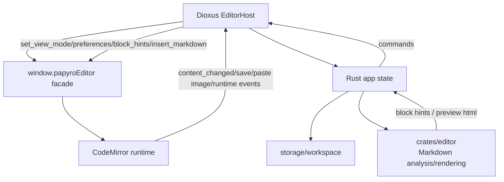
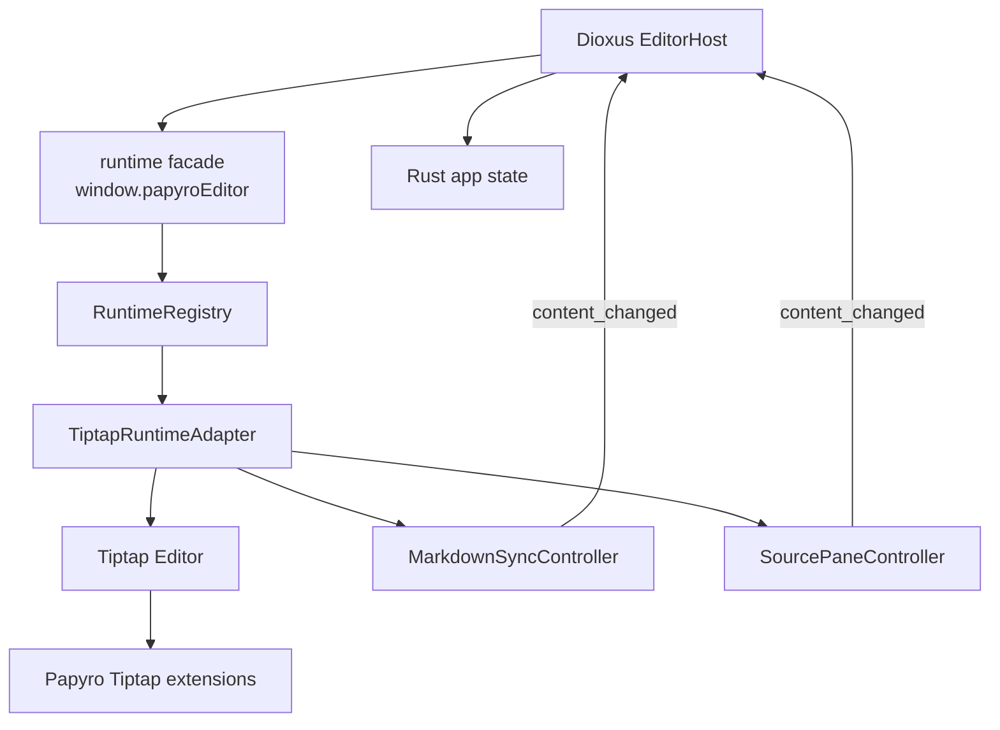

# Tiptap Migration Plan

[简体中文](zh-CN/tiptap-migration-plan.md) | [Roadmap](roadmap.md) | [Editor guide](editor.md)

The `feat-tiptap` branch is dedicated to replacing Papyro's interactive editor runtime with Tiptap. The goal is not a quick library swap. The goal is an enterprise-grade Markdown editing foundation that is reusable, resilient, and maintainable.

## Goals

- Keep local Markdown files as the only persisted content format.
- Keep Rust/Dioxus tab, dirty/save/conflict, workspace, and preview flows independent from the editor library.
- Use Tiptap/ProseMirror's document model for Hybrid editing instead of relying on fragile source decorations for cursor and selection behavior.
- Turn tables, task lists, math, Mermaid, images, and future block components into extensible node views or extensions.
- Preserve the user-facing Source, Hybrid, and Preview modes.

## Current Architecture Facts

The existing JS facade exposes:

- `ensureEditor({ tabId, containerId, instanceId, initialContent, viewMode })`
- `attachChannel(tabId, dioxus)`
- `handleRustMessage(tabId, message)`
- `attachPreviewScroll`
- `navigateOutline`
- `syncOutline`
- `scrollEditorToLine`
- `scrollPreviewToHeading`
- `renderPreviewMermaid`

The migration must preserve this facade first. Rust and Dioxus should not be rewritten just because the editor implementation changes.

## Official Capability Assessment

The current Tiptap documentation confirms three important capabilities:

- Tiptap supports Vanilla JavaScript and ES modules, so it can fit the existing `js/` esbuild pipeline through `@tiptap/core`, `@tiptap/pm`, and `@tiptap/starter-kit`.
- `@tiptap/markdown` provides Markdown to Tiptap JSON conversion and Tiptap JSON back to Markdown. It supports `editor.commands.setContent(markdown, { contentType: "markdown" })`, `editor.commands.insertContent(markdown, { contentType: "markdown" })`, and `editor.getMarkdown()`.
- JavaScript node views can separate in-editor UI from serialized output and can use editable `contentDOM` or non-editable islands.

References:

- [Tiptap Vanilla JavaScript install](https://tiptap.dev/docs/editor/getting-started/install/cdn)
- [Tiptap Markdown basic usage](https://tiptap.dev/docs/editor/markdown/getting-started/basic-usage)
- [Tiptap Markdown introduction](https://tiptap.dev/docs/editor/markdown)
- [Tiptap JavaScript node views](https://tiptap.dev/docs/editor/extensions/custom-extensions/node-views/javascript)
- [Tiptap Notion-like editor template](https://tiptap.dev/docs/ui-components/templates/notion-like-editor)

## Notion-Like Interaction Reference

The official Tiptap Notion-like template is a strong product reference for Papyro's future Hybrid editor. It demonstrates a block-based writing surface with slash commands, context-aware floating formatting, block drag and drop, responsive toolbars, dark/light theming, rich block insertion, link management, and undo/redo.

Papyro should borrow the interaction model, not the full product dependency stack. The template requires a Start plan for production, is delivered as a React UI Components template, and includes cloud-oriented collaboration, AI, JWT, and upload service assumptions. Papyro remains a local-first Markdown app, so the migration should rebuild the relevant interaction patterns with vanilla Tiptap modules, local Markdown persistence, existing Dioxus chrome, and Papyro design tokens.

Product targets inspired by the template:

- **Slash command menu**: quick insert for headings, lists, tasks, tables, code, math, Mermaid, images, and future callouts.
- **Floating toolbar**: compact contextual formatting for selected text, using Papyro primitives instead of browser-native controls.
- **Block handle affordance**: optional block move/duplicate/delete controls after Markdown round-trip is stable.
- **Responsive editor chrome**: adaptive toolbars that keep narrow windows usable without hiding core writing actions.
- **Token-based styling**: `.mn-tiptap-*` classes should map to the existing theme system instead of importing template CSS wholesale.

Implementation rules for this reference:

- Start with headless command controllers before drawing menus. The same command model must power slash search, toolbar buttons, keyboard shortcuts, and tests.
- Use simple Markdown insertion for blocks that are not yet native Tiptap nodes, such as tables, math, and Mermaid. Upgrade each block later through a tested extension.
- Keep all Notion-like UI pieces optional and local. Collaboration, AI, comments, uploads, and JWT flows are out of scope for the migration branch unless a separate product decision adds them.
- Keep command labels and groups stable enough for i18n and future Dioxus chrome integration.

## Engineering Standards

- **Stable facade**: Rust depends only on `window.papyroEditor`, not on Tiptap internals.
- **Adapter isolation**: `CodeMirrorAdapter` and `TiptapAdapter` can coexist during migration, but product code calls one runtime adapter contract.
- **Markdown round-trip first**: every extension must define Markdown input, editor JSON, and Markdown output behavior.
- **Graceful failure**: parse failures, missing handlers, and node view errors must fall back to editable Source content.
- **Tests before feature migration**: each block migration gets fixtures or JS unit tests before it is considered complete.
- **Generated assets stay synchronized**: `assets/editor.js` and desktop/mobile copies must be committed with source changes.
- **Budgets stay enforced**: bundle generation, file line budget, primitive usage, a11y, contrast, token audit, and Rust checks remain mandatory.
- **Reusable extension system**: tables, math, Mermaid, images, and callouts should live in focused extension/adapter modules.
- **IME and undo cannot regress**: IME, paste, undo/redo, selection, and keyboard navigation are acceptance criteria.
- **Enterprise code quality**: generated implementation code must be reusable, iterative, robust, tested at the contract level, and safe to evolve without creating a second monolithic editor runtime.

## Target Architecture

## Phased Work

### 0. Branch And Plan

- [x] Create the `feat-tiptap` branch.
- [x] Document migration goals, risks, and acceptance criteria.
- [x] Commit and push the planning update.

### 1. Runtime Boundary

- [x] Extract the first runtime adapter facade contract and tests.
- [x] Add a runtime registry module for tab entry lifecycle management.
- [x] Wrap the current CodeMirror runtime in an injectable runtime factory.
- [ ] Split the current `js/src/editor.js` facade into smaller runtime modules.
- [ ] Define an `EditorRuntimeAdapter` contract: `mount`, `attachChannel`, `handleMessage`, `setViewMode`, `destroy`, and `getMarkdown`.
- [ ] Keep the CodeMirror adapter as the default implementation with no behavior change.
- [ ] Add adapter contract tests.

### 2. Tiptap Foundation

- [x] Install `@tiptap/core`, `@tiptap/pm`, `@tiptap/starter-kit`, and `@tiptap/markdown`.
- [x] Add `TiptapRuntimeAdapter` for paragraphs, headings, lists, blockquotes, code blocks, links, bold, italic, inline code, and strike.
- [x] Enable the adapter behind a feature flag or runtime selector.
- [x] Add Markdown parse/serialize fixtures for English, Chinese, headings, lists, links, and code.

### 3. Source, Hybrid, And Preview

- [ ] Hybrid uses Tiptap rich-text editing.
- [ ] Hybrid interaction design references the official Notion-like template while staying local-first, Markdown-first, and Papyro-token based.
- [x] Add a Tiptap mode controller that normalizes Source, Hybrid, and Preview and keeps non-Hybrid modes non-editable in the rich-text editor.
- [x] Add a reusable Tiptap slash command controller for headings, lists, quotes, code, dividers, tables, math, and Mermaid.
- [x] Add a Papyro slash command menu controller with keyboard navigation and token-based styling for common Markdown block insertion.
- [x] Add a Papyro floating formatting toolbar controller for selected text and common inline marks.
- [x] Add a Papyro block handle controller as the hover entry point for future block actions.
- [x] Add the first Papyro block action menu controller for basic insert, transform, and delete actions.
- [ ] Add reusable UI primitives for Tiptap dropdowns, popovers, responsive toolbars, and advanced block action menus before wiring advanced blocks.
- [ ] Source uses a source editor pane synchronized through `MarkdownSyncController`.
- [x] Add `MarkdownSyncController` as the canonical Markdown state boundary for Tiptap runtime updates.
- [ ] Preview remains Rust-rendered HTML.
- [ ] Mode switching preserves selection, dirty state, and scroll snapshots.
- [ ] Outline clicks work in Source and Hybrid.

### 4. Rust/JS Protocol Compatibility

- [ ] Preserve `content_changed`, `save_requested`, `paste_image_requested`, `runtime_ready`, and `runtime_error`.
- [ ] Preserve `insert_markdown` and `set_view_mode`.
- [x] Preserve `destroy` semantics, including stale host instance protection.
- [x] Preserve `set_preferences` state updates through a Tiptap preferences controller.
- [x] Treat `set_block_hints` as a compatibility message through a Tiptap block hints controller.
- [x] Preserve `auto_link_paste` for selected-text URL paste through a Tiptap paste controller.

### 5. Markdown Block Migration

- [ ] Task list round-trips `- [ ]` and `- [x]`.
- [ ] Pipe tables become editable tables with row/column operations and cell navigation.
- [ ] Inline and display math support edit, preview, and error states.
- [ ] Mermaid supports source editing and rendered preview.
- [ ] Images preserve local image URLs, paste image requests, and Markdown image syntax.
- [ ] Code blocks preserve language metadata and highlighting strategy.

### 6. Remove CodeMirror

- [ ] Replace CodeMirror runtime entry points and tests.
- [ ] Remove CodeMirror npm dependencies and `codemirror-lang-mermaid`.
- [ ] Clean `.cm-*` CSS in favor of `.mn-editor-*` and `.mn-tiptap-*` semantic classes.
- [ ] Confirm generated bundles and file line budgets pass.

### 7. Acceptance

- [ ] `npm --prefix js run build`
- [ ] `npm --prefix js test`
- [ ] `cargo fmt --check`
- [ ] `cargo clippy --workspace --all-targets --all-features -- -D warnings`
- [ ] `cargo test --workspace`
- [ ] `node scripts/check-ui-primitives.js`
- [ ] `node scripts/check-ui-a11y.js`
- [ ] `node scripts/check-ui-contrast.js`
- [ ] `node scripts/report-file-lines.js`
- [ ] `git diff --check`
- [ ] Manual smoke: Source/Hybrid/Preview, Chinese IME, paste, undo, tables, math, Mermaid, images, outline, failed saves, and OS-opened Markdown files.

## Risks

| Risk | Mitigation |
| --- | --- |
| `@tiptap/markdown` is still beta and may have Markdown edge cases | Lock Papyro fixtures, add custom handlers for complex syntax, and fall back to Source on failures |
| Source mode may not preserve every formatting detail | Prefer semantic Markdown stability; document known limitations; keep source-block strategies where exact text matters |
| Extension sprawl increases bundle size | Use focused modules and keep bundle/file budgets active |
| Node views drift away from Papyro tokens | Use `mn-tiptap-*` classes and existing Markdown tokens |
| Rust block hints duplicate Tiptap's document model | Keep protocol compatibility during migration; eventually let Tiptap own interactive block state |
| Multi-window tab lifecycle leaks editor instances | Add registry destroy/recycle tests and release DOM listeners on close |

## Definition Of Done

- `js/package.json` no longer depends on CodeMirror.
- `window.papyroEditor` still serves the existing Rust/Dioxus protocol.
- Source, Hybrid, and Preview support everyday Markdown writing.
- Markdown round-trip tests cover headings, paragraphs, lists, tasks, links, inline code, code blocks, tables, math, Mermaid, and images.
- Tables, math, Mermaid, and images are testable extensions or adapter modules, not one-off DOM hacks.
- Generated bundles, desktop/mobile assets, Rust checks, JS tests, and UI checks all pass.
