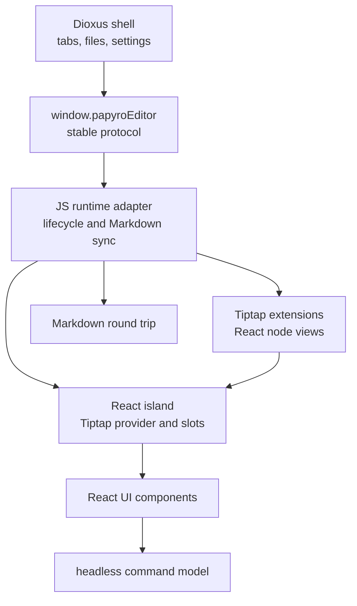

# Tiptap Official React Strategy

[简体中文](zh-CN/tiptap-official-react-strategy.md) | [Tiptap React runtime plan](tiptap-react-runtime-plan.md) | [Enterprise editor TODO](tiptap-enterprise-editor-todo.md) | [Roadmap](roadmap.md)

This document records the official-first strategy for the `feat-tiptap` editor work. It exists because Papyro should stop growing one-off DOM overlays and move toward the same React/Tiptap composition model used by the official Tiptap examples.

## Decision

Papyro keeps the Rust/Dioxus shell, local Markdown storage, and `window.papyroEditor` facade. The rich editor surface moves behind a React island that uses official Tiptap 3 React APIs and legally reusable Tiptap UI code.

The target shape is:

React is not a second app shell. It is the editor UI runtime. Dioxus remains the product shell.

## Official Sources Checked

Before this decision, the local official sources were refreshed and reviewed:

- `E:\tiptap\packages\react\src\Tiptap.tsx`
- `E:\tiptap\packages\extension-drag-handle-react`
- `E:\tiptap\packages\extension-table`
- `.reference/tiptap-docs/src/content/guides/react-composable-api.mdx`
- `.reference/tiptap-docs/src/content/editor/getting-started/install/react.mdx`
- `.reference/tiptap-docs/src/content/ui-components/templates/notion-like-editor.mdx`
- `.reference/tiptap-docs/src/content/ui-components/node-components/table-node.mdx`
- `.reference/tiptap-ui-components/README.md`

The current installed Tiptap packages in `js/package.json` are pinned to the same `3.22.5` version, which matches Tiptap's package-version consistency rule.

## License Boundary

Use this table before copying or adapting any Tiptap UI code:

| Source | Status | Papyro action |
| --- | --- | --- |
| `@tiptap/*` core packages | Open-source package dependencies | Use directly when all package versions stay aligned. |
| Public `ueberdosis/tiptap-ui-components` repository | MIT-licensed components and simple editor template | Copy-own-adapt into Papyro React components when useful, preserving license attribution if source is copied. |
| Official Notion-like editor template | Requires Tiptap Start plan for production | Use as UX benchmark only unless licensed source is generated for this project. |
| `table-node`, `drag-context-menu`, `slash-dropdown-menu` docs components | Marked non-free / non-open in official docs | Do not copy source without an active license path. Re-create behavior with Papyro code or integrate licensed CLI output. |
| Tiptap Cloud collaboration, AI, comments, conversion | Cloud or paid features depending on capability | Keep out of the local-first editor unless the product explicitly adopts those services. |

If licensed Tiptap CLI output is later added, commit it as third-party source with a clear attribution note and keep local customizations isolated.

## Architecture Rules

- `js/src/tiptap-runtime.js` owns editor lifecycle, Rust message routing, Markdown sync, and controller attachment.
- `js/src/tiptap-react/` owns React composition: provider, slots, shared hooks, editor UI components, and future React node views.
- `js/src/tiptap-react-island.jsx` is only a compatibility shim. New imports should use `js/src/tiptap-react/index.js`.
- Existing DOM controllers under `js/src/tiptap-*.js` are migration candidates, not the final pattern for advanced chrome.
- Commands must be headless data plus execution callbacks, so slash menus, block handles, toolbar buttons, keyboard paths, and tests share one source of truth.
- React components should use Papyro design tokens and small focused modules. Avoid one giant `NotionEditor.jsx`.

## Migration Path

1. Keep the React island mount lifecycle stable and tested.
2. Move insertion and block action panels into React components backed by the existing headless command definitions.
3. Replace block handle behavior with official `@tiptap/extension-drag-handle-react` and `@tiptap/extension-node-range` where the Markdown-first model allows it.
4. Rebuild floating formatting as React menus using Tiptap state selectors instead of DOM polling.
5. Rework table chrome around `@tiptap/extension-table` and React overlays. If the official `table-node` component is licensed, prefer integrating that source over rebuilding the same advanced handles by hand.
6. Convert code block, image, callout, math, Mermaid, and table surfaces into React node views only when they improve maintainability or user experience.
7. Delete obsolete DOM controllers and CSS after each surface is migrated and covered by tests.

## Quality Bar

A Papyro Tiptap feature is not complete until:

- Source, Hybrid, and Preview still round-trip Markdown safely.
- Chinese and English labels are provided.
- Pointer, keyboard, focus, and outside-dismiss behavior are tested.
- WebView focus races are handled deliberately.
- Generated `assets/editor.js` copies are rebuilt and committed.
- The implementation uses official APIs or documented local abstractions rather than direct DOM guesswork.
