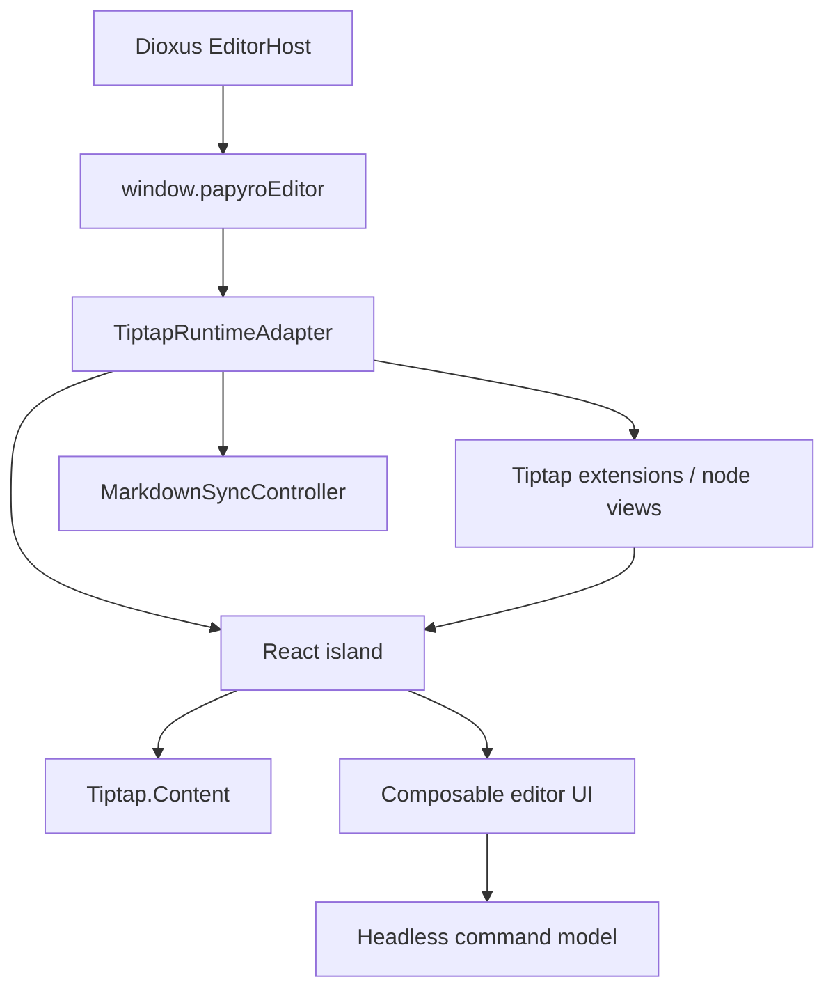

# Tiptap React Runtime Plan

[简体中文](zh-CN/tiptap-react-runtime-plan.md) | [Tiptap migration plan](tiptap-migration-plan.md) | [Roadmap](roadmap.md)

This document records the next architecture step for Papyro's Tiptap editor. The current migration branch already runs on Tiptap, but too much advanced editor chrome was built as hand-written DOM controllers. The next step is to align the editor UI with official Tiptap React practices while preserving Papyro's Rust/Dioxus shell and local Markdown model.

## Decision

Papyro will use a React island inside the existing Dioxus desktop app for the editor surface.

The Rust and Dioxus app still owns workspaces, tabs, file safety, settings, preview rendering, and window chrome. The JS runtime still exposes `window.papyroEditor` to Dioxus. React owns the composable Tiptap UI layer: editor content, command panels, drag handles, floating menus, React node views, table chrome, and future Notion-like interactions.



## Official Basis

The local Tiptap docs and source were checked before this design:

- `tiptap-docs/src/content/guides/react-composable-api.mdx`
- `tiptap-docs/src/content/editor/getting-started/install/react.mdx`
- `tiptap-docs/src/content/ui-components/templates/notion-like-editor.mdx`
- `tiptap/packages/react/src/Tiptap.tsx`
- `tiptap/packages/react/src/EditorContent.tsx`
- `tiptap/packages/extension-drag-handle-react/src/DragHandle.tsx`
- `tiptap/packages/extension-node-range/src/node-range.ts`
- `tiptap/packages/extension-table/src/kit/index.ts`

The React composable API gives the editor a provider, `Tiptap.Content`, and context hooks. `EditorContent` expects the editor view to exist before it moves the ProseMirror DOM into React. Papyro therefore creates a hidden seed element for the Tiptap editor constructor, then lets `Tiptap.Content` take ownership of the content DOM.

The official Notion-like editor template remains a product and interaction reference. It requires a Tiptap Start plan for production use, so Papyro must not copy private template source into this repository. We can adopt the public, open-source Tiptap 3 packages and re-create relevant local-first Markdown interactions with Papyro code.

## Runtime Boundary

`js/src/tiptap-runtime.js` accepts a `mountControllerFactory`. The default controller still supports legacy direct mounting, but the desktop entry now injects `createTiptapReactMountController`.

The mount controller owns only mounting lifecycle:

- create the seed element used by `new Editor({ element })`
- mount React into the runtime root
- refresh the React island when a tab host is reused
- destroy React before destroying the Tiptap editor

It must not own Markdown synchronization, Rust messages, tab lifecycle, or file state.

## React Island Contract

`js/src/tiptap-react-island.jsx` defines the first React boundary:

- `PapyroTiptapReactIsland`
- `PapyroTiptapEditorContent`
- `createPapyroTiptapReactComponents`
- `createTiptapReactMountController`

The island is intentionally slot-based:

| Slot | Purpose |
| --- | --- |
| `BeforeContent` | lightweight editor chrome that must render before the content DOM |
| `EditorContent` | the official `Tiptap.Content` mount point |
| `AfterContent` | panels that visually belong after the editor body |
| `OverlayLayer` | floating menus, drag handles, popovers, and future React table chrome |

This avoids a second monolithic editor runtime. New editor UI should enter through small React components, headless command controllers, and focused extensions rather than direct DOM mutation inside `tiptap-runtime.js`.

## Target React Structure

As the island grows, use this structure:

```text
js/src/tiptap-react/
  island.jsx              # root provider and slots
  hooks/
    use-editor-command.js # command execution and active state
    use-editor-locale.js  # i18n bridge
  commands/
    block-actions.js      # data model, not DOM
    insert-actions.js
    table-actions.js
  components/
    command-panel.jsx
    icon-button.jsx
    popover.jsx
    toolbar.jsx
  extensions/
    table-node-view.jsx
    code-block-view.jsx
    callout-view.jsx
  utils/
    floating.js
    keyboard.js
    selection.js
```

Rules:

- Components receive data and command callbacks. They do not parse Markdown or reach into Rust state.
- Hooks subscribe to specific editor state slices. Avoid re-rendering the whole island for every transaction.
- Command definitions are plain data plus execution functions. The same definitions should power slash menus, handles, keyboard shortcuts, and tests.
- Node views use Papyro tokens and serialize through tested Tiptap Markdown handlers.
- Old hand-written DOM controllers should be migrated one surface at a time, with tests kept green after each move.

## Migration Sequence

1. Keep the React mount foundation stable.
2. Move the slash/insert command panel to React using the existing headless command model.
3. Replace the block handle with official `@tiptap/extension-drag-handle-react` and `@tiptap/extension-node-range` where it fits Papyro's Markdown-first behavior.
4. Move floating inline formatting to React menu components.
5. Rework table chrome around Tiptap TableKit and React components instead of hand-positioned DOM strips.
6. Convert code block, callout, math, Mermaid, image, and table views into focused React node views where that improves maintainability.
7. Remove obsolete DOM-controller CSS and JS after each React replacement is complete.

## Quality Bar

Before calling the React migration complete:

- `window.papyroEditor` remains the only Dioxus-facing editor API.
- All direct `@tiptap/*` dependencies use the same version.
- Generated bundles are committed with JS source changes.
- JS tests cover mount lifecycle, Markdown round-trip, Rust message compatibility, IME guards, command execution, and overlay dismissal.
- React components are reusable and token-based, not one-off copies of the official template.
- Table and block interactions are validated against the official Notion-like UX benchmark.
- Manual release smoke covers Source, Hybrid, Preview, Chinese IME, paste, undo/redo, table editing, code block languages, math, Mermaid, images, outline, save failures, and OS-opened Markdown files.

