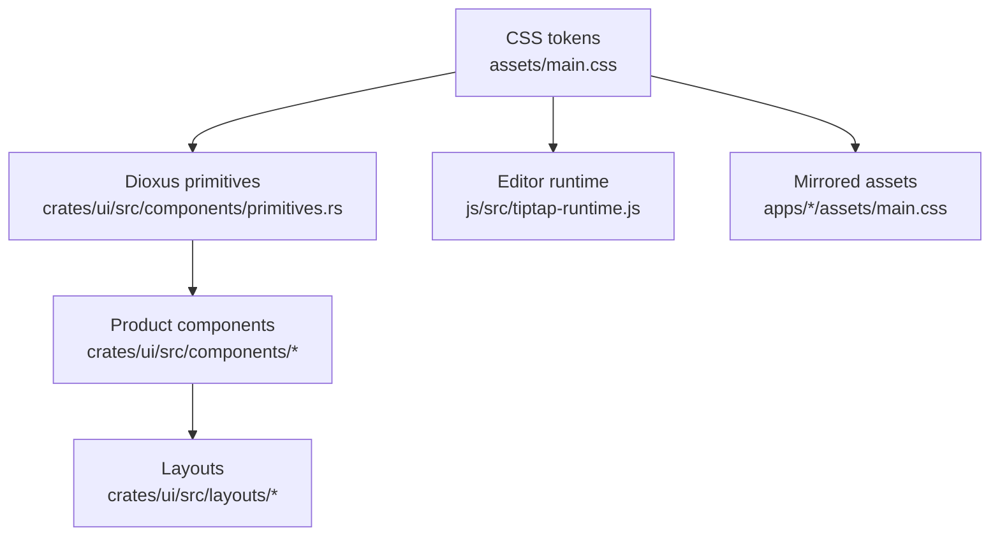

# UI Architecture And Component Inventory

[简体中文](zh-CN/ui-architecture.md) | [Documentation](README.md)

This document explains how Papyro UI should be organized during the Phase 3.5 redesign. It complements [UI/UX Benchmark And Redesign Decisions](ui-ux-benchmark.md), [Papyro UI Visual Brief](ui-visual-brief.md), [UI Information Architecture](ui-information-architecture.md), [UI Surface Audit](ui-surface-audit.md), and [Theme System](theme-system.md).

## Ownership Model

Rules:

- `assets/main.css` is the shared visual source; `assets/styles/markdown.css` keeps document surface, outline, Preview, and rendered Markdown styles out of the main chrome budget, while `assets/styles/tiptap-chrome.css` carries Tiptap command panels and editor-control chrome.
- `apps/desktop/assets/main.css` mirrors the desktop runtime copy; `apps/mobile/assets/main.css` owns mobile shell layout and mobile token bridges.
- Desktop and mobile runtime copies of `assets/styles/markdown.css` and `assets/styles/tiptap-chrome.css` must stay synchronized whenever shared editor CSS changes.
- `crates/ui/src/components/primitives.rs` owns reusable Dioxus controls and re-exports focused primitive submodules such as `primitives/buttons.rs`, `primitives/empty.rs`, `primitives/feedback.rs`, `primitives/forms.rs`, `primitives/layout.rs`, `primitives/navigation.rs`, `primitives/overlays.rs`, `primitives/results.rs`, `primitives/settings.rs`, and `primitives/tabs.rs`.
- Product components compose primitives and should avoid inventing control behavior.
- Layout modules arrange product regions; they should not own button, menu, or field styling.
- Tiptap runtime modules and node views consume the same CSS tokens through semantic `.mn-tiptap-*` and `.mn-editor-*` classes.
- Desktop shell chrome is platform-aware through `crates/ui/src/desktop_chrome.rs`: macOS uses native window controls and `.mn-platform-macos`, while Windows and Linux keep Papyro's custom controls and `.mn-custom-window-controls`.

## Component Placement Rules

Use the smallest owner that can express the behavior without leaking product-specific state:

| Need | Put It In | Rule |
| --- | --- | --- |
| Reusable control behavior | `crates/ui/src/components/primitives.rs` and `crates/ui/src/components/primitives/*` | Use when the component owns visual states, keyboard/focus behavior, ARIA shape, sizing, or shared slots. Keep tests or large component families in submodules once the main file grows. |
| A product surface made from primitives | `crates/ui/src/components/<surface>/` | Use when labels, app commands, view-model data, or product-specific callbacks are involved. |
| Page or window arrangement | `crates/ui/src/layouts/` | Use only for region placement, split panes, rails, scroll containers, and responsive overflow rules. |
| Markdown editor runtime behavior | `js/src/tiptap-*.js`, `js/src/tiptap-react/`, `js/src/editor-host-runtime.js`, `js/src/editor-runtime-bootstrap.js` | Use only when Tiptap, editor hit-testing, Markdown sync, React editor chrome, or JS host lifecycle owns the behavior. Keep Rust as the source of app state truth. |
| Shared visual language | `assets/main.css` | Define tokens and primitive classes here, then mirror the CSS into app asset directories. |

Do not create a new product-level class for a button, menu item, text field, select, switch, tab, tooltip, dialog header, result row, tree row, or empty state until the existing primitive family has been checked. If a primitive is missing a variant, extend the primitive first unless the product surface has a one-off layout need.

## Dioxus Component Contract

New or changed Dioxus UI components should follow these rules:

- Use Dioxus 0.7 component functions with owned props that implement `Clone + PartialEq`.
- Prefer explicit props for semantic state: `selected`, `disabled`, `danger`, `loading`, `compact`, `checked`, `current`, and `expanded` are better than ad hoc class strings.
- Compose primitive state classes through the shared internal `PrimitiveState` and `ClassBuilder` helpers instead of hand-assembling repeated `active`, `open`, `disabled`, `danger`, `editing`, `dragging`, `drop-target`, `expanded`, `onboarding`, `resizing`, and extension class order in each primitive family.
- Keep event boundaries clear. Row actions should not trigger row selection, context-menu targets should not trigger file open, and modal close controls should not depend on parent DOM details.
- Add ARIA at the primitive level when the role is generic. Product components should only supply user-facing labels and IDs.
- Keep labels internationalized in product components. Primitives may accept label strings, but should not own English or Chinese product copy.
- Avoid blocking work, filesystem access, or large clones in render paths.
- Prefer visible focus states over mouse-only affordances. Keyboard users must be able to reach the same action surface.

## Token Naming Rules

Token names should describe meaning rather than a single color or screen:

| Layer | Prefix | Examples | Use |
| --- | --- | --- | --- |
| Palette | `--mn-bg`, `--mn-surface`, `--mn-ink`, `--mn-accent` | `--mn-surface`, `--mn-ink-muted` | Theme building blocks. |
| Semantic surface | `--mn-chrome-*`, `--mn-editor-*`, `--mn-markdown-*` | `--mn-chrome-border`, `--mn-editor-canvas` | App regions and writing surfaces. |
| Interaction | `--mn-focus-*`, `--mn-selection-*`, `--mn-status-*` | `--mn-focus-ring`, `--mn-selection-bg` | Shared state feedback. |
| Component | `--mn-<component>-*` | `--mn-tabbar-min-height`, `--mn-button-pad` | Only when a primitive needs a stable sizing or state contract. |
| Primitive state | `--mn-primitive-*` | `--mn-primitive-hover-bg`, `--mn-primitive-active-ink`, `--mn-primitive-disabled-opacity` | Local contracts for repeated primitive hover, active, focus, disabled, and destructive feedback. Define them on the primitive selector, then consume them in state selectors. |

Avoid names tied to temporary screens such as `--mn-settings-blue` or `--mn-sidebar-new-bg`. Use role-based names so the same token can survive future layout changes.

## One-Off CSS Policy

One-off CSS is allowed only when it is product layout glue. It must not replace a primitive state or visual contract.

Allowed:

- region sizing, split-pane tracks, sticky zones, and scroll containers
- surface-specific content layout, such as settings sections or compare panels
- migration classes recorded in this document, the roadmap, or a follow-up primitive task

Not allowed:

- new button, input, select, tab, menu, tooltip, dialog, empty-state, skeleton, or result-row styling outside the primitive family
- raw colors in component CSS unless the selector is a palette/theme declaration
- hover/focus/active/disabled states that exist only for one screen
- light-mode-only selectors
- nested card shells used to fake hierarchy
- CSS that requires generated desktop/mobile copies to drift from `assets/main.css`

If a one-off rule starts gaining a second use, promote it to a primitive or product pattern before adding the second copy.

## Validation Matrix

Run the narrowest checks that cover the changed layer:

| Change | Required Checks |
| --- | --- |
| Rust UI component | `cargo fmt --check`; `cargo clippy -p papyro-ui --all-targets --all-features -- -D warnings`; `cargo test -p papyro-ui`; `node scripts/check-ui-a11y.js` |
| CSS or tokens | UI component checks; `node scripts/check-ui-contrast.js`; `node scripts/report-ui-tokens.js`; `node scripts/report-file-lines.js`; confirm mirrored CSS files match |
| Editor JS UI behavior | `npm --prefix js run build`; `npm --prefix js test`; commit generated bundles |
| Documentation-only UI rules | `git diff --check`; update matching English and Chinese docs; update roadmap status when a roadmap task is completed |

## Current Component Inventory

| Area | Current Components | Notes |
| --- | --- | --- |
| Primitives | `Button`, `ActionButton`, `RowActionButton`, `IconButton`, `EditorToolButton`, `EditorTabScrollButton`, `Select`, `Dropdown`, `SegmentedControl`, `Tabs`, `DocumentTab`, `Modal`, `ModalHeader`, `ModalCloseButton`, `Menu`, `ContextMenu`, `MenuItem`, `Tooltip`, `Message`, `StatusStrip`, `StatusMessage`, `StatusIndicator`, `FormField`, `Switch`, `Toggle`, `Slider`, `TextInput`, `ColorInput`, `ResultList`, `ResultRow`, `RowActions`, `ModalFooterMeta`, `ComparePanel`, `SkeletonRows`, `ErrorState`, `SettingsLayout`, `SettingsNav`, `SettingsRow`, `SettingsInlineRow`, `SidebarItem`, `SidebarSearchButton`, `OutlineItemButton`, `DialogSection`, `TreeItemButton`, `TreeItemEditRow`, `TreeRenameInput`, `EmptyState`, `EmptyStateSurface`, `EmptyStateCopy`, `EmptyRecentItem` | Good foundation; button, empty, feedback, form, layout, navigation, overlay, result, settings, and tabs component families now live in focused submodules. Repeated primitive state class names now flow through `PrimitiveState` plus `ClassBuilder`; the system still needs richer variants, keyboard behavior, and docs. |
| App chrome | `AppShell`, `Workbench`, `MainColumn`, `ResizeRail`, `Sidebar`, `TreeSortControl`, `FileTree`, `AppHeader`, `StatusBar`, `DesktopLayout`, `MobileLayout` | Desktop and mobile shells now share `AppShell` and `Workbench`, `Workbench` and `MainColumn` carry the shared split-pane contract, the sidebar resize affordance uses `ResizeRail`, file-tree rows use `TreeItem` primitives, workspace root rows use `SidebarItem`, sidebar search uses `SidebarSearchButton`, sidebar create/footer actions use button primitives, desktop/mobile file sort controls share `TreeSortControl`, and the tree sort control composes `SegmentedControl`; remaining tab chrome still needs broader primitive coverage. |
| Editor | `EditorPane`, `EditorChrome`, `EditorTabButton`, `OutlinePane`, `PreviewPane`, `EditorHost`, `FallbackEditor` | Editor chrome now composes `SegmentedControl` for view mode switching, `EditorTabScrollButton` for tab overflow controls, `DocumentTab` for open document tabs, and `OutlineItemButton` for outline navigation rows. Tab scroll buttons share the editor tool button state contract instead of carrying one-off hover and focus rules. It still needs shared Markdown visual tokens. |
| Modal surfaces | `SettingsModal`, `QuickOpenModal`, `CommandPaletteModal`, `SearchModal`, `TrashModal`, `RecoveryDraftsModal`, `RecoveryDraftCompareModal` | Should share dialog shells, result rows, empty states, loading states, and keyboard focus behavior. |
| Settings | `SettingsSurface`, `TagManagementSection`, `TagEditorRow`, `AboutMetaItem` | Settings now composes shared navigation, panel, row, inline-row, and section primitives from `primitives/settings.rs`; tag management still needs richer validation and helper states. |
| Search/commands | `ResultList`, `ResultRow`, `RowActions`, `CommandPaletteRow`, `QuickOpenRow`, `SearchResultRow`, `HighlightedText` | Command, quick-open, search, trash, and recovery surfaces now share list shells, row shells, and action slots from `primitives/results.rs`; next work should add icons, shortcuts, richer metadata, and grouped states. |
| Recovery/trash | `RecoveryDraftRow`, `ComparePanel`, `TrashNoteRow` | Recovery and trash list rows use `ResultRow`, recovery comparisons use `ComparePanel`, and trash footer metadata uses `ModalFooterMeta` from `primitives/results.rs`; conflict/error states still need dedicated data-safety patterns. |

## Target Primitive Set

| Primitive | Status | Required Work |
| --- | --- | --- |
| `Button` / `ActionButton` / `RowActionButton` | Partial | `primitives/buttons.rs` owns ordinary buttons, icon+text action buttons, loading/disabled state, and result-row-safe action buttons. Button hover, disabled, focus, active, and destructive feedback now flows through local `--mn-primitive-*` state variables. Next work should add size variants and migrate remaining raw button markup with special `title`, `aria`, or keyboard contracts. |
| `IconButton` | Partial | `primitives/buttons.rs` owns selected, disabled, destructive, custom class, and icon-class states, and now covers app-header and sidebar brand icon buttons. Icon button active, disabled, focus, and destructive feedback now flows through local `--mn-primitive-*` state variables. Next work should add compact size variants and tooltip placement. |
| `Input` / `TextInput` / `ColorInput` | Partial | `primitives/forms.rs` owns `TextInput` for command/search/quick-open fields plus ordinary sidebar, mobile, and settings tag text fields; it also owns `ColorInput` for native color inputs used by tag management. Next work should add label, error, disabled, and inline action support. |
| `Select` | Exists | `primitives/forms.rs` owns the current select/dropdown shell. Add keyboard navigation, option groups when needed, and size variants. |
| `SegmentedControl` | Exists | `primitives/forms.rs` owns small enumerations such as theme, view mode, and file-tree sorting, including disabled state and optional per-option classes for compact product surfaces. Add per-option disabled states if needed. |
| `Switch` | Partial | `primitives/forms.rs` owns the preferred boolean control; `Toggle` remains as a compatibility wrapper. Next work should add disabled and helper/error states. |
| `Dialog` / `Modal` | Partial | `primitives/overlays.rs` owns `Modal`, `ModalHeader`, and `ModalCloseButton` for repeated modal title/close controls, and `DialogSection` covers repeated settings sections; the modal shell still needs stable dimensions and focus management. |
| `Popover` | Missing | Needed for insert menu, compact settings hints, and editor affordances. |
| `DropdownMenu` | Partial through `Menu` | `primitives/overlays.rs` owns the menu shell and menu items. Add trigger, alignment, keyboard handling, separators, icons, and shortcuts. |
| `ContextMenu` | Exists | `primitives/overlays.rs` owns the context-menu shell; share item model with dropdown menu. |
| `Tooltip` | Exists | `primitives/overlays.rs` owns the current CSS tooltip. Add placement and delay policy if CSS-only tooltip becomes insufficient. |
| `Toast` / `Message` / `StatusStrip` | Partial | `primitives/feedback.rs` owns `Message`, `InlineAlert`, `SkeletonRows`, `ErrorState`, `StatusStrip`, `StatusMessage`, and `StatusIndicator`; transient toast still needs a separate primitive. |
| `Tabs` / `DocumentTab` | Exists | `primitives/tabs.rs` owns generic tabs and the document tab row shell, including title, save marker slot, close metadata, and keyboard close behavior. Product code still owns tab commands and save-state copy. |
| `SidebarItem` / `SidebarSearchButton` | Partial | `primitives/navigation.rs` owns workspace root rows through `SidebarItem` and the sidebar search trigger through `SidebarSearchButton`; future navigation rows still need adoption. |
| `OutlineItemButton` | Partial | `primitives/navigation.rs` owns outline navigation row shape, heading level class, line metadata, and tab metadata; active/current state still comes from the editor outline sync script. |
| `TreeItem` / `TreeRenameInput` | Partial | `primitives/navigation.rs` owns `TreeItemButton`, `TreeItemEditRow`, `TreeItemLabel`, and `TreeRenameInput` for file/folder icons, expand state, selected/editing/drag/drop classes, row label layout, and inline rename input shape; keyboard model and context-menu scoping remain in file-tree code. |
| `Toolbar` / `ToolbarZone` / `ResizeRail` | Partial | `primitives/layout.rs` owns `AppShell`, `Workbench`, `MainColumn`, `EditorToolbar`, `ToolbarZone`, `EditorToolButton`, `EditorTabScrollButton`, `ResizeRail`, `ScrollContainer`, and `InlineOverflow` for the shared shell, split panes, sticky editor toolbar, fixed/flexible toolbar zones, settings content scrolling, resizable rails, and tab overflow. More scroll containers still need broader adoption. |
| `EmptyState` | Partial | `primitives/empty.rs` owns `EmptyStateSurface`, `EmptyStateCopy`, `EmptyState`, and `EmptyRecentItem` for generic empty shells, copy, onboarding layout, and recent-workspace entry rows; add compact, error, and richer action variants. |
| `SkeletonRows` | Partial | Workspace search loading now uses reusable skeleton rows; workspace load and future async windows still need adoption. |
| `InlineAlert` / `ErrorState` | Partial | `primitives/feedback.rs` owns preview notices, command/search empty states, loading skeletons, status indicators, and editor runtime failures; larger blocking failures should reuse this family. |
| `SettingsLayout` / `SettingsRow` / `SettingsInlineRow` | Partial | `primitives/settings.rs` owns settings navigation, panels, sections, rows, and inline control rows; helper text, errors, and richer form states still need broader use. |

## Product Patterns

Build these patterns from primitives before redesigning more screens:

| Pattern | Used By | Contract |
| --- | --- | --- |
| `SettingsRow` | Settings, future preferences windows | One-column label, optional description, control, and future helper/error slots. |
| `SettingsInlineRow` | Settings tag management, compact form rows | Inline controls with stable create/edit grid contracts and narrow-width migration path. |
| `ResultList` / `ResultRow` | Search, quick open, command palette, trash, recovery | Accessible result list shell plus row icon, primary text, secondary text, metadata, highlight, and keyboard-current state. |
| `RowActions` / `RowActionButton` | Result rows, destructive management rows | Right-aligned row actions with shared spacing, optional wrapping, and scoped click handling. |
| `ModalFooterMeta` | Trash, recovery, destructive dialogs | Leading footer metadata that truncates safely before action buttons. |
| `ComparePanel` | Recovery comparisons, future conflicts | Title, metadata, optional error, scrollable preformatted content, and stable side-by-side sizing. |
| `SkeletonRows` | Search, workspace loading, async windows | Accessible loading rows with stable height, restrained motion, and no layout jump when results arrive. |
| `ErrorState` | Editor runtime, workspace load, blocking failures | Title, user-facing message, optional technical detail, and alert role for non-recoverable inline failures. |
| `TreeRow` | File tree | Indent, disclosure, file/folder icon, selected/editing/drag/drop state, context menu, keyboard target. |
| `ToolbarZone` | Editor chrome, app header | Fixed width or flexible zone with explicit overflow behavior. |
| `ModalHeader` / `DialogSection` | Settings, recovery, trash | Modal title/close controls plus section heading, body, optional footer, and stable spacing. |
| `InlineStatus` / `StatusStrip` | Save state, preview policy, errors, footer status | Tone, icon/text, compact layout, accessible role. |

## CSS Token Rules

Use these token layers:

- Palette tokens: `--mn-bg`, `--mn-surface`, `--mn-ink`, `--mn-accent`.
- Semantic tokens: `--mn-chrome-*`, `--mn-editor-*`, `--mn-markdown-*`, `--mn-code-*`, `--mn-selection-*`, `--mn-status-*`.
- Component tokens: only when a primitive needs a stable contract such as `--mn-button-pad` or `--mn-tabbar-min-height`.

Forbidden in broad UI work:

- raw hex colors inside component CSS, except palette/theme declarations
- one-off spacing that duplicates an existing token
- component styles that only work in light mode
- nested card styling for page sections
- new class names that bypass an existing primitive

Acceptable one-off CSS:

- layout glue for a single product surface
- a temporary migration class listed in this document or the roadmap
- a visual rule that is impossible to express through an existing primitive, followed by a primitive proposal

## Migration Order

1. **Settings rows:** continue building on `SettingsRow`, `SettingsInlineRow`, `DialogSection`, `SettingsNav`, `Switch`, `Select`, and `SegmentedControl`; next work should add helper/error slots and validation states.
2. **Result rows:** align command palette, quick open, and search result rows.
3. **Tree rows:** continue building on `TreeItemButton` and `TreeItemEditRow`; next work should add focus/current variants and share scoped menu item models.
4. **Editor chrome:** continue building on `EditorToolbar` and `ToolbarZone` for tab overflow, mode switch, outline action, and future overflow menu rules.
5. **Empty/loading/error:** extend `InlineAlert`, `SkeletonRows`, and `ErrorState` across remaining async and blocking surfaces.
6. **Markdown surfaces:** apply shared Markdown tokens only after Hybrid selection and hit testing are stable.

## Review Checklist

Before merging a UI change:

- Does it use existing primitives first?
- Are light, dark, and high-contrast states covered?
- Is keyboard focus visible and reachable?
- Does narrow width keep primary actions reachable?
- Are generated CSS mirrors synchronized?
- Does the change update relevant docs when it changes component rules?
- Is the commit scoped to one surface or one primitive family?
