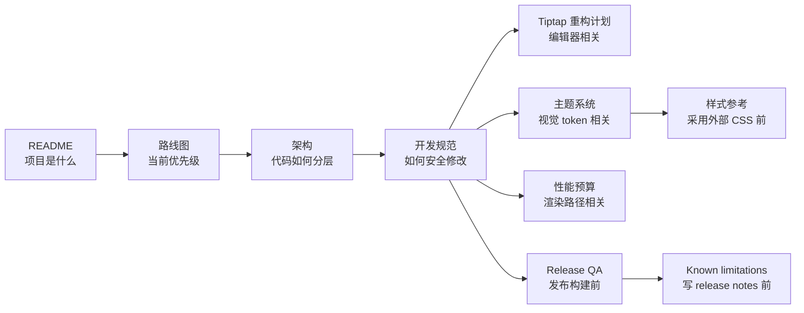

# Papyro 文档

[English](../README.md) | [仓库 README](../../README.zh-CN.md)

这个目录只保留当前有效的文档。旧的阶段性草稿、重复设计说明和一次性调研记录已经合并进下面这些核心文档，避免新人一进来就被历史信息绕晕。

## 从这里开始

| 你想做什么 | 阅读 |
| --- | --- |
| 理解产品方向 | [路线图](roadmap.md) |
| 理解代码结构 | [架构导览](architecture.md) |
| 安全地开始开发 | [开发规范](development-standards.md) |
| 推进 Tiptap 编辑器重构 | [Tiptap 重构计划](tiptap-refactor-plan.md) |
| 验收 Tiptap 编辑器运行时 | [Tiptap 发布候选 Smoke 检查清单](tiptap-release-smoke.md) |
| 修改主题或 Markdown 样式 | [主题系统](theme-system.md) |
| 选择 Markdown 样式参考 | [Markdown 样式参考调研](markdown-style-references.md) |
| 重构 UI/UX 体系 | [UI/UX 对标与改版决策](ui-ux-benchmark.md) |
| 定义视觉设计规则 | [UI 视觉 Brief](ui-visual-brief.md) |
| 理解 UI 架构 | [UI 架构与组件盘点](ui-architecture.md) |
| 理解 UI 信息架构 | [UI 信息架构](ui-information-architecture.md) |
| 审计 UI 界面 | [UI 界面审计](ui-surface-audit.md) |
| 审计 CSS token | [UI Token 审计](ui-token-audit.md) |
| 评审 UI 改版 | [UI 设计 QA 检查清单](ui-design-qa.md) |
| 更新 app 图标 | [App icons](app-icons.md) |
| 保持交互性能 | [性能预算](performance-budget.md) |
| 构建桌面端发布包 | [桌面端 Release Packaging](release-packaging.md) |
| 准备桌面端发布 | [Release QA 检查清单](release-qa.md) |
| 查看当前已知限制 | [Known limitations](known-limitations.md) |
| 让 AI 快速理解项目 | [AI skills](ai-skills.md) |

## 新人推荐阅读路径

如果你不知道代码该放哪里：

- UI 布局和控件：`crates/ui`
- 用户流程、状态变更、副作用：`crates/app`
- 纯模型和纯规则：`crates/core`
- SQLite、文件系统、workspace 扫描、watcher：`crates/storage`
- 平台对话框和系统集成：`crates/platform`
- Markdown 统计、渲染、协议结构：`crates/editor`
- Tiptap runtime 行为：`js/src/tiptap-runtime.js`、`js/src/tiptap-*.js`、`js/src/tiptap-react/`、`js/src/editor-host-runtime.js` 或 `js/src/editor-runtime-bootstrap.js` 中的共享 helper
- 主题 token 或 Markdown 视觉语言：`assets/main.css`、`apps/*/assets/main.css` 和 [theme-system.md](theme-system.md)

## 文档维护规则

- README 面向游客和快速启动，不要写成内部设计备忘录。
- [architecture.md](architecture.md) 必须描述当前代码，而不是过期愿景。
- [roadmap.md](roadmap.md) 必须写当前产品和工程优先级。
- [performance-budget.md](performance-budget.md) 必须包含 `scripts/check-perf-docs.js` 检查的所有 trace 名。
- 改动面向贡献者的规则时，中英文文档要同步。
