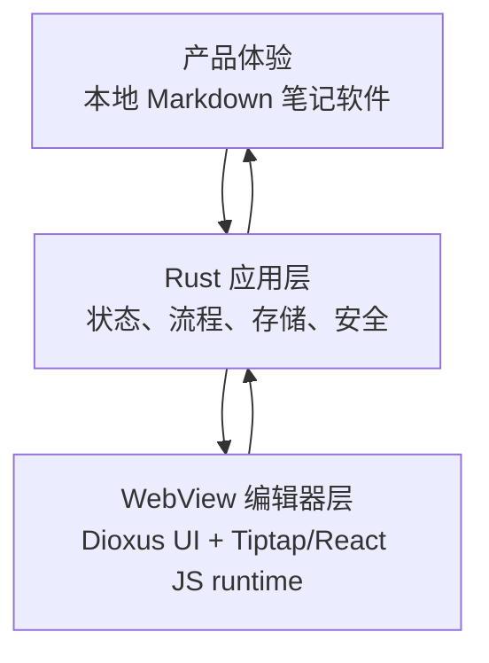
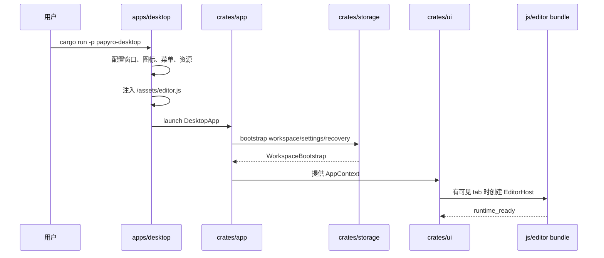
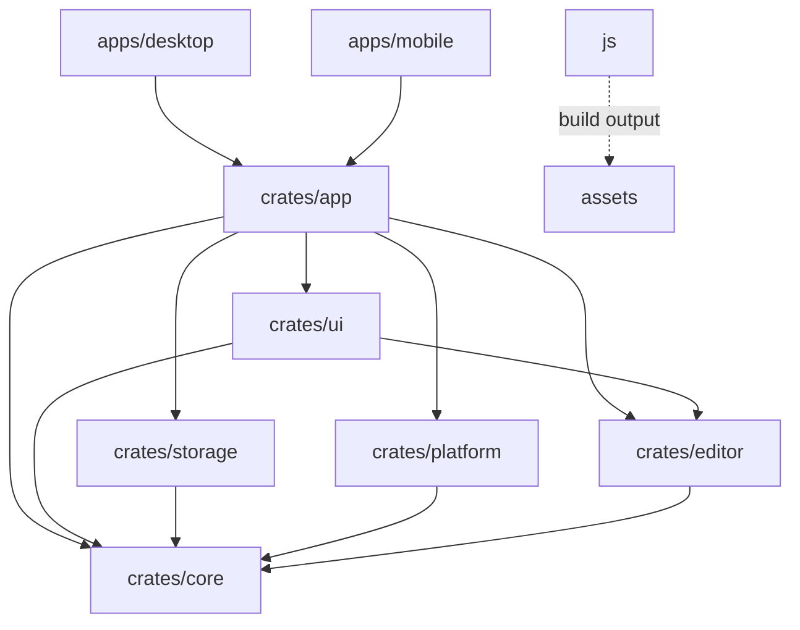
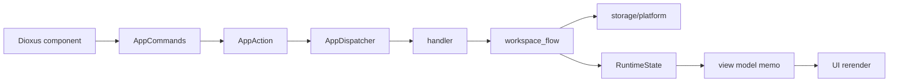
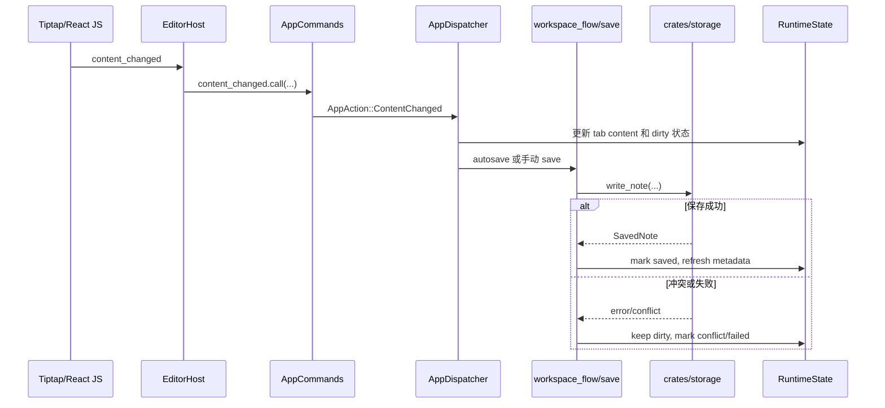
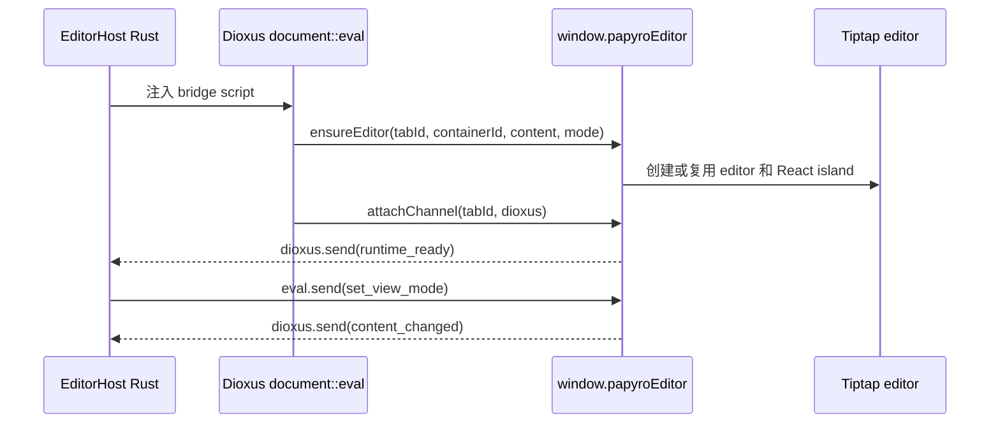
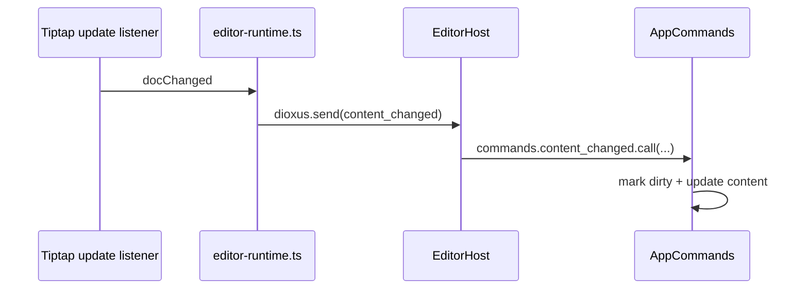
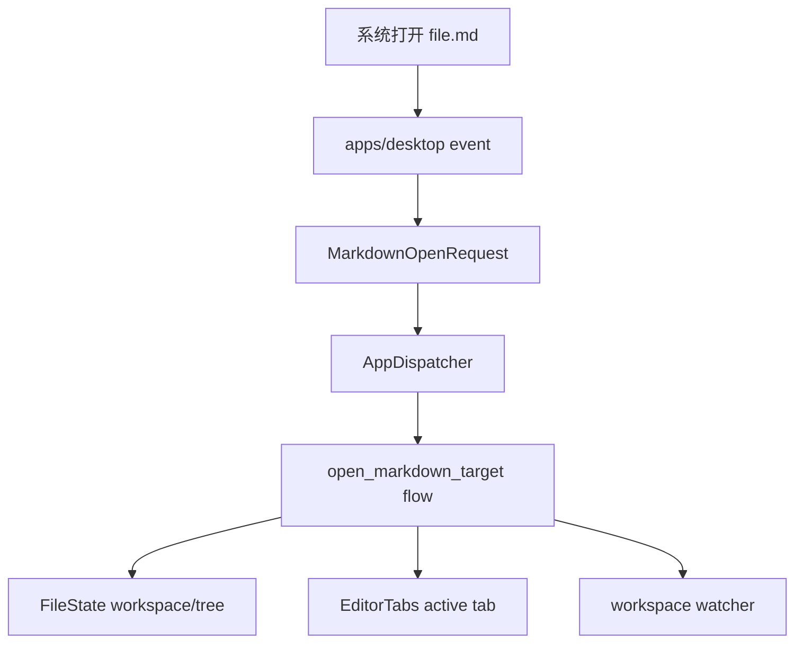

# Papyro 项目上手与架构导览

[English](../architecture.md) | [文档首页](README.md)

这份文档的目标不是简单列目录，而是让新人读完后能回答这些问题：

- Papyro 是什么类型的应用？
- 为什么项目里同时有 Rust、Dioxus 和 JavaScript？
- 用户点击一个按钮、输入一段文字、保存一篇笔记时，数据怎么流动？
- 每个 crate 负责什么？我应该把代码写在哪里？
- 编辑器为什么用 Tiptap/React？它和 Rust 怎么通信？
- 未来做文件关联、多窗口、主题和 Hybrid 编辑体验时，应该沿着什么架构推进？

如果你第一次接触这个仓库，建议按顺序读完本文。之后再根据任务去看 [开发规范](development-standards.md)、[路线图](roadmap.md)、[Tiptap 重构计划](tiptap-refactor-plan.md) 和 [性能预算](performance-budget.md)。

## 1. 一句话理解 Papyro

Papyro 是一个本地优先的 Markdown workspace 应用。

更具体一点：

- 用户自己的 `.md` 文件保存在真实文件夹里。
- SQLite 只保存元数据，例如 workspace、最近文件、标签、设置和恢复草稿。
- Rust 负责应用状态、文件操作、存储、安全和业务流程。
- Dioxus 0.7 负责用 Rust 写 UI，并把 UI 渲染到桌面 WebView。
- Tiptap/ProseMirror 负责复杂的浏览器编辑器能力，例如输入、选区、IME、撤销、结构化 block、表格和文档原生命令。
- React 负责 Tiptap 菜单、句柄、浮层和后续 node view 等编辑器 UI island。
- JavaScript 负责浏览器端编辑器 runtime，因为 Tiptap、Mermaid、KaTeX、React 和 DOM 编辑 API 都在 JS/DOM 世界里。

你可以把 Papyro 想成三层：



## 2. 新人先认识这些词

| 词 | 含义 |
| --- | --- |
| Workspace | 用户选择的笔记文件夹。文件树、搜索、watcher 都围绕它工作。 |
| Note | 一个 Markdown 文件，通常是 `.md` 或 `.markdown`。 |
| Tab | 当前窗口打开的一个文档视图。tab 保存路径、dirty 状态和保存状态。 |
| Content | tab 当前编辑内容。它可能还没保存到磁盘。 |
| Dirty | 内容已修改但还没成功保存。写入失败时必须继续保持 dirty。 |
| Shell | 平台宿主，例如 `apps/desktop` 或 `apps/mobile`。 |
| Runtime | `crates/app` 创建的应用运行时，包括 signals、commands、effects 和 context。 |
| View model | UI 友好的状态投影，避免组件直接理解底层业务结构。 |
| Editor runtime | 浏览器里的 Tiptap/ProseMirror runtime 和 React island，由 `js/src/editor-entry.ts` 构建而来。 |
| Protocol | Rust 和 JS 编辑器 runtime 之间传输的命令和事件结构。 |

## 3. 从启动开始看全链路

桌面端启动链路：



桌面端 workspace 选择是显式的：

- 如果启动参数里有 Markdown 文件，优先选择包含它的最深已知 workspace。
- `PAPYRO_WORKSPACE` 是唯一的环境变量默认 workspace。
- 如果没有启动文件和环境变量默认值，就恢复最近一次打开的 workspace。
- 真正首次启动时不打开任何 workspace，而是进入 onboarding 空状态。

桌面端不会再把进程当前目录当作隐式 workspace 扫描。
这样可以避免 `cargo run` 或打包后启动时意外索引一个很大的项目目录。

对应代码：

| 步骤 | 关键文件 |
| --- | --- |
| 桌面启动 | `apps/desktop/src/main.rs` |
| desktop app 组件入口 | `crates/app/src/desktop.rs` |
| runtime 和 context | `crates/app/src/runtime.rs` |
| 初始状态 | `crates/app/src/state.rs` |
| UI layout | `crates/ui/src/layouts/desktop_layout.rs` |
| 编辑器面板 | `crates/ui/src/components/editor/pane.rs` |
| 编辑器 host | `crates/ui/src/components/editor/host.rs` |

移动端也走 `crates/app` 和 `crates/ui`，但目前它是共享 runtime 的开发入口，不是生产级移动端产品。

## 4. 为什么是 Rust + Dioxus + JavaScript？

这是项目里最容易疑惑的地方。它不是随便混用技术栈，而是职责分层后的结果。

### 4.1 Rust 适合做什么

Rust 负责应用的“可信核心”：

- 文件系统读写。
- SQLite 元数据。
- workspace 扫描。
- 保存、重命名、移动、删除。
- 恢复草稿。
- dirty/save/conflict 状态。
- Markdown 渲染和统计中可以纯函数化的部分。
- 跨平台能力的安全封装。

这些能力需要可靠、可测试、可控。Rust 很适合。

### 4.2 Dioxus 适合做什么

Dioxus 让我们用 Rust 写 UI 组件，并在 desktop WebView 中渲染。

Papyro 使用 Dioxus 0.7：

- 组件是 Rust 函数。
- 状态使用 `Signal<T>`。
- 派生状态使用 `use_memo`。
- 副作用使用 `use_effect`。
- UI 和应用层通过 `AppContext` 和 `AppCommands` 通信。

这让 UI 可以靠近 Rust 应用状态，而不是把整个应用写成 JS 前端。

### 4.3 JavaScript 适合做什么

复杂文本编辑器是浏览器生态的强项。

Tiptap 基于 ProseMirror，已经解决了很多很难手搓的问题：

- 光标和选区。
- IME 输入法。
- undo/redo 历史。
- 结构化 block 和 mark。
- 表格编辑和列宽拖拽。
- node view 和 extension 组合。
- 通过已测试 handler 做 Markdown 导入/导出。
- 通过官方 `@tiptap/react` API 承载 React 编辑器 chrome。
- 粘贴和快捷键。

Mermaid、KaTeX、React 和不少 Markdown 编辑增强库也天然运行在 JS/DOM 里。

如果全部用 Rust 手写编辑器，成本会非常高，也很难达到现代编辑器体验。因此 Papyro 的选择是：

- Rust 管数据真相和业务流程。
- JS 管浏览器编辑器交互和 React 编辑器 chrome。
- 两边通过明确协议通信。

这不是“前后端分裂”，而是“Rust 应用核心 + JS 编辑器 runtime”。

## 5. 项目目录怎么读

```text
.
├─ apps/
│  ├─ desktop/             # 桌面宿主：窗口、启动参数、资源、系统事件
│  └─ mobile/              # 移动宿主：移动资源、共享 runtime 挂载
├─ crates/
│  ├─ app/                 # 应用层：runtime、dispatcher、effects、use cases
│  ├─ core/                # 核心层：模型、状态结构、trait、纯规则
│  ├─ ui/                  # UI 层：Dioxus 组件、布局、view model、i18n
│  ├─ storage/             # 存储层：SQLite、文件系统、watcher、workspace 扫描
│  ├─ platform/            # 平台层：对话框、app data、reveal、外链
│  └─ editor/              # 编辑器能力：Markdown、HTML render、protocol
├─ js/                     # Tiptap runtime、React editor island、测试和构建脚本
├─ assets/                 # workspace 级生成资源和共享静态资源
├─ scripts/                # CI 和本地检查脚本
├─ skills/                 # 项目级 AI skill
└─ docs/                   # 当前文档
```

最重要的认知：

- `apps/*` 不写共享业务逻辑。
- `crates/app` 是应用流程中心。
- `crates/core` 是纯规则和数据结构。
- `crates/ui` 只负责展示和交互。
- `crates/storage` 负责磁盘和数据库。
- `crates/editor` 负责 Markdown 派生能力。
- `js/` 负责编辑器 runtime 源码。

## 6. 依赖方向



依赖规则：

- `core` 不能依赖 Dioxus、storage、platform 或 JS。
- `ui` 不能直接写文件。
- `storage` 不能知道 UI 长什么样。
- `platform` 不直接改应用状态。
- `js` 不直接保存文件。
- 新增依赖方向后必须跑 `node scripts/check-workspace-deps.js`。

## 7. 每一层具体负责什么

### 7.1 `apps/desktop`

它是桌面端壳层。

负责：

- 初始化日志。
- 配置窗口大小、标题、图标。
- 禁用原生菜单栏。
- 管理平台窗口 chrome 策略：macOS 使用原生红黄绿窗口控制，Windows 和 Linux 保留 Papyro 自绘标题栏控制。
- 同步运行时资产到可访问的 `/assets`。
- 注入 `editor.js`。
- 收集启动参数里的 Markdown 路径。
- 接收系统打开文件事件。
- 挂载 `papyro_app::desktop::DesktopApp`。

不负责：

- 打开 workspace 的业务流程。
- 保存笔记。
- 文件树状态。
- 编辑器内容状态。

### 7.2 `apps/mobile`

它是移动端壳层。

目前负责：

- 注入移动端 CSS 和资源。
- 提供品牌资源 context。
- 挂载 `papyro_app::mobile::MobileApp`。

它不是 desktop 的复制品，也不应该绕过 `crates/app` 自己写一套业务流程。

### 7.3 `crates/app`

这是共享应用层，也是新人最应该认真理解的一层。

关键文件：

| 文件 | 作用 |
| --- | --- |
| `runtime.rs` | 创建 runtime、memos、context、effects。 |
| `state.rs` | 定义所有运行时 signals。 |
| `actions.rs` | 定义 UI command 转换后的应用动作。 |
| `dispatcher.rs` | 把 action 分发给 handler 或 effect。 |
| `handlers/*` | 连接 action、state、storage、platform。 |
| `workspace_flow/*` | 纯应用用例，例如创建、打开、保存、删除。 |
| `effects.rs` | autosave、watcher、退出前 flush 等副作用。 |
| `settings_persistence.rs` | settings 持久化队列。 |
| `open_requests.rs` | Markdown 外部打开请求归一化。 |

`crates/app` 的核心使命是：让 UI 不直接碰 storage，让 storage 不理解 UI。

### 7.4 `crates/core`

核心层保存稳定的数据结构和纯规则。

常见内容：

- `Workspace`
- `NoteMeta`
- `FileNode`
- `EditorTab`
- `AppSettings`
- `FileState`
- `EditorTabs`
- `TabContentsMap`
- `UiState`
- `NoteStorage` trait
- `ProcessRuntimeSession`
- `WindowSession`
- `WindowSessionKind`

判断代码是否适合放 `core`：

- 能不能脱离 Dioxus 测试？
- 能不能脱离文件系统测试？
- 它是不是领域模型或纯状态迁移？

如果答案是“是”，它可能属于 `core`。

### 7.5 `crates/ui`

UI 层负责所有 Dioxus 组件。

常见目录：

- `layouts/desktop_layout.rs`
- `layouts/mobile_layout.rs`
- `components/sidebar`
- `components/header`
- `components/editor`
- `components/settings`
- `components/search`
- `components/command_palette.rs`
- `view_model.rs`
- `context.rs`
- `commands.rs`
- `i18n.rs`

UI 的正确姿势：

1. 从 `AppContext` 读 view model 或必要 signal。
2. 渲染 Dioxus 组件。
3. 用户操作时调用 `AppCommands`。
4. 不直接调用 storage。

### 7.6 `crates/storage`

存储层负责真实持久化。

它包含：

- SQLite schema 和 migrations。
- workspace 记录。
- note metadata。
- recent files。
- tags。
- settings。
- recovery drafts。
- Markdown 文件读写。
- workspace 扫描。
- watcher 事件映射。
- 搜索索引辅助。

最重要的数据安全规则：

写文件失败时，应用层不能把 tab 当作已保存。

### 7.7 `crates/platform`

平台层负责系统能力：

- app data directory。
- 文件夹选择。
- 保存文件对话框。
- reveal in explorer。
- 打开外部链接。
- desktop opened URL 解析。

这些能力被 trait/adapter 包起来，是为了让应用层更容易测试。

### 7.8 `crates/editor`

编辑器能力层负责 Rust 侧 Markdown 逻辑：

- Markdown 统计。
- 带 TOC anchor 的大纲提取。
- Hybrid block 分析。
- Preview HTML 渲染。
- 代码高亮主题。
- Rust/JS 协议结构。

注意：`crates/editor` 不等于 Tiptap runtime。浏览器编辑器 runtime 在 `js/`。

大纲提取使用和 Preview 相同的 `pulldown-cmark` Markdown 语义，不再依赖逐行扫描。
它会收集 ATX 和 Setext 标题，清理标题里的 inline Markdown 标记，保留显式 heading
ID，并为重复标题生成稳定且不冲突的 anchor ID。Rust 继续作为应用层 TOC 数据源；
JS 只消费渲染后的大纲行，负责 active state 同步和导航滚动。

### 7.9 `js/`

JS 目录负责浏览器编辑器 runtime。

常见文件：

| 文件 | 作用 |
| --- | --- |
| `js/src/editor-entry.ts` | bundle 入口，把 Tiptap adapter 注册到 `window.papyroEditor` 后面。 |
| `js/src/editor-runtime-defaults.ts` | 生产环境 Tiptap runtime 装配，包括 React island、node view 和 table adapter。 |
| `js/src/editor-runtime.ts` | Tiptap Editor 创建、Markdown 同步初始化、生命周期接线和 React 树挂载。 |
| `js/src/editor-runtime-protocol.ts` | Rust 命令桥接，处理视图模式、内容、偏好、命令、聚焦和销毁消息。 |
| `js/src/editor-runtime-contract.ts` | `window.papyroEditor` 使用的稳定 host facade 和 adapter contract。 |
| `js/src/tiptap-react/` | React island provider、slots、mount controller 和后续编辑器 UI 组件。 |
| `js/src/tiptap-i18n.js` | Tiptap runtime chrome、命令菜单和可访问性文案的集中标签表。 |
| `js/src/tiptap-*.js` | 聚焦的 Tiptap controller、command、Markdown handler 和 UI helper。 |
| `js/test/tiptap-*.test.ts` | runtime、command、table、Markdown 和 UI primitive 的 Node test-runner 覆盖。 |
| `js/build.js` | 构建并同步 `editor.js` 生成物。 |

只手动改 `js/src/*`，不要直接改生成出来的 `assets/editor.js`。

## 8. 应用状态怎么组织

`crates/app/src/state.rs` 里有 `RuntimeState`。

它不是一个普通 struct，而是一组 Dioxus `Signal<T>`：

```text
RuntimeState
├─ file_state              # workspace、文件树、选中路径、最近文件
├─ process_runtime         # 进程级会话和打开模式
├─ editor_tabs             # 打开的 tabs 和 active tab
├─ tab_contents            # 每个 tab 的内容和 revision
├─ ui_state                # theme、settings、view mode、chrome 状态
├─ workspace_search        # workspace 搜索
├─ recovery_drafts         # 恢复草稿列表
├─ status_message          # 底部/状态提示
├─ workspace_watch_path    # watcher 当前监听路径
├─ pending_close_tab       # 二次确认关闭
├─ pending_delete_path     # 二次确认删除
├─ editor_runtime_commands # Rust 发往 JS editor runtime 的命令队列
└─ settings_persistence    # settings 后台保存队列
```

为什么拆这么多 signal？

因为不同 UI 区域不应该互相拖累：

- 文件树变化不应该重建 Tiptap editor。
- 输入文字不应该重渲染整个侧边栏。
- 切主题不应该重新计算 Markdown preview。
- 切 tab 不应该重新扫描整个 workspace。

## 9. UI 到应用层的数据流

当用户点击一个 UI 按钮时，常见链路是：



例子：点击“新建笔记”。

1. UI 调用 `commands.create_note.call(name)`。
2. `AppCommands` 转给 `AppDispatcher`。
3. dispatcher 产生 `AppAction::CreateNote`。
4. handler 调用 `file_ops::create_note`。
5. workspace flow 调用 storage 创建文件。
6. 成功后更新 `FileState`、`EditorTabs`、`TabContentsMap`。
7. view model 重新计算。
8. UI 展示新 tab 和文件树。

## 10. 保存一篇笔记时发生什么



这个流程里，最关键的是：

- JS 只报告“内容变了”。
- Rust 负责决定什么时候保存。
- storage 负责实际写磁盘。
- 保存失败时 dirty 状态必须保留。

## 11. 为什么编辑器要有 Rust/JS 协议

Rust 和 JS 不能随便互相调用内部函数。它们之间需要稳定边界。

这个边界就是 `crates/editor/src/protocol.rs`：

- `EditorCommand`：Rust 发给 JS。
- `EditorEvent`：JS 发给 Rust。

这样有几个好处：

- 事件结构可测试。
- JSON 字段稳定。
- 新增能力时知道该改哪里。
- JS 不需要知道 Rust 内部状态结构。
- Rust 不需要知道 Tiptap、ProseMirror、React 或 DOM 内部对象。

## 12. Rust 如何启动 JS 编辑器

关键文件是 `crates/ui/src/components/editor/host.rs`。

每个可编辑 tab 都会有一个 `EditorHost`。它做几件事：

1. 创建一个 DOM 容器 id，例如 `mn-editor-{tab_id}`。
2. 用 `document::eval` 执行一段 JS bridge 脚本。
3. bridge 脚本确认 `window.papyroEditor` 已加载。
4. 调用 `window.papyroEditor.ensureEditor(...)` 创建或复用 Tiptap editor 和 React island。
5. 调用 `window.papyroEditor.attachChannel(tabId, dioxus)` 保存通信通道。
6. JS 发送 `runtime_ready`。
7. Rust 开始监听 JS event。
8. Rust 通过 `eval.send(EditorCommand::...)` 发命令给 JS。

简化后的形状：



这里的 `dioxus` 是 Dioxus eval 提供给脚本的通信对象：

- JS 调用 `dioxus.send(value)`，Rust 通过 `eval.recv::<EditorEvent>().await` 接收。
- Rust 调用 `eval.send(command)`，JS 通过 `await dioxus.recv()` 接收。

## 13. JS 如何注册编辑器 runtime

关键文件是 `js/src/editor-entry.ts`。

它最后会注册：

```javascript
window.papyroEditor = {
  name: "papyro.editor",
  version: "1.0.0",
  protocolVersion: 1,
  runtimeKind: "tiptap",
  methods: [...],
  describe() { ... },
  ensureEditor,
  handleRustMessage(tabId, message) { ... },
  attachChannel(tabId, dioxus) { ... },
  attachPreviewScroll,
  navigateOutline,
  syncOutline,
  scrollEditorToLine,
  scrollPreviewToHeading,
  renderPreviewMermaid,
  renderPreviewMath,
};
```

这个 facade 会被冻结，并以不可写的 `window.papyroEditor` 属性安装。
Rust 在挂载 editor 前会校验 facade name、facade version、protocol version
和必需的 bridge methods。这样 WebView bridge 是可审计的，同时 Tiptap、
ProseMirror、React、registry 和 DOM 内部对象仍然被明确函数边界隔离。

这些函数的含义：

| 函数 | 作用 |
| --- | --- |
| `describe` | 返回冻结的 facade descriptor，供 smoke test 和 host 校验使用。 |
| `ensureEditor` | 创建或复用 Tiptap editor instance 和 React island。 |
| `attachChannel` | 保存 Dioxus 通信对象，让 JS 能给 Rust 发事件。 |
| `handleRustMessage` | 处理 Rust 发来的命令。 |
| `syncOutline` | 根据编辑器位置同步大纲高亮。 |
| `navigateOutline` | 点击大纲后跳到目标标题。 |
| `renderPreviewMermaid` | 在 Preview 中渲染 Mermaid。 |
| `renderPreviewMath` | 在 Preview 中渲染 KaTeX 数学公式。 |

## 14. Rust 发给 JS 的命令

`EditorCommand` 当前包括：

| 命令 | 作用 |
| --- | --- |
| `SetContent` | 用 Rust 内容替换 editor 内容。 |
| `SetViewMode` | 切换 Source / Hybrid / Preview 相关 runtime 状态。 |
| `SetBlockHints` | 把 Rust 分析出的 Markdown block hints 发给 JS。 |
| `SetPreferences` | 更新 editor 偏好，例如自动链接粘贴。 |
| `InsertMarkdown` | 在当前 selection 插入 Markdown。 |
| `ApplyFormat` | 应用加粗、斜体、链接、标题等格式命令。 |
| `Focus` | 聚焦编辑器。 |
| `Destroy` | 销毁或回收 editor host。 |

`SetPreferences` 会把 Rust 侧的 `AppLanguage` 传入浏览器 runtime。React
island 通过 `usePapyroTiptapLanguage()` 暴露归一化后的语言，当前编辑器
chrome 从 `js/src/tiptap-i18n.js` 读取面向用户的标签。这样 Tiptap 组件状态仍
由 React 本地管理，同时菜单、tooltip、placeholder 和可访问性文案会跟随 Rust
UI 的语言偏好。

Rust 发送命令的位置通常在：

- `crates/ui/src/components/editor/host.rs`
- `crates/ui/src/commands.rs`
- `crates/app/src/dispatcher.rs`

## 15. JS 发给 Rust 的事件

`EditorEvent` 当前包括：

| 事件 | 触发场景 |
| --- | --- |
| `RuntimeReady` | editor runtime 已准备好。 |
| `RuntimeError` | JS runtime 初始化或执行失败。 |
| `ContentChanged` | 用户输入导致文档变化。 |
| `SaveRequested` | JS 捕获保存快捷键。 |
| `PasteImageRequested` | 用户粘贴或拖入图片。 |

本地图片粘贴/拖入遵循 Tiptap 官方的文件处理职责划分：editor runtime
只拦截受支持的图片文件，不在 JS 侧持久化文件，也不把 base64 图片写入
Markdown 文档。JS 将文件读取为 base64，并发送
`PasteImageRequested { tab_id, mime_type, data }`；Rust 校验 MIME 和图片文件头，
在当前 workspace 的 `assets/` 目录下写入唯一文件名，然后排队发送
`EditorCommand::InsertMarkdown`，插入相对路径 ``。如果 Rust
通信通道尚未附加，粘贴/拖入会交还给 Tiptap/ProseMirror 处理。

Mermaid 渲染保留在 JS 侧，因为 Mermaid 依赖 DOM API，并且内部维护自己的
SVG 渲染队列。Papyro 对 Preview HTML 和 Tiptap Mermaid node view 使用同一个
渲染器。该渲染器以 `startOnLoad: false`、`securityLevel: "strict"`、
`suppressErrorRendering: true`、`htmlLabels: false` 初始化 Mermaid，并把这些
安全相关 key 标记为 secure，避免文档内 Mermaid 指令放宽本地文档沙箱。每个
目标元素都有独立 render token，旧的异步渲染结果不会覆盖新的图表状态。

KaTeX 渲染也保留在 JS 侧。Rust 启用 `pulldown-cmark` 的 `ENABLE_MATH`，
继续剥离原始 HTML，并把 inline/display math event 转成经过转义的
`.mn-math-inline` 与 `.mn-math-block` 占位符。`js/src/tiptap-math.js`
同时负责 Tiptap math node view 和 Preview 占位符渲染，使用 `trust: false`、
`throwOnError: true`、`output: "mathml"`，并限制 `maxSize` 与 `maxExpand`，
避免本地文档开启受信任的 KaTeX HTML 能力。

大纲/TOC 数据保留在 Rust 侧，便于和 document revision 对齐。`OutlineItem`
包含标题级别、清理后的标题文本、源码行号和稳定的 `anchor_id`。`OutlinePane`
把这些值暴露为 `data-line-number`、`data-heading-index` 和 `data-anchor-id`；
`window.papyroEditor.syncOutline` 与 `navigateOutline` 仍只处理 DOM active state
和滚动行为。这遵循 Tiptap TOC 的“无头 anchor 数据 + 独立 UI”模型，同时保持
Papyro 的 Rust 文档模型是真相源。

最常见的是 `ContentChanged`：



## 16. Hybrid mode 为什么还需要 Rust block hints

Hybrid 不是简单 CSS。

它需要知道 Markdown 文档里哪些范围是：

- heading
- list
- task list
- blockquote
- code fence
- table
- math
- Mermaid

这些结构由 Rust 在 `crates/editor/src/parser/blocks.rs` 分析，生成 `MarkdownBlockHintSet`。

然后 `EditorPane` 在 Hybrid 模式下异步计算 hints：

```text
active document snapshot
-> analyze_markdown_block_snapshot_with_options
-> MarkdownBlockHintSet
-> EditorHost
-> EditorCommand::SetBlockHints
-> Tiptap runtime compatibility handlers
```

为什么不全放 JS？

- Rust 侧已经需要 Markdown 统计、Preview、Outline 和大文档策略。
- block hints 可以和 Rust 的 document revision 对齐。
- 大文档降级策略更容易集中管理。
- 协议让 JS 只负责编辑器交互和 Markdown 同步回报，不拥有应用层真相。

为什么不全放 Rust？

- Tiptap document state、selection、node views、DOM hit testing 和 scroll 都在 JS runtime 中。
- DOM hit testing、IME、selection 和 scroll 由浏览器处理。
- Rust 直接操作这些会非常笨重。

所以 Hybrid 是 Rust 分析 + Tiptap/React 呈现的协作模式。随着更多编辑器表面迁到 Tiptap extension 和 React node view，block hints 应该保持为兼容数据，而不是第二份编辑真相。

## 17. Preview mode 和 Hybrid mode 的区别

Preview mode：

- Rust 使用 `pulldown-cmark` 把 Markdown 渲染成 HTML。
- Rust 使用 `syntect` 做代码高亮。
- UI 把 HTML 放进 Preview pane。
- JS 辅助处理 Mermaid 渲染、preview scroll 和大纲跳转。

Hybrid mode：

- Tiptap 是主要交互编辑器。
- Rust 给 JS block hints 做兼容和大文档策略辅助。
- JS 用 Tiptap/React 把 Markdown 呈现得更像文档。
- 用户仍在同一个 editor runtime 里输入。

简单对比：

| 能力 | Preview | Hybrid |
| --- | --- | --- |
| 是否可编辑 | 否 | 是 |
| 主要渲染 | Rust HTML | Tiptap/ProseMirror document view + React chrome |
| Mermaid | JS 辅助渲染 | Tiptap node/extension state |
| KaTeX 数学公式 | Rust 占位符 + JS KaTeX 渲染 | Tiptap math node view |
| 数据真相 | Rust tab content | Rust tab content + JS 当前输入事件 |

Preview 使用 Rust 侧的 `pulldown-cmark` 和 `syntect` 输出 HTML，然后由 JS 负责
Mermaid、KaTeX、滚动同步和大纲跳转辅助。Preview Mermaid 与 math block 只有在
source 变化时才会重新渲染，并复用和可编辑 node view 相同的严格渲染配置。

## 18. Editor host 为什么要复用

创建 Tiptap editor 很贵。

它会创建 ProseMirror view、extension state、node views、插件、监听器、layout 缓存和 React island。如果每次切 tab 或折叠侧栏都销毁重建，体验会卡。

因此 Papyro 有 host 生命周期和 spare pool：

- 打开 tab 时尽量复用已有 editor host。
- 隐藏 tab 时保留 host。
- 关闭 tab 后延迟 destroy 或回收。
- sidebar、theme、status bar 变化不应该重建 editor。

JS 侧通过 `EditorRuntimeRegistry` 为每个打开的 tab 保存一个 runtime entry。
runtime 把 registry 作为活跃 editor 身份、Dioxus 通道、React island 状态、
source pane 状态、table command 状态、粘贴处理和滚动/layout hook 的统一生命
周期边界。事件处理器会先确认传入的 Tiptap editor 仍然是该 tab 当前的 editor，
然后才发送 dirty、save 或 paste 请求。如果 host 被销毁后同一个 tab id 重新挂
载，旧 editor 的迟到事件会被忽略，已销毁的 registry entry 也会被替换而不是复用。

相关代码：

- `crates/ui/src/components/editor/pane.rs`
- `crates/ui/src/components/editor/host.rs`
- `js/src/editor-registry.js`
- `js/src/editor-runtime.ts`
- `js/src/tiptap-react/`

## 19. 文件树、Tabs 和 Workspace 的关系

当前基本模型：

- `FileState` 保存当前 workspace、文件树、选中路径。
- `EditorTabs` 保存打开的 tabs 和 active tab。
- `TabContentsMap` 保存 tab 内容。
- `workspace_watch_path` 保存当前 watcher 路径。

系统打开 Markdown 的当前链路：

当系统用 Papyro 打开某个 Markdown 文件时：

1. 桌面端收到 opened file event。
2. 转成 `MarkdownOpenRequest`。
3. 应用层判断它属于哪个 workspace。
4. 如果需要，bootstrap 该文件所在目录。
5. 打开或激活对应 tab。
6. 左侧文件树切换到该 tab 的 workspace。
7. 切换 tab 时，文件树也跟随 active tab 的 workspace。
8. watcher subscription 跟随当前 active workspace。

目标链路：



这块是 roadmap 里的重点，因为它会影响多 workspace、多 tab 和未来多窗口。
打开另一个 workspace 里的文件时不能丢掉已有 tab；active tab 的路径是左侧文件树和 watcher context 的事实来源。

### Window Session 所有权

`crates/core/src/session.rs` 把进程和窗口路由保持为纯规则，便于测试。

- `ProcessRuntimeSession` 保存用户配置的打开方式，以及当前 runtime 实际启用的打开方式。
- `WindowSessionRegistry` 保存已知窗口和当前聚焦窗口。
- `WindowSessionKind::Main` 在单窗口模式下负责普通 tab 编辑。
- `WindowSessionKind::Settings` 是进程级工具窗口，不能接收文档 tab。
- `WindowSessionKind::Document { path }` 是唯一拥有明确文档路径的窗口类型。
- 窗口上的 workspace path 只是上下文元数据，不代表拥有某个文档。
- `ProcessRuntimeSession::prepare_markdown_open` 是 app 层使用的可变路由入口。`MultiWindow` 模式下，它会在第一次打开某个路径时注册 document session，或者聚焦已拥有该路径的 document session。
- `crates/app/src/state.rs` 会在路由后排入 `DocumentWindowRequest`，让桌面层负责打开或聚焦原生文档窗口。
- `crates/app/src/desktop_tool_windows.rs` 拥有原生桌面窗口 registry。再次打开同一路径时会聚焦已有的 `WindowSessionId`，而不是重复创建文档窗口。

Document window 会运行自己的 Dioxus runtime，并设置 `multi_window_available: false`。
这样它的 `EditorTabs`、`TabContentsMap`、pending close tab、selection、command queue 和 dirty state 都留在该窗口本地，而不是通过主窗口状态投影。
Storage 和 settings 是进程级依赖：

- `crates/app/src/runtime.rs` 会把同一个 `Arc<dyn NoteStorage>` 传给 document window。
- `crates/app/src/process_settings.rs` 拥有 `ProcessSettingsHub`，它保存进程级 settings snapshot，并通过 watch channel 同步给每个 runtime。
- runtime bootstrap 会经过 `ProcessSettingsHub::prepare_bootstrap`，所以新开的 document window 会优先使用最新内存 settings，再回落到磁盘状态。
- 保存 settings 时会先发布到 hub，再写入 storage，因此其它窗口可以实时更新。
- `crates/app/src/settings_persistence.rs` 会用 revision guard 和进程级写锁保护 settings 写入，避免较旧窗口的延迟保存覆盖较新的 settings snapshot。

跨窗口文档保存冲突仍然需要专门测试和 UX，完成前不应把多窗口编辑视为完整能力。

## 20. Settings 工具窗口如何工作

桌面端 settings 现在会打开独立的 Dioxus desktop 工具窗口，不再作为主编辑器 chrome 内的 modal 展示。

实现路径：

- `crates/app/src/desktop_tool_windows.rs` 通过 `dioxus::desktop::window().new_window(...)` 创建设置工具窗口。
- `crates/ui/src/components/settings/mod.rs` 暴露 `SettingsSurface`，让 modal 和工具窗口复用同一份设置表单。
- `crates/ui/src/layouts/desktop_layout.rs` 通过 `SettingsWindowLauncher` context 打开工具窗口，同时保留旧 modal 作为兜底。
- 工具窗口接收和主窗口相同的 app context，因此设置修改仍走正常 command，并能实时更新主编辑器。
- 工具窗口会先以隐藏状态创建，等 desktop context 就绪后再显示并聚焦，避免 webview 初始化阶段出现一闪而过的白屏。
- 窗口标题会跟随共享 app context 的当前语言更新，原生窗口图标也会从 Papyro 的 logo 资源加载，保证次级窗口和主窗口的品牌与语言一致。
- 桌面 chrome 会按平台分支处理。macOS 主窗口和设置窗口使用系统原生红黄绿控制，并隐藏 Papyro 自绘最小化、最大化和关闭按钮；Windows 和 Linux 保留 Papyro 自绘按钮和拖拽区域。

Document window 复用同一套进程级窗口模式，但和 settings 不同，它会创建新的 app runtime，而不是共享主窗口的 `AppContext`。
它的编辑状态保持窗口本地，storage 和 settings 则通过进程级 shared services 注入。

## 21. 常见开发任务应该从哪里下手

| 任务 | 先看 | 通常还要看 |
| --- | --- | --- |
| 改按钮、布局、样式 | `crates/ui/src/components` | `assets/main.css`, `apps/*/assets/main.css` |
| 改主题 token 或 Markdown 视觉样式 | [theme-system.md](theme-system.md) | `assets/main.css`, `js/src/tiptap-*.js`, `js/src/tiptap-react/` |
| 新增 UI 命令 | `crates/ui/src/commands.rs` | `crates/app/src/actions.rs` |
| 新增应用行为 | `crates/app/src/dispatcher.rs` | `handlers/*`, `workspace_flow/*` |
| 新增文件操作 | `crates/app/src/workspace_flow` | `crates/storage/src/fs` |
| 改保存逻辑 | `workspace_flow/save.rs` | `crates/storage/src/lib.rs` |
| 改文件树 | `crates/ui/src/components/sidebar` | `crates/core/src/file_state.rs` |
| 改 Markdown Preview | `crates/editor/src/renderer/html.rs` | `crates/ui/src/components/editor/preview.rs` |
| 改 Hybrid 编辑 | `js/src/editor-runtime.ts`, `js/src/tiptap-*.js` | `js/src/tiptap-react/`, `crates/editor/src/parser/blocks.rs` |
| 改粘贴/选区/IME | `js/src/tiptap-paste-controller.js`, `js/src/tiptap-ui-primitives.js` | `js/test/tiptap-*.test.ts` |
| 改设置项 | `crates/core/src/models.rs` | settings UI、storage settings |
| 改系统打开文件 | `apps/desktop/src/main.rs` | `crates/app/src/open_requests.rs`, `dispatcher.rs` |

## 22. 新增一个功能的标准路径

假设你要新增“插入 callout block”。

推荐路径：

1. 在 roadmap 或 issue 明确产品行为。
2. 在 UI 找到入口位置，比如 toolbar、command palette 或快捷键。
3. 如需 Rust command，扩展 `AppCommands`。
4. 如需 app action，扩展 `AppAction` 和 dispatcher。
5. 如需给 JS 插入 Markdown，使用 `EditorRuntimeCommandQueue`。
6. 在 JS 侧处理 `insert_markdown` 或新增协议命令。
7. 给 JS core 行为加测试。
8. 更新 [Tiptap 重构计划](tiptap-refactor-plan.md)。
9. 跑相关检查。

不要一上来就在 UI 组件里直接改文件或直接操作 storage。

## 23. 新增一个编辑器协议的标准路径

如果 Rust 和 JS 之间要传新消息：

1. 修改 `crates/editor/src/protocol.rs`。
2. 给 serde JSON 加测试。
3. Rust 发送命令时更新 `EditorHost` 或 command queue。
4. JS 在 `js/src/editor-runtime.ts` 或聚焦的 `js/src/tiptap-*.js` controller 中处理新命令。
5. JS 发事件时使用 `dioxus.send(...)`。
6. Rust 在 `EditorHost` 的 event match 里处理新事件。
7. 加 Rust 或 JS 测试。
8. 更新本文和 [Tiptap 重构计划](tiptap-refactor-plan.md)。

协议字段要稳定，不要传 Tiptap、ProseMirror、React 或 DOM 内部对象。

## 24. 性能边界怎么看

Papyro 的高风险路径：

- 输入。
- 粘贴。
- 切 tab。
- 切 Source/Hybrid/Preview。
- Preview render。
- 大纲提取。
- 文件树刷新。
- workspace 搜索。
- sidebar resize。

这些路径都有 trace 或预算要求。改动前看 [性能预算](performance-budget.md)。

如果你改了 editor 或 chrome render path，至少思考：

- 会不会重建 Tiptap editor 或 React island？
- 会不会 clone 大文档内容？
- 会不会在 render path 中做 IO？
- 会不会让 sidebar 和 editor 互相订阅？
- 会不会让大文档每次输入都全量解析？

## 25. 代码健康和文档健康

项目希望保持这几个习惯：

- 文档说当前事实，不写过期愿景。
- README 面向游客，架构文档面向贡献者。
- roadmap 写未来优先级，不写流水账。
- skill 帮助 AI 快速加载上下文，不替代正式文档。
- 每个提交只做一个最小任务。

完整检查：

```powershell
powershell -NoProfile -ExecutionPolicy Bypass -File scripts/check.ps1
```

如果只改文档，至少跑：

```bash
node scripts/check-perf-docs.js
node scripts/report-file-lines.js
```

## 26. 一句话总结

Papyro 的架构核心是：Rust 管应用真相，Dioxus 管界面组合，JavaScript 管复杂的 Tiptap/React 编辑器交互，双方用明确协议通信。

只要你守住这个边界，新增功能、优化 UI、改 Hybrid、做系统文件关联和未来多窗口都会有清楚的落点。
