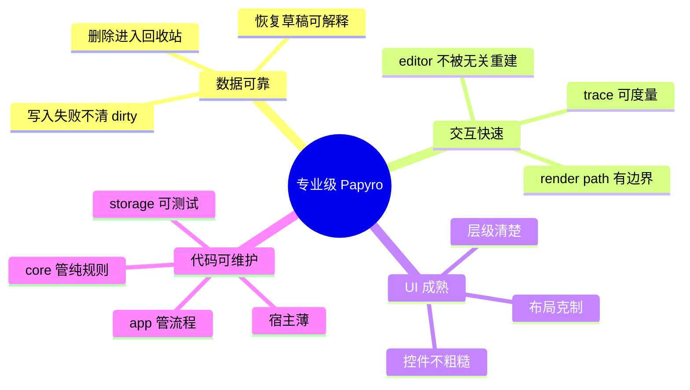
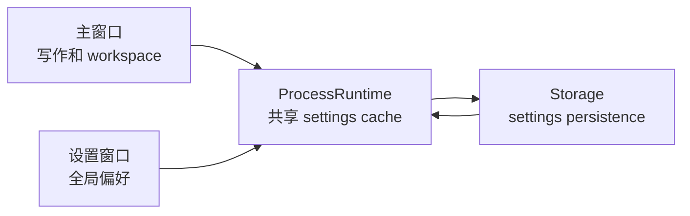
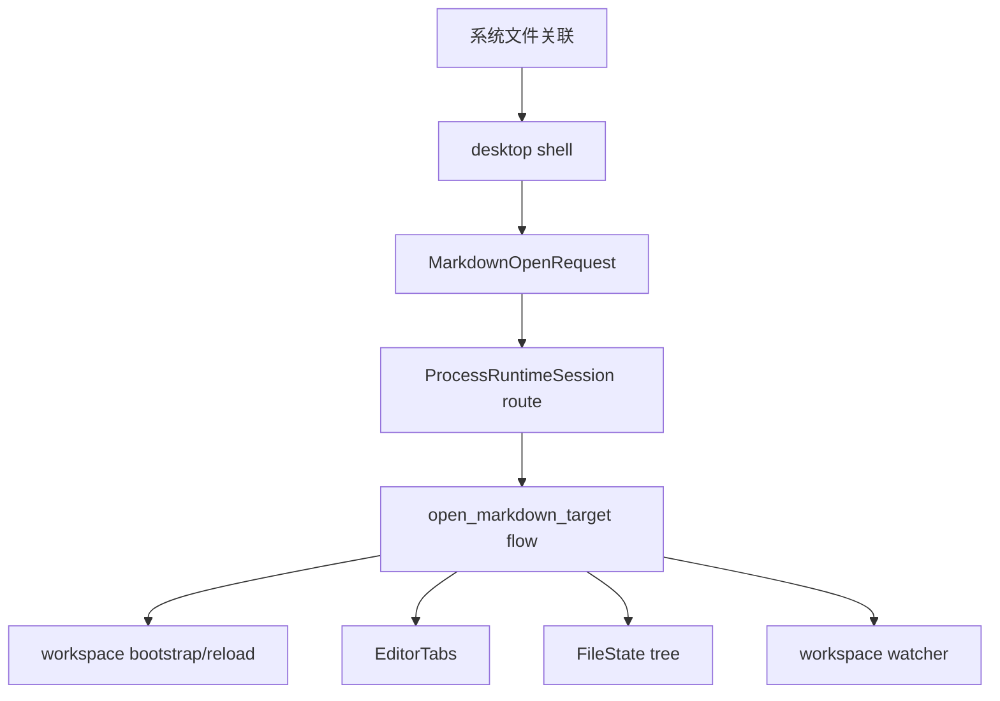

# Papyro 路线图

[English](../roadmap.md) | [文档首页](README.md)

Papyro 的路线图刻意保持聚焦。它应该先成为一个专业的本地优先 Markdown workspace，再考虑成为大型功能平台。

## 产品北极星

Papyro 应该像一个安静、稳定、专业的桌面写作工具：

- 本地 Markdown 文件归用户所有，易备份、同步和迁移。
- Hybrid 模式接近 Typora 的日常写作体验。
- Source 和 Preview 保持可控。
- workspace、tabs、搜索、大纲、回收站、附件、恢复都可预测。
- 启动、切 tab、文件操作和输入在真实项目里保持流畅。
- 架构让新人能理解和继续维护。

## 专业质量标准

## Phase 1 - 基础和数据安全

- [x] 共享 runtime 收进 `crates/app`。
- [x] 平台宿主变薄。
- [x] workspace flow 拆成 use case 模块。
- [x] 保存失败保留 dirty 状态。
- [x] 增加恢复草稿流程。
- [x] 增加 settings 持久化队列。
- [x] 增加 workspace 依赖检查。
- [x] 审计外部文件变化和系统打开 Markdown 文件的保存/冲突路径。
- [x] 把文件关联打开请求做成一等 use case 并补测试。

## Phase 2 - 性能契约

- [x] 增加 editor 和 chrome 交互 trace。
- [x] 增加性能 smoke checker。
- [x] 增加单文件行数预算。
- [x] 增加 UI a11y 和 contrast 检查。
- [x] 保持 editor bundle 生成物同步。
- [ ] 大改 editor 或 chrome 前采集桌面端 trace。
- [x] 给高风险 editor 路径补自动化 smoke。

Trace 名：

- `perf app dispatch action`
- `perf editor pane render prep`
- `perf editor open markdown`
- `perf editor switch tab`
- `perf editor view mode change`
- `perf editor outline extract`
- `perf editor command set_view_mode`
- `perf editor command set_preferences`
- `perf editor input change`
- `perf editor preview render`
- `perf editor host lifecycle`
- `perf editor host destroy`
- `perf editor stale bridge cleanup`
- `perf chrome toggle sidebar`
- `perf chrome resize sidebar`
- `perf chrome toggle theme`
- `perf chrome open modal`
- `perf workspace search`
- `perf tab close trigger`
- `perf runtime close_tab handler`

## Phase 3 - 桌面壳和核心 UX

- [x] 重做桌面 shell 布局。
- [x] 优化侧边栏图标、菜单、根目录选择和空白区域右键行为。
- [x] 移除原生桌面菜单栏。
- [x] 增加中英文 UI 国际化。
- [x] 优化设置界面和暗色模式对比度。
- [x] 替换应用品牌资源。
- [x] 设置改为独立桌面窗口。
- [x] 设置窗口切换分区时大小稳定。
- [x] 用 Papyro 设计系统组件替换原生感强的 `select`、modal、message、menu、tooltip。
- [x] 建立 `Button`、`IconButton`、`Select`、`SegmentedControl`、`Modal/Dialog`、`Message/Toast`、`ContextMenu`、`Tooltip`、`Tabs`、`FormField` 等基础组件。
- [x] 参考成熟开源组件系统的行为和可访问性，例如 [Radix Primitives](https://github.com/radix-ui/primitives)；参考 [shadcn/ui](https://github.com/shadcn-ui/ui) 的二次封装思路，但不直接引入 React 依赖。
- [x] 桌面体验稳定后再做移动端布局 pass。

设置窗口目标：

## Phase 3.5 - UI/UX 体系重构

目标：让 Papyro 看起来像经过专业设计的桌面知识工具，而不是 demo 级界面或 AI 味很重的拼装界面。

参考方向：

- 重做前先系统对标顶级 Markdown 和知识库产品：飞书文档、语雀、Notion Docs、Obsidian、Typora，以及其它 2026 年仍然有代表性的企业级文档工具。
- 重点研究现代企业级 UI 系统，例如 Linear 和 Fluent UI：信息密度、视觉层级、键盘优先路径、组件状态、可访问性、深浅色主题和响应式规则。
- 保持 Papyro 自己的定位：本地优先 Markdown、安静写作、快速 workspace 导航、专业桌面端效率，而不是照搬云协作文档产品。
- 参考对象只作为质量标尺，不直接复制专有产品。要抽取导航、写作流、组件状态、信息密度和可访问性原则。
- 实现前先产出对比矩阵：workspace 导航、编辑器 chrome、block 插入、Markdown 渲染、大纲、搜索、命令面板、设置、空/加载/错误态、键盘路径、主题和窄窗口行为。

设计工作：

- [x] 审计所有核心界面：桌面壳、侧边栏、编辑器头部、tab bar、大纲、状态栏、设置、搜索、快速打开、命令面板、回收站、恢复、空状态、加载态和错误态。见 [UI 界面审计](ui-surface-audit.md)。
- [x] 在改主 CSS 前先创建 benchmark 和 gap-analysis 文档，包含来源链接、截图、交互记录和 Papyro 的明确改版决策。见 [UI/UX 对标与改版决策](ui-ux-benchmark.md)。
- [x] 输出新的产品视觉 brief：字体、字号层级、间距比例、语义色、背景层级、边框半径、图标风格、密度、动效、focus ring、文案语气和中英文排版规则。见 [Papyro UI 视觉 Brief](ui-visual-brief.md)。
- [x] 重新梳理信息架构，让 workspace 导航、文档编辑、大纲、命令、设置和多窗口体验像一个整体，而不是每个页面各自拼出来。见 [UI 信息架构](ui-information-architecture.md)。
- [x] 盘点基于 CSS token 的 Dioxus 组件体系并定义目标基础组件：`Button`、`IconButton`、`Input`、`Select`、`SegmentedControl`、`Switch`、`Dialog`、`Popover`、`DropdownMenu`、`ContextMenu`、`Tooltip`、`Toast/Message`、`Tabs`、`SidebarItem`、`TreeItem`、`Toolbar`、`EmptyState`、`Skeleton`。见 [UI 架构与组件盘点](ui-architecture.md)。
- [x] 大范围视觉重写前增加 CSS token 审计，覆盖裸色值、一次性间距和重复组件 selector。见 [UI Token 审计](ui-token-audit.md)。
- [x] 用可复用组件替换原生感强或一次性产品控件，已覆盖侧边栏搜索、文件树行、inline rename、编辑器 tab、大纲条目、设置颜色输入和编辑器 chrome 控件。
- [x] 通过 `PrimitiveState` 和 `ClassBuilder` 集中管理 active、open、disabled、destructive、editing、drag、drop、expanded、onboarding、resizing 等基础组件状态 class。
- [x] 为 button、icon button、editor tool 和 view-mode option 的 hover、active、focus、disabled、destructive 状态增加第一批 primitive 交互 CSS 变量。
- [ ] 继续减少一次性 CSS，把重复的 hover、active、disabled、focus-visible、loading、destructive、compact、selected、checked 等状态规则沉淀到可复用 primitive 契约里。
- [x] 建立 app chrome 的布局基础设施：split panes、可调整侧栏、滚动容器、sticky toolbar、固定编辑操作区、窄窗口 overflow 规则和 tab 溢出规则。
- [ ] 重做 Markdown 写作界面：安静的编辑画布、合理行宽、更成熟的标题/列表/表格/引用/代码/公式/Mermaid 样式，并保证 Preview 与 Hybrid 的视觉一致。
- [x] 产出设计 QA 资产：组件清单、改版前后截图、窄窗口截图、暗色模式截图、对比度检查、键盘导航检查、CSS 行数预算检查。见 [UI 设计 QA 检查清单](ui-design-qa.md)。
- [x] 更新 UI 架构文档，明确组件放在哪里、token 怎么命名、什么情况下禁止新增一次性 CSS、Dioxus 组件如何保持可维护。

验收标准：

- Papyro 应该更接近严肃的桌面知识工具，而不是原型应用。
- 界面不能依赖泛滥的渐变、噪音卡片、随机色值或装饰性填充来显得“丰富”。
- 组件必须可复用、可访问、键盘友好，并且在浅色和深色主题下保持一致。
- 窗口变窄、tab 溢出、长文件名、设置分区切换、对话框内容变化时，布局不能跳动或把操作区挤出可视范围。

## Phase 4 - Markdown 编辑体验

- [x] 增加 Rust block 分析：标题、列表、表格、代码、数学公式、Mermaid。
- [x] Preview 支持代码高亮和 Mermaid。
- [x] 增加 Hybrid decorations 和 runtime block state。
- [x] 优化粘贴替换和 Markdown 输入命令。
- [x] 增加 Mermaid 渲染/编辑态。
- [ ] 统一 Hybrid selection、cursor hit testing 和 inline decoration 行为。
- [x] 明确 pointer 行为：鼠标 hover 到文字时进入编辑态，hover 到行高空隙时保持普通态；在空隙里选中应命中下一行文字，在当前行文字区域选中应命中当前行；选中背景只覆盖文字字形区域，不要把行高空隙整块染色。
- [x] 统一代码块、inline code、链接、列表、Mermaid 的选中背景颜色。
- [ ] 把光标错位、命中到错误行、选中背景缺失、意外恢复源码、选区影响空白区域等问题视为 Hybrid 架构级缺陷，而不是零散 CSS bug。
- [x] 继续修补 Hybrid 前先调研行业通用编辑器架构：CodeMirror decorations/widgets、ProseMirror/Tiptap node views、Lexical decorators、Slate void/inline nodes、Typora 类源码/渲染切换策略。见 [Hybrid 编辑器架构评审](editor-hybrid-architecture.md)。
- [x] 在新增更多 Markdown block 能力前，先确定 inline 元素、代码块、表格、公式、Mermaid、链接的稳定 selection 和 hit-testing 策略。
- [x] 为光标定位、文本选中、IME composition、粘贴替换、block 编辑/渲染切换增加回归覆盖或可重复 smoke 脚本。
- [x] 对齐 Typora、飞书文档等现代 Markdown/文档编辑方式，让插入表格、公式、代码块、链接、图片和 Mermaid 足够方便。
- [x] 增加常见 block 的插入入口，不能要求普通用户记住所有 Markdown 语法。
- [x] 表格编辑要文档化：新增行列、单元格导航、对齐、避免布局跳动。
- [x] 数学公式要一等支持：inline/display 插入、实时预览、错误反馈。
- [ ] 以企业级编辑体验为标准：粘贴、撤销、选区、IME、键盘导航、可访问性和布局稳定性都要可靠。
- [x] 评估 Hybrid 长期是否继续基于 CodeMirror decoration，还是引入更丰富的文档模型。

## Phase 4.1 - Tiptap 编辑器运行时迁移

目标：在 `feat-tiptap` 分支把交互式编辑器从 CodeMirror runtime 迁移到 Tiptap/ProseMirror 文档模型，同时保持 Markdown 文件格式、Rust/Dioxus 协议和企业级可维护性。

迁移计划见 [Tiptap 迁移计划](tiptap-migration-plan.md)。

企业级要求：

- 新代码必须高可复用、可迭代、健壮，并且有明确模块边界。
- 不能把 Tiptap 逻辑塞进一个新的巨型 `editor.js`。
- 所有复杂 block 必须有 Markdown round-trip 策略和测试。
- 迁移期间保留 `window.papyroEditor` facade，避免 Rust/Dioxus 侧被编辑器实现细节污染。
- 以 Tiptap 官方 Notion-like editor template 作为交互参考，重点借鉴 slash command、浮动格式栏、块插入和响应式编辑器 chrome，但保持 Papyro local-first 和 Markdown-first。
- 生成 bundle、桌面/mobile asset、CSS 行数预算、a11y、contrast、primitive usage 和 Rust/JS 测试必须持续通过。

任务：

- [x] 创建专用迁移分支 `feat-tiptap`。
- [x] 写清 Tiptap 迁移架构、风险、分阶段计划和完成定义。
- [x] 提交并推送迁移计划。
- [x] 抽出第一版 runtime adapter facade 契约和测试。
- [x] 增加 runtime registry 和可注入的 CodeMirror runtime 工厂模块。
- [x] 把 JS 编辑器 runtime 拆出稳定 facade、registry 和 adapter 契约。
- [x] 迁移分支默认 runtime 切换为 Tiptap，同时保留显式 CodeMirror 回退。
- [x] 安装并接入 Tiptap 基础依赖。
- [x] 在 feature flag 或 runtime selector 后面实现 Tiptap adapter 原型。
- [x] 支持基础 Markdown round-trip：段落、标题、列表、引用、粗体、斜体、行内代码、代码块、链接。
- [x] 重新定义 Source/Hybrid/Preview 模式契约：Hybrid 用 Tiptap，Preview 继续 Rust 渲染，Source 保持源码可编辑。
- [x] 增加通过 `MarkdownSyncController` 同步的 Tiptap Source 源码编辑面板。
- [x] Tiptap Source 面板忽略未变化输入，避免重复触发 dirty/content_changed 事件。
- [x] 支持 Tiptap Source 和 Hybrid 模式下的大纲跳转与当前标题联动。
- [x] 增加可复用的 slash command controller，作为 Notion-like 但 Papyro 原生块插入体验的 headless 基础。
- [x] 增加第一版 Notion-like 但 Papyro 原生的 slash command menu controller。
- [x] 增加第一版 Papyro 原生浮动格式栏 controller。
- [x] 浮动格式栏按钮统一为 pointer-first 触发，避免 WebView 焦点顺序吞掉行内格式操作。
- [x] 增加第一版 Papyro 原生块操作柄 controller。
- [x] 把块操作柄升级为 Notion-like 双入口：`+` 打开块插入菜单，句柄点击选中当前块并打开块操作菜单。
- [x] 修复块操作柄事件链：重复 hover 更新后仍保留 action/insert 回调，并让 `+` 插入入口在 WebView 指针事件下稳定打开。
- [x] 稳定块操作柄 hover bridge：鼠标从正文移动到浮动句柄/`+` 控件时不会因为沟槽空隙导致控件提前消失。
- [x] 增加第一版 Papyro 原生块操作菜单 controller。
- [x] 对齐 Tiptap 官方 Notion-like editor template 的块菜单质量基线：块菜单补齐复制为 Markdown、重复块和删除等常用动作，并把菜单点击切到 pointer 事件，减少 WebView/ProseMirror 焦点竞争导致的无响应。
- [x] 接通块操作菜单已展示的快捷键：菜单打开时 Ctrl/Cmd+C 复制、Ctrl/Cmd+D 重复、Delete/Backspace 删除当前块。
- [x] 稳定块操作柄菜单：左键点击释放后打开动作菜单，右键不再泄漏 WebView 原生菜单，小幅鼠标抖动不会被误判为拖拽，鼠标从操作柄移入浮层菜单时保持菜单打开，直到外部点击再关闭。
- [x] 按官方 Drag Context Menu 的职责拆分块句柄状态机：普通点击只选择当前块并在点击点右侧打开当前块菜单，拖动超过阈值才进入块移动，右键只打开 Papyro 菜单并阻止 WebView 原生菜单。
- [x] 给块句柄补齐 WebView 事件容错链路：句柄菜单支持 pointerup 和 click fallback，`+` 插入入口支持 click fallback 且不会重复插入 slash 段落，右键/auxclick 继续拦截原生菜单，避免出现“要长按才可能唤出菜单”的体验。
- [x] 给块操作菜单增加重置格式动作，可清除当前块 marks、颜色和高亮，继续保持中英文文案。
- [x] 让 `+` 插入入口在下一行创建独立 slash 段落并在该光标位置打开插入菜单，而不是混入块动作菜单语义。
- [x] 块操作菜单只保留当前块动作和样式，插入能力交给 `+` 和 slash 命令，避免两个入口职责混乱。
- [x] 进一步收窄块句柄菜单职责：句柄菜单默认只展示复制、重复、重置、删除、文字颜色、高亮和 callout 类型切换；标题、列表、表格、公式、代码块等结构插入继续交给 `+`/slash 和 Markdown 工具栏，避免普通用户误把块操作菜单当成第二个插入面板。
- [x] 给 slash/`+` 插入菜单增加表格尺寸选择器，可直接选择 1x1 到 6x6 的表格尺寸，避免普通用户只能插入固定 3x2 表格。
- [x] 增加第一版 Tiptap 表格浮动工具条，支持插入/删除行列、合并/拆分单元格、切换表头和删除表格。
- [x] 把 Tiptap 表格工具条升级为列、行、单元格、表头、导航、修复、删除分组命令，让表格编辑更接近成熟文档产品。
- [x] 增加表格边缘快捷添加控件，可直接在表格下方新增行、右侧新增列，不必先打开完整工具条。
- [x] 增加表格行/列边缘选择 handle：点击行左侧或列顶部可直接选中整行/整列，并复用表格工具条执行后续行列操作。
- [x] 增加表格左上角整表选择 handle：点击即可选中整张表，便于继续执行删除、表头、对齐和单元格样式操作。
- [x] 把始终可见的一整排表格命令改成更轻的 Notion-like 表格界面：边缘 `+` 控件负责快捷新增行列，合并、对齐、颜色等单元格操作收进当前单元格上下文触发器。
- [x] 补齐表格选区体验：ProseMirror `selectedCell` 和 Papyro 行/列/整表选择都会显示清晰覆盖层，当前行列 handle 有 active 态，当前单元格菜单触发器居中显示并跟随中英文文案。
- [x] 让表格上下文菜单按选区语义裁剪命令：单元格/多单元格聚焦合并、拆分、对齐、颜色；行选区显示加行、删行、表头行和样式；列选区显示加列、删列、表头列和样式；整表选区只显示表头、修复和删除等整表动作。
- [x] 让表格行、列和整表 handle 点击即打开对应菜单：选中行/列/整表后，菜单会锚定到当前选区旁边，保留稳定的选区覆盖层，并用更安静的分组菜单替代密集工具条，让体验更接近 Tiptap 官方 Notion-like 参考，而不是面向开发者的命令堆叠。
- [x] 增加表格单元格对齐命令：左对齐、居中、右对齐通过 Tiptap `setCellAttribute('align', ...)` 写入文档模型，并保持 Markdown pipe table 对齐语义。
- [x] 优化表格上下文菜单展示形态：对齐命令改成图标按钮，单元格背景改成色块按钮，行列/合并/删除继续保留文字动作，让普通用户更容易理解表格菜单而不是面对一排开发者命令。
- [x] 表格工具条主命令统一为 pointer-first 触发，避免 WebView 焦点顺序吞掉表格操作。
- [x] 归一化表格工具条 active 对齐状态，让默认、左对齐、居中和右对齐能准确反映 Markdown 表格状态。
- [x] 增加表格单元格背景色命令：清除、黄色、蓝色、绿色通过 Tiptap `setCellAttribute('backgroundColor', ...)` 写入单元格属性，并在工具条中显示当前背景状态。
- [x] 增加共享 Tiptap UI primitives，用于 popover 定位、菜单 active-descendant 状态、toolbar root 和显隐处理。
- [x] 表格工具条尊重 Tiptap `editor.can()`，当前状态不可执行的行、列、单元格和修复操作会显示为 disabled，而不是伪装成可点击。
- [x] 增加 Tiptap 表格工具条键盘访问：在表格选区内 Shift+F10 打开工具条，方向键在可用命令间移动，Enter/Space 执行当前命令，Escape 关闭。
- [x] 给 slash/`+` 插入菜单、块操作菜单、浮动格式栏和表格工具条接入共享浮层 dismiss 生命周期：外部点击、滚动和窗口变化会稳定收起，点击当前块或表格内部不会误关。
- [x] slash 菜单和块操作菜单的键盘导航会自动把当前选项滚入可视区，长菜单也能稳定键盘操作。
- [x] 增加高级块操作菜单和响应式编辑器 toolbar 行为。
- [x] 修复 Tiptap Hybrid 滚动容器约束，避免内容撑开宿主后被外层裁剪导致无法滚动。
- [x] 通过 runtime 测试保持 Tiptap `content_changed`、`insert_markdown` 和 `set_view_mode` 协议行为。
- [x] Markdown 内容变化后跳过过期的 Source/Hybrid 选区快照，避免模式切换把旧光标恢复到已更新文本中。
- [x] 保持 Tiptap `save_requested`、`paste_image_requested` 和 `runtime_error` 协议行为；`runtime_ready` 继续由 editor host 负责。
- [x] 通过独立 history command controller 保持 Tiptap 撤销/重做协议，并接入稳定 Rust 消息路由，同时避免把撤销/重做混进只服务选区的浮动格式栏。
- [x] 通过测试覆盖的 controller 保持 Tiptap `set_preferences` 状态更新。
- [x] 通过 `set_preferences` 把应用语言传入 Tiptap runtime，让 slash 菜单、块操作、表格工具条和操作柄文案跟随中英文设置。
- [x] 保持 Tiptap 选中文字后粘贴 URL 的 `auto_link_paste` 行为。
- [x] 在 IME composition 期间保护 slash 菜单和块操作菜单的键盘处理，避免中文输入确认被误当成菜单导航或命令执行。
- [x] 把 `set_block_hints` 保留为 Tiptap 迁移期兼容消息。
- [x] 保持 Tiptap `destroy` 语义，并保护 stale instance 不误删新 runtime。
- [x] 增加 Tiptap task list 扩展，并用 checked/unchecked Markdown round-trip 测试覆盖。
- [x] 增加 Tiptap table 扩展，并用 pipe table round-trip 和富表格插入命令测试覆盖。
- [x] 增加 Tiptap math 扩展，并用 inline/display Markdown round-trip 和 KaTeX 预览/错误态测试覆盖。
- [x] 增加 Tiptap Mermaid 扩展，并用 fenced code round-trip 和共享预览/错误渲染测试覆盖。
- [x] 增加 Tiptap image 扩展，并用本地 URL Markdown round-trip 和共享粘贴/拖拽协议测试覆盖。
- [x] 增加 Tiptap code block 配置，并用语言元数据、fenced Markdown round-trip 和共享代码样式测试覆盖。
- [x] 增加 Tiptap callout/admonition block，支持 `> [!NOTE]` 风格 Markdown round-trip、slash/`+` 插入、块操作菜单插入和 token 化样式。
- [x] 增加发布 smoke Markdown fixture 的自动化 round-trip 覆盖，确保标题、中文、列表、任务、callout、代码、对齐表格、公式、Mermaid 和图片在手工 QA 前先有测试守护。
- [x] 增加专用 Tiptap 发布 smoke fixture checker，并接入完整本地检查脚本。
- [x] 块操作菜单增加 Notion-like 的文本颜色和块高亮动作，点击句柄后可直接对当前块应用弱化、强调、危险色和多色高亮，并保持 Markdown 保存语义。
- [x] 迁移 task list、table、math、Mermaid、image 和 code block。
- [x] 清理 CodeMirror npm 依赖和旧 JS runtime 测试。
- [x] 清理剩余 `.cm-*` CSS，并把 host surface 改成语义化 Tiptap/editor class。
- [x] 完成全量自动化验收并推送迁移收口提交。
- [x] 通过 Papyro 块操作柄实现完整块拖拽排序体验，包含可测试的 ProseMirror transaction 移动逻辑和 drop indicator。
- [x] 定义发布候选 [Tiptap Smoke 检查清单](tiptap-release-smoke.md)。
- [ ] 执行发布候选手工 smoke：Source/Hybrid/Preview、中文 IME、粘贴、撤销、表格、公式、Mermaid、图片、大纲、保存失败、外部文件打开。

## Phase 4.5 - 主题、字体和 Markdown 样式

- [x] 定义 theme token：app chrome、editor canvas、Markdown 内容、代码块、selection、focus ring、状态色。
- [x] 先提供少量高质量主题：System、Light、Dark、GitHub-like light/dark、高对比度、暖色阅读主题。
- [x] 采用 Markdown 样式前先调研高认可开源项目，例如 [`sindresorhus/github-markdown-css`](https://github.com/sindresorhus/github-markdown-css)，以及 [Shiki](https://github.com/shikijs/shiki)、[highlight.js](https://github.com/highlightjs/highlight.js)、[Catppuccin](https://github.com/catppuccin/catppuccin) 等代码/主题生态。
- [x] Preview 和 Hybrid 的 Markdown 样式必须一致，标题、列表、表格、引用、代码、数学公式和 Mermaid 不能模式一切换就变样。
- [x] 替换奇怪的字体预设，改成系统优先的实用预设：UI Sans、System Serif、Reading Serif、Mono Code、CJK-friendly fallback stacks。
- [x] 字体设置要面向普通用户：有预览文本、清晰标签、安全默认值，不把冷门字体名放在首选。
- [x] 增加主题和 Markdown 样式 smoke/snapshot 检查，避免后续 CSS 改坏对比度、间距和代码可读性。

## Phase 5 - 文件关联、Tabs 和 Workspace Sessions

目标行为：

- [x] 系统用 Papyro 打开 Markdown 文件时，当前窗口接收文件打开事件。
- [x] Tabs 更新到当前打开的 Markdown 文件。
- [x] 左侧文件树根据打开文件所在目录切换 workspace。
- [x] 多个 tab 属于不同 workspace 时，切换 tab 会同步左侧文件树到当前 tab 的 workspace。
- [x] 切换 workspace context 前保护 dirty tabs。
- [x] watcher subscription 安全跟随 active workspace。
- [x] recent workspace/file 元数据记录该流程。

推荐链路：

## Phase 6 - 多窗口模式

- [x] 定义生产级 `ProcessRuntime` 和 `WindowSession`。
- [x] 先把设置做成进程级工具窗口。
- [x] 消除桌面端设置窗口新开时的白屏闪烁，让新窗口完整继承国际化，并改成 Papyro 自己的应用图标而不是默认 Dioxus 图标。
- [x] 在 `NoteOpenMode::MultiWindow` 后面增加 document window routing。
- [x] 每个窗口独立拥有 tab contents、selection 和 dirty state。
- [x] storage 和 settings 可安全跨窗口共享。
- [x] 增加跨窗口保存冲突测试。

多窗口不是简单 UI 功能，它是可靠性功能，不能抢跑。

## Phase 7 - 打包和发布

- [x] 明确 license。
- [x] 增加桌面端 release packaging。
- [x] 增加目标平台 app icons。
- [x] 增加首次启动 workspace onboarding。
- [x] 增加 release build 手工 QA checklist。
- [x] 文档化 known limitations。
- [ ] 发布前补齐关于窗口的“检查更新”和“查看发行说明”入口。

## 长期原则

- 不新增无助于写作和导航的常驻 chrome。
- 熟悉动作优先图标，破坏性或含义模糊动作使用文本。
- 主编辑区保持安静。
- 数据安全优先于便利。
- 性能预算就是功能要求。
- 架构文档要让新人能做出正确下一步。
