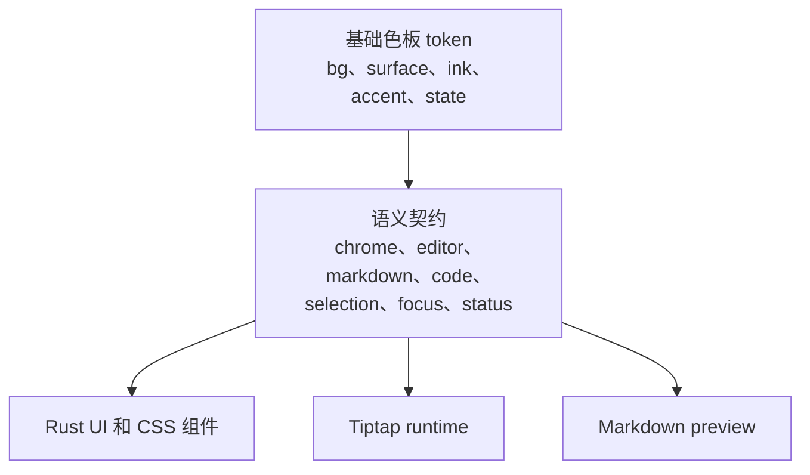

# 主题系统

[English](../theme-system.md)

Papyro 的主题基于语义化 CSS token。组件应该描述“我需要什么语义”，而不是直接写“今天看起来不错的某个颜色”。

## Token 分层

| 层级 | 示例 | 使用者 |
| --- | --- | --- |
| 基础色板 | `--mn-bg`、`--mn-surface`、`--mn-ink`、`--mn-accent` | 主题作者和底层 CSS |
| 应用界面 | `--mn-chrome-bg`、`--mn-chrome-surface`、`--mn-chrome-ink-muted` | 侧边栏、顶部栏、弹窗、命令面板、状态栏 |
| 编辑画布 | `--mn-editor-canvas-bg`、`--mn-editor-canvas-ink`、`--mn-editor-active-line-bg` | Tiptap host 和源码编辑 UI |
| Markdown | `--mn-markdown-ink`、`--mn-markdown-muted-ink`、`--mn-markdown-link` | Preview 和 Hybrid 渲染后的 Markdown |
| 代码 | `--mn-code-surface`、`--mn-code-block-surface`、`--mn-code-ink`、`--mn-code-border` | 行内代码、代码块、Mermaid 源码编辑区 |
| 选区和焦点 | `--mn-selection-bg`、`--mn-selection-ink`、`--mn-focus-ring` | 文本选区、控件焦点、编辑器光标状态 |
| 状态色 | `--mn-status-danger`、`--mn-status-warning`、`--mn-status-success` | 保存状态、危险操作、警告、成功提示 |

## 源文件

- `assets/main.css` 是共享设计源。
- `apps/desktop/assets/main.css` 是桌面端 runtime 使用的副本。
- `apps/mobile/assets/main.css` 负责移动端 shell 布局和移动端 token 桥接。
- `assets/styles/modal.css` 和 `apps/desktop/assets/styles/modal.css` 放弹窗相关样式。
- `assets/styles/markdown.css`、`apps/desktop/assets/styles/markdown.css` 和 `apps/mobile/assets/styles/markdown.css` 放文档 surface、大纲、Preview 与渲染后 Markdown 的排版节奏样式。
- `assets/styles/tiptap-chrome.css`、`apps/desktop/assets/styles/tiptap-chrome.css` 和 `apps/mobile/assets/styles/tiptap-chrome.css` 放 Tiptap runtime 控件样式，包括命令面板、块句柄、表格 chrome 与代码语言菜单。
- `tiptap-chrome.css` ? Tiptap chrome ???????????? `tiptap-chrome-code.css`?`tiptap-chrome-base.css`?`tiptap-chrome-command.css`?`tiptap-chrome-table.css` ? `tiptap-chrome-block.css`??????????????????
- 这些 Tiptap chrome 文件只放 Papyro 宿主适配和兜底样式；官方组件自己的 SCSS 保留在 `js/src/components/tiptap-*`，并由 `assets/editor.js` 注入。
- `tiptap-chrome-papyro.css` 只承载 Papyro 专属编辑器功能样式：Markdown 源码模式、KaTeX 数学编辑，以及 Mermaid 渲染/编辑区域。
- Tiptap node views 通过 Markdown 与 Tiptap chrome 样式中的 CSS class，以及聚焦的 `js/src/tiptap-*.js` 模块消费同一批 token。
- 官方 Tiptap UI 组件保留上游 `--tt-*` 变量。Papyro 在 `assets/main.css`、`apps/*/assets/main.css` 和 `js/src/styles/_variables.scss` 中将这些变量映射到语义化 `--mn-*` 契约。
- `scripts/check-tiptap-theme-bridge.js` 会校验每个内置主题都提供编辑器需要的 `--mn-*` token，并确认官方 `--tt-*` 桥接来自这些 token；改编辑器主题前必须随 editor gate 一起运行。

如果某个 token 在 app asset 中有副本，同一次提交里必须同步更新。

## 编写规则

- 组件 CSS 优先使用语义 token。写应用界面时用 `--mn-chrome-surface`，不要直接拿 `--mn-surface`。
- Preview 和 Hybrid 的 Markdown 必须共用 `--mn-markdown-*` 和 `--mn-code-*`。
- 不要把官方 Tiptap 组件样式直接改成 `--mn-*`。优先扩展桥接层，把官方 `--tt-*` 变量映射到现有语义 token。
- 不要为了单个组件随手加一个颜色；先判断是否应该补一个语义 token。
- 不要把行为写成颜色名。用 `--mn-status-warning`，不要用 `--mn-yellow`。
- 新增主题前，必须确认 token 覆盖 app chrome、editor canvas、Markdown、代码块、selection、focus ring 和状态色。

## 组件基础件

共享 UI surface 放在 `crates/ui/src/components/primitives.rs`。新增界面前优先复用这些基础件。

当前基础组件盘点、目标组件清单、迁移顺序和一次性 CSS 规则见 [UI 架构与组件盘点](ui-architecture.md)。

行为和可访问性参考成熟开源系统：Radix Primitives 用作键盘交互和 ARIA 行为参考，shadcn/ui 用作 copy-and-own 组合方式和克制视觉层级参考。Papyro 不直接依赖这两个 React 库。

## 当前主题

Papyro 当前提供 System、Light、Dark、GitHub Light、GitHub Dark、High Contrast 和 Warm Reading。后续增加高质量主题时，优先覆盖基础色板；只有主题确实需要表达不同语义时，才覆盖语义 token。
