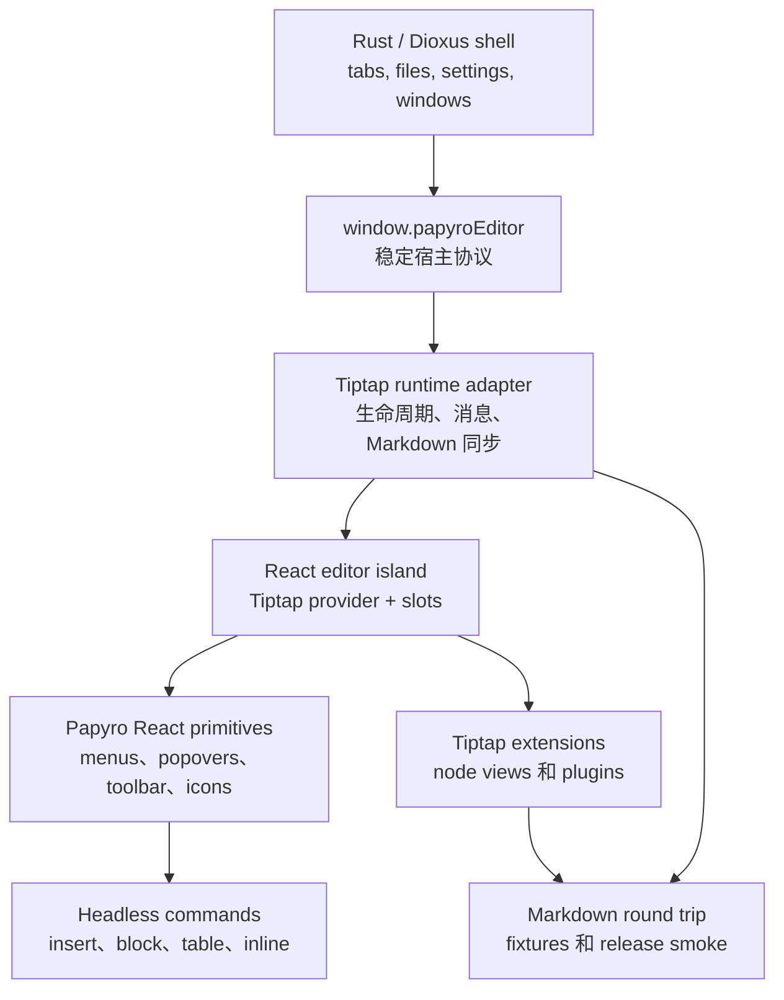

# Tiptap 企业级编辑器 TODO

[English](../tiptap-enterprise-editor-todo.md) | [官方优先 React 策略](tiptap-official-react-strategy.md) | [React 运行时方案](tiptap-react-runtime-plan.md) | [路线图](roadmap.md)

这份文档是把 Papyro 的 Tiptap 编辑器打磨到可上线、接近 Notion-like Markdown 编辑体验的执行清单。它比路线图更具体：每个里程碑都包含范围、实现要点、验收标准和验证方式。

## 当前状态

`feat-tiptap` 分支已经改变了运行时方向，但可见体验还没有完成。当前状态是：

- Hybrid 模式已经使用 Tiptap/ProseMirror，并保留 Dioxus 侧使用的 `window.papyroEditor` facade。
- `js/src/tiptap-react/` 下已经有 React island 基座。
- React island 使用已安装 `@tiptap/react` 的 composable API，并保持 `Tiptap.Content` 作为唯一正文宿主。
- 授权路径下的官方 `table-node` UI 源码已经通过 `PapyroOfficialTableNodeLayer` 挂载，但 Papyro 仍需要为本地 Markdown 持久化、i18n 和桌面 WebView 约束做适配。
- 可选 editor chrome 现在有 React 错误边界保护；表格、句柄或浮层异常时，不应该再把文档正文一起白屏。
- Slash 插入、块句柄、代码块 chrome、浮动格式栏、链接编辑器和表格菜单已经有 React 路径，但部分几何计算和兼容行为仍依赖迁移期 controller。

所以当前编辑器已经不是纯自研 DOM 编辑器，但也还不是完成态的官方 Notion-like editor。下一步要继续遵循官方 Tiptap React/table-node 模式，同时收掉让可见体验偏离标尺的兼容 controller。

## 当前推进重点

在开始大范围视觉打磨前，优先用这份短清单约束后续实现：

1. 稳定 React island 和 bundle gate，确保任意 chrome 组件异常都不会让已打开文档白屏。
2. 按官方交互契约完成 table-node 集成：hover 驱动的行/列句柄、不会选中文字的视觉单元格选中、矩形范围选区、菜单、resize 和快捷新增。
3. 把剩余一次性 DOM 几何所有权迁到 React 组件，或迁到可被 React 消费的纯共享模型。
4. 继续把 Markdown 作为唯一持久化源；改动表格、代码、图片、公式、Mermaid 序列化前必须先补 fixture。
5. 每次 editor runtime 提交前都运行真实 bundle smoke，并至少运行 `node scripts/check-editor-markdown-gate.js`。

## 官方基线

执行这里任何任务前，先刷新并查看本地官方参考：

```powershell
git -C E:\tiptap pull --ff-only
git -C .reference\tiptap-docs pull --ff-only
```

主要参考：

- `E:\tiptap\packages\react`
- `E:\tiptap\packages\extension-drag-handle-react`
- `E:\tiptap\packages\extension-node-range`
- `E:\tiptap\packages\extension-table`
- `.reference/tiptap-docs/src/content/guides/react-composable-api.mdx`
- `.reference/tiptap-docs/src/content/editor/getting-started/install/react.mdx`
- `.reference/tiptap-docs/src/content/ui-components/templates/notion-like-editor.mdx`
- `.reference/tiptap-docs/src/content/ui-components/node-components/table-node.mdx`
- `.reference/tiptap-docs/src/content/ui-components/components/drag-context-menu.mdx`
- `.reference/tiptap-docs/src/content/ui-components/components/slash-dropdown-menu.mdx`

规则：

- 使用稳定版 Tiptap 3，并保持所有 `@tiptap/*` 依赖版本一致。
- 编辑器 UI 优先使用 React composable API。
- 修改集成细节前必须核对已安装的 `@tiptap/react` 源码。当前已安装版本里，`<Tiptap editor={editor}>` 是主路径，`instance` 是 deprecated 兼容 prop。
- Notion-like editor、`table-node`、`drag-context-menu`、`slash-dropdown-menu` 在未授权前按 licensed/non-open UI 处理。
- 官方开源 package 可以直接用。没有授权源码时，只能在 Papyro 内按相同产品原则重新实现交互。

## 默认免费/开源路线

除非项目明确加入授权后的 Tiptap Start/Pro 输出，否则 Papyro 默认走官方免费能力优先的路线：

1. 使用官方免费/开源 Tiptap package 作为文档模型和编辑基础。
2. 由 Papyro 自己封装 React 层：命令菜单、popover、toolbar、node view、表格 chrome、块句柄。
3. 官方 Notion-like 交互只作为 UX 标尺，不复制未授权源码。
4. 每个核心表面完成后先和产品 owner 确认，再标记完成。
5. 持续迭代到真实 WebView 手感符合双方确认的验收标准，而不是只满足测试通过。

这条路线比直接接入付费 UI 输出更慢，但可以保证代码合法、本地优先、可维护。最终目标不是做一堆一次性仿制控件，而是沉淀出 Papyro 自己可持续演进的企业级编辑器系统。

可复用组件授权说明：

- 如果这些编辑器组件继续沿用仓库的 MIT 许可证，它们就是严格意义上的开源组件，同时允许商业使用。
- 如果目标是“只允许非商业使用”，需要把组件包隔离出来，并使用明确的 source-available non-commercial 许可证；这种包不要称为 OSI 意义上的开源。
- 无论采用哪种授权，具体实现都必须是基于公开 Tiptap API 的 Papyro clean-room 代码。没有授权时不能复制 Tiptap Start/Pro UI 源码。

确认节点：

- Milestone 1 后，确认 React 编辑器壳和共享 primitives 是否适合作为长期基础。
- Milestone 2 后，确认 slash/`+` 插入布局、键盘行为和命令分组。
- Milestone 3 后，确认块句柄点击、拖拽、菜单和高亮行为。
- Milestone 4 后，对照官方标尺确认表格选择、resize、新增行列和单元格菜单。
- Milestone 5 和 6 后，确认代码块和浮动格式栏打磨效果。
- Milestone 10 前，按 release smoke checklist 一起做最终验收。

## 目标架构



不可妥协的边界：

- Dioxus 不直接导入 Tiptap 内部实现。
- React 只负责编辑器 UI，不接管 workspace 或文件状态。
- 命令定义必须 data-first，供 slash 菜单、句柄、快捷键、测试和未来命令面板共用。
- 旧 DOM controller 只是迁移期代码。某个里程碑完成时，要删除已经被替换的 controller 和 CSS。
- Markdown 继续作为唯一持久化源。

## 完成定义

Tiptap 编辑器达到可上线标准时，必须同时满足：

- Hybrid 模式在 block、table、code、math、Mermaid、image、task list、paste、undo、IME 上像原生文档编辑器。
- Source、Hybrid、Preview 可以安全 Markdown round-trip，不发生静默数据丢失。
- Slash 插入、块句柄、浮动格式栏、代码块控件、表格控件都是基于共享 primitives 的 React 组件。
- pointer、keyboard、focus、outside-dismiss、drag、resize 在桌面 WebView 中行为可预测。
- 所有新编辑器动作都有中英文文案。
- 自动化 JS/Rust 检查和手工 WebView smoke 都通过。
- 架构足够模块化，新增一种 block 不需要继续修改巨型 runtime 文件。

## Milestone 0 - 产品和授权决策

目标：先停止猜测到底是重建官方体验，还是直接集成官方 UI。

任务：

- [x] 决定 Papyro 是否购买/使用 Tiptap Start/Pro 生产路径。
  - 当前决策：table-node 工作使用已接受的 Tiptap Pro/Start 授权路径生成 UI 源码。生产使用资格继续取决于有效 plan 和已接受条款。
- [x] 如果使用授权路径，把 Tiptap CLI 生成的官方 UI 源码放入明确隔离的 third-party 区域。
  - 当前覆盖：Tiptap UI 项目初始化在 `js` 子包，官方组件源码安装在 `js/src/components/`，并通过 `js/jsconfig.json` 支持 `@` alias。CLI 命令要带 `--cwd js`；从 `E:\papyro` 根目录运行会报 `Directory not found`，因为根目录不是已初始化的 UI 组件项目。
  - 当前守卫：`.npmrc` 和 `js/.npmrc` 保存本机 registry 凭据，已被 git ignore，不能提交。
- [ ] 如果不使用授权路径，记录哪些官方交互要本地复刻，哪些延后。
- [ ] 如果复制公开 Tiptap UI 仓库中的 MIT 源码，补充 attribution 和升级说明。
- [ ] 固定交互标尺：Notion-like block handle、slash insert、table node、floating toolbar、responsive toolbar。

验收标准：

- 未授权时不复制 non-open Tiptap UI 源码。
- 选定路径已写入 [Tiptap 官方优先 React 策略](tiptap-official-react-strategy.md)。
- 后续每个里程碑都写清使用授权官方源码还是 Papyro 本地等价实现。

验证：

```powershell
git status --short
node scripts/check-workspace-deps.js
```

## Milestone 1 - React Island 成为唯一 Editor Chrome 宿主

目标：让 React 真正接管编辑器 UI，而不是只作为旧 DOM controller 外面的挂载壳。

任务：

- [ ] 增加 `js/src/tiptap-react/components/`、`commands/`、`hooks/`、`extensions/`、`utils/` 模块。
- [ ] 把共享浮层生命周期迁入 React：外部点击、Escape、焦点回流、滚动、窗口变化、WebView body 焦点竞态。
- [ ] 增加共享 React primitives：`EditorPopover`、`CommandMenu`、`CommandItem`、`CommandSection`、`IconButton`、`ToolbarButton`、`Kbd`、`VisuallyHidden`。
  - 当前覆盖：共享 primitive 模块已经导出目标 popover、命令菜单、命令项/分组、图标按钮、工具栏按钮、键盘提示和 visually-hidden 基础组件。slash 命令分组和命令项已经使用 `CommandSection`/`CommandItem`；块操作和表格上下文命令行复用同一套 primitive row/text/icon 路径；浮动格式栏也已改用共享 toolbar button 契约。官方 table-node 层现在负责可见的表格句柄、选区 overlay、单元格菜单触发点和扩展按钮；迁移期表格 controller 仍负责命令路由和部分兼容事件处理。
- [ ] 为 insert、block action、inline format、table、code block 定义 typed command model。
  - 当前覆盖：代码块语言、复制和软换行命令元数据已经进入纯 React command model，slash 侧边面板和 React 代码块 node view 复用同一套 label、token、active state 和 i18n 契约。代码块扩展现在支持注入 node-view renderer，并在 React 挂载生命周期尚未准备好时回退到迁移期 DOM node view。
  - 当前覆盖：块操作菜单的命令准备、子菜单分组、Home/End 行为、子菜单方向键导航和快捷键映射已经进入共享 React 菜单模型。迁移期 DOM fallback 也消费这套模型，降低块操作表面继续迁入 React 时的行为分叉。
  - 当前覆盖：表格命令菜单状态已经有纯模型，统一处理 mode 归一化、作用域内可见命令、可执行命令 id 和 active command fallback。迁移期 controller 已改为消费这个模型，减少后续表格 chrome 继续迁入 React 前的重复命令选择逻辑。
  - 当前覆盖：表格命令分组也已经集中在同一个模型中，并由 React context menu 和 DOM fallback renderer 共同使用，后续调整布局时不会让两条渲染路径的分组/排序行为分叉。
  - 当前打磨：表格命令菜单现在增加了面向对象的菜单模型，按“结构、内容、样式、危险”组织命令。真实 React 菜单和迁移期 fallback 共用同一份 section 元数据，让行、列、单元格、范围和整表菜单更像用户能理解的文档操作，而不是底层工具箱。
- [ ] 暴露稳定 runtime hooks：editor instance、language、view mode、preferences、command executor、active selection snapshot。
  - 当前覆盖：React runtime context 现在基于纯 runtime model 构建，已经暴露 preferences、command executor 和 active selection snapshot hooks，并把 cursor/range/table 选区归一化，供后续 React block-handle 和 table-chrome 组件复用。code-block 命令模型已经开始脱离迁移期 controller；table 命令模型仍需要继续上提。
  - 当前覆盖：React runtime selection 现在通过 `useSyncExternalStore` 订阅 Tiptap `transaction` 和 `selectionUpdate` 事件，并使用值稳定 snapshot，避免 editor transaction 后 React chrome 继续读取过期选区。
- [x] 为可选 React chrome 增加错误边界，避免浮层异常把文档正文一起白屏。
  - 当前覆盖：`BeforeContent`、`AfterContent` 和 `OverlayLayer` 都由 `PapyroTiptapChromeErrorBoundary` 隔离。编辑器正文不在这些边界内，因此表格、句柄或菜单异常时，只会上报 runtime error 并隐藏损坏 chrome，不会移除正文编辑面。
- [ ] 在 React 替换完成前，把旧 DOM controller 放在 runtime flag 后面，避免双系统同时抢 UI。
  - 当前覆盖：真实运行时现在注入 table chrome bridge，而不是传入 `tableChromeRendererFactory: null`。这个 bridge 只同步 Papyro 视觉单元格选中 class，并保持旧快捷新增轨道、单元格触发点、行列句柄和遮罩 DOM 隐藏，因此官方 `table-node` 是真实运行时唯一可见的表格 chrome owner。

验收标准：

- 新 editor UI 通过 React slots 添加，不再直接 `document.createElement` 造浮层。
- 菜单内部 hover 或键盘移动不会重建整棵 overlay DOM。
- slash、block、table、toolbar 面板共用同一套浮层关闭语义。
- 不新增巨型 `NotionEditor.jsx` 或巨型 controller 文件。

验证：

```powershell
npm --prefix js test
npm --prefix js run build
node scripts/report-file-lines.js
```

手工 smoke：

- 打开 Hybrid。
- 打开任意命令面板。
- 缓慢把鼠标移入面板。
- 确认它不会在外部点击、Escape、执行命令或有意滚动编辑器外部之前消失。

## Milestone 2 - Slash 和 Insert 菜单

目标：让 `/` 和 `+` 插入成为专业文档命令面板。

任务：

- [x] 用 React command menu 替换 DOM slash menu。
- [x] 核心插入命令按 Text、Lists、Blocks、Data、Media、Advanced 分组。
- [x] 等命令使用历史存在后再增加 Recent 分组。
  - 当前覆盖：slash 和 `+` 空查询菜单会把最近成功执行的命令提升到 Recent 分组，并保留原始 `sourceIndex` 方便调试与测试。
- [ ] 支持表格尺寸、callout 样式、代码语言、未来 diagram/math 模板的二级详情面板。
  - 当前覆盖：表格尺寸、callout 样式和代码语言面板已实现，并锚定到当前激活命令行。
  - 当前覆盖：React 菜单现在会把表格尺寸作为紧凑二级面板锚定到当前 Table 命令行，尺寸网格不再作为割裂的右上角侧边面板出现，也不会挤压主命令列表。Callout 样式和代码语言同样使用锚定式侧边面板契约来承载较长选项。
  - 当前覆盖：键盘用户可以通过 ArrowRight 进入表格尺寸面板，用方向键调整行列，在第一列按 ArrowLeft 回到主命令列表，并用 Enter/Tab 插入当前尺寸。鼠标 hover 只更新预览尺寸，不抢走主列表导航状态。
  - 当前打磨：插入菜单的宽度、项目节奏和紧凑表格尺寸二级面板已进一步收紧，表格插入更像一个聚焦的嵌套选择，而不是会阻挡下方命令扫描的厚重浮层。
- [x] 修复键盘导航，ArrowDown 必须能到达每一项，不能没到表格就回到第一项。
- [x] 支持 Home 和 End 在完整插入命令列表中跳转。
- [x] 详情面板跟随当前命令右侧定位，不要飘到右上角奇怪位置。
- [x] 为当前命令增加本地化 title、description、搜索别名和空状态。
- [x] 命令过滤要保持稳定 active item；只有键盘导航时才强制 scroll into view。
- [x] 保持 `+` 语义独立：在当前 block 下方插入、在新光标处打开菜单、取消时清理临时 slash 文本。
- [x] 用共享的 Lucide-backed React 图标系统替换 slash 菜单里临时感较强的 glyph，并为命令分组增加语义化色调。
  - 当前打磨：slash 和 `+` 菜单已改为更克制的中性图标框，表格尺寸二级面板变窄，并同步了定位宽度契约；React 路径使用 Lucide 图标，迁移期 DOM fallback 也有同一套语义化线性图标和 Recent 色调，避免不同渲染路径观感分裂。
  - 当前打磨：block `+` 会把真实点击锚点传给插入菜单，菜单从用户点击的 affordance 旁边打开，不再漂回旧按钮矩形位置。

验收标准：

- 用户手打 `/` 和点击 gutter `+` 打开同一套插入系统，但锚点不同。
- 表格尺寸选择器可以用键盘和鼠标触达。
- hover 详情面板不会盖住下方命令导致无法继续选择。
- 每个命令都有清晰 icon、标题、描述和 i18n 文案。

验证：

```powershell
node scripts/check-editor-markdown-gate.js
```

手工 smoke：

- 输入 `/`，用 ArrowDown 从第一项移动到表格并插入。
- 点击段落旁边的 `+`，分别插入标题、表格、代码块、公式、Mermaid 和 callout。
- 切换中英文后重复。

## Milestone 3 - Drag Handle 和块操作菜单

目标：让左侧块句柄像真正的文档编辑器句柄。

任务：

- [ ] 评估用 `@tiptap/extension-drag-handle-react` 和 `@tiptap/extension-node-range` 替换本地句柄代码。
  - 决策已写入 [Tiptap 官方优先 React 策略](tiptap-official-react-strategy.md)：官方 DragHandle 负责节点跟踪/拖拽，Papyro React handle 继续负责动作和插入控件，表格仍归 table overlay 管理。
  - 基础已接入：`@tiptap/extension-node-range` 已加入编辑器 extension 链，使用 `Mod` 鼠标范围选择，并补齐 Papyro 主题化的 range-selection CSS。
  - 基础已接入：官方 DragHandle adapter 配置和 Papyro 排除规则已在 `js/src/tiptap-official-drag-handle.js` 中测试覆盖；运行时行为仍需从兼容 controller 切到官方 plugin。
  - 基础已接入：React 官方 DragHandle bridge 现在只在可编辑 Hybrid 模式且存在 block-handle controller 时注册，Source/Preview 不再保持官方 hover plugin 激活。
  - 基础已接入：块操作菜单和插入菜单打开时会锁定官方 DragHandle plugin；优先调用 `lockDragHandle`/`unlockDragHandle`，React bridge 场景下回退到 `setMeta("lockDragHandle", ...)`。
  - 当前覆盖：官方原生 drag start/end 现在会回流到 Papyro controller 生命周期。原生拖拽会关闭块操作/插入浮层、先选中语义 block、向 React chrome 发布 `officialDragging` 状态，并在拖拽结束时清理选中底色，同时不替换官方 drop handler。
- [ ] 用 React 渲染句柄，明确分成拖拽/操作句柄和插入 `+` 两个控件。
  - 当前覆盖：桌面端/移动端 bundle 入口保留 React block-handle view 作为迁移 fallback，官方 `DragHandle` React bridge 现在会在官方 drag-handle 元素内部直接渲染同一套 Papyro `+` 和操作控件。Hybrid 模式下可见句柄的 hover 跟踪和定位由官方插件负责，旧 floating view 只保留菜单锚点、drop indicator 和 fallback 职责。
  - 当前打磨：官方 hover tracking 接管可见控件时，旧 floating handle 会重新隐藏，但 hover bridge 仍能覆盖正文到官方句柄之间的沟槽，并继续为 fallback 菜单提供锚点。
  - 当前打磨：`+` 和操作句柄的间距、点击热区和静态/激活样式已进一步细化，避免两个 icon 簇在一起导致职责模糊。
  - 当前打磨：官方原生拖拽状态现在会进入共享 React 句柄视觉状态，官方 drag path 运行时 cursor 和 active affordance 保持一致。
  - 仍需继续：把拖拽重排执行完全迁移到官方 drag/drop 路径，并继续收缩兼容 controller。
- [ ] 普通点击时在点击点右侧打开块操作菜单，而不是长按才可能打开。
  - 当前覆盖：官方 React DragHandle bridge 现在会记录 pointer down/up 距离，短按主键会立即打开块操作菜单；发生拖拽倾向后会抑制 click fallback，真实拖拽继续交给官方 drag path。
  - 当前覆盖：短按主键已经在 pointer-up 阶段处理后，会吞掉浏览器紧跟着派发的 click fallback，避免块操作菜单被打开两次或锚点异常跳动。
- [ ] 右键阻止 WebView 原生菜单，只展示 Papyro 动作。
  - 当前覆盖：官方 React DragHandle bridge 现在会在句柄根节点、动作句柄和插入句柄上吞掉 `contextmenu` 与辅助键点击。右键只打开 Papyro 块操作菜单，不再漏出 WebView 的刷新/检查菜单；插入句柄上的非主键点击也会被吞掉，不触发原生浏览器 chrome。
- [ ] 高亮完整语义 block，包括行内代码和混合 mark。
  - 当前覆盖：块句柄动作现在优先使用 Tiptap 官方 `setNodeSelection` 选中语义块；只有节点选中不可用时才回退到完整 textblock range，因此混合行内 mark 和行内代码不再决定用户感知到的选区边界。
- [ ] 实现可靠拖拽排序、drop indicator 和 transaction 级测试。
  - 当前覆盖：共享块移动 helper 现在会把 ProseMirror selection 写入同一个重排 transaction，dispatch 时移动和选中原子生效，不再依赖 dispatch 后的第二个选中命令。新增测试使用真实 ProseMirror 文档覆盖向上/向下移动、兄弟节点边界、自身 drop 拒绝，以及 transaction 已携带 selection 时不再走 fallback 命令的路径。
- [ ] 复杂节点只显示 block 级句柄：表格、代码块、图片、公式、Mermaid 不出现每个子元素的句柄。
  - 兼容句柄路径已覆盖：表格、代码块、图片 node view、独立公式和 Mermaid 的内部元素会归属到外层复杂 block。
  - 仍需继续：在最终 React 句柄里基于官方 drag-handle/node-range API 落地。
- [ ] 增加块动作：复制 Markdown、重复、删除、重置格式、文字颜色、高亮、turn into、上移/下移。
  - 当前覆盖：块操作命令现在已包含上移/下移，并复用句柄拖拽路径同一套 ProseMirror transaction helper。命令会在兄弟节点边界自动隐藏，移动后保持选中当前块，补齐中英文标签，支持 `Alt+Up` / `Alt+Down`，并覆盖命令元数据、键盘快捷键和 transaction 行为测试。
  - 当前覆盖：Hybrid 模式下 `Shift+F10` 和键盘 Context Menu 键现在会为当前语义块打开块操作菜单。选区解析在表格单元格内部会向上归属到外层表格，并且 IME composition 事件会被忽略，避免中文输入确认误开块菜单。

验收标准：

- 点击句柄会选中并高亮当前块。
- 拖拽只有超过移动阈值后才开始。
- 鼠标从句柄移到菜单不会关闭菜单。
- 插入 `+` 永远不会打开块操作菜单。
- 表格和列表不出现冗余的每单元格或每列表项块句柄。

验证：

```powershell
npm --prefix js test
node scripts/check-tiptap-release-smoke.js
```

手工 smoke：

- 对段落、标题、列表项、代码块、表格、图片、公式、Mermaid、callout 分别点击、右键和拖拽句柄。
- 确认选中背景覆盖语义 block，而不是只覆盖普通文本。

## Milestone 4 - 表格 UX 重建

目标：表格编辑要接近官方 Notion-like table 体验，而不是像调试 overlay。

交互契约：

- 行/列句柄由 hover 直接驱动。hover 任意单元格（包含表头）时，当前行左侧显示行句柄，当前列顶部显示列句柄。鼠标从单元格移动到句柄时句柄不能消失，只有离开当前行/列 chrome 后才隐藏。
- 点击行/列句柄后，选中整行或整列，只把外轮廓 border 变成主题色，内部相邻单元格交界 border 保持中性，并添加一层克制的雾蒙层。菜单从句柄附近打开，作用域限定为当前行/列。
- 行、列、单元格和范围菜单应把结构、内容、危险动作留在主列表；对齐、文字颜色和单元格背景通过 hover 或键盘 focus 在右侧展开紧凑二级样式菜单。
- 单击单个单元格只创建 Papyro 的视觉对象选中，不应该全选单元格文字，也不应该替换自然光标位置。用户仍然可以点击文字、输入文字，并在同一个单元格内拖选复制文本。
- 从一个单元格拖到另一个单元格时，才创建矩形单元格范围选区。范围只显示一个外轮廓主题色 border、一层雾蒙层，以及位于 head/right edge 的唯一操作触发点，并暴露合并、颜色、对齐、清空内容等动作。
- 当存在视觉单元格选中或范围选中时，Delete/Backspace 清空所选单元格内容，但不删除表格结构。

决策路径：

- 授权路径：集成官方 `table-node` 输出，并适配 Papyro token、Markdown 持久化和 i18n。
  - 当前覆盖：本里程碑现在走授权路径。官方 `table-node` 源码通过 `PapyroOfficialTableNodeLayer` 挂载；Papyro 继续保留 `TableKit` 边界，负责 Markdown 持久化和本地表格命令。
- 未授权路径：基于 `@tiptap/extension-table`、ProseMirror table utilities 和 Papyro React overlay 重建同类交互原则。

任务：

- [x] 把官方 table-node chrome 接入 React island。
  - 当前覆盖：`js/src/tiptap-react/slots.jsx` 会把官方 table-node overlay 和官方 drag-handle bridge 一起渲染。
  - 当前覆盖：`js/src/tiptap-table.js` 注册官方 `tableHandleExtension`，让官方行/列句柄状态进入 React。
  - 当前覆盖：`PapyroTableView` 现在会在每个 `.tableWrapper` 内补齐官方 table-node 句柄和选区 overlay 需要的 `.table-controls` 与 `.table-selection-overlay-container` portal 目标。
  - 当前覆盖：editor 入口注入 `createTiptapReactTableChromeRenderer` 作为视觉状态 bridge，而不是传 `null` 触发迁移期 DOM fallback，避免重复的 hover 句柄、选区 overlay 和单元格操作触发点互相抢状态。
  - 当前覆盖：官方 SCSS import 会被打进 `editor.js`，桌面端和移动端通过现有 editor runtime 脚本获得 table-node 样式。
- [x] 删除左上角选择整张表格入口，除非有明确产品动作需要它。
  - 当前覆盖：表格 overlay 不再渲染整表角落句柄；geometry 返回 `table: null`，只保留行/列 slim handle 作为轴向操作入口。
- [ ] 默认隐藏可视句柄。只有在第一行或第一列附近有明确 hover 意图时展示行/列句柄。
  - 当前覆盖：行/列句柄默认保持隐藏；hover 表格单元格时，会在该行边缘显示对应行句柄，并在该列上方显示对应列句柄。句柄尺寸跟随行高或列宽，因此更接近官方轴向 chrome，同时不会遮住可编辑单元格文本。
  - 当前打磨：行/列句柄现在贴齐表格网格，朝向表格的一侧边框保持透明；鼠标从表格跨入顶部/左侧轨道时会刷新为对应轴向 hover，因此句柄不会在可点击前消失。
  - 当前修复：表格 chrome 现在会在 document 级别继续跟踪浮动行/列句柄上的 hover，因此鼠标从单元格跨到外部句柄时，句柄不会立刻消失。
  - 当前修复：React 和 fallback chrome 现在都会在 hover 轴向上添加透明行/列命中区，所以鼠标从表头或正文单元格移向顶部/左侧浮动句柄时，会保持同一个轴向 hover，不再半路丢失句柄。
  - 当前打磨：hover 单元格只显示行/列句柄；整行/整列的雾蒙层和主题外轮廓只保留给点击轴向句柄后的真实选中态。
  - 当前架构：官方 table-node 负责可见的行/列句柄、选区 overlay、单元格 handle 菜单和扩展按钮。Papyro 迁移期 table toolbar 退到后台，只作为命令桥和视觉状态同步器。
  - 当前架构：注入的 table chrome bridge 会同步选中/活跃单元格 class 以维持 Papyro 样式，但它的 root 始终隐藏，不渲染快捷新增、单元格操作触发点、插入轨道、行列句柄或遮罩 DOM；旧 DOM renderer 只保留 fallback 和测试路径。
- [ ] 整个单元格表面都能进入编辑和聚焦，不应该只有中间一小块能触发。
  - 纠偏要求：短点击不能再提交单个单元格 ProseMirror `CellSelection`。单个单元格选中必须是 Papyro 视觉状态，叠加在正常 ProseMirror 文本选区之上，让光标定位和单元格内文本拖选保持自然。
  - 当前目标：表格范围拖选仍然可以从已有文字、空白单元格表面或空段落开始，但 controller 只在指针跨入另一个单元格后才升级为真实表格范围。
  - 当前目标：双击不是唯一文字编辑入口。普通点击必须同时显示单元格选中边框，并把文本光标保留在鼠标位置。
- [x] 单元格之间不能有视觉间隙，保证 selection 和 resize border 连续。
  - 当前覆盖：Tiptap 表格单元格现在与 Preview 一样是零间距网格：使用 `border-collapse: collapse`、`border-spacing: 0`、常规单元格边框、表格 margin 归零和 border-box 背景绘制，并由样式 smoke 守护连续单元格表面。
  - 当前纠偏：选中和 hover affordance 现在由表格 chrome overlay 绘制，不再依赖每个单元格各自绘制一段主题色边框，避免相邻单元格之间出现断点。
  - 当前打磨：表格网格绘制与编辑器背景隔离，选中单元格保持克制的活跃填充，选中/激活状态下仍保留 resize rail，但不额外增加常驻 chrome。
  - 当前打磨：Hybrid 表格 wrapper 不再给表格网格增加内部 padding，因此渲染表格从真实零间距边缘开始，不再露出一圈编辑器背景缝隙。
  - 当前修复：开启列宽 resize 后，Tiptap 的表格 DOM 由官方 `TableView` 创建；现在 Papyro 自定义 `TableView` 会把 `mn-tiptap-table` 重新加到真实运行时 `<table>` 上，避免零间距表格 CSS 因 selector 打不到而失效。
  - 当前修复：官方 table-node SCSS 现在被限制在自身 `.tiptap` 模板 selector 和 Papyro 既有 `.mn-tiptap-editor` 表格 wrapper 范围内，避免误改 Hybrid/Preview 的宽度和 padding 一致性。
- [x] 点击单元格后，用主题色边框高亮当前单元格。
  - 当前目标：活跃和选中单元格共用一套 selection overlay，为单个视觉单元格或整个单元格范围绘制主题色对象边框；单元格菜单触发点只是右侧操作入口。
  - 当前目标：单个点击单元格在不转换为 ProseMirror `CellSelection` 的前提下显示对象选中外框，因此选中反馈表现为真实边框，同时文字编辑保持自然。
  - 当前目标：空白单元格和空段落短点击必须有视觉 class 测试；范围选择测试必须证明只有拖到另一个单元格后才调用 `setCellSelection`。
  - 当前修复：初始 pointerdown 仍保留文本光标定位，但视觉单元格选中后的 follow-up browser click 会被抑制，避免对象选中边框立刻又被原生单元格/文字选择行为覆盖。
  - 当前修复：调用 `setCellSelection` 前会把 DOM 表格单元格解析回真实 ProseMirror `tableCell` / `tableHeader` 节点位置；真实挂载测试现在覆盖了之前 fixture 把 `posAtDOM(cell, 0)` 误当作可选中位置的假阳性。
- [ ] 多单元格框选后显示克制遮罩，并在选区边缘显示小操作触发点。
  - 当前覆盖：表格单元格操作触发器默认是边缘小点，只在 hover、focus 或打开状态展开为紧凑四点 grip。
  - 当前打磨：单个单元格的操作触发点现在优先按 ProseMirror 单元格选区在表格网格中的真实位置锚定，而不是沿用过期的 active cell 矩形。打开触发点时也复用这个已选位置，避免用户选中另一个单元格后菜单又跳回之前活跃的单元格。
  - 当前打磨：官方 table-node 层现在提供可见的单元格 handle 菜单触发点。Papyro 隐藏 bridge 会把旧 chrome root 从可访问树和焦点顺序中移除，避免旧快捷新增轨道、单元格触发点、插入轨道和行列句柄在隐藏态留下不可见焦点目标。
  - 当前架构：真实运行时注入 table chrome bridge 时，不再挂载旧的快捷新增、单元格操作触发点、复杂块插入轨道、行列句柄或选区遮罩 DOM；旧 DOM chrome 只保留为 fallback 和测试路径，避免两套 overlay 同时抢状态。
  - 当前打磨：迁移期 DOM fallback 现在也对表格快捷新增轨道、单元格触发点、行列句柄、复杂块插入轨道和装饰遮罩使用同一套隐藏态契约，保证 React 与 fallback chrome 在继续迁移期间语义一致。
  - 当前纠偏：表格右侧单元格操作触发点现在只服务单个单元格和单元格范围选区；行/列菜单从细轴向句柄打开，整表动作也不再伪装成泛化的单元格操作。
  - 当前打磨：已选单元格的操作触发点默认收敛为更小的边缘圆点，只有 hover、focus 或菜单打开时才展开为完整四点 grip，减少它与官方列宽拖拽 handle 的竞争。
- [ ] 增加单元格菜单：合并、拆分、对齐、文字颜色、背景颜色、清除格式、复制、删除内容。
  - 当前覆盖：真实运行时的表格上下文菜单从 editor 入口注入，并由 React 组件渲染。headless 命令模型和 fake-DOM fallback 会保留到其余表格 chrome 完成迁移。
  - 当前打磨：React 渲染的表格命令行现在与 fallback renderer 使用同一套“标题 + 描述”的可访问标签契约，在表格 chrome 继续迁入 React 时保持屏幕阅读器语义一致。
  - 当前打磨：真实 React 表格上下文菜单现在使用专用 Lucide 图标映射渲染表格操作，迁移期 DOM fallback 继续保留 CSS 绘制图标；运行时菜单更接近官方 UI 组件质感，同时测试不耦合具体 SVG 标记。
  - 当前打磨：表格上下文菜单现在按用户意图分区：结构承载行/列/表头/修复操作，内容承载复制/合并/清空内容，样式承载对齐和颜色，危险承载删除类操作。这些分区已经接入中英文文案，并由 React 与 fallback 渲染器共享，减少调试工具箱感，同时保持紧凑菜单宽度。
  - 当前打磨：样式命令现在以 hover/focus 右侧二级菜单承载，对齐、文字颜色和单元格背景各自成组。React 运行时和 DOM fallback 共用同一份 layout-group 元数据，因此颜色/对齐选择更紧凑，也不会把行列结构动作挤出主菜单。
  - 当前覆盖：选中单元格内容现在可以通过 Papyro 命令清空，底层复用官方 `@tiptap/pm/tables` 的 `deleteCellSelection` utility，并已补齐菜单元数据、国际化标签和真实 editor 挂载测试。该命令也支持官方 table-node 的 `resetAttrs` 语义，可在清空内容时同步重置对齐/背景属性；同时提供单独的清除样式菜单项，保留文本内容。
  - 当前覆盖：选中单元格现在支持默认、弱化、强调、危险四种文字颜色命令，底层复用共享 `TextStyle` mark 路径。该命令作用于 ProseMirror 单元格选区，也支持从同一菜单清除颜色，并已补齐真实 editor 挂载测试、菜单元数据和国际化标签。
  - 当前覆盖：选中的表格单元格现在可以通过表格作用域命令复制为纯文本 TSV，底层使用官方 `selectedRect` 网格语义，不修改文档内容，并已补齐菜单文案、复制图标和真实 editor 挂载测试。
- [ ] 从细边缘句柄打开行/列操作菜单。
  - 当前覆盖：行/列上下文菜单现在也暴露与单元格选区一致的清空内容和清除样式动作，轴向选区不需要退回单元格菜单，也能复用官方表格清空/重置语义。
  - 当前打磨：行/列细句柄会先冻结自己的几何位置，再选择对应轴并打开菜单，避免 table chrome 重绘后菜单锚点漂移。
  - 当前打磨：行/列句柄现在是表格网格外侧的整段 strip。普通单元格 hover 会露出相关轴向入口；明确 gutter/边缘 hover 仍然把意图收窄到当前 hover 的轴。
  - 当前打磨：gutter hover 意图现在复用可见细句柄本身的几何区域，句柄和表格之间的空隙不再表现成不可见的行/列选择器。
  - 当前打磨：第一个单元格左上角现在是明确的双轴意图区，用户可以同时露出第一行和第一列句柄，但普通单元格 hover 仍然不会变得吵。
  - 当前打磨：行/列句柄菜单现在只会在底层表格轴向选区成功后打开，避免 ProseMirror 拒绝选中时仍弹出误导性的菜单。
  - 当前打磨：React 渲染的轴向句柄现在使用独立 pointer activation guard，成功的 pointer-down 选区不会被随后到来的 click 事件重复执行，避免菜单被意外切换或重新锚定。
  - 当前覆盖：行/列上下文菜单现在通过 Papyro 薄封装接入公开的 `prosemirror-tables` `moveTableRow` 和 `moveTableColumn` 命令，提供上移/下移、左移/右移结构操作；边界移动会被 capability 禁用，移动后继续保持对应轴选中，并补齐本地化标签与紧凑表格箭头图标。
  - 当前覆盖：行/列上下文菜单现在也暴露对齐、文字颜色和背景颜色命令，整行/整列样式复用与单元格范围一致的 ProseMirror `CellSelection` 和 Tiptap 表格属性语义。
  - 当前覆盖：行/列上下文菜单现在暴露重复行/列动作，作为官方 `table-node` duplicate 能力在免费/开源路径下的 Papyro 等价实现。常规无合并单元格表格会保留被选中行/列的内容；遇到 merged-cell 结构时会禁用，避免静默破坏表格结构。
- [ ] 列边框支持 resize，即使当前已有单元格选中也不能失效。
  - 当前覆盖：已选中的表格单元格不会仅因为选中态就露出列 resize handle；resize chrome 只跟随 hover 或正在 resize 的明确意图。
  - 当前打磨：选中/激活单元格现在保留 16px 的列宽调整命中区，并用克制的主题色细 rail 提示可拖拽，避免选中后 resize 入口变得不可发现。
  - 当前打磨：表格单元格和内部常见块级内容都会保持整面可编辑的文本光标，同时保留选中/激活单元格上的官方列 resize 命中区，避免编辑入口和 resize 入口互相抵消。
- [ ] 增加快捷新增行/列轨道：贴近表格边缘的细长轨道，宽/高跟随整表，中间是 `+`。
  - 当前覆盖：快捷新增轨道已贴着真实表格网格边缘，使用 12px 的紧凑 chrome，在亮色/暗色主题下保持对比度，但不再像调试 overlay。
  - 当前打磨：快捷新增轨道意图热区收紧到 12px，可见轨道收敛为 14px，减少在表格与相邻块之间移动时误露出新增行/列控件；表格 hover 比较也会忽略同一语义目标内的普通鼠标抖动，避免 overlay 重复重绘。
  - 当前打磨：快捷新增 chrome 现在在共享模型中区分可见的细轨道和稍大的命中区，React chrome 与迁移期 DOM fallback 共用同一套 visual-rect CSS 契约。
- [ ] 表格控件不能出现在相邻代码块或其它非表格内容下面。
  - 当前覆盖：快捷新增行/列轨道现在要求 target 属于表格自身，或是明确的 editor rail 目标；相邻代码块和其它复杂块不能再借用表格坐标误显示表格新增 chrome。
- [x] 为对齐、表头、合并单元格 fallback、单元格背景 metadata 补 Markdown round-trip fixtures。
  - 当前覆盖：release smoke 同时检查主无损 pipe-table fixture，以及带背景色、colspan metadata 的独立 HTML fallback 表格；真实挂载 runtime smoke 会验证复杂表格属性能够通过 HTML parse 保留。
  - 当前覆盖：无损表格仍序列化为可读的 pipe table；带单元格背景、单元格级差异对齐、colspan/rowspan、列宽或非首行表头的表格会序列化为 HTML table，保存/重开时保留 Tiptap 表格属性，避免静默丢失语义。

验收标准：

- 空闲状态下表格干净。
- hover 第一行/列时只显示相关细句柄。
- 点击行/列句柄会选择对应轴并打开作用域菜单。
- 点击单元格会选中该单元格，同时文字编辑仍然自然。
- 拖选多个单元格后出现 range action trigger，且可以合并。
- 列 resize 从列边框触发，选中单元格后仍然可用。
- 快捷新增行/列控件在亮色和暗色主题都清晰。

验证：

```powershell
npm --prefix js test
npm --prefix js run build
node scripts/check-tiptap-release-smoke.js
```

手工 smoke：

- 插入 2x2、3x3、6x6 表格。
- 点击单元格不同区域都能编辑。
- 分别选择单元格、行、列和单元格范围。
- 拖动调整列宽。
- 用边缘轨道添加行和列。
- 保存、关闭、重开，确认 Markdown round-trip 正常。

## Milestone 5 - 代码块体验

目标：代码块阅读和编辑都达到专业 Markdown block 水平。

任务：

- [ ] 如果能提升可维护性，用 React node view 实现代码块 chrome。
  - 当前覆盖：桌面和移动运行时现在通过 Tiptap 扩展边界注入基于 React `NodeViewWrapper`/`NodeViewContent` 的代码块 node view。它保留官方 React node-view 生命周期，把代码块属性同步到真实 ProseMirror node-view 根节点，供句柄和样式识别；在 React `EditorContent` content component 尚未 ready 时仍回退到 DOM node view。
- [ ] 显示语言标签，并支持切换语言。
  - 当前覆盖：代码块已提供语言 badge、显式/自动状态数据、紧凑语言 token 和可编辑语言菜单。语言列表现在由共享 React command model 驱动，React node view 和迁移期 fallback 都复用同一套命令模型。
  - 当前打磨：可见语言 chip 现在显示实际语法 token（`JS`、`RS`、`TXT` 等），自动检测语言也会显示检测结果 token，而不是泛泛的“语言”标签。
- [ ] 增加复制按钮、自动换行开关；如果定义了 Markdown 策略，再支持 filename/title metadata。
  - 当前覆盖：代码块 node-view chrome 已提供低噪声复制和软换行控件，不改变保存后的 Markdown。复制/换行标签和状态已经进入共享 React command model，供后续 React node view 直接复用。
- [ ] 亮色和暗色模式都使用真正的代码高亮主题。
  - 当前覆盖：Hybrid 代码块使用 lowlight 的 `.hljs-*` class，并通过主题 token、亮色模式左侧强调线与 smoke 检查覆盖核心语法分组。
  - 当前打磨：代码语言 chrome 增加主题感知的亮色 chip surface，语法控件不再像一整块纯蓝色区域。
- [x] fenced code language 通过 Markdown round-trip 保留。
  - 当前覆盖：release smoke 和 Markdown 测试已覆盖 Rust、JavaScript、Markdown、plaintext、自定义安全语言 id 以及无语言自动 fence，避免保存笔记时静默丢失代码块语言元数据。
- [ ] 为代码块前后增加插入入口，尤其是表格紧挨代码块的场景。
  - 当前覆盖：复杂块插入 rail 已有独立且更宽容的底部热区，用于 table/code 相邻处插入，同时不扩大表格 resize 或 quick-add 的意图范围。
  - 当前覆盖：代码块后继续写作时优先使用 Tiptap 官方 `exitCode()` 命令，不可用时再回退到显式插入段落。
  - 当前覆盖：复杂块插入入口现在同时支持顶部和底部 rail。hover 到代码块或表格类复杂块顶部时，会在该块之前打开共享 slash 插入流程，因此表格紧挨代码块时，可以在二者之间插入新段落或 Markdown block，不再依赖难以命中的双击位置。

验收标准：

- 亮色模式不再是一整块纯蓝。
- 用户可以不用编辑 fence 原文就查看和修改语言。
- 表格和代码块之间可以插入新段落。
- 复制和语言控件可发现但不喧宾夺主。

验证：

```powershell
npm --prefix js test
node scripts/check-tiptap-release-smoke.js
```

手工 smoke：

- 插入 JavaScript、Rust、JSON、Markdown、plain text 代码块。
- 修改语言并保存重开。
- 测试表格 + 代码块相邻时的中间插入。

## Milestone 6 - 浮动格式栏

目标：选中文本后的格式操作要紧凑、稳定、键盘可访问。

任务：

- [ ] 将浮动格式栏迁入 React。
  - 当前覆盖：真实桌面/移动运行时已经在 editor 入口边界注入 React 渲染的格式工具栏 view；现有 controller 和 DOM fallback 暂时保留，用于测试与迁移期稳定性。
- [ ] 用 Tiptap state selector 获取 active marks，不再 DOM polling。
  - 当前覆盖：active mark、文字颜色和高亮状态现在进入纯 format snapshot；React runtime 通过 Tiptap 文档推荐的 `useEditorState` selector 订阅，迁移期 controller 也消费同一份 snapshot，确保 controller 退场前两条路径的 active-state 语义一致。
- [ ] 增加加粗、斜体、删除线、行内代码、链接、文字颜色、高亮、清除格式、turn into。
  - 当前覆盖：headless 行内格式命令模型现在已经暴露 Tiptap 官方免费版的加粗、斜体、下划线、删除线、行内代码、链接、文字颜色、高亮和 `unsetAllMarks` 清除格式命令，并把本地化标签同时供给 React view 和 DOM fallback。
  - 当前覆盖：文字颜色复用现有 `TextStyle` + 官方 `Color` 扩展路径，通过 `setColor` 和 `unsetColor` 执行；浮动格式栏提供默认、弱化、强调、危险四个紧凑色板按钮。
  - 当前覆盖：高亮复用官方 `Highlight.configure({ multicolor: true })` 扩展路径，通过 `toggleHighlight({ color })` 和 `unsetHighlight()` 执行；浮动格式栏提供黄色、蓝色、绿色和清除四个紧凑色板按钮。
  - 当前覆盖：链接编辑已改用 Papyro React/Dioxus 安全的 popover，不再使用浏览器原生 prompt；它通过 `editor.getAttributes("link").href` 读取当前链接，恢复选区后用 Tiptap 官方 `setLink` 和 `unsetLink` 命令应用或移除链接。
  - 当前覆盖：`turn into` 按钮现在会打开共享子菜单，包含段落、标题、列表、引用、标注和代码块转换；其中 code-block 转换已经纳入这套共享子菜单，让浮动工具栏和块操作菜单复用同一份命令源。
- [ ] 靠近视口边缘时定位稳定。
  - 当前覆盖：ProseMirror remount/selection race 期间如果 `coordsAtPos` 短暂失败，工具栏刷新会沿用 React view 一致的防护路径，不再因为坐标查询异常中断。
- [ ] 支持键盘访问和焦点回到编辑器。
  - 当前覆盖：Hybrid 模式下 `Mod+K` 会打开 Papyro 链接编辑器，遵循 Tiptap Link 扩展文档里自定义链接 UI 的建议；当光标折叠在链接内时，会先用 `extendMarkRange("link")` 扩展到整段链接再编辑。
  - 当前覆盖：`Alt+F10` 可从编辑器选区打开浮动格式栏；方向键、Home/End、Enter/Space 和 Escape 已支持键盘导航、执行、关闭和焦点回到编辑器。
  - 当前覆盖：React 工具栏和 DOM fallback 已共享 `turn into` 子菜单的 `aria-activedescendant` 契约，包括独立子菜单 owner id、roving tab index，以及仅在键盘导航时触发的滚动同步。
- [ ] 本地化 label 和 tooltip。
  - 当前覆盖：当前工具栏命令已从共享 Tiptap i18n model 提供英文和简体中文 title 与 accessible label。

验收标准：

- 点击工具栏不会丢失选区。
- 鼠标轻微移动不会闪烁。
- active 状态和选中文本一致。
- 链接编辑不依赖浏览器原生 prompt。

验证：

```powershell
npm --prefix js test
npm --prefix js run build
```

手工 smoke：

- 分别选择英文、中文、行内代码、链接文本、混合格式文本。
- 应用每个 mark，并逐个 undo/redo。

## Milestone 7 - Markdown Node Views

目标：复杂 Markdown 结构都变成可维护 node view，并有序列化测试。

任务：

- [ ] 审核当前 task list、image、math、Mermaid、callout、table、code block 实现。
- [ ] 只有在能降低复杂度或提升体验时，才迁到 React node view。
- [ ] 为每个 node 定义 Markdown parse、editor JSON、Markdown serialize 行为。
- [ ] 为不支持的 metadata 定义 fallback。
- [ ] Mermaid 和 math 要有错误状态，但不能阻塞编辑。
- [ ] node-view UI 不能被序列化到 Markdown；需要可编辑的内容保留 contentDOM。

验收标准：

- 每个复杂 node 只有一个 owner module。
- 编辑器 UI chrome 不会泄漏到 Markdown 输出。
- parse 失败会回退为可编辑 Markdown 或可恢复错误界面。

验证：

```powershell
npm --prefix js test
node scripts/check-tiptap-release-smoke.js
```

## Milestone 8 - 模式契约和持久化

目标：Source、Hybrid、Preview 要像同一份文档的三种视图。

任务：

- [ ] 审核 Source/Hybrid/Preview 切换时的 selection、scroll、undo、dirty state、outline sync。
- [ ] Source 编辑未变化内容时不触发重复 dirty。
- [ ] Hybrid 修改产出规范 Markdown。
- [ ] Preview 与 Hybrid 使用一致的 Markdown 视觉语言。
  - 当前打磨：Source、Hybrid、fallback 编辑器和 Preview 滚动区域现在都至少保留 24px 文档 padding；Hybrid 无序/有序列表复用 Preview 的列表缩进和列表项节奏 token。
- [ ] 为保存失败和外部文件变更补冲突行为测试。
- [ ] 重构期间保持 `window.papyroEditor` 稳定。

验收标准：

- 切换模式不丢 selection、scroll 或 edits。
- 保存失败仍保留 dirty。
- Preview 和 Hybrid 在标题、表格、代码、callout、math、Mermaid、image 上表现一致。

验证：

```powershell
npm --prefix js test
cargo test
node scripts/check-tiptap-release-smoke.js
```

## Milestone 9 - i18n、可访问性和键盘

目标：编辑器在中文和英文下都能通过真实键盘和可访问性语义使用。

任务：

- [ ] 所有新 editor 文案都接入 i18n model。
  - 当前覆盖：Source 模式 textarea 标签、源码解析 fallback 错误、React island 加载状态，以及 Math/Mermaid 源码编辑 node-view 标签已经接入共享 i18n model，并读取当前编辑器语言。
- [ ] icon-only 控件都有 accessible label。
- [ ] 菜单统一使用 `aria-activedescendant` 或 roving tab index。
- [ ] 支持 Escape、Enter、Space、方向键、Home、End、Tab、Shift+Tab、Shift+F10 等相关键位。
  - 当前覆盖：编辑器级键盘路由现在按表格工具栏、块句柄、slash 菜单的顺序分发事件，确保表格上下文菜单和块操作菜单都能先于 slash 导航收到自己的键盘入口。表格菜单现在同时支持 `Shift+F10` 和键盘 Context Menu / Apps 键。
  - 当前覆盖：slash/insert 菜单和块操作菜单现在会忽略 `Shift+Tab`，避免用户反向切换焦点时误执行当前插入命令或块操作命令。
  - 当前打磨：共享 pointer 激活现在会把 `pointerdown` 视为已处理激活，即使命令返回 `false`，后续浏览器 `click` fallback 也不会重复重试失败的菜单命令。
- [ ] IME composition 期间保护菜单键盘处理，避免中文输入确认触发命令。
  - 当前覆盖：slash 菜单、块操作菜单、代码块菜单、浮动格式栏和表格工具栏都会在 composition / `keyCode 229` 事件期间让出键盘处理，避免中文输入确认误执行编辑器命令。
- [ ] focus ring 可见并使用主题 token。

验收标准：

- 中文 IME 不会误触发命令。
- 键盘可以打开并操作 slash、block、table、code language、formatting 菜单。
- icon-only 控件在中英文下都有可理解的可访问名称。

验证：

```powershell
npm --prefix js test
node scripts/check-ui-a11y.js
node scripts/check-ui-contrast.js
```

手工 smoke：

- 在段落、表格单元格、代码块、任务列表、callout 中输入中文。
- 全键盘操作每个编辑器菜单。

## Milestone 10 - 性能、清理和发布闸门

目标：通过删除旧代码和完整验收证明编辑器可以上线。

任务：

- [ ] React 替换完成后删除过时 DOM controller。
- [ ] 删除未使用 CSS 和旧 `.cm-*` 残留。
- [ ] JS 文件保持在行数预算内，超过前先拆分。
- [ ] 为 editor open、tab switch、mode switch、command menu open、table edit、save 增加性能 trace。
- [ ] 重新构建生成 bundle 和桌面/mobile 副本。
- [ ] 跑完整自动化检查。
- [ ] 提交编辑器 runtime 改动前，运行真实挂载的编辑器 smoke gate。
  - 当前覆盖：`js/test/editor-bundle-smoke.test.js` 会在 DOM runtime 中加载生成后的 `assets/editor.js`，并调用 `window.papyroEditor.ensureEditor(...)`，因此 bundle 级 React 挂载崩溃会被 `npm --prefix js test` 捕获。
  - 当前覆盖：`scripts/check-desktop-resource-smoke.js` 现在也会检查 desktop/mobile editor bundle 镜像、logo/favicon 镜像、WebView 相对 `/assets/...` URL、共享 header/sidebar logo 绑定、设置页 logo 用法，以及工具窗口 editor script 标签。这样可以防止 Windows 下 editor runtime 或 logo 路径意外变成本地盘符路径的回归。
- [ ] 在桌面 WebView 执行完整 Tiptap release smoke。
- [ ] 当免费/开源路径的企业级 Tiptap 编辑体验通过最终验收并得到用户确认后，将 `feat-tiptap` 合并回主分支，作为迁移收口步骤。

验收标准：

- 高级 editor chrome 不再由一次性 DOM controller 持有。
- 文件行数预算通过。
- 生成的 `assets/editor.js` 已同步。
- 合并 `feat-tiptap` 前，手工 smoke 结果已记录。
- 只有发布候选手工 smoke 已记录并通过确认后，才允许合并 `feat-tiptap`。

验证：

```powershell
npm --prefix js run build
npm --prefix js test
node scripts/check-workspace-deps.js
node scripts/check-tiptap-release-smoke.js
node scripts/check-tiptap-runtime-smoke.js
node scripts/check-perf-docs.js
node scripts/check-ui-a11y.js
node scripts/check-ui-contrast.js
node scripts/check-ui-primitives.js
node scripts/report-file-lines.js
cargo test
git diff --check
```

手工 smoke 清单：

- Source、Hybrid、Preview 切换。
- 中文 IME。
- 粘贴 Markdown、HTML、图片、URL。
- 文本、表格、块操作的 undo/redo。
- Slash 和 `+` 插入。
- 块操作菜单和拖拽排序。
- 表格插入、选择、resize、新增行列、合并/拆分、对齐、颜色。
- 代码块语言切换和高亮。
- Math、Mermaid、image、callout、task list。
- 大纲跳转。
- 保存失败和恢复。
- 系统打开 Markdown 文件流程。

## 每个任务的执行规则

每勾掉一个任务，都按这个循环：

1. 阅读对应 Tiptap 官方文档和源码。
2. 决定使用授权集成还是本地等价实现。
3. 增加或更新聚焦的 React component、hook、command 或 extension module。
4. 先补单元/契约测试，再做大范围视觉打磨。
5. JS 改动后重新构建生成 bundle。
6. 运行对应验证命令；涉及编辑器时必须包含 `node scripts/check-editor-markdown-gate.js`。
7. 行为、架构或已知限制发生变化时同步更新文档。
8. 使用英文 Conventional Commit 提交。

编辑器代码提交闸门：

- Tiptap/editor 代码如果导致 Markdown fixture 渲染或 round-trip smoke 失败，不能提交。
- 这个闸门同样适用于编辑器 CSS、生成的 editor bundle、Markdown 解析、Markdown 渲染、Preview 一致性和 node-view 改动。
- 编辑器 runtime 改动提交前至少运行 `node scripts/check-editor-markdown-gate.js`。它会运行 JS 测试、重建生成 bundle、检查 Markdown 样式、验证 release round-trip、真实挂载 Tiptap runtime，并检查生成 bundle 同步。
- 如果改动影响 Markdown 解析、序列化、Preview 一致性或 node view，提交前必须新增或更新 fixture。

提交示例：

- `feat: add react slash command menu`
- `feat: rebuild tiptap table chrome`
- `fix: stabilize block handle dismissal`
- `test: cover tiptap table selection commands`
- `docs: update tiptap editor todo`
