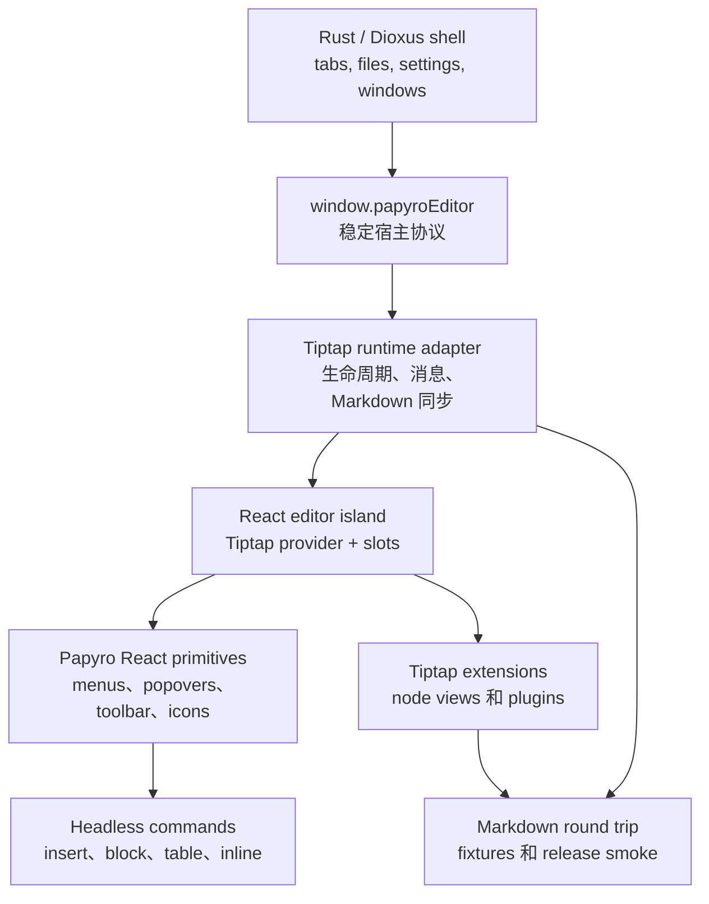

# Tiptap 企业级编辑器 TODO

[English](../tiptap-enterprise-editor-todo.md) | [官方优先 React 策略](tiptap-official-react-strategy.md) | [React 运行时方案](tiptap-react-runtime-plan.md) | [路线图](roadmap.md)

这份文档是把 Papyro 的 Tiptap 编辑器打磨到可上线、接近 Notion-like Markdown 编辑体验的执行清单。它比路线图更具体：每个里程碑都包含范围、实现要点、验收标准和验证方式。

## 当前状态

`feat-tiptap` 分支已经改变了运行时方向，但可见体验还没有完成。

- Hybrid 模式已经使用 Tiptap/ProseMirror，并保留 Dioxus 侧使用的 `window.papyroEditor` facade。
- `js/src/tiptap-react/` 下已经有 React island 基座。
- 许多高级编辑器表面仍然来自 `js/src/tiptap-*.js` 里的手写 DOM controller。
- Tiptap 官方 Notion-like template 目前仍只是体验标尺，不是已经接入的组件系统。

所以你现在看到的体验仍然可能像之前那套自研实现。下一步必须把用户能感知到的 editor chrome 迁移到官方 Tiptap React 模式，而不是继续围着 DOM 打补丁。

## 官方基线

执行这里任何任务前，先刷新并查看本地官方参考：

```powershell
git -C E:\tiptap pull --ff-only
git -C .reference\tiptap-docs pull --ff-only
```

主要参考：

- `E:\tiptap\packages\react`
- `E:\tiptap\packages\extension-drag-handle-react`
- `E:\tiptap\packages\extension-node-range`
- `E:\tiptap\packages\extension-table`
- `.reference/tiptap-docs/src/content/guides/react-composable-api.mdx`
- `.reference/tiptap-docs/src/content/editor/getting-started/install/react.mdx`
- `.reference/tiptap-docs/src/content/ui-components/templates/notion-like-editor.mdx`
- `.reference/tiptap-docs/src/content/ui-components/node-components/table-node.mdx`
- `.reference/tiptap-docs/src/content/ui-components/components/drag-context-menu.mdx`
- `.reference/tiptap-docs/src/content/ui-components/components/slash-dropdown-menu.mdx`

规则：

- 使用稳定版 Tiptap 3，并保持所有 `@tiptap/*` 依赖版本一致。
- 编辑器 UI 优先使用 React composable API。
- Notion-like editor、`table-node`、`drag-context-menu`、`slash-dropdown-menu` 在未授权前按 licensed/non-open UI 处理。
- 官方开源 package 可以直接用。没有授权源码时，只能在 Papyro 内按相同产品原则重新实现交互。

## 默认免费/开源路线

除非项目明确加入授权后的 Tiptap Start/Pro 输出，否则 Papyro 默认走官方免费能力优先的路线：

1. 使用官方免费/开源 Tiptap package 作为文档模型和编辑基础。
2. 由 Papyro 自己封装 React 层：命令菜单、popover、toolbar、node view、表格 chrome、块句柄。
3. 官方 Notion-like 交互只作为 UX 标尺，不复制未授权源码。
4. 每个核心表面完成后先和产品 owner 确认，再标记完成。
5. 持续迭代到真实 WebView 手感符合双方确认的验收标准，而不是只满足测试通过。

这条路线比直接接入付费 UI 输出更慢，但可以保证代码合法、本地优先、可维护。最终目标不是做一堆一次性仿制控件，而是沉淀出 Papyro 自己可持续演进的企业级编辑器系统。

确认节点：

- Milestone 1 后，确认 React 编辑器壳和共享 primitives 是否适合作为长期基础。
- Milestone 2 后，确认 slash/`+` 插入布局、键盘行为和命令分组。
- Milestone 3 后，确认块句柄点击、拖拽、菜单和高亮行为。
- Milestone 4 后，对照官方标尺确认表格选择、resize、新增行列和单元格菜单。
- Milestone 5 和 6 后，确认代码块和浮动格式栏打磨效果。
- Milestone 10 前，按 release smoke checklist 一起做最终验收。

## 目标架构



不可妥协的边界：

- Dioxus 不直接导入 Tiptap 内部实现。
- React 只负责编辑器 UI，不接管 workspace 或文件状态。
- 命令定义必须 data-first，供 slash 菜单、句柄、快捷键、测试和未来命令面板共用。
- 旧 DOM controller 只是迁移期代码。某个里程碑完成时，要删除已经被替换的 controller 和 CSS。
- Markdown 继续作为唯一持久化源。

## 完成定义

Tiptap 编辑器达到可上线标准时，必须同时满足：

- Hybrid 模式在 block、table、code、math、Mermaid、image、task list、paste、undo、IME 上像原生文档编辑器。
- Source、Hybrid、Preview 可以安全 Markdown round-trip，不发生静默数据丢失。
- Slash 插入、块句柄、浮动格式栏、代码块控件、表格控件都是基于共享 primitives 的 React 组件。
- pointer、keyboard、focus、outside-dismiss、drag、resize 在桌面 WebView 中行为可预测。
- 所有新编辑器动作都有中英文文案。
- 自动化 JS/Rust 检查和手工 WebView smoke 都通过。
- 架构足够模块化，新增一种 block 不需要继续修改巨型 runtime 文件。

## Milestone 0 - 产品和授权决策

目标：先停止猜测到底是重建官方体验，还是直接集成官方 UI。

任务：

- [ ] 决定 Papyro 是否购买/使用 Tiptap Start/Pro 生产路径。
- [ ] 如果使用授权路径，把 Tiptap CLI 生成的官方 UI 源码放入明确隔离的 third-party 区域。
- [ ] 如果不使用授权路径，记录哪些官方交互要本地复刻，哪些延后。
- [ ] 如果复制公开 Tiptap UI 仓库中的 MIT 源码，补充 attribution 和升级说明。
- [ ] 固定交互标尺：Notion-like block handle、slash insert、table node、floating toolbar、responsive toolbar。

验收标准：

- 未授权时不复制 non-open Tiptap UI 源码。
- 选定路径已写入 [Tiptap 官方优先 React 策略](tiptap-official-react-strategy.md)。
- 后续每个里程碑都写清使用授权官方源码还是 Papyro 本地等价实现。

验证：

```powershell
git status --short
node scripts/check-workspace-deps.js
```

## Milestone 1 - React Island 成为唯一 Editor Chrome 宿主

目标：让 React 真正接管编辑器 UI，而不是只作为旧 DOM controller 外面的挂载壳。

任务：

- [ ] 增加 `js/src/tiptap-react/components/`、`commands/`、`hooks/`、`extensions/`、`utils/` 模块。
- [ ] 把共享浮层生命周期迁入 React：外部点击、Escape、焦点回流、滚动、窗口变化、WebView body 焦点竞态。
- [ ] 增加共享 React primitives：`EditorPopover`、`CommandMenu`、`CommandItem`、`CommandSection`、`IconButton`、`ToolbarButton`、`Kbd`、`VisuallyHidden`。
  - 当前覆盖：slash、块操作和表格上下文命令行已经共享 React primitives。表格几何、选区遮罩、resize 轨道和快捷新增轨道仍由迁移期 controller 管理。
- [ ] 为 insert、block action、inline format、table、code block 定义 typed command model。
- [ ] 暴露稳定 runtime hooks：editor instance、language、view mode、preferences、command executor、active selection snapshot。
- [ ] 在 React 替换完成前，把旧 DOM controller 放在 runtime flag 后面，避免双系统同时抢 UI。

验收标准：

- 新 editor UI 通过 React slots 添加，不再直接 `document.createElement` 造浮层。
- 菜单内部 hover 或键盘移动不会重建整棵 overlay DOM。
- slash、block、table、toolbar 面板共用同一套浮层关闭语义。
- 不新增巨型 `NotionEditor.jsx` 或巨型 controller 文件。

验证：

```powershell
npm --prefix js test
npm --prefix js run build
node scripts/report-file-lines.js
```

手工 smoke：

- 打开 Hybrid。
- 打开任意命令面板。
- 缓慢把鼠标移入面板。
- 确认它不会在外部点击、Escape、执行命令或有意滚动编辑器外部之前消失。

## Milestone 2 - Slash 和 Insert 菜单

目标：让 `/` 和 `+` 插入成为专业文档命令面板。

任务：

- [x] 用 React command menu 替换 DOM slash menu。
- [x] 核心插入命令按 Text、Lists、Blocks、Data、Media、Advanced 分组。
- [ ] 等命令使用历史存在后再增加 Recent 分组。
- [ ] 支持表格尺寸、callout 样式、代码语言、未来 diagram/math 模板的二级详情面板。
  - 当前覆盖：表格尺寸、callout 样式和代码语言面板已实现，并锚定到当前激活命令行。
- [x] 修复键盘导航，ArrowDown 必须能到达每一项，不能没到表格就回到第一项。
- [x] 支持 Home 和 End 在完整插入命令列表中跳转。
- [x] 详情面板跟随当前命令右侧定位，不要飘到右上角奇怪位置。
- [x] 为当前命令增加本地化 title、description、搜索别名和空状态。
- [x] 命令过滤要保持稳定 active item；只有键盘导航时才强制 scroll into view。
- [x] 保持 `+` 语义独立：在当前 block 下方插入、在新光标处打开菜单、取消时清理临时 slash 文本。
- [x] 用共享的 Lucide-backed React 图标系统替换 slash 菜单里临时感较强的 glyph，并为命令分组增加语义化色调。
  - 当前打磨：slash 和 `+` 菜单已改为更克制的中性图标框，表格尺寸二级面板变窄，并同步了定位宽度契约。

验收标准：

- 用户手打 `/` 和点击 gutter `+` 打开同一套插入系统，但锚点不同。
- 表格尺寸选择器可以用键盘和鼠标触达。
- hover 详情面板不会盖住下方命令导致无法继续选择。
- 每个命令都有清晰 icon、标题、描述和 i18n 文案。

验证：

```powershell
node scripts/check-editor-markdown-gate.js
```

手工 smoke：

- 输入 `/`，用 ArrowDown 从第一项移动到表格并插入。
- 点击段落旁边的 `+`，分别插入标题、表格、代码块、公式、Mermaid 和 callout。
- 切换中英文后重复。

## Milestone 3 - Drag Handle 和块操作菜单

目标：让左侧块句柄像真正的文档编辑器句柄。

任务：

- [ ] 评估用 `@tiptap/extension-drag-handle-react` 和 `@tiptap/extension-node-range` 替换本地句柄代码。
  - 决策已写入 [Tiptap 官方优先 React 策略](tiptap-official-react-strategy.md)：官方 DragHandle 负责节点跟踪/拖拽，Papyro React handle 继续负责动作和插入控件，表格仍归 table overlay 管理。
  - 基础已接入：`@tiptap/extension-node-range` 已加入编辑器 extension 链，使用 `Mod` 鼠标范围选择，并补齐 Papyro 主题化的 range-selection CSS。
  - 基础已接入：官方 DragHandle adapter 配置和 Papyro 排除规则已在 `js/src/tiptap-official-drag-handle.js` 中测试覆盖；运行时行为仍需从兼容 controller 切到官方 plugin。
  - 基础已接入：React 官方 DragHandle bridge 现在只在可编辑 Hybrid 模式且存在 block-handle controller 时注册，Source/Preview 不再保持官方 hover plugin 激活。
  - 基础已接入：块操作菜单和插入菜单打开时会锁定官方 DragHandle plugin；优先调用 `lockDragHandle`/`unlockDragHandle`，React bridge 场景下回退到 `setMeta("lockDragHandle", ...)`。
- [ ] 用 React 渲染句柄，明确分成拖拽/操作句柄和插入 `+` 两个控件。
  - 视觉 view 已完成：桌面端/移动端 bundle 入口现在注入 React block-handle view，现有 controller 仍负责行为。
  - 仍需继续：把行为迁移到官方 `DragHandle`/`NodeRange` 集成。
- [ ] 普通点击时在点击点右侧打开块操作菜单，而不是长按才可能打开。
- [ ] 右键阻止 WebView 原生菜单，只展示 Papyro 动作。
- [ ] 高亮完整语义 block，包括行内代码和混合 mark。
- [ ] 实现可靠拖拽排序、drop indicator 和 transaction 级测试。
- [ ] 复杂节点只显示 block 级句柄：表格、代码块、图片、公式、Mermaid 不出现每个子元素的句柄。
  - 兼容句柄路径已覆盖：表格、代码块、图片 node view、独立公式和 Mermaid 的内部元素会归属到外层复杂 block。
  - 仍需继续：在最终 React 句柄里基于官方 drag-handle/node-range API 落地。
- [ ] 增加块动作：复制 Markdown、重复、删除、重置格式、文字颜色、高亮、turn into、上移/下移。

验收标准：

- 点击句柄会选中并高亮当前块。
- 拖拽只有超过移动阈值后才开始。
- 鼠标从句柄移到菜单不会关闭菜单。
- 插入 `+` 永远不会打开块操作菜单。
- 表格和列表不出现冗余的每单元格或每列表项块句柄。

验证：

```powershell
npm --prefix js test
node scripts/check-tiptap-release-smoke.js
```

手工 smoke：

- 对段落、标题、列表项、代码块、表格、图片、公式、Mermaid、callout 分别点击、右键和拖拽句柄。
- 确认选中背景覆盖语义 block，而不是只覆盖普通文本。

## Milestone 4 - 表格 UX 重建

目标：表格编辑要接近官方 Notion-like table 体验，而不是像调试 overlay。

决策路径：

- 授权路径：集成官方 `table-node` 输出，并适配 Papyro token、Markdown 持久化和 i18n。
- 未授权路径：基于 `@tiptap/extension-table`、ProseMirror table utilities 和 Papyro React overlay 重建同类交互原则。

任务：

- [ ] 删除左上角选择整张表格入口，除非有明确产品动作需要它。
- [ ] 默认隐藏可视句柄。只有在第一行或第一列附近有明确 hover 意图时展示行/列句柄。
- [ ] 整个单元格表面都能进入编辑和聚焦，不应该只有中间一小块能触发。
  - 当前覆盖：空白单元格表面和空段落表面会走表格聚焦 fallback；已有文字的行内内容继续交给 ProseMirror 原生文本选择，不会启动表格范围拖选。
- [ ] 单元格之间不能有视觉间隙，保证 selection 和 resize border 连续。
- [ ] 点击单元格后，用主题色边框高亮当前单元格。
  - 当前覆盖：活跃和选中单元格使用更克制、连续的主题色边框；单元格菜单触发点按真实单元格垂直居中锚定，hover 只作为次级反馈。
- [ ] 多单元格框选后显示克制遮罩，并在选区边缘显示小操作触发点。
  - 当前覆盖：表格单元格操作触发器默认是边缘小点，只在 hover、focus 或打开状态展开为紧凑四点 grip。
- [ ] 增加单元格菜单：合并、拆分、对齐、文字颜色、背景颜色、清除格式、复制、删除内容。
  - 当前覆盖：真实运行时的表格上下文菜单从 editor 入口注入，并由 React 组件渲染。headless 命令模型和 fake-DOM fallback 会保留到其余表格 chrome 完成迁移。
  - 当前覆盖：选中单元格内容现在可以通过 Papyro 命令清空，底层复用官方 `@tiptap/pm/tables` 的 `deleteCellSelection` utility，并已补齐菜单元数据、国际化标签和真实 editor 挂载测试。
- [ ] 从细边缘句柄打开行/列操作菜单。
- [ ] 列边框支持 resize，即使当前已有单元格选中也不能失效。
  - 当前覆盖：已选中的表格单元格不会仅因为选中态就露出列 resize handle；resize chrome 只跟随 hover 或正在 resize 的明确意图。
- [ ] 增加快捷新增行/列轨道：贴近表格边缘的细长轨道，宽/高跟随整表，中间是 `+`。
  - 当前覆盖：快捷新增轨道已贴着真实表格网格边缘，使用 12px 的紧凑 chrome，在亮色/暗色主题下保持对比度，但不再像调试 overlay。
- [ ] 表格控件不能出现在相邻代码块或其它非表格内容下面。
- [ ] 为对齐、表头、合并单元格 fallback、单元格背景 metadata 补 Markdown round-trip fixtures。

验收标准：

- 空闲状态下表格干净。
- hover 第一行/列时只显示相关细句柄。
- 点击行/列句柄会选择对应轴并打开作用域菜单。
- 点击单元格会选中该单元格，同时文字编辑仍然自然。
- 拖选多个单元格后出现 range action trigger，且可以合并。
- 列 resize 从列边框触发，选中单元格后仍然可用。
- 快捷新增行/列控件在亮色和暗色主题都清晰。

验证：

```powershell
npm --prefix js test
npm --prefix js run build
node scripts/check-tiptap-release-smoke.js
```

手工 smoke：

- 插入 2x2、3x3、6x6 表格。
- 点击单元格不同区域都能编辑。
- 分别选择单元格、行、列和单元格范围。
- 拖动调整列宽。
- 用边缘轨道添加行和列。
- 保存、关闭、重开，确认 Markdown round-trip 正常。

## Milestone 5 - 代码块体验

目标：代码块阅读和编辑都达到专业 Markdown block 水平。

任务：

- [ ] 如果能提升可维护性，用 React node view 实现代码块 chrome。
- [ ] 显示语言标签，并支持切换语言。
  - 当前覆盖：代码块已提供语言 badge、显式/自动状态数据、紧凑语言 token 和可编辑语言菜单。
- [ ] 增加复制按钮、自动换行开关；如果定义了 Markdown 策略，再支持 filename/title metadata。
  - 当前覆盖：代码块 node-view chrome 已提供低噪声复制和软换行控件，不改变保存后的 Markdown。
- [ ] 亮色和暗色模式都使用真正的代码高亮主题。
  - 当前覆盖：Hybrid 代码块使用 lowlight 的 `.hljs-*` class，并通过主题 token、亮色模式左侧强调线与 smoke 检查覆盖核心语法分组。
- [ ] fenced code language 通过 Markdown round-trip 保留。
- [ ] 为代码块前后增加插入入口，尤其是表格紧挨代码块的场景。
  - 当前覆盖：复杂块插入 rail 已有独立且更宽容的底部热区，用于 table/code 相邻处插入，同时不扩大表格 resize 或 quick-add 的意图范围。

验收标准：

- 亮色模式不再是一整块纯蓝。
- 用户可以不用编辑 fence 原文就查看和修改语言。
- 表格和代码块之间可以插入新段落。
- 复制和语言控件可发现但不喧宾夺主。

验证：

```powershell
npm --prefix js test
node scripts/check-tiptap-release-smoke.js
```

手工 smoke：

- 插入 JavaScript、Rust、JSON、Markdown、plain text 代码块。
- 修改语言并保存重开。
- 测试表格 + 代码块相邻时的中间插入。

## Milestone 6 - 浮动格式栏

目标：选中文本后的格式操作要紧凑、稳定、键盘可访问。

任务：

- [ ] 将浮动格式栏迁入 React。
- [ ] 用 Tiptap state selector 获取 active marks，不再 DOM polling。
- [ ] 增加加粗、斜体、删除线、行内代码、链接、文字颜色、高亮、清除格式、turn into。
- [ ] 靠近视口边缘时定位稳定。
- [ ] 支持键盘访问和焦点回到编辑器。
- [ ] 本地化 label 和 tooltip。

验收标准：

- 点击工具栏不会丢失选区。
- 鼠标轻微移动不会闪烁。
- active 状态和选中文本一致。
- 链接编辑不依赖浏览器原生 prompt。

验证：

```powershell
npm --prefix js test
npm --prefix js run build
```

手工 smoke：

- 分别选择英文、中文、行内代码、链接文本、混合格式文本。
- 应用每个 mark，并逐个 undo/redo。

## Milestone 7 - Markdown Node Views

目标：复杂 Markdown 结构都变成可维护 node view，并有序列化测试。

任务：

- [ ] 审核当前 task list、image、math、Mermaid、callout、table、code block 实现。
- [ ] 只有在能降低复杂度或提升体验时，才迁到 React node view。
- [ ] 为每个 node 定义 Markdown parse、editor JSON、Markdown serialize 行为。
- [ ] 为不支持的 metadata 定义 fallback。
- [ ] Mermaid 和 math 要有错误状态，但不能阻塞编辑。
- [ ] node-view UI 不能被序列化到 Markdown；需要可编辑的内容保留 contentDOM。

验收标准：

- 每个复杂 node 只有一个 owner module。
- 编辑器 UI chrome 不会泄漏到 Markdown 输出。
- parse 失败会回退为可编辑 Markdown 或可恢复错误界面。

验证：

```powershell
npm --prefix js test
node scripts/check-tiptap-release-smoke.js
```

## Milestone 8 - 模式契约和持久化

目标：Source、Hybrid、Preview 要像同一份文档的三种视图。

任务：

- [ ] 审核 Source/Hybrid/Preview 切换时的 selection、scroll、undo、dirty state、outline sync。
- [ ] Source 编辑未变化内容时不触发重复 dirty。
- [ ] Hybrid 修改产出规范 Markdown。
- [ ] Preview 与 Hybrid 使用一致的 Markdown 视觉语言。
- [ ] 为保存失败和外部文件变更补冲突行为测试。
- [ ] 重构期间保持 `window.papyroEditor` 稳定。

验收标准：

- 切换模式不丢 selection、scroll 或 edits。
- 保存失败仍保留 dirty。
- Preview 和 Hybrid 在标题、表格、代码、callout、math、Mermaid、image 上表现一致。

验证：

```powershell
npm --prefix js test
cargo test
node scripts/check-tiptap-release-smoke.js
```

## Milestone 9 - i18n、可访问性和键盘

目标：编辑器在中文和英文下都能通过真实键盘和可访问性语义使用。

任务：

- [ ] 所有新 editor 文案都接入 i18n model。
- [ ] icon-only 控件都有 accessible label。
- [ ] 菜单统一使用 `aria-activedescendant` 或 roving tab index。
- [ ] 支持 Escape、Enter、Space、方向键、Home、End、Tab、Shift+Tab、Shift+F10 等相关键位。
- [ ] IME composition 期间保护菜单键盘处理，避免中文输入确认触发命令。
- [ ] focus ring 可见并使用主题 token。

验收标准：

- 中文 IME 不会误触发命令。
- 键盘可以打开并操作 slash、block、table、code language、formatting 菜单。
- icon-only 控件在中英文下都有可理解的可访问名称。

验证：

```powershell
npm --prefix js test
node scripts/check-ui-a11y.js
node scripts/check-ui-contrast.js
```

手工 smoke：

- 在段落、表格单元格、代码块、任务列表、callout 中输入中文。
- 全键盘操作每个编辑器菜单。

## Milestone 10 - 性能、清理和发布闸门

目标：通过删除旧代码和完整验收证明编辑器可以上线。

任务：

- [ ] React 替换完成后删除过时 DOM controller。
- [ ] 删除未使用 CSS 和旧 `.cm-*` 残留。
- [ ] JS 文件保持在行数预算内，超过前先拆分。
- [ ] 为 editor open、tab switch、mode switch、command menu open、table edit、save 增加性能 trace。
- [ ] 重新构建生成 bundle 和桌面/mobile 副本。
- [ ] 跑完整自动化检查。
- [ ] 提交编辑器 runtime 改动前，运行真实挂载的编辑器 smoke gate。
- [ ] 在桌面 WebView 执行完整 Tiptap release smoke。

验收标准：

- 高级 editor chrome 不再由一次性 DOM controller 持有。
- 文件行数预算通过。
- 生成的 `assets/editor.js` 已同步。
- 合并 `feat-tiptap` 前，手工 smoke 结果已记录。

验证：

```powershell
npm --prefix js run build
npm --prefix js test
node scripts/check-workspace-deps.js
node scripts/check-tiptap-release-smoke.js
node scripts/check-tiptap-runtime-smoke.js
node scripts/check-perf-docs.js
node scripts/check-ui-a11y.js
node scripts/check-ui-contrast.js
node scripts/check-ui-primitives.js
node scripts/report-file-lines.js
cargo test
git diff --check
```

手工 smoke 清单：

- Source、Hybrid、Preview 切换。
- 中文 IME。
- 粘贴 Markdown、HTML、图片、URL。
- 文本、表格、块操作的 undo/redo。
- Slash 和 `+` 插入。
- 块操作菜单和拖拽排序。
- 表格插入、选择、resize、新增行列、合并/拆分、对齐、颜色。
- 代码块语言切换和高亮。
- Math、Mermaid、image、callout、task list。
- 大纲跳转。
- 保存失败和恢复。
- 系统打开 Markdown 文件流程。

## 每个任务的执行规则

每勾掉一个任务，都按这个循环：

1. 阅读对应 Tiptap 官方文档和源码。
2. 决定使用授权集成还是本地等价实现。
3. 增加或更新聚焦的 React component、hook、command 或 extension module。
4. 先补单元/契约测试，再做大范围视觉打磨。
5. JS 改动后重新构建生成 bundle。
6. 运行对应验证命令；涉及编辑器时必须包含 `node scripts/check-editor-markdown-gate.js`。
7. 行为、架构或已知限制发生变化时同步更新文档。
8. 使用英文 Conventional Commit 提交。

编辑器代码提交闸门：

- Tiptap/editor 代码如果导致 Markdown fixture 渲染或 round-trip smoke 失败，不能提交。
- 这个闸门同样适用于编辑器 CSS、生成的 editor bundle、Markdown 解析、Markdown 渲染、Preview 一致性和 node-view 改动。
- 编辑器 runtime 改动提交前至少运行 `node scripts/check-editor-markdown-gate.js`。它会运行 JS 测试、重建生成 bundle、检查 Markdown 样式、验证 release round-trip、真实挂载 Tiptap runtime，并检查生成 bundle 同步。
- 如果改动影响 Markdown 解析、序列化、Preview 一致性或 node view，提交前必须新增或更新 fixture。

提交示例：

- `feat: add react slash command menu`
- `feat: rebuild tiptap table chrome`
- `fix: stabilize block handle dismissal`
- `test: cover tiptap table selection commands`
- `docs: update tiptap editor todo`
