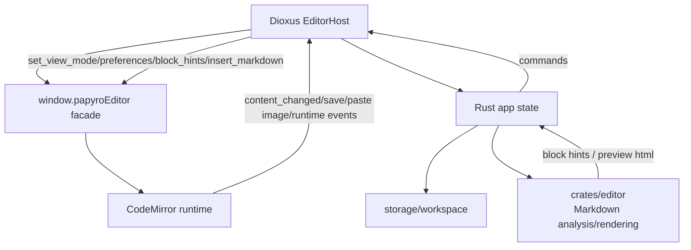
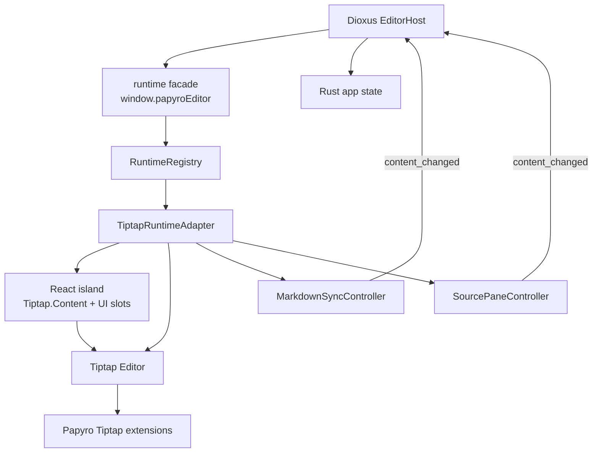

# Tiptap 迁移计划

[English](../tiptap-migration-plan.md) | [路线图](roadmap.md) | [编辑器指南](editor.md)

这个分支 `feat-tiptap` 专门用于把 Papyro 的交互式编辑器运行时从 CodeMirror 迁移到 Tiptap。目标不是“换一个库能跑”，而是把编辑器升级成可持续迭代的企业级 Markdown 写作内核。

## 迁移目标

- 保留本地 Markdown 文件作为唯一持久化格式。
- 保持 Rust/Dioxus 应用层的 tab、dirty/save/conflict、workspace 和 preview 流程不被编辑器库绑死。
- 用 Tiptap/ProseMirror 文档模型承载 Hybrid 写作体验，减少手写 decorations 对光标、选区和 hit testing 的影响。
- 让表格、任务列表、公式、Mermaid、图片和未来 block 组件变成可扩展的 extension/node view，而不是零散 DOM hack。
- 迁移后仍支持 Source、Hybrid、Preview 三种用户心智。

## 当前架构事实

现有 JS facade 暴露：

- `ensureEditor({ tabId, containerId, instanceId, initialContent, viewMode })`
- `attachChannel(tabId, dioxus)`
- `handleRustMessage(tabId, message)`
- `attachPreviewScroll`
- `navigateOutline`
- `syncOutline`
- `scrollEditorToLine`
- `scrollPreviewToHeading`
- `renderPreviewMermaid`

迁移早期必须保留这个 facade，让 Rust/Dioxus 侧不跟着重写。真正替换的是 facade 后面的 runtime adapter。

## 官方能力评估

Tiptap 官方文档确认三件事适合 Papyro：

- Tiptap 支持 Vanilla JavaScript 和 ES module 构建，可在当前 `js/` esbuild 管线中使用 `@tiptap/core`、`@tiptap/pm`、`@tiptap/starter-kit`。
- `@tiptap/markdown` 提供 Markdown 和 Tiptap JSON 的双向转换，支持 `editor.commands.setContent(markdown, { contentType: "markdown" })`、`editor.commands.insertContent(markdown, { contentType: "markdown" })` 和 `editor.getMarkdown()`。
- Node views 可以用纯 JavaScript 实现，并且可以把编辑器内部 UI 与序列化输出分开；复杂 block 可以暴露 `contentDOM` 或设置 `contenteditable="false"`。

参考：

- [Tiptap Vanilla JavaScript install](https://tiptap.dev/docs/editor/getting-started/install/cdn)
- [Tiptap Markdown basic usage](https://tiptap.dev/docs/editor/markdown/getting-started/basic-usage)
- [Tiptap Markdown introduction](https://tiptap.dev/docs/editor/markdown)
- [Tiptap JavaScript node views](https://tiptap.dev/docs/editor/extensions/custom-extensions/node-views/javascript)
- [Tiptap Notion-like editor template](https://tiptap.dev/docs/ui-components/templates/notion-like-editor)

## Notion-like 交互参考

Tiptap 官方的 Notion-like template 是 Papyro 后续 Hybrid 编辑器非常值得参考的产品范式。它展示了块级写作界面、slash command、上下文浮动格式栏、块拖拽、响应式工具栏、暗亮主题、富 block 插入、链接管理和撤销重做等能力。

Papyro 应该借鉴它的交互模型，而不是直接引入整套产品依赖。该模板生产使用需要 Start plan，本身是 React UI Components 模板，并且默认带有协作、AI、JWT 和上传服务等 Cloud 场景假设。Papyro 仍然是 local-first Markdown 应用，因此迁移时要用 vanilla Tiptap 模块、本地 Markdown 持久化、现有 Dioxus chrome 和 Papyro design tokens 重建适合自身的交互。

受该模板启发的产品目标：

- **Slash command 菜单**：快速插入标题、列表、任务、表格、代码、公式、Mermaid、图片和 callout。
- **浮动格式栏**：选中文字时展示紧凑的上下文格式操作，使用 Papyro primitives，不使用浏览器原生控件。
- **块级操作柄**：Markdown round-trip 稳定后，再支持移动、复制、删除等块级操作。
- **响应式编辑器 chrome**：窄窗口下仍然保留核心写作动作，不让工具栏挤压正文。
- **Token 化样式**：`.mn-tiptap-*` 语义类必须映射到现有主题系统，不整包照搬模板 CSS。

这条参考的实现规则：

- 先做 headless command controller，再画菜单。同一套命令模型必须服务 slash search、工具栏按钮、键盘快捷键和测试。
- 对还没有原生 Tiptap node 的块，先使用 Markdown 插入保持可用；后续再逐个升级成有测试的 extension。
- Notion-like UI 必须保持可选且本地化。协作、AI、评论、上传和 JWT 流程不属于本迁移分支，除非后续有单独产品决策。
- 命令 label 和 group 要足够稳定，便于后续接入 i18n 和 Dioxus chrome。

迁移后的编辑器 UI 演进要遵循 [Tiptap React 运行时方案](tiptap-react-runtime-plan.md)。该方案保持现有 Rust/Dioxus facade 稳定，同时把高级编辑器 UI 迁移到基于官方 Tiptap React API 的可组合 React island。

## 企业级工程准则

- **稳定 facade**：Rust 侧只依赖 `window.papyroEditor` 协议，不直接知道 Tiptap。
- **Adapter 隔离**：`CodeMirrorAdapter` 和 `TiptapAdapter` 不能混在一个大文件里。迁移期间可以并存，但业务入口只调统一 runtime adapter。
- **Markdown round-trip 优先**：每个扩展必须说明 Markdown 输入、编辑态 JSON、Markdown 输出怎么对应。
- **失败可降级**：Markdown 解析失败、extension handler 缺失、node view 渲染失败时，用户至少能回到 Source 模式修正文档。
- **测试先行**：迁移每个 block 前先补 fixture 或 JS 单测；不能只靠手测通过。
- **生成物同步**：`assets/editor.js`、桌面端和移动端副本必须和源码同提交。
- **预算受控**：继续满足 bundle 生成、单文件行数、UI primitive、a11y、contrast、token audit 和 Rust checks。
- **可迭代 extension 体系**：表格、公式、Mermaid、图片、callout 都应是独立 extension/adapter 模块，而不是写进一个巨型 runtime 文件。
- **输入法和撤销不可回归**：IME、paste、undo/redo、selection、keyboard navigation 是验收项，不是后续优化项。
- **企业级代码质量**：生成实现代码必须高可复用、可迭代、健壮，有契约测试，并且不能制造第二个巨型编辑器 runtime。

## 目标架构

### 模块边界

| 模块 | 责任 |
| --- | --- |
| `runtime-facade` | 保持现有 `window.papyroEditor` API，分发 Rust 消息 |
| `runtime-registry` | 管理 tab -> runtime entry，处理 attach/recycle/destroy |
| `tiptap-adapter` | 创建 Tiptap、切换 view mode、同步内容、发事件 |
| `markdown-sync` | 维护 canonical Markdown，处理 set/insert/get/parse 错误 |
| `source-pane` | Source 模式源码编辑，不依赖 CodeMirror |
| `extensions/*` | 表格、任务、数学、Mermaid、图片等 Tiptap 扩展 |
| `scroll-outline` | 编辑器滚动、大纲联动、预览滚动保持独立 |

## 分阶段任务

### 0. 分支和计划

- [x] 创建 `feat-tiptap` 分支。
- [x] 写清迁移计划、风险、验收标准并更新 roadmap。
- [x] 提交并推送计划文档。

### 1. 建立运行时边界

- [x] 抽出第一版 runtime adapter facade 契约和测试。
- [x] 增加 runtime registry 模块，管理 tab entry 生命周期。
- [x] 把当前 CodeMirror runtime 包装成可注入的 runtime 工厂。
- [x] 把当前 `js/src/editor.js` facade 入口拆成小模块。
  - `editor-runtime-bootstrap` 现在负责 runtime 选择、facade 创建和 host 安装，大入口只组装具体 adapter。
- [x] 定义 `EditorRuntimeAdapter` 契约：`mount`、`attachChannel`、`handleMessage`、`setViewMode`、`destroy`、`getMarkdown`。
- [x] 将迁移分支默认 runtime 切换到 Tiptap，同时保留显式 CodeMirror 回退选择器。
- [x] 增加 adapter contract 单测。
  - 该契约已把旧 host facade 桥接到稳定迁移方法，并显式保留 preview、大纲和 Mermaid helper，避免 Rust/Dioxus 兼容协议被隐式打散。

### 2. 引入 Tiptap 基础运行时

- [x] 安装 `@tiptap/core`、`@tiptap/pm`、`@tiptap/starter-kit`、`@tiptap/markdown`。
- [x] 新建 `TiptapRuntimeAdapter`，先支持段落、标题、列表、引用、代码块、链接、粗体、斜体、行内代码和删除线。
- [x] 通过 feature flag 或 runtime 选择器启用 Tiptap adapter。
- [x] 增加 Markdown parse/serialize fixture，覆盖中文、英文、标题、列表、链接和代码。

### 3. Source/Hybrid/Preview 模式契约

- [x] 迁移分支默认让 Hybrid 使用 Tiptap 富文本编辑。
- [x] Hybrid 交互设计参考官方 Notion-like template，但保持 local-first、Markdown-first 和 Papyro token 化样式。
- [x] 使用 `@tiptap/react` 和官方 `Tiptap.Content` 生命周期建立 React island 挂载基座，同时不改变 Rust/Dioxus facade。
- [x] 文档化官方 React 运行时方案，作为后续命令面板、拖拽句柄、表格 chrome 和 React node view 的演进依据。见 [Tiptap React 运行时方案](tiptap-react-runtime-plan.md)。
- [ ] 逐步把手写 DOM 编辑器 chrome 迁移成可复用 React 组件、官方 Tiptap React 扩展和聚焦 node view。
- [x] 增加 Tiptap mode controller，统一 Source、Hybrid、Preview，并让非 Hybrid 模式关闭富文本编辑态。
- [x] 增加可复用的 Tiptap slash command controller，覆盖标题、列表、引用、代码、分割线、表格、公式和 Mermaid。
- [x] 增加带键盘导航和 token 化样式的 Papyro slash command menu controller，用于常见 Markdown block 插入。
- [x] 增加 Papyro 浮动格式栏 controller，用于选中文字后的常见行内格式操作。
- [x] 增加 Papyro 块操作柄 controller，作为后续块操作的 hover 入口。
- [x] 增加第一版 Papyro 块操作菜单 controller，用于基础插入、转换和删除操作。
- [x] 封装 Tiptap popover 定位、菜单 active-descendant 状态、toolbar root 和显隐处理等可复用 UI primitives。
- [x] 基于共享 Tiptap UI primitives 增加高级 block action menu 和响应式编辑器 toolbar 行为。
  - 块操作菜单现在基于可复用命令模型，按 Insert/Text/Lists/Blocks/Advanced/Danger 分区展示，优先调用富 Tiptap 命令，不可用时回退 Markdown 插入，并保留键盘导航与桌面/移动端 token 化样式。
  - 块操作柄现在在重复 hover 刷新后仍保持回调稳定，并在 pointer 交互阶段触发 `+` 插入，避免 WebView click 顺序导致控件无响应。
  - 块操作柄 hover bridge 现在能覆盖正文与浮动控件之间的沟槽空隙，鼠标移向 `+` 和操作柄时不会提前消失。
  - 块操作菜单继续向官方 Notion-like template 的 Drag Context Menu 靠齐，包含当前块转换、文字颜色、高亮、重置格式、复制为 Markdown、重复块和删除动作，并接通 Ctrl/Cmd+C、Ctrl/Cmd+D、Delete/Backspace 等已展示快捷键。纯插入能力交给 `+`/slash 流程，避免块操作菜单和插入菜单职责混在一起。
  - 块操作柄现在把点击与拖拽拆成明确状态机：左键按下只选择当前块并记录点击点，释放且未超过拖拽阈值时才在指针右侧打开菜单；超过阈值才进入块移动。右键会阻止 WebView 原生菜单泄漏；菜单打开时当前块保持高亮，鼠标从沟槽控件移入浮层菜单不会误关闭。
  - `+` 操作柄现在会在下一行插入 slash 触发符，并在该光标位置打开插入菜单，让块动作和内容插入两个入口语义清晰分离。
  - 浮动格式栏现在暴露 density 状态，在窄窗口或选区空间受限时自动切换为 compact 控件，并从 pointerdown 执行命令以减少 WebView 焦点竞争。
  - slash/`+` 插入菜单、块操作菜单、浮动格式栏和表格工具条共享浮层 dismiss 生命周期：外部点击、滚动和窗口变化会关闭浮层，点击当前块或表格内部会保持上下文不丢失。
  - slash 菜单和块操作菜单共享 active-descendant 滚动逻辑，键盘导航长菜单时会保持当前命令可见。
- [x] Source 使用源码编辑面板，并通过 `MarkdownSyncController` 同步到 Tiptap。
- [x] 增加 `MarkdownSyncController`，作为 Tiptap runtime 更新的 canonical Markdown 状态边界。
- [x] Source 面板输入会跳过未变化 Markdown，避免源码编辑产生重复 dirty/content 事件。
- [x] Preview 继续使用 Rust HTML 渲染，不让 Tiptap 接管只读预览。
- [x] 模式切换不丢 selection、dirty state 或 scroll snapshot。
  - `TiptapModeSnapshotController` 在视图模式切换前保存 Hybrid ProseMirror 选区和 Source textarea 选区，并在 `set_view_mode` 后恢复目标模式选区。
  - Runtime 测试覆盖 Source/Hybrid 选区恢复、Markdown 内容版本变化后跳过过期选区快照，并验证模式切换不会发送 `content_changed`；滚动位置继续复用已有的按模式 scroll snapshot hook。
- [x] 大纲点击在 Source 和 Hybrid 都能跳到目标位置。

### 4. Rust/JS 协议兼容

- [x] 保持 Tiptap Markdown 变更后的 `content_changed` 事件，并用 runtime 测试覆盖。
- [x] 保持 `insert_markdown`、`set_view_mode` 消息不变，并用显式 runtime 测试覆盖。
- [x] 保持 Tiptap 键盘快捷键触发的 `save_requested`。
- [x] 通过独立 Tiptap history command controller 和稳定 `undo`/`redo` Rust 消息保持撤销/重做。
- [x] 通过共享 clipboard helper 保持 Tiptap 粘贴和拖拽图片时的 `paste_image_requested`。
- [x] 保持 parse 失败和 runtime command 失败时的 `runtime_error`。
- [x] 明确 `runtime_ready` 归 editor host 所有：Dioxus 在 `ensureEditor` 和 `attachChannel` 后发送，Tiptap adapter 不重复发送。
- [x] 保持 `destroy` 语义，包括 stale host instance 保护。
- [x] 通过 Tiptap preferences controller 保持 `set_preferences` 状态更新。
- [x] 通过 `set_preferences` 保持应用语言变化，让 Tiptap chrome 可以在不重建编辑器的情况下本地化 slash 命令、块操作、操作柄文案和表格工具条命令。
- [x] 通过 Tiptap block hints controller 对 `set_block_hints` 做兼容处理。
- [x] 通过 Tiptap paste controller 保持选中文字后粘贴 URL 的 `auto_link_paste` 行为。
- [x] slash 菜单和块操作菜单在 IME composition 期间会让出键盘处理，避免中文输入确认被菜单导航或命令执行吞掉。

### 5. Markdown block 能力迁移

- [x] Task list：checkbox 直接切换并 round-trip 为 `- [ ]` / `- [x]`。
- [x] Table：从 pipe table 解析到文档表格，支持 slash/`+` 表格尺寸选择、整表/行/列边缘选择 handle、pointer-first 工具条动作、键盘可访问的工具条导航、新增/删除行列、表格边缘快捷添加、更轻量的当前单元格上下文菜单用于合并/对齐/颜色操作、按单元格/行/列/整表选区裁剪上下文命令、行/列/整表 handle 点击即打开对应菜单、选中单元格与选中轴覆盖层、当前行列和整表 handle active 态、锚定到选区旁边的上下文菜单、更安静的 Notion-like 分组命令菜单、表头切换、归一化的单元格左/中/右对齐状态、基于 `editor.can()` 的 disabled 状态、合并/拆分单元格、单元格导航、表格修复和删除。
- [x] Math：inline/display 公式有编辑态、预览态和错误反馈。
- [x] Mermaid：保留源码编辑和渲染预览，失败时显示错误。
- [x] Image：本地图片 URL、粘贴图片请求和 Markdown 图片语法保持兼容。
- [x] Code block：语言信息、代码文本和高亮主题策略明确。
- [x] Callout/admonition：解析并序列化 `> [!NOTE]` 风格 Markdown，提供可复用 Tiptap node，并接入 slash/`+` 插入和块操作菜单。
- [x] 发布 smoke Markdown fixture 已接入自动化 round-trip 覆盖，覆盖标题、中文、列表、任务、callout、代码、对齐表格、公式、Mermaid 和图片。
- [x] 发布 smoke fixture checker 已接入完整本地检查脚本，避免手工 QA 前 fixture 覆盖静默漂移。

### 6. 删除 CodeMirror 依赖

- [x] 替换所有 CodeMirror runtime 入口和测试。
  - 生成 bundle 现在从 `editor-tiptap-entry` 构建，只安装 Tiptap adapter，并把共享滚动、大纲和 Mermaid 预览桥接放进 `editor-host-runtime`。
- [x] 移除 CodeMirror npm 依赖和 `codemirror-lang-mermaid`。
  - `js/package.json` 现在只保留 Tiptap、KaTeX、Mermaid 和 esbuild 相关依赖。旧 CodeMirror runtime 文件和测试已删除。
- [x] 清理 `.cm-*` 专属 CSS，保留迁移后的 `.mn-editor-*` 和 `.mn-tiptap-*` 语义类。
  - Dioxus host 容器现在使用 `mn-editor-runtime-host`，桌面 Markdown 样式中不再保留 CodeMirror host 或 `.cm-*` selector。
- [x] 确认 bundle 生成物同步且行数预算通过。

### 7. 验收

- [x] `npm --prefix js run build`
- [x] `npm --prefix js test`
- [x] `cargo fmt --check`
- [x] `cargo clippy --workspace --all-targets --all-features -- -D warnings`
- [x] `cargo test --workspace`
- [x] `node scripts/check-ui-primitives.js`
- [x] `node scripts/check-ui-a11y.js`
- [x] `node scripts/check-ui-contrast.js`
- [x] `node scripts/check-markdown-style-smoke.js`
- [x] `node scripts/check-markdown-style-smoke.js --self-test`
- [x] `node scripts/check-perf-smoke.js --self-test`
- [x] `node scripts/report-ui-tokens.js`
- [x] `node scripts/report-file-lines.js`
- [x] `git diff --check`
- [x] 块拖拽排序通过 Papyro 操作柄完成，并用 JS 测试覆盖 transaction 移动逻辑。
- [x] 文档化专项 [Tiptap 发布候选 Smoke 检查清单](tiptap-release-smoke.md)。
- [ ] 执行发布前手工 smoke：Source/Hybrid/Preview、中文 IME、粘贴、撤销、表格、公式、Mermaid、图片、大纲、保存失败、外部文件打开。

## 关键风险和处理策略

| 风险 | 处理 |
| --- | --- |
| `@tiptap/markdown` 仍是 beta，可能有 Markdown 边界问题 | 用 Papyro fixture 锁定 round-trip；复杂语法用自定义 handlers；失败时降级 Source |
| Source 模式可能不再保持原始格式细节 | 以 Markdown 内容语义为主；需要保真的区域先保留源码块策略；文档说明已知限制 |
| Tiptap extension 太分散导致运行时变大 | 每个 extension 独立模块和测试；构建后继续执行 bundle/行数预算 |
| Tiptap node view 与 Papyro CSS token 脱节 | 所有 node view 使用 `mn-tiptap-*` 语义类和现有 Markdown token |
| Rust block hints 与 Tiptap 文档模型重复 | 迁移期间保留协议兼容；最终由 Tiptap 文档模型承担交互式 block 判断，Rust 继续服务 preview/outline/summary |
| 多窗口和 tab 生命周期泄漏 editor instance | registry 必须有 destroy/recycle 测试；关闭 tab 后释放 Tiptap editor 和 DOM 监听 |

## 完成定义

Tiptap 迁移完成必须同时满足：

- `js/package.json` 不再依赖 CodeMirror。
- `window.papyroEditor` facade 仍可服务 Rust/Dioxus 现有消息。
- Source、Hybrid、Preview 都能完成日常 Markdown 写作。
- Markdown round-trip 覆盖标题、段落、列表、任务、链接、行内代码、代码块、表格、数学、Mermaid 和图片。
- 表格、公式、Mermaid、图片不是一次性 DOM hack，而是可测试、可维护的 extension 或 adapter 模块。
- 生成 bundle、桌面/mobile asset、Rust checks、JS tests 和 UI 检查全部通过。
