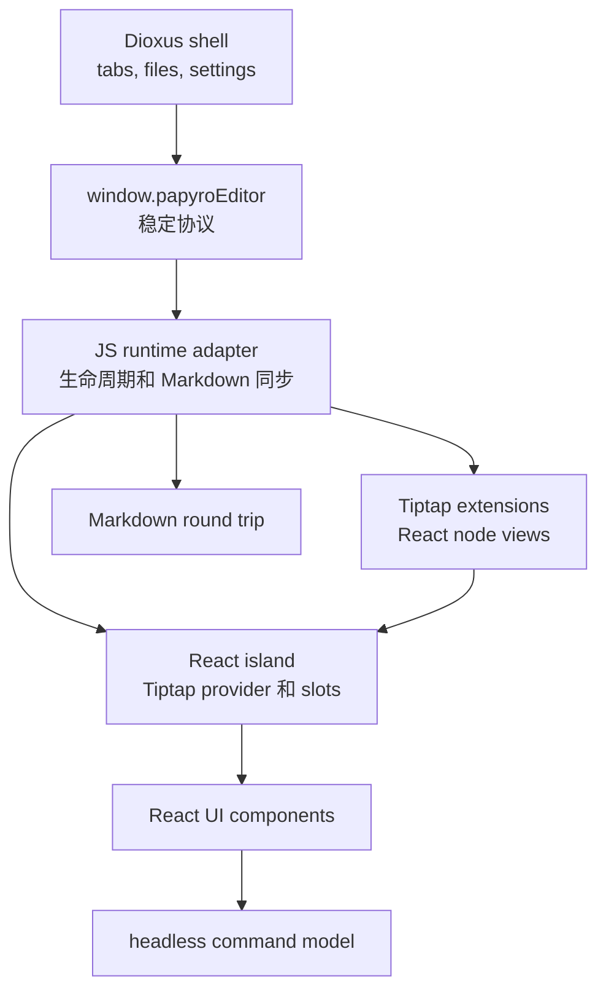

# Tiptap 官方优先 React 策略

[English](../tiptap-official-react-strategy.md) | [Tiptap React 运行时方案](tiptap-react-runtime-plan.md) | [企业级编辑器 TODO](tiptap-enterprise-editor-todo.md) | [路线图](roadmap.md)

这份文档记录 `feat-tiptap` 编辑器工作的官方优先策略。它的目的很直接：Papyro 不应该继续堆一次性的 DOM overlay，而应该迁到 Tiptap 官方示例同类的 React/Tiptap 组合模式。

## 决策

Papyro 保留 Rust/Dioxus 外壳、本地 Markdown 存储和 `window.papyroEditor` facade。富编辑器表面收进一个 React island，使用 Tiptap 3 官方 React API 和可合法复用的 Tiptap UI 代码。

目标结构：

React 不是第二个应用外壳。它只负责编辑器 UI runtime。Dioxus 继续负责产品外壳。

## 已核对的官方来源

这次决策前，已更新并查看本地官方来源：

- `E:\tiptap\packages\react\src\Tiptap.tsx`
- `E:\tiptap\packages\extension-drag-handle-react`
- `E:\tiptap\packages\extension-table`
- `.reference/tiptap-docs/src/content/guides/react-composable-api.mdx`
- `.reference/tiptap-docs/src/content/editor/getting-started/install/react.mdx`
- `.reference/tiptap-docs/src/content/ui-components/templates/notion-like-editor.mdx`
- `.reference/tiptap-docs/src/content/ui-components/node-components/table-node.mdx`
- `.reference/tiptap-ui-components/README.md`

当前 `js/package.json` 里的 Tiptap 依赖都固定在同一个 `3.22.5` 版本，符合 Tiptap 包版本一致性的要求。

## 授权边界

复制或改造任何 Tiptap UI 代码前，先看这张表：

| 来源 | 状态 | Papyro 处理方式 |
| --- | --- | --- |
| `@tiptap/*` core packages | 开源 npm 依赖 | 直接使用，但所有 `@tiptap/*` 版本必须保持一致。 |
| 公开 `ueberdosis/tiptap-ui-components` 仓库 | MIT 组件和 simple editor template | 需要时 copy-own-adapt 到 Papyro React 组件，若复制源码需保留授权说明。 |
| 官方 Notion-like editor template | 生产使用需要 Tiptap Start plan | 未获得授权前只作为 UX 标尺，不复制源码。 |
| `table-node`、`drag-context-menu`、`slash-dropdown-menu` 文档组件 | 官方文档标记为 non-free / non-open | 未获得授权前不复制源码。要么用 Papyro 代码复刻行为，要么接入授权后的 CLI 输出。 |
| Tiptap Cloud collaboration、AI、comments、conversion | 根据能力属于 Cloud 或付费功能 | 本地优先编辑器暂不引入，除非产品明确采用这些服务。 |

如果后续加入授权后的 Tiptap CLI 输出，应作为第三方源代码提交，并写清 attribution；本地定制要隔离，避免升级时冲突失控。

## 架构规则

- `js/src/tiptap-runtime.js` 负责 editor 生命周期、Rust 消息路由、Markdown 同步和 controller attach。
- `js/src/tiptap-react/` 负责 React 组合：provider、slots、共享 hooks、编辑器 UI 组件和后续 React node views。
- `js/src/tiptap-react-island.jsx` 只作为兼容 shim。新代码应导入 `js/src/tiptap-react/index.js`。
- 现有 `js/src/tiptap-*.js` DOM controller 是迁移对象，不是高级 chrome 的最终模式。
- 命令必须是 headless data 加执行回调，让 slash 菜单、块句柄、toolbar、键盘路径和测试共享同一份事实。
- React 组件要使用 Papyro design token 和小模块。不要写一个巨型 `NotionEditor.jsx`。

## 迁移路径

1. 稳定并测试 React island 挂载生命周期。
2. 把插入菜单和块操作菜单迁成 React 组件，继续复用现有 headless command 定义。
3. 在 Markdown-first 模型允许的地方，用官方 `@tiptap/extension-drag-handle-react` 和 `@tiptap/extension-node-range` 替换块句柄行为。
4. 把浮动格式栏重做为 React menu，用 Tiptap state selector 替代 DOM 轮询。
5. 围绕 `@tiptap/extension-table` 和 React overlay 重做表格 chrome。如果拿到官方 `table-node` 授权源码，优先集成官方方案，而不是继续手写同一套高级句柄。
6. 只有在能提升可维护性或体验时，才把 code block、image、callout、math、Mermaid、table 迁成 React node view。
7. 每迁移完一个表面并补测试后，删除对应过时 DOM controller 和 CSS。

## 质量标准

Papyro 的 Tiptap 功能完成前必须满足：

- Source、Hybrid、Preview 仍然能安全 Markdown round-trip。
- 中英文文案齐全。
- pointer、keyboard、focus 和 outside-dismiss 行为有测试。
- WebView 焦点竞态被明确处理。
- 生成的 `assets/editor.js` 及宿主副本已重新构建并提交。
- 实现基于官方 API 或文档化的本地抽象，而不是直接猜 DOM。
