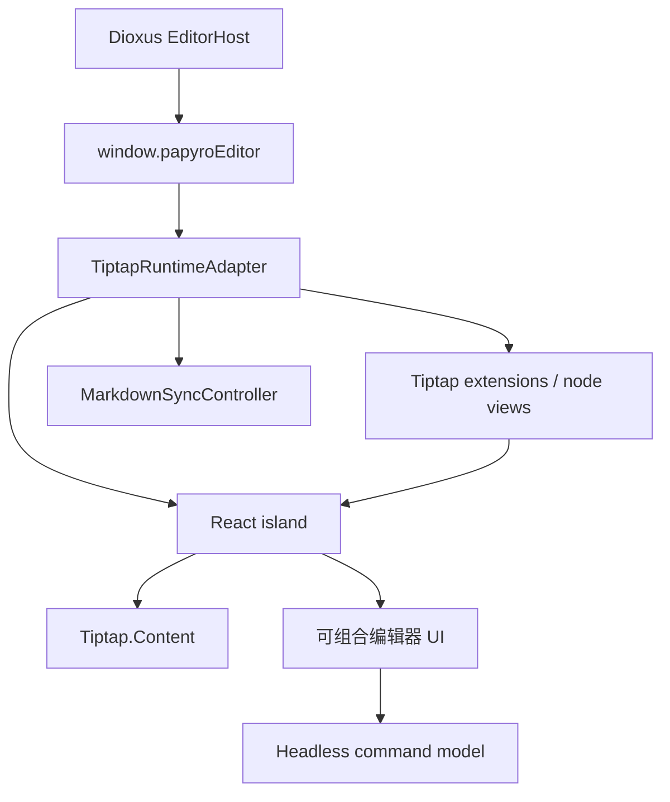

# Tiptap React 运行时方案

[English](../tiptap-react-runtime-plan.md) | [Tiptap 迁移计划](tiptap-migration-plan.md) | [路线图](roadmap.md)

这份文档记录 Papyro 编辑器下一步的架构方案。当前 `feat-tiptap` 分支已经切到 Tiptap，但很多高级编辑器 chrome 仍然是手写 DOM controller。下一步要按 Tiptap 官方 React 最佳实践重新收敛编辑器 UI，同时保留 Papyro 现有 Rust/Dioxus 外壳和本地 Markdown 模型。

## 决策

Papyro 会在现有 Dioxus 桌面应用内部使用一个 React island 承载编辑器表面。

Rust 和 Dioxus 仍然负责 workspace、tab、文件安全、设置、预览渲染和窗口 chrome。JS runtime 仍然通过 `window.papyroEditor` 暴露给 Dioxus。React 只负责可组合的 Tiptap UI 层：编辑器内容、命令面板、拖拽句柄、浮动菜单、React node view、表格 chrome，以及后续 Notion-like 交互。



## 官方依据

本方案落地前已查看本地 Tiptap 文档和源码：

- `tiptap-docs/src/content/guides/react-composable-api.mdx`
- `tiptap-docs/src/content/editor/getting-started/install/react.mdx`
- `tiptap-docs/src/content/ui-components/templates/notion-like-editor.mdx`
- `tiptap/packages/react/src/Tiptap.tsx`
- `tiptap/packages/react/src/EditorContent.tsx`
- `tiptap/packages/extension-drag-handle-react/src/DragHandle.tsx`
- `tiptap/packages/extension-node-range/src/node-range.ts`
- `tiptap/packages/extension-table/src/kit/index.ts`

React composable API 提供 provider、`Tiptap.Content` 和上下文 hooks。`EditorContent` 要求 editor view 已经存在，然后会把 ProseMirror DOM 移动到 React 内容容器里。因此 Papyro 先为 Tiptap editor constructor 创建一个隐藏 seed element，再让 `Tiptap.Content` 接管内容 DOM。

官方 Notion-like editor template 继续作为产品和交互参考。它生产使用需要 Tiptap Start plan，所以 Papyro 不能把私有模板源码直接复制进仓库。我们可以使用公开开源的 Tiptap 3 包，并用 Papyro 自己的代码重建适合本地优先、Markdown 优先的交互。

## Runtime 边界

`js/src/tiptap-runtime.js` 接收 `mountControllerFactory`。默认 controller 仍支持旧的直接挂载，桌面入口现在注入 `createTiptapReactMountController`。

mount controller 只负责挂载生命周期：

- 创建 `new Editor({ element })` 使用的 seed element
- 把 React 挂到 runtime root
- tab host 复用时刷新 React island
- 销毁 Tiptap editor 前先销毁 React

它不能负责 Markdown 同步、Rust 消息、tab 生命周期或文件状态。

## React Island 契约

`js/src/tiptap-react-island.jsx` 定义第一版 React 边界：

- `PapyroTiptapReactIsland`
- `PapyroTiptapEditorContent`
- `createPapyroTiptapReactComponents`
- `createTiptapReactMountController`

island 采用 slot 设计：

| Slot | 职责 |
| --- | --- |
| `BeforeContent` | 必须出现在内容 DOM 前面的轻量编辑器 chrome |
| `EditorContent` | 官方 `Tiptap.Content` 挂载点 |
| `AfterContent` | 视觉上属于编辑器正文之后的面板 |
| `OverlayLayer` | 浮动菜单、拖拽句柄、popover、后续 React 表格 chrome |

这样可以避免重新制造第二个巨型 editor runtime。新的编辑器 UI 应该通过小 React 组件、headless command controller 和聚焦 extension 进入，而不是继续在 `tiptap-runtime.js` 里直接改 DOM。

## 目标 React 结构

后续 island 变大时，按这个结构演进：

```text
js/src/tiptap-react/
  island.jsx              # root provider and slots
  hooks/
    use-editor-command.js # command execution and active state
    use-editor-locale.js  # i18n bridge
  commands/
    block-actions.js      # data model, not DOM
    insert-actions.js
    table-actions.js
  components/
    command-panel.jsx
    icon-button.jsx
    popover.jsx
    toolbar.jsx
  extensions/
    table-node-view.jsx
    code-block-view.jsx
    callout-view.jsx
  utils/
    floating.js
    keyboard.js
    selection.js
```

规则：

- 组件只接收数据和命令回调，不解析 Markdown，也不直接读取 Rust 状态。
- hooks 订阅具体 editor state slice，避免每个 transaction 都重渲染整个 island。
- 命令定义是 plain data 加执行函数。同一份定义服务 slash 菜单、句柄、快捷键和测试。
- Node view 使用 Papyro token，并通过已测试的 Tiptap Markdown handler 序列化。
- 旧手写 DOM controller 要按界面逐个迁移，每迁移一块都保持测试通过。

## 迁移顺序

1. 保持 React mount 基座稳定。
2. 基于现有 headless command model，把 slash/insert 命令面板迁到 React。
3. 在符合 Papyro Markdown-first 行为的前提下，用官方 `@tiptap/extension-drag-handle-react` 和 `@tiptap/extension-node-range` 替换块句柄。
4. 把行内浮动格式栏迁移为 React menu 组件。
5. 围绕 Tiptap TableKit 和 React 组件重做表格 chrome，停止继续维护手写定位的 DOM 条。
6. 在能提升可维护性的地方，把 code block、callout、math、Mermaid、image、table 迁成聚焦 React node view。
7. 每完成一个 React 替换，就清理对应过时 DOM-controller CSS 和 JS。

## 质量标准

React 迁移完成前必须满足：

- `window.papyroEditor` 仍然是 Dioxus 唯一依赖的编辑器 API。
- 所有直接 `@tiptap/*` 依赖使用同一个版本。
- JS 源码变化必须同步提交生成后的 bundle。
- JS 测试覆盖 mount 生命周期、Markdown round-trip、Rust 消息兼容、IME 保护、命令执行和浮层关闭。
- React 组件必须可复用并使用 Papyro token，不能直接复制官方模板。
- 表格和块交互要对照官方 Notion-like UX benchmark 验证。
- 手工 release smoke 覆盖 Source、Hybrid、Preview、中文输入法、粘贴、撤销/重做、表格编辑、代码块语言、公式、Mermaid、图片、大纲、保存失败和系统打开 Markdown 文件。

