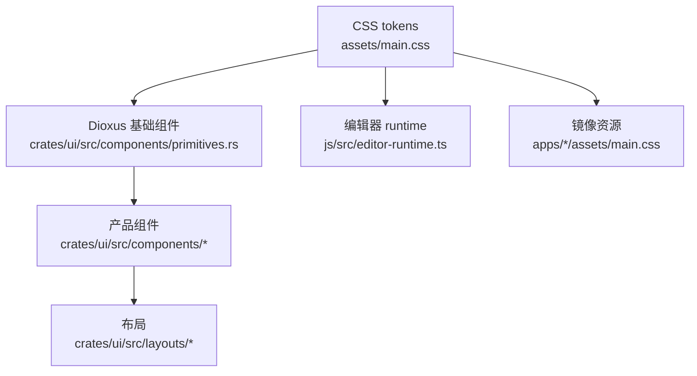

# UI 架构与组件盘点

[English](../ui-architecture.md) | [文档首页](README.md)

这份文档说明 Phase 3.5 重构期间 Papyro UI 应该如何组织。它和 [UI/UX 对标与改版决策](ui-ux-benchmark.md)、[Papyro UI 视觉 Brief](ui-visual-brief.md)、[UI 信息架构](ui-information-architecture.md)、[UI 界面审计](ui-surface-audit.md)、[主题系统](theme-system.md) 配套使用。

## 归属模型

规则：

- `assets/main.css` 是共享视觉源；`assets/styles/markdown.css` 用来承载文档 surface、大纲、Preview 与渲染后 Markdown 样式，`assets/styles/tiptap-chrome.css` 承载 Tiptap 命令面板和编辑器控件 chrome，避免主 chrome CSS 预算被挤满。
- `apps/desktop/assets/main.css` 是桌面端运行时副本；`apps/mobile/assets/main.css` 负责移动端 shell 布局和移动端 token 桥接。
- `assets/styles/markdown.css` 与 `assets/styles/tiptap-chrome.css` 的桌面端、移动端 runtime 副本在共享编辑器 CSS 改动时必须同步。
- `tiptap-chrome.css` ??? Tiptap chrome ???????????? `tiptap-chrome-code.css`?`tiptap-chrome-base.css`?`tiptap-chrome-command.css`?`tiptap-chrome-table.css` ? `tiptap-chrome-block.css`????? CSS ???????????
- `crates/ui/src/components/primitives.rs` 拥有可复用 Dioxus 控件，并重新导出 `primitives/buttons.rs`、`primitives/empty.rs`、`primitives/feedback.rs`、`primitives/forms.rs`、`primitives/layout.rs`、`primitives/navigation.rs`、`primitives/overlays.rs`、`primitives/results.rs`、`primitives/settings.rs`、`primitives/tabs.rs` 等聚焦的基础组件子模块。
- 产品组件组合基础组件，不应该重新发明控件行为。
- layout 模块负责排列产品区域，不拥有按钮、菜单或表单字段样式。
- Tiptap runtime 模块和 node views 通过语义化 `.mn-tiptap-*` 与 `.mn-editor-*` class 消费同一批 CSS token。
- 桌面窗口 chrome 通过 `crates/ui/src/desktop_chrome.rs` 按平台适配：macOS 使用系统原生窗口控制和 `.mn-platform-macos`，Windows 与 Linux 保留 Papyro 自绘控制和 `.mn-custom-window-controls`。

## 组件放置规则

用能够表达行为的最小归属层，不把产品状态泄漏到更底层：

| 需求 | 放置位置 | 规则 |
| --- | --- | --- |
| 可复用控件行为 | `crates/ui/src/components/primitives.rs` 和 `crates/ui/src/components/primitives/*` | 组件拥有视觉状态、键盘/焦点行为、ARIA 结构、尺寸或共享 slot 时放这里。主文件变大后，测试或大型组件族应进入子模块。 |
| 由基础组件组成的产品界面 | `crates/ui/src/components/<surface>/` | 涉及标签、app 命令、view-model 数据或产品专属回调时放这里。 |
| 页面或窗口排布 | `crates/ui/src/layouts/` | 只负责区域排列、split pane、rail、滚动容器和响应式 overflow 规则。 |
| Markdown 编辑器 runtime 行为 | `js/src/tiptap-*.js`、`js/src/tiptap-react/`、`js/src/editor-host-runtime.js`、`js/src/editor-runtime-bootstrap.js` | 只有 Tiptap、编辑器 hit-testing、Markdown 同步、React 编辑器 chrome 或 JS host 生命周期拥有该行为时才放这里。Rust 仍是 app 状态事实来源。 |
| 共享视觉语言 | `assets/main.css` | 在这里定义 token 和基础组件 class，再同步到 app 资源目录。 |

新增按钮、菜单项、文本输入、选择器、开关、tab、tooltip、dialog header、结果行、树行或空状态样式前，必须先检查现有基础组件族。若只是缺少 variant，优先扩展基础组件；只有产品界面确实存在一次性布局需求时，才增加产品层 class。

## Dioxus 组件契约

新增或修改 Dioxus UI 组件时遵守这些规则：

- 使用 Dioxus 0.7 组件函数，props 使用 owned value，并实现 `Clone + PartialEq`。
- 用显式 props 表达语义状态：`selected`、`disabled`、`danger`、`loading`、`compact`、`checked`、`current`、`expanded` 优于临时 class 字符串。
- primitive 状态 class 应使用内部共享 `PrimitiveState` 和 `ClassBuilder` 组合，避免在每个组件族里重复手拼 `active`、`open`、`disabled`、`danger`、`editing`、`dragging`、`drop-target`、`expanded`、`onboarding`、`resizing` 和扩展 class 顺序。
- 明确事件边界。行内动作不应触发行选择，右键菜单目标不应触发文件打开，弹窗关闭控件不应依赖父级 DOM 细节。
- 通用 role 的 ARIA 放在基础组件层。产品组件只负责传入面向用户的 label 和 ID。
- 产品文案保持国际化。基础组件可以接收 label 字符串，但不拥有具体中英文产品文案。
- render path 不做阻塞工作、文件访问或大对象 clone。
- 焦点状态必须可见，不只为鼠标 hover 设计。键盘用户要能到达同一个操作界面。

## Token 命名规则

Token 名称描述语义，而不是描述单个颜色或单个页面：

| 分层 | 前缀 | 示例 | 用途 |
| --- | --- | --- | --- |
| 色板 | `--mn-bg`、`--mn-surface`、`--mn-ink`、`--mn-accent` | `--mn-surface`、`--mn-ink-muted` | 主题基础色。 |
| 语义界面 | `--mn-chrome-*`、`--mn-editor-*`、`--mn-markdown-*` | `--mn-chrome-border`、`--mn-editor-canvas` | App 区域和写作界面。 |
| 交互反馈 | `--mn-focus-*`、`--mn-selection-*`、`--mn-status-*` | `--mn-focus-ring`、`--mn-selection-bg` | 共享状态反馈。 |
| 组件 | `--mn-<component>-*` | `--mn-tabbar-min-height`、`--mn-button-pad` | 只有基础组件需要稳定尺寸或状态契约时使用。 |
| 基础组件状态 | `--mn-primitive-*` | `--mn-primitive-hover-bg`、`--mn-primitive-active-ink`、`--mn-primitive-disabled-opacity` | 用于重复的 hover、active、focus、disabled、destructive 反馈。先在基础组件 selector 上定义，再由状态 selector 消费。 |

避免 `--mn-settings-blue` 或 `--mn-sidebar-new-bg` 这种绑定临时界面的名字。优先使用角色化命名，让 token 在未来布局变化后仍然成立。

## 一次性 CSS 政策

一次性 CSS 只允许用于产品布局胶水，不能替代基础组件状态或视觉契约。

允许：

- 区域尺寸、split pane 轨道、sticky 区域和滚动容器。
- 界面专属内容排版，例如设置 section 或对比面板。
- 已在本文、roadmap 或后续 primitive 任务中记录的迁移 class。

禁止：

- 在基础组件族之外新增按钮、输入框、选择器、tab、菜单、tooltip、dialog、空状态、skeleton 或结果行样式。
- 在组件 CSS 里写裸色值，palette/theme 定义除外。
- 只服务单个界面的 hover/focus/active/disabled 状态。
- 只适配浅色模式的 selector。
- 用 card 套 card 伪造层级。
- 让桌面端/移动端生成 CSS 副本偏离 `assets/main.css`。

如果某条一次性规则开始出现第二个使用场景，先提升为基础组件或产品 pattern，再增加第二份使用。

## 验证矩阵

按改动层级运行最小但充分的检查：

| 改动 | 必跑检查 |
| --- | --- |
| Rust UI 组件 | `cargo fmt --check`；`cargo clippy -p papyro-ui --all-targets --all-features -- -D warnings`；`cargo test -p papyro-ui`；`node scripts/check-ui-a11y.js` |
| CSS 或 token | UI 组件检查；`node scripts/check-ui-contrast.js`；`node scripts/report-ui-tokens.js`；`node scripts/report-file-lines.js`；确认镜像 CSS 同步 |
| 编辑器 JS UI 行为 | `npm --prefix js run build`；`npm --prefix js test`；提交生成后的 bundle |
| 纯文档 UI 规则 | `git diff --check`；同步中英文文档；完成 roadmap 任务时更新 roadmap 状态 |

## 当前组件盘点

| 区域 | 当前组件 | 说明 |
| --- | --- | --- |
| 基础组件 | `Button`、`ActionButton`、`RowActionButton`、`IconButton`、`EditorToolButton`、`EditorTabScrollButton`、`Select`、`Dropdown`、`SegmentedControl`、`Tabs`、`DocumentTab`、`Modal`、`ModalHeader`、`ModalCloseButton`、`Menu`、`ContextMenu`、`MenuItem`、`Tooltip`、`Message`、`StatusStrip`、`StatusMessage`、`StatusIndicator`、`FormField`、`Switch`、`Toggle`、`Slider`、`TextInput`、`ColorInput`、`ResultList`、`ResultRow`、`RowActions`、`ModalFooterMeta`、`ComparePanel`、`SkeletonRows`、`ErrorState`、`SettingsLayout`、`SettingsNav`、`SettingsRow`、`SettingsInlineRow`、`SidebarItem`、`SidebarSearchButton`、`OutlineItemButton`、`DialogSection`、`TreeItemButton`、`TreeItemEditRow`、`TreeRenameInput`、`EmptyState`、`EmptyStateSurface`、`EmptyStateCopy`、`EmptyRecentItem` | 已经有基础，按钮、空状态、反馈、表单、布局、导航、浮层、结果、设置和 tabs 组件族已经进入聚焦子模块；重复的基础组件状态 class 已通过 `PrimitiveState` 和 `ClassBuilder` 集中管理，但还需要更丰富的 variant、键盘行为和文档。 |
| App chrome | `AppShell`、`Workbench`、`MainColumn`、`ResizeRail`、`Sidebar`、`TreeSortControl`、`FileTree`、`AppHeader`、`StatusBar`、`DesktopLayout`、`MobileLayout` | 桌面和移动端 shell 已共享 `AppShell` 与 `Workbench`，`Workbench` 和 `MainColumn` 已承载 split-pane 契约，侧边栏拖拽调整宽度入口已使用 `ResizeRail`，文件树行已使用 `TreeItem` 基础组件，workspace 根目录行已使用 `SidebarItem`，侧边栏搜索已使用 `SidebarSearchButton`，侧边栏创建和底部操作已使用 button 基础组件，桌面/移动端文件排序控件已共享 `TreeSortControl`，并且树排序控件已组合 `SegmentedControl`；剩余 tab chrome 还需要继续接入基础组件。 |
| 编辑器 | `EditorPane`、`EditorChrome`、`EditorTabButton`、`OutlinePane`、`PreviewPane`、`EditorHost`、`FallbackEditor` | 编辑器 chrome 已组合 `SegmentedControl` 承载视图模式切换，使用 `EditorTabScrollButton` 承载 tab 溢出滚动按钮，使用 `DocumentTab` 承载打开文档 tab，并使用 `OutlineItemButton` 承载大纲导航行；tab 滚动按钮已复用 editor tool button 的状态契约，不再单独维护 hover/focus 规则；还需要共享 Markdown 视觉 token。 |
| 弹窗界面 | `SettingsModal`、`QuickOpenModal`、`CommandPaletteModal`、`SearchModal`、`TrashModal`、`RecoveryDraftsModal`、`RecoveryDraftCompareModal` | 应共享 dialog shell、结果行、空状态、加载态和键盘焦点行为。 |
| 设置 | `SettingsSurface`、`TagManagementSection`、`TagEditorRow`、`AboutMetaItem` | 设置页已经组合 `primitives/settings.rs` 中的共享导航、面板、表单行、内联行和 section 基础组件；标签管理还需要更丰富的校验与 helper 状态。 |
| 搜索/命令 | `ResultList`、`ResultRow`、`RowActions`、`CommandPaletteRow`、`QuickOpenRow`、`SearchResultRow`、`HighlightedText` | 命令、快速打开、搜索、回收站和恢复界面已经共享 `primitives/results.rs` 的列表壳、行壳和动作槽位；下一步补图标、快捷键、更丰富元信息和分组状态。 |
| 恢复/回收站 | `RecoveryDraftRow`、`ComparePanel`、`TrashNoteRow` | 恢复和回收站列表行已使用 `ResultRow`，恢复对比已使用 `ComparePanel`，回收站 footer 元信息已使用 `ModalFooterMeta`，这些都来自 `primitives/results.rs`；冲突/错误状态仍需要专门的数据安全 pattern。 |

## 目标基础组件

| 基础组件 | 状态 | 需要补齐 |
| --- | --- | --- |
| `Button` / `ActionButton` / `RowActionButton` | 部分已有 | `primitives/buttons.rs` 拥有普通按钮、图标+文字 action 按钮、loading/disabled 状态和不会触发行选择的行内按钮。按钮 hover、disabled、focus、active、destructive 反馈已通过局部 `--mn-primitive-*` 状态变量承载。下一步补尺寸 variant，并迁移仍带特殊 `title`、`aria` 或键盘契约的原生按钮。 |
| `IconButton` | 部分已有 | `primitives/buttons.rs` 拥有 selected、disabled、destructive、自定义 class 和 icon-class 状态，并覆盖 app header 与侧边栏品牌区图标按钮。图标按钮 active、disabled、focus、destructive 反馈已通过局部 `--mn-primitive-*` 状态变量承载。下一步补 compact 尺寸 variant 和 tooltip placement。 |
| `Input` / `TextInput` / `ColorInput` | 部分已有 | `primitives/forms.rs` 拥有 `TextInput`，已覆盖命令/搜索/快速打开输入框，以及普通侧边栏、移动端、设置标签文本输入；同时拥有用于标签管理原生颜色输入的 `ColorInput`。下一步补 label、error、disabled、inline action。 |
| `Select` | 已有 | `primitives/forms.rs` 拥有当前 select/dropdown 壳。下一步增加键盘导航、必要时支持 option group、增加尺寸 variant。 |
| `SegmentedControl` | 已有 | `primitives/forms.rs` 拥有主题、视图模式、文件树排序等小枚举控件，并支持 disabled 状态和紧凑产品界面的 option class；必要时补每个 option 独立 disabled 状态。 |
| `Switch` | 部分已有 | `primitives/forms.rs` 拥有布尔设置控件；`Toggle` 保留为兼容封装。下一步补 disabled 和 helper/error 状态。 |
| `Dialog` / `Modal` | 部分已有 | `primitives/overlays.rs` 拥有 `Modal`、`ModalHeader` 和 `ModalCloseButton`，用于重复弹窗标题/关闭控件；`DialogSection` 已覆盖设置页重复 section；modal shell 还需要稳定尺寸和焦点管理。 |
| `Popover` | 缺失 | 用于插入菜单、紧凑设置提示和编辑器 affordance。 |
| `DropdownMenu` | 通过 `Menu` 部分存在 | `primitives/overlays.rs` 拥有 menu shell 和 menu items。下一步补 trigger、对齐、键盘行为、分割线、图标和快捷键。 |
| `ContextMenu` | 已有 | `primitives/overlays.rs` 拥有 context-menu shell；和 dropdown menu 共享 item model。 |
| `Tooltip` | 已有 | `primitives/overlays.rs` 拥有当前 CSS tooltip。如果 CSS-only tooltip 不够，再补 placement 和 delay 策略。 |
| `Toast` / `Message` / `StatusStrip` | 部分已有 | `primitives/feedback.rs` 拥有 `Message`、`InlineAlert`、`SkeletonRows`、`ErrorState`、`StatusStrip`、`StatusMessage` 和 `StatusIndicator`；transient toast 仍需要单独 primitive。 |
| `Tabs` / `DocumentTab` | 已有 | `primitives/tabs.rs` 拥有通用 tabs 和文档 tab 行外壳，包括标题、保存状态标记槽位、关闭元数据和键盘关闭行为；产品代码仍负责 tab 命令和保存状态文案。 |
| `SidebarItem` / `SidebarSearchButton` | 部分已有 | `primitives/navigation.rs` 通过 `SidebarItem` 拥有 workspace 根目录行，并通过 `SidebarSearchButton` 拥有侧边栏搜索触发器；未来导航行还需要继续接入。 |
| `OutlineItemButton` | 部分已有 | `primitives/navigation.rs` 拥有大纲导航行结构、标题层级 class、行号元数据和 tab 元数据；active/current 状态仍由编辑器大纲同步脚本维护。 |
| `TreeItem` / `TreeRenameInput` | 部分已有 | `primitives/navigation.rs` 拥有 `TreeItemButton`、`TreeItemEditRow`、`TreeItemLabel` 和 `TreeRenameInput`，覆盖文件/文件夹图标、展开态、选中/编辑/拖拽/放置 class、行标签布局和 inline rename 输入结构；键盘模型和右键菜单作用域仍在文件树代码里。 |
| `Toolbar` / `ToolbarZone` / `ResizeRail` | 部分已有 | `primitives/layout.rs` 拥有 `AppShell`、`Workbench`、`MainColumn`、`EditorToolbar`、`ToolbarZone`、`EditorToolButton`、`EditorTabScrollButton`、`ResizeRail`、`ScrollContainer` 和 `InlineOverflow`，覆盖共享 shell、split panes、sticky 编辑器工具栏、固定/弹性 toolbar zone、设置内容滚动区、可调整 rail 与 tab 溢出；更多滚动容器还需要继续接入。 |
| `EmptyState` | 部分已有 | `primitives/empty.rs` 拥有 `EmptyStateSurface`、`EmptyStateCopy`、`EmptyState` 和 `EmptyRecentItem`，覆盖通用空状态外壳、文案、onboarding 布局与最近工作区入口行；还需要增加 compact、error 和更丰富的 action variant。 |
| `SkeletonRows` | 部分已有 | 工作区搜索加载态已使用可复用 skeleton 行；workspace 加载和未来异步窗口还需要继续接入。 |
| `InlineAlert` / `ErrorState` | 部分已有 | `primitives/feedback.rs` 拥有预览提示、命令/搜索空态、加载 skeleton、状态指示和编辑器 runtime 失败；后续较大的阻断错误也应复用这个组件族。 |
| `SettingsLayout` / `SettingsRow` / `SettingsInlineRow` | 部分已有 | `primitives/settings.rs` 拥有设置导航、面板、section、行和内联控制行；helper text、错误态和更丰富的表单状态还需要继续接入。 |

## 产品 Pattern

重构更多界面前，先用基础组件建立这些 pattern：

| Pattern | 使用位置 | 契约 |
| --- | --- | --- |
| `SettingsRow` | 设置、未来偏好设置窗口 | 一列表单：label、可选 description、control、未来 helper/error slots。 |
| `SettingsInlineRow` | 设置标签管理、紧凑表单行 | 稳定的 create/edit 内联控制网格，并为窄窗口迁移保留统一入口。 |
| `ResultList` / `ResultRow` | 搜索、快速打开、命令面板、回收站、恢复 | 可访问的结果列表壳，以及行图标、主文本、次文本、元信息、高亮、键盘 current 状态。 |
| `RowActions` / `RowActionButton` | 结果行、数据安全管理行 | 右对齐行内动作，统一间距，按需支持换行，并收敛行内按钮点击边界。 |
| `ModalFooterMeta` | 回收站、恢复、破坏性操作弹窗 | footer 左侧元信息，长文本会在操作按钮前安全截断。 |
| `ComparePanel` | 恢复对比、未来冲突处理 | 标题、元信息、可选错误、可滚动预格式内容和稳定的左右对比尺寸。 |
| `SkeletonRows` | 搜索、workspace 加载、异步窗口 | 可访问的加载行，保持稳定高度、克制动效，并避免结果到达时布局跳动。 |
| `ErrorState` | 编辑器 runtime、workspace 加载、阻断失败 | 标题、面向用户的说明、可选技术详情，以及用于不可恢复行内失败的 alert role。 |
| `TreeRow` | 文件树 | 缩进、展开图标、文件/文件夹图标、selected/editing/drag/drop 状态、右键菜单、键盘目标。 |
| `ToolbarZone` | 编辑器 chrome、app header | 固定或弹性区域，并显式定义 overflow 行为。 |
| `ModalHeader` / `DialogSection` | 设置、恢复、回收站 | 弹窗标题/关闭控件，以及 section 标题、正文、可选 footer、稳定间距。 |
| `InlineStatus` / `StatusStrip` | 保存状态、预览策略、错误、footer 状态栏 | tone、图标/文本、紧凑布局、可访问 role。 |

## CSS Token 规则

使用这些 token 分层：

- 基础色板：`--mn-bg`、`--mn-surface`、`--mn-ink`、`--mn-accent`。
- 语义 token：`--mn-chrome-*`、`--mn-editor-*`、`--mn-markdown-*`、`--mn-code-*`、`--mn-selection-*`、`--mn-status-*`。
- 组件 token：只有基础组件需要稳定契约时才新增，例如 `--mn-button-pad` 或 `--mn-tabbar-min-height`。

大范围 UI 改动中禁止：

- 在组件 CSS 里写裸 hex，palette/theme 定义除外。
- 重复现有 token 的一次性间距。
- 只适配浅色模式的组件样式。
- 页面 section 使用 card 套 card。
- 新 class 绕过现有基础组件。

允许的一次性 CSS：

- 单个产品界面的布局胶水。
- 在本文或 roadmap 中记录过的临时迁移 class。
- 现有基础组件确实表达不了的视觉规则，但后续必须提出 primitive 方案。

## 迁移顺序

1. **设置行：** 继续基于 `SettingsRow`、`SettingsInlineRow`、`DialogSection`、`SettingsNav`、`Switch`、`Select`、`SegmentedControl` 推进；下一步补 helper/error slots 和校验状态。
2. **结果行：** 对齐命令面板、快速打开和搜索结果行。
3. **文件树行：** 继续基于 `TreeItemButton` 和 `TreeItemEditRow` 推进；下一步补 focus/current variants，并共享带作用域的菜单 item model。
4. **编辑器 chrome：** 继续基于 `EditorToolbar` 和 `ToolbarZone` 完善 tab overflow、模式切换、大纲按钮和未来更多菜单规则。
5. **空/加载/错误态：** 继续把 `InlineAlert`、`SkeletonRows` 和 `ErrorState` 接入剩余异步与阻断错误界面。
6. **Markdown surface：** 等 Hybrid selection 和 hit testing 稳定后，再统一 Markdown token。

## Review Checklist

合并 UI 改动前检查：

- 是否优先使用了现有基础组件？
- 浅色、深色、高对比状态是否覆盖？
- 键盘焦点是否可见且可到达？
- 窄窗口下主要操作是否仍可达？
- 生成/镜像 CSS 是否同步？
- 组件规则变化时，相关文档是否更新？
- 提交是否只聚焦一个界面或一个基础组件族？
