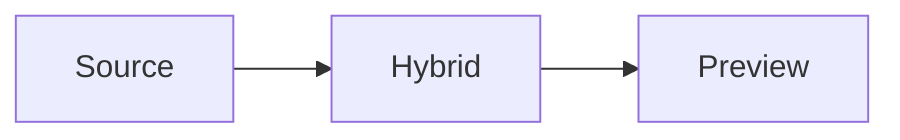

# Tiptap Smoke

中文输入法测试：这是第一段文字，用来验证光标、选区、撤销和粘贴。

## Formatting

This paragraph has **bold**, *italic*, `inline code`, ~~strike~~, and [Papyro](https://github.com/youzi2233/papyro).

### Nested Heading

- Alpha item
- Beta item
  - Nested item

1. First ordered item
2. Second ordered item

- [ ] Unchecked task
- [x] Checked task

> [!NOTE]
> Callout content should round-trip through Markdown.

```rust
fn main() {
    println!("hello tiptap");
}
```

```javascript
const message = "hello papyro";
console.log(message);
```

```markdown
# Nested Markdown

- It stays inside the code fence.
```

```plaintext
plain text should not be highlighted
```

```custom-lang
safe custom language ids should survive
```

```
language-less fences stay automatic
```

| Name | Count | Status |
| :--- | ---: | :---: |
| Alpha | 12 | Ready |
| Beta | 3 | Draft |

Inline math: $a^2 + b^2 = c^2$

$$
\int_0^1 x^2 dx = \frac{1}{3}
$$




## Notes

End of document.
